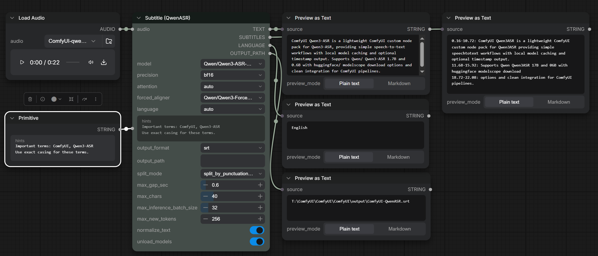

# ComfyUI-QwenASR

ComfyUI custom nodes for **Qwen3-ASR** (Automatic Speech Recognition). This pack focuses on simple, reliable speech-to-text and subtitle workflows with local model caching and long-audio support.


## What's New in v1.1.0 
[update in v1.1.0 ](Update.md#update-v110-2026-09-11)

### 1. A Comprehensive Three-Node Speech Toolkit
This update enriches the suite from basic speech recognition into a complete audio workflow:
- **ASR (QwenASR)**: Fast, lightweight speech-to-text transcription for quick audio prompts and notes.
- **Subtitle (QwenASR)**: Generates timestamped sentences ready to export directly as `.srt` or `.txt` subtitle files.
- **Forced Align (QwenASR)**: High-precision word-level aligner built specifically for long-form speech (podcasts, videos, lectures), keeping every word synchronized without cutting off at arbitrary boundaries.

### 2. Cleaner, More Accurate, and Production-Ready Output
Raw speech-to-text often produces acoustic noise and awkward phrasing. Version 1.1.0 introduces smart **Inverse Text Normalization (ITN)**:
- **Clean Digits & Percentages**: Spoken numerals are automatically converted into natural, readable digits (e.g. `一百二十八` → `128`, `一点七` → `1.7`, `百分之九十九` → `99%`).
- **Acronym Clean-Up**: Spaced-out letters from verbatim transcribing are merged into standard abbreviations (e.g. `A S R` → `ASR`, `U S B` → `USB`, `A P I` → `API`).
- **Multi-Language Term & Phonetic Correction**: Built-in rules correct common spoken tech and AI terms across English, Chinese, Japanese, Korean, and French (e.g. `ChatGPT`, `OpenAI`, `DeepSeek`, `ComfyUI`).
- **Idiom Protection**: Cultural idioms and fixed expressions are safeguarded so numbers inside phrases are never mistakenly converted.

### 3. Major Architectural Upgrade: Official Native Models & Transformers 5
- **Full Migration to Official Hugging Face Native Models**: Exclusively uses official native checkpoints (`Qwen3-ASR-1.7B-hf`, `0.6B-hf`, `ForcedAligner-0.6B-hf`). Legacy un-suffixed checkpoints are now deprecated in favor of official standard pipelines.
- **Upgraded to `transformers >= 5.13.0`**: Integration with Transformers 5 eliminates obsolete bundled code, delivering pure PyTorch multimodal execution, lower VRAM consumption, and significantly faster inference.

### 4. New Features to Get the Exact Results You Need
- **One-Click Transcription & Alignment**: In the Forced Align node, simply connect your audio and leave the text box blank. The node automatically transcribes the speech and generates word-level timestamps in a single step.
- **Zero-Restart Custom Dictionary**: Need to add your own names, industry terms, or specialized vocabulary? Edit `itn_rules.json` and changes take effect immediately on your very next run — no ComfyUI restart needed.
- **Out-of-the-Box Mac Support**: Seamless, crash-free execution on Apple Silicon (M-series) Macs with built-in precision guards.
- **Dual Download Mirrors via `config.json`**: Effortlessly configure your preferred download mirror (HuggingFace or ModelScope) in `config.json` for dependable, fast downloads worldwide.

## Features

- **Three complementary nodes**: simple STT, timestamped subtitles, and iterative forced aligner for long audio
- **Transformers native support**: official `-hf` models with native Hugging Face pipeline (`transformers >= 5.13.0`)
- **Long audio handling**: automatic chunking and speaking-rate based iterative alignment
- **Forced aligner**: word-level timestamping and subtitles
- **Local model cache**: under `ComfyUI/models/Qwen3-ASR/`
- **HuggingFace / ModelScope**: configurable download sources in `config.json`

## Nodes

### ASR (QwenASR)
- **Input**: AUDIO
- **Output**: TEXT
- **Use case**: quick speech-to-text
- **Options**: model, precision, language, hints, normalize_text, unload_models

[Workflow](example_workflows/ComfyUI-QwenASR.json)

### Subtitle (QwenASR)
- **Input**: AUDIO
- **Output**: TEXT, SUBTITLES, LANGUAGE, OUTPUT_PATH
- **Use case**: subtitle generation with timestamps
- **Options**: model, precision, attention, forced_aligner, language, hints, output_format, output_path, split_mode, max_gap_sec, max_chars, max_inference_batch_size, max_new_tokens, normalize_text, unload_models
- **Output format**: none / txt / srt (controls file save only)
- **Output path**: optional file save location (default: `ComfyUI/output/ComfyUI-QwenASR/`)
- **Split mode**: default is punctuation + pause + length (balanced for subtitles)

 [Workflow](example_workflows/ComfyUI-QwenASR_subtitle.json)

### Forced Align (QwenASR)
- **Input**: AUDIO (required), TEXT (optional transcript; if left blank, speech is auto-transcribed first)
- **Output**: WORD_TIMESTAMPS
- **Use case**: iterative safe-zone forced alignment for long audio (with known transcript or automatic transcription)
- **Options**: text, language, forced_aligner, precision, attention, chunk_audio_sec, min_tail_sec, backoff_words, normalize_text, unload_models


Tip: in ComfyUI search, type **ASR** to find these nodes quickly.

## Installation

1) Install the custom node:
```
cd ComfyUI/custom_nodes

git clone https://github.com/1038lab/ComfyUI-QwenASR.git
```

2) Install dependencies (requires `transformers >= 5.13.0` for native model pipelines):
```
cd ComfyUI/custom_nodes/ComfyUI-QwenASR

pip install -r requirements.txt
```

3) Restart ComfyUI.

## Models

Supported models (Official Hugging Face Native):
- `Qwen/Qwen3-ASR-1.7B-hf` (Recommended)
- `Qwen/Qwen3-ASR-0.6B-hf` (Fast & lightweight)
- `Qwen/Qwen3-ForcedAligner-0.6B-hf` (For subtitles and word-level timestamps)

Downloaded models are stored in:
```
ComfyUI/models/Qwen3-ASR/
```

### config.json (defaults & model list)

You can edit `config.json` in the repo root to change defaults (e.g. default model, source)
or to add/remove model repo entries.

Example:
```json
{
  "defaults": {
    "source": "ModelScope",
    "repo_id": "Qwen/Qwen3-ASR-0.6B-hf"
  }
}
```

Tip: If you are in mainland China, using **ModelScope** as the source is usually faster and more reliable.

### Custom model locations (extra_model_paths.yaml)

If you keep models outside the default folder, add the parent directory to ComfyUI’s `extra_model_paths.yaml`.
This node will also search those paths for `Qwen3-ASR` models.

### itn_rules.json (Text Normalization & Multi-Language Custom Rules)

Located at the root of this repository, `itn_rules.json` provides Inverse Text Normalization (ITN) and user-defined phonetic/spelling corrections across any language.

**Key Capabilities:**
- **Number & Digit Formatting**: Spoken numerals and decimals are automatically converted to digits (e.g. `一百二十八` → `128`, `一点七` → `1.7`, `百分之九十九` → `99%`).
- **Acronym Cleanup**: Merges spaced letters from verbatim transcription (e.g. `A S R` → `ASR`, `U S B` → `USB`, `A P I` → `API`).
- **Multi-Language Phonetic & Term Corrections**: Add phonetic corrections and brand names for English, Chinese, Japanese, Korean, etc.
- **Protected Idioms**: Prevents Chinese idioms from being converted into digits (e.g. preserves `五颜六色`, `万无一失`).
- **Hot-Reloading**: Edits to `itn_rules.json` take effect immediately on the next generation — **no ComfyUI restart required**.

Example:
```json
{
  "custom_replacements": {
    "chat gpt": "ChatGPT",
    "open a i": "OpenAI",
    "g p t four": "GPT-4",
    "deep seek": "DeepSeek",
    "クウェン": "Qwen",
    "コムフィーユーアイ": "ComfyUI",
    "컴피UI": "ComfyUI"
  },
  "enable_number_conversion": true,
  "enable_acronym_cleanup": true
}
```

*Tip*: Each node features a `normalize_text` toggle (default: `True`) right above `unload_models`. You can turn it off anytime to output raw verbatim transcription.

## Usage

**STT**
```
LoadAudio → ASR (QwenASR) → ShowText
```

**Subtitles**
```
LoadAudio → Subtitle (QwenASR) → ShowText / SaveText
```

**Long Audio Forced Alignment**
```
LoadAudio + Text Transcript → Forced Align (QwenASR) → ShowText
```

## Notes

- Official `-hf` checkpoints (`Qwen3-ASR-*-hf`) are required. Legacy un-suffixed checkpoints are deprecated and no longer supported under `transformers >= 5.0.0`.
- Long audio is automatically chunked inside the model pipeline.
- Subtitle timestamps require the forced aligner to be available.
- Apple Silicon Mac (MPS) is fully supported with automatic precision fallback (fp16) and SDPA acceleration.
- If you switch machines or want manual control, extra model paths are supported.

## License

- Code: GPL-3.0
- Models: Qwen3-ASR (Apache-2.0)
