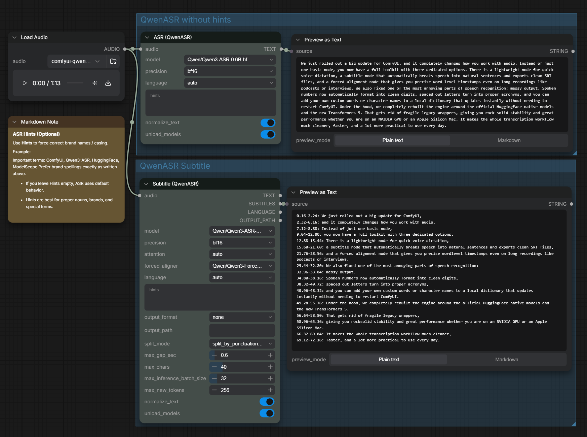

# Update v1.1.0 (2026-09-11)

This release focuses on delivering production-ready speech transcription and subtitling in ComfyUI, improving output accuracy, and expanding the node suite into a complete audio workflow.

---

### 1. How v1.1.0 Enriches the Node Family
Instead of relying on a single speech-to-text node, users now have a complete three-node toolkit tailored to different audio tasks:
- **ASR (QwenASR)**: Fast, lightweight speech transcription for voice prompts, dialogue notes, and quick dictation.
- **Subtitle (QwenASR)**: Automatically chunks speech into natural, timestamped subtitle sentences with one-click export to `.srt` or `.txt`.
- **Forced Align (QwenASR)**: High-precision word-level aligner built specifically to process long continuous speech (podcasts, lectures, long videos) without hitting duration limits.

### 2. How Transcription Output is Made Significantly More Accurate
Raw speech recognition models output verbatim acoustic sounds, which often produces awkward, unreadable results. Version 1.1.0 introduces smart **Inverse Text Normalization (ITN)**:
- **Clean Numerical Formatting**: Spoken numbers, decimals, and percentages are automatically formatted into standard digits (e.g. `一百二十八` → `128`, `两千` → `2000`, `一点七` → `1.7`, `百分之九十九` → `99%`).
- **Acronym Clean-Up**: Spaced-out letters from phonetic transcription are merged into clean abbreviations (e.g. `A S R` → `ASR`, `U S B` → `USB`, `A P I` → `API`).
- **Multi-Language Phonetic & Term Corrections**: Built-in rules correct common spoken tech and AI terminology across English, Chinese, Japanese, Korean, and French (e.g. `ChatGPT`, `OpenAI`, `DeepSeek`, `ComfyUI`).
- **Idiom & Phrase Safeguards**: Built-in whitelist protects idioms from being accidentally corrupted into digits (e.g. `万无一失`, `五颜六色`).

### 3. Major Architectural Upgrade: Official Native Models & Transformers 5
This version introduces a significant architectural evolution for stability and performance:
- **Full Migration to Official Hugging Face Native Models**: Transitioned completely to official native checkpoints (`Qwen3-ASR-1.7B-hf`, `Qwen3-ASR-0.6B-hf`, `Qwen3-ForcedAligner-0.6B-hf`). Legacy un-suffixed checkpoints are now deprecated in favor of official standard pipelines.
- **Upgraded to `transformers >= 5.13.0`**: Upstream Transformers 5 integration eliminates bulky, brittle legacy backend code, providing pure PyTorch multimodal execution, lower VRAM usage, and significantly faster inference across all hardware.

### 4. New Features to Help Users Get Exactly What They Need
- **One-Click Transcription & Alignment**: In the Forced Align node, leaving the transcript text empty automatically transcribes the audio and produces precision word timestamps in a single step.
- **Zero-Restart Custom Dictionary (`itn_rules.json`)**: Add custom industry terms, names, or words in your own language into `itn_rules.json`. Changes apply immediately on the next generation without needing to restart ComfyUI.
- **Apple Silicon Mac Support**: Automatic precision safeguards (fp16 fallback and SDPA attention) provide smooth, crash-free execution on M-series Macs.
- **Dual High-Speed Download Mirrors via `config.json`**: Set your preferred download mirror (HuggingFace or ModelScope) in `config.json` for fast, reliable model downloads anywhere in the world.

