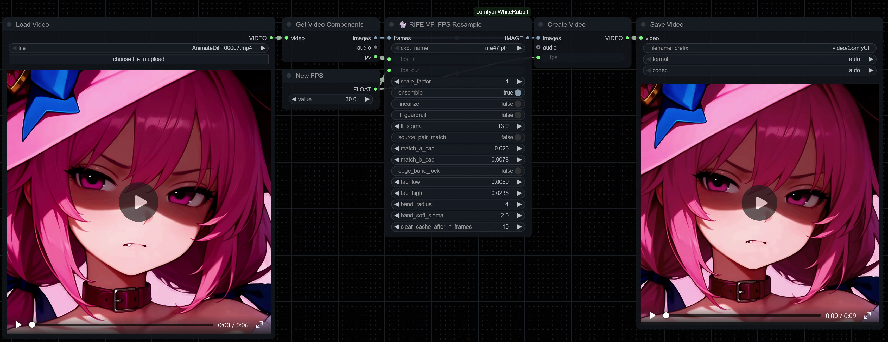
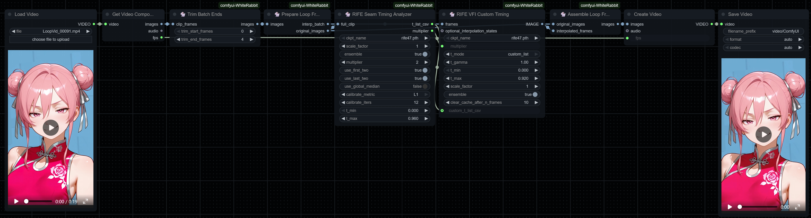
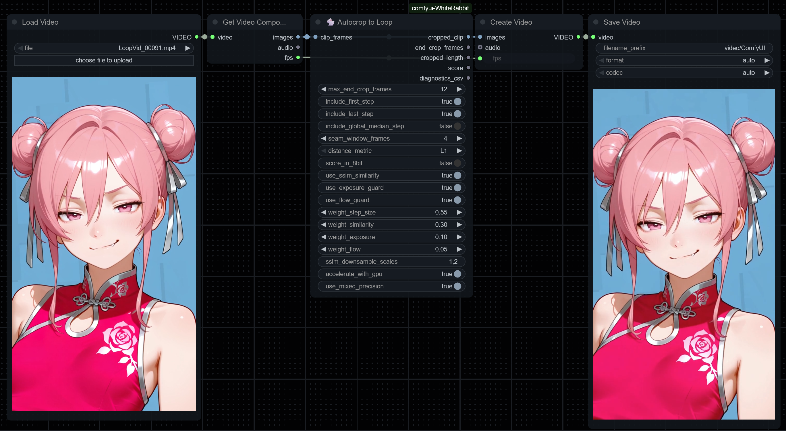
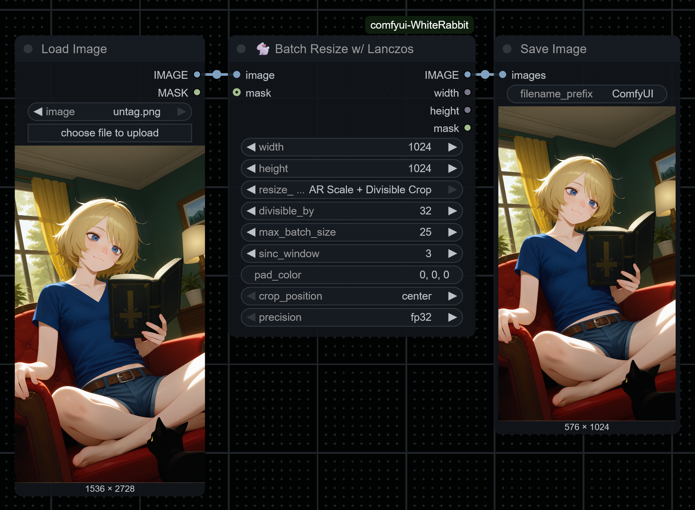
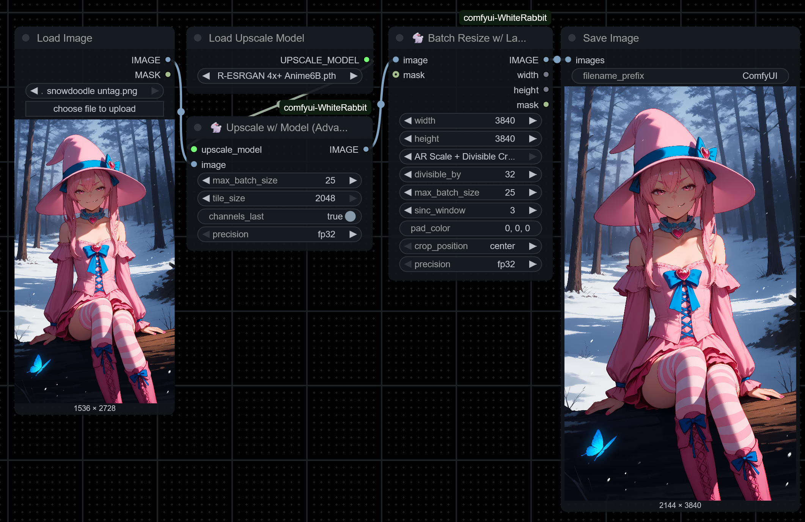
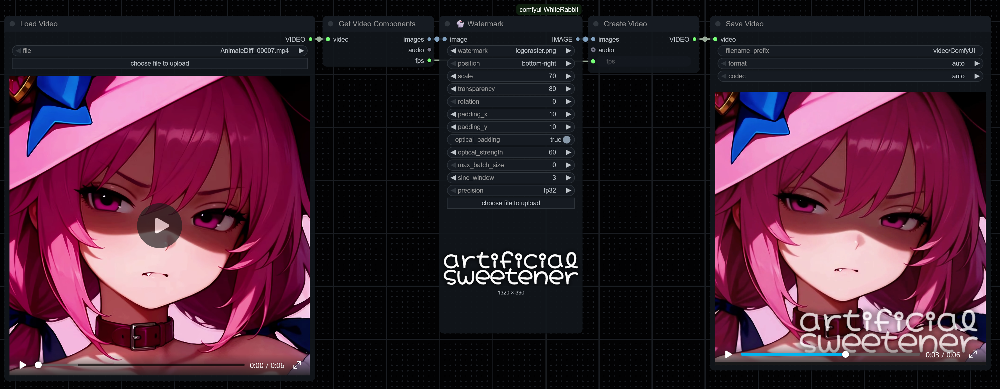

# WhiteRabbit：掌控时间之流 🐇
[](https://registry.comfy.org/publishers/artificialsweetener/nodes/whiterabbit) [](https://registry.comfy.org/publishers/artificialsweetener/nodes/whiterabbit) [](https://www.python.org/downloads/) [](LICENSE)

<a href="readme.md">English</a> | <strong>简体中文</strong>

这是 **WhiteRabbit**，一个专为在 ComfyUI 中处理视频而设计的节点包。

兔子的拿手好戏是穿梭时间，帮你做出无缝循环视频。但她带来的可不止这些——高质量的任意帧率重采样和超快的图像缩放也都在这份“茶会”礼盒里！

虽然这些节点中有些当然也能用于单张图片，但它们无一不是以高效的**批处理**为核心设计。这意味着性能收益会层层叠加，让你在硬件允许的范围内尽可能快地处理整段视频。


## 安装

**快速安装：**
1. 将 **WhiteRabbit** 文件夹放入 `ComfyUI/custom_nodes/`。
2. 使用 ComfyUI 的 Python 环境安装本节点依赖：

   ```powershell
   python -m pip install -r requirements.txt
   ```

WhiteRabbit 使用 ComfyUI 原生的 `models/frame_interpolation/` 目录。RIFE 节点
支持 4.7、4.9、4.25 和 4.26；缺少的目录内模型会在所选模型首次用于推理时
自动下载，并在使用前通过 SHA-256 校验。

### Python 依赖

本节点使用 ComfyUI 已提供的 Python 包。节点本地依赖仅增加伽马校正的
Lanczos 重采样器：

```
torchlanc>=1.1.0
```

## 节点一览

这个节点包帮你解决视频创作中一些最棘手的问题。

### 时间扭曲者（Time Benders）

这些节点通过 **RIFE 4.7、4.9、4.25 和 4.26** 在时间上增删帧。模型由
ComfyUI 管理并在工作流中共享，同时完整保留 WhiteRabbit 的缩放金字塔、
内部双向集成、自定义时序、FPS 转换和接缝分析。**RIFE VFI FPS Resample**
还把稳定控制端上了茶桌。

- **RIFE VFI Interpolate by Multiple**：帧插值的基础工具。将帧数乘以 2x、4x 等，它会生成让你的视频丝滑流畅的新帧。
- **RIFE VFI FPS Resample**：时间旅行大师。把视频转换为指定目标帧率，自动处理补帧与丢帧。内置多种防止常见伪影（如闪烁）的措施，输出更干净。
- **RIFE VFI Custom Timing**：需要完全掌控？以“外科级精度”放置每一帧。通过提供自定义时序列表来制作速度坡道，或只在特定时刻进行平滑处理。
- **RIFE Seam Timing Analyzer**：自定义时序节点的完美搭档。自动计算无缝循环的精确时序，给出你需要的 CSV 数值，让过渡天衣无缝。


> 示例：**RIFE VFI FPS Resample** 节点是“时间大师”，可将你的视频重采样到新的帧率。自己试试吧——附带工作流！

### 循环大师（Loop Masters）

做出一个无缝循环的视频常像解谜。这些节点把开启完美、连续循环的钥匙交给你。

- **Prepare Loop Frames**：第一步。该节点会处理整段视频以准备循环“接缝”，将最后一帧与第一帧单独打成一个批。这一小对帧就是你的插帧器开始过渡所需的一切。
- **Assemble Loop Frames**：最后一块拼图。插帧器施展魔法后，该节点会把新的接缝帧追加到原视频的末尾，组装出完整、连续的循环。
- **Autocrop to Loop**：别在帧的森林里迷路！这个聪明的节点会智能分析视频，从末尾找到最佳裁剪点，确保循环尽可能顺畅。
- **Trim Batch Ends**：一个用于从片段开头或结尾裁掉固定数量帧的简洁工具，适合去掉不需要的开场/收尾。
- **Roll Frames**：循环地改变一批图像的顺序。在循环场景中，这会改变你的循环从第几帧开始。
- **Unroll Frames**：撤销上面节点的操作；你可能会为了某个过程（如插帧）先滚动帧，再恢复原顺序。该节点支持设置帧乘数，以与之前的 **RIFE VFI Interpolate by Multiple** 保持同步。


> 示例：用 **Prepare Loop Frames** → **RIFE Seam Timing Analyzer** → **RIFE VFI Custom Timing** → **Assemble Loop Frames** 缝合无缝循环。把这张 png 丢进 ComfyUI 亲自试驾！


> 示例：最好的循环就是你已经拥有的那个。**Autocrop to Loop** 通过分析片段尾部帧之间的视觉差异与时序，帮你找到最佳结束帧。

### 后期处理（Post-Processing）

这些节点是得力助手！

- **Batch Resize w/ Lanczos**：快速、正统、品质不妥协。这个 CUDA 加速的节点使用为 PyTorch 编写的高质量 Lanczos 算法 [TorchLanc](https://github.com/Artificial-Sweetener/TorchLanc) 来批量缩放图像（当然也支持单张）。它相比 CPU 方案（如 Pillow 自带的 Lanczos）速度显著更快，最高可达约 *10×* 提升。
- **Upscale w/ Model (Advanced)**：ComfyUI 自带 “Upscale Image (Using Model)” 的进阶版本，直接暴露批大小与切片等参数。如果根据你的机器进行调优，放大速度能显著提升。
- **Pixel Hold**：通过抑制由视频扩散或压缩造成的小幅波动，减少视频闪烁并清理画面中的静态区域。也可将输入图像作为基准，具备一定的创作潜力。
- **Watermark**：支持单图与批量。非常快速，尤其是与专业编辑工具中做同类操作相比。


> 示例：使用 **Batch Resize w/ Lanczos** 快速缩放图像。已附工作流！


> 示例：将 **Upscale w/ Model (Advanced)** 与 **Batch Resize w/ Lanczos** 配合使用，达到特定目标尺寸。图中已附带工作流。


> 示例：用灵活的配置选项为每一帧快速添加水印。已附工作流。

## 许可

WhiteRabbit 是**自由及开放源代码软件（FOSS）**，依据
**[GNU Affero 通用公共许可证 v3.0](LICENSE)** 发布。

## 致谢

WhiteRabbit 建立在无数人的杰出工作之上。我真心感谢他们每一位。

- **ComfyUI：** 感谢 [comfyanonymous](https://github.com/comfyanonymous)、
  [Comfy Org](https://github.com/Comfy-Org) 以及所有为
  [ComfyUI](https://github.com/Comfy-Org/ComfyUI) 做出贡献的人。它的运行时、
  模型管理与开放节点生态让 WhiteRabbit 成为可能。
- **ComfyUI-Frame-Interpolation：** 感谢
  [Fannovel16](https://github.com/Fannovel16) 和
  [ComfyUI-Frame-Interpolation](https://github.com/Fannovel16/ComfyUI-Frame-Interpolation)
  的所有贡献者。他们把实用的 RIFE 插帧能力带入 ComfyUI，也为 WhiteRabbit
  的增强型 RIFE 支持提供了宝贵的技术参考。
- **KJNodes：** [Kijai](https://github.com/kijai/) 和
  [KJNodes](https://github.com/kijai/ComfyUI-KJNodes) 的贡献者启发了
  **Batch Resize w/ Lanczos** 的界面设计。

### 研究引用

本节点包在视频帧插值上使用 **RIFE（IFNet）**。你可以在[这里](https://ar5iv.labs.arxiv.org/html/2011.06294)阅读论文。

```bibtex
@inproceedings{huang2022rife,
  title={Real-Time Intermediate Flow Estimation for Video Frame Interpolation},
  author={Huang, Zhewei and Zhang, Tianyuan and Heng, Wen and Shi, Boxin and Zhou, Shuchang},
  booktitle={European Conference on Computer Vision (ECCV)},
  year={2022}
}
```

---

## 来自开发者 ❤️

希望你使用这些节点时的快乐，不亚于我把它们拼到一起时！

- **请我喝杯咖啡**：你可以在我的 [Ko-fi 页面](https://ko-fi.com/artificial_sweetener) 支持更多类似项目。
- **我的网站与社媒**：欢迎在 [artificialsweetener.ai](https://artificialsweetener.ai) 查看我的艺术作品、诗歌与开发动态。
- **如果你喜欢这个项目**，在 GitHub 上点一颗 Star 会让我非常开心！！ ⭐
