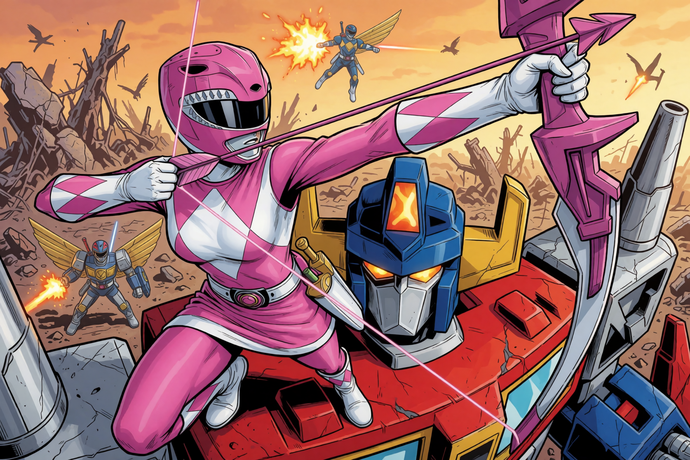

# Krea 2 Two Stage Sampler (& More!)

Right now this repo includes four nodes for ComfyUI:

A Sigma-locked two-stage sampler with separate inputs for models for each.  The general thinking was to run several steps of a base/raw model for better variation between seeds, and then finish it off with an extracted turbo lora on the second stage for both speed and possibly higher quality. It also has support for running two resolutions, so you can run the first stage at a lower, faster resolution.  The neat thing is that you can choose a percentage and any amount of steps for the first and second stage and it will change over with the original noise (if not upscaling) at just the right sigma values.

I've also included a dual resolution node—select the aspect ratio and the base and final megapixels. It includes random modes covering all ratios, vertical ratios, horizontal ratios, or a constrained set (1:1, 4:5, 5:4, 2:3, 3:2, 3:4, and 4:3). The included aspect ratios are specifically tailored for Krea 2.

The three-stage sampler adds a final pass that reuses all of the stage 1 settings (including its model, steps, CFG, sampler, and scheduler). `handoff_percent` controls the stage 1 to stage 2 transition, while `stage3_handoff_percent` controls the later stage 2 to stage 3 transition.  This can be helpful if you want to apply negative conditioning to the beginning and end of a generation.

The Krea 2 Model Sampling node provides `raw_dynamic`, `turbo_fixed`, and `manual` modes. `raw_dynamic` follows Krea 2's resolution-dependent Raw schedule (`0.5` at 256x256 through `1.15` at 1280x1280). `turbo_fixed` pins the shift to `1.15`, as expected by the distilled Turbo sampling regime.  ComfyUI doesn't set the shift correctly for non-turbo Krea 2, so it might be worth a shot to use this when not using the turbo model or checkpoint - like you might for stage one.

The main knob you'll want to play with is `handoff_percent`, which sets the point in the denoising process where stage 1 hands off to stage 2. For example, at 25%, stage 1 handles the first 25% and stage 2 handles the remaining 75%. At 0%, stage 2 performs the full generation; at 100%, stage 1 performs the full generation. There's no single right answer for where it should be set.  You can also set it to 0% or 100% to only to one stage or the other.  That can be a little confusing as to which one is 0% and which is 100% so there's a tooltip to help you.

Installation: Put in the custom_nodes folder or grab from ComfyUI manager. 

Here's an image with a sample workflow embedded:

