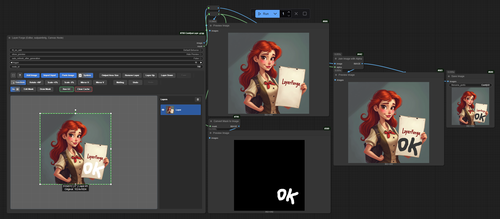
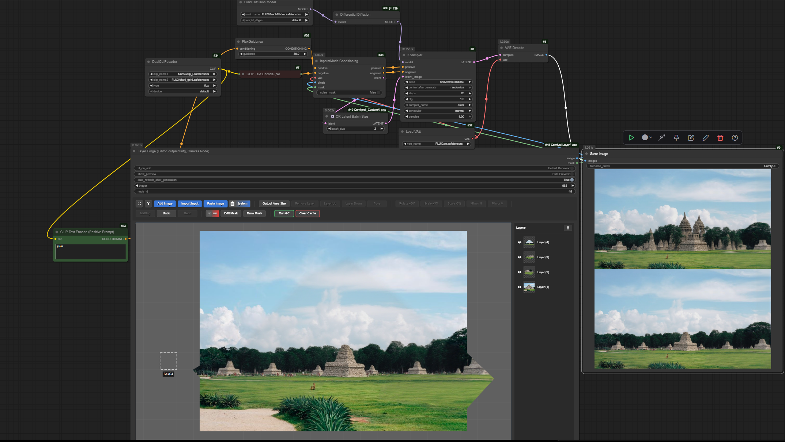

<h1 align="center">LayerForge: Layered Canvas Editor for ComfyUI 🎨</h1>


<p align="center"><i>LayerForge is a ComfyUI node for compositing images with multiple layers, masks, blend modes, and transformations. It stores canvas state in the browser's IndexedDB and returns an IMAGE plus a MASK to downstream nodes.</i></p>

<p align="center">
  <a href="https://registry.comfy.org/publishers/azornes/nodes/layerforge" style="display:inline-flex; align-items:center; gap:6px;">
    </a>
  <a href="https://github.com/Azornes/Comfyui-LayerForge" style="display:inline-flex; align-items:center; gap:6px;"></a>
  <a href="https://visitorbadge.io/status?path=https%3A%2F%2Fgithub.com%2FAzornes%2FComfyui-LayerForge"></a>
  
  <a href="https://github.com/sponsors/Azornes" style="display:inline-flex; align-items:center; white-space:nowrap;"></a>
  <a href="https://ko-fi.com/azornes" style="display:inline-flex; align-items:center; white-space:nowrap;"></a>
</p>

<p align="center">
  <strong>🔹 <a href="https://github.com/Azornes/Comfyui-LayerForge?tab=readme-ov-file#-installation">Quick Start</a></strong>
  &nbsp; | &nbsp;
  <strong>🧩 <a href="https://github.com/Azornes/Comfyui-LayerForge?tab=readme-ov-file#-workflow-example">Workflow Example</a></strong>
  &nbsp; | &nbsp;
  <strong>⚠️ <a href="https://github.com/Azornes/Comfyui-LayerForge?tab=readme-ov-file#%EF%B8%8F-known-issues--compatibility">Known Issues</a></strong>

</p>

https://github.com/user-attachments/assets/90fffb9a-dae2-4d19-aca2-5d47600f0a01

https://github.com/user-attachments/assets/9c7ce1de-873b-4a3b-8579-0fc67642af3a

## ✨ Key Features

- **Polygonal inpainting selection:** Draw a closed shape for an inpainting area. LayerForge clips imported output images to the shape and can apply a shape mask to layers inside its boundary.
- **Persistent canvas state:** LayerForge stores layers, positions, masks, and other canvas data in the browser's IndexedDB so the state survives a page reload.
- **Layer editing:** Add, reorder, move, scale, and rotate multiple image layers.
- **Mask editing:** Paint masks with adjustable brush size, strength, and softness. LayerForge keeps mask history separate from layer history.
- **Blend modes and opacity:** Choose from 12 blend modes, including `Overlay` and `Multiply`, and set opacity for each layer from the context menu.
- **Undo and redo:** Revert layer changes and mask strokes with separate histories.
- **Image import:** Add files by drag and drop, paste images or internal layer selections from the clipboard, or import the latest ComfyUI output with one click.
- **Optional matting:** Generate a background-removal mask for a selected layer with ComfyUI's native `BiRefNet` loader or local `BRIA RMBG 2.0`.
- **Image storage cleanup:** Garbage collection removes image data that no longer has references in the browser storage.

### Inputs

- **Image input:** An optional `IMAGE` input. Connect a ComfyUI Batch Image node to import multiple images as separate layers.
- **Mask input:** An optional `MASK` input. LayerForge loads it into Draw Mask when the workflow runs. The `Fit on Add/Paste` option scales it to the output area.

### Outputs

- **IMAGE:** The flattened composite from the visible layer stack.
- **MASK:** A combined alpha mask for the visible layers.

## 🚀 Installation

### Install via ComfyUI-Manager
1. Search for `Comfyui-LayerForge` in ComfyUI-Manager and click the `Install` button.
2. Restart ComfyUI.

### Manual Install
1. Install [ComfyUI](https://github.com/comfyanonymous/ComfyUI). The [portable Windows build](https://docs.comfy.org/installation/comfyui_portable_windows) is one option.
2. Clone this repo into `custom_nodes`:
    ```bash
    cd ComfyUI/custom_nodes/
    git clone https://github.com/Azornes/Comfyui-LayerForge.git
    ```
3. Restart ComfyUI.

---

## 🎯 Polygonal Lasso Inpainting Workflow

Use the polygonal selection tool to define the area that should receive a generated image. LayerForge clips new output images to the closed shape and can apply a matching mask to the layer stack.

### Setup Requirements

1. **Enable Auto-Refresh:** On the LayerForge node, enable `auto_refresh_after_generation`. After a successful execution, LayerForge checks ComfyUI's output directory and imports images created during that execution.

2. **Configure Auto-Apply (Optional):** Open the custom-shape menu on the left and enable `Auto-apply shape mask`. LayerForge then applies the shape mask to layers inside the boundary.

### How to Use Polygonal Selection

1. **Start Drawing:** Hold `Shift`, press `S`, and left-click to place the first point.

2. **Add Points:** Continue left-clicking to add vertices.

3. **Close Selection:** Click the first point or click near it to close the shape.

4. **Run the Workflow:** Execute the inpainting workflow. Save the generated image to ComfyUI's output directory, for example with a `Save Image` node, so LayerForge can import it after execution.

### Shape Mask Options

The custom-shape menu provides these controls:

- **Expand/Contract mask:** Enable the option and set the boundary from `-300` to `+300` px. Positive values expand the mask; negative values contract it.
- **Feather edges:** Enable the option and set the feather amount from `0` to `300` px. Feathering creates a gradual transition from opaque to transparent.
- **Extend output area:** Extend the output area by up to `500` px on each side without changing the custom shape.

### Tips

- Start with `10` to `50` px of feathering. Increase the value for larger images or softer edges.
- Try `10` to `20` px of mask expansion if the result has hard edges or visible seams.
- Extend the output area when the generation model needs more surrounding context, for large or complex images.
- The blue shape defines where LayerForge places the generated or pasted image. The dashed white outline shows the context area used for generation, so include enough surrounding content for consistent lighting and texture.

---

## 🧪 Workflow Example

The repository includes two workflows. The first checks LayerForge's basic image and mask outputs. The second demonstrates Flux fill inpainting.

**🔗 Example Workflows**

### 🔹 Simple Test Workflow
The simple workflow tests the node without a model-based generation step.


### 🔹 Flux Inpainting Workflow
This workflow combines LayerForge with Flux fill inpainting. It requires the Flux models used by the workflow.



**Load a workflow:**
Drag either workflow image into the ComfyUI workflow window in your browser. ComfyUI should load the workflow from the image metadata.

---

## 🎮 Controls & Shortcuts

### Canvas Control

| Action                       | Description                |
|------------------------------|----------------------------|
| `Click + Drag`               | Pan canvas view            |
| `Mouse Wheel`                | Zoom view in/out           |
| `Shift + Click (background)` | Start resizing canvas area |
| `Shift + Ctrl + Click`       | Start moving entire canvas |
| `Shift + S + Left Click`     | Draw custom polygonal shape for output area |
| `Single Click (background)`  | Deselect all layers        |
| `Esc`                        | Close fullscreen editor mode |
| `Double Click (background)`  | Deselect all layers        |

### Clipboard and Image Input

| Action                   | Description                                     |
|--------------------------|-------------------------------------------------|
| `Ctrl + C`               | Copy selected layer(s)                          |
| `Ctrl + V`               | Paste from clipboard (image or internal layers) |
| `Drag & Drop Image File` | Add image as a new layer                        |

### Layer Controls

| Action                | Description                     |
|-----------------------|---------------------------------|
| `Click + Drag`        | Move selected layer(s)          |
| `Ctrl + Click`        | Add/Remove layer from selection |
| `Alt + Drag`          | Clone selected layer(s)         |
| `Right Click`         | Show blend mode & opacity menu  |
| `Mouse Wheel`         | Scale layer (snaps to grid)     |
| `Ctrl + Mouse Wheel`  | Fine-scale layer                |
| `Shift + Mouse Wheel` | Rotate layer by 5°              |
| `Shift + Ctrl + Mouse Wheel` | Snap rotation to 5° increments |
| `Arrow Keys`          | Nudge layer by 1px              |
| `Shift + Arrow Keys`  | Nudge layer by 10px             |
| `[` or `]`            | Rotate by 1°                    |
| `Shift + [` or `]`    | Rotate by 10°                   |
| `Delete`              | Delete selected layer(s)        |

### Undo and Redo

| Action | Description |
|---|---|
| `Ctrl + Z` | Undo the last action |
| `Ctrl + Y` or `Ctrl + Shift + Z` | Redo the last undone action |

### Transform Handles (on selected layer)

| Action                 | Description                              |
|------------------------|------------------------------------------|
| `Drag Corner/Side`     | Resize layer                             |
| `Drag Rotation Handle` | Rotate layer                             |
| `Hold Shift`           | Keep aspect ratio / Snap rotation to 15° |
| `Hold Ctrl`            | Snap to grid                             |

### Mask Mode

| Action                       | Description                                                           |
|------------------------------|-----------------------------------------------------------------------|
| `Click + Drag`               | Paint on the mask                                                     |
| `Middle Mouse Button + Drag` | Pan canvas view                                                       |
| `Mouse Wheel`                | Zoom view in/out                                                      |
| **Brush Controls**           | Use sliders to control brush **Size**, **Strength**, and **Softness** |
| **Clear Mask**               | Remove the entire mask                                                |
| **Exit Mode**                | Click the "Draw Mask" button again                                    |

---

## 🤖 Model Compatibility

LayerForge outputs standard ComfyUI `IMAGE` and `MASK` values. Connect the node to models and nodes that accept those types.

For polygonal inpainting with Auto-Refresh enabled, save the generated image to ComfyUI's output directory, for example with a `Save Image` node. After execution, LayerForge imports the new output images, clips them to the closed blue shape, and places them in the selected output area.

---

## 🧠 Optional: Matting Model (for image cutout)

Matting generates a foreground cutout and alpha mask for the selected layer. It is optional and requires a model. LayerForge supports ComfyUI's native BiRefNet loader and a local BRIA RMBG 2.0 backend through Transformers.

### Models and Downloads

- **Models:** `BiRefNet` and `BRIA RMBG 2.0`.
- **BiRefNet download sources:** [Hugging Face](https://huggingface.co/ZhengPeng7/BiRefNet/tree/main) (recommended) and [Google Drive](https://drive.google.com/drive/folders/1BCLInCLH89fmTpYoP8Sgs_Eqww28f_wq?usp=sharing).
- **BiRefNet installation path:** Place a full checkpoint in `ComfyUI/models/background_removal/`.
- **Managed filenames:** LayerForge uses descriptive names such as `BiRefNet-general.safetensors` and `BiRefNet-portrait.safetensors` for catalog checkpoints.
- **First-use downloads:** `Auto` selects a compatible installed model and downloads the default BiRefNet checkpoint when needed. You can also select an official BiRefNet or BRIA model from the model selector. Downloads require an internet connection.
- **Download progress:** The Matting button shows Hugging Face download progress in a green progress bar.
- **BiRefNet compatibility:** LayerForge uses ComfyUI's native loader. Use a checkpoint with the full BiRefNet architecture. The `lite-*` variants do not work with this loader.
- **BRIA RMBG 2.0:** LayerForge stores the local Transformers model in `ComfyUI/models/background_removal/RMBG-2.0/`. The model requires the `transformers` package in the active ComfyUI environment.
- **Gated downloads:** Accept access to the BRIA repository on Hugging Face before downloading it. You can enter an optional read token in Matting settings. LayerForge stores the token in `layerforge_settings.json`, not in the workflow or browser `localStorage`.
- **BRIA license:** Check the [official model card](https://huggingface.co/briaai/RMBG-2.0) before commercial use.

### Matting Settings

Click the gear button next to **Matting**. LayerForge stores these settings in `layerforge_settings.json` next to the custom node:

- **Model:** Choose `Auto`, a compatible local checkpoint, or an official BiRefNet or BRIA model for download on first use.
- **Processing mode:** Choose `Remove background / keep foreground`, `Remove detected foreground / keep background`, `Apply generated mask to Draw Mask`, or `Apply inverted mask to Draw Mask`.
- **Mask threshold:** Set the value from `0` to `1`. `0` preserves a soft alpha mask; higher values produce a harder cutout.
- **Hugging Face token:** Enter an optional read token for gated repositories such as BRIA RMBG 2.0. Leave the field blank to keep the saved token.

The model selector lists compatible local checkpoints in one group and official models available for download in another. LayerForge stores BiRefNet checkpoints in `ComfyUI/models/background_removal/` and BRIA RMBG 2.0 under `ComfyUI/models/background_removal/RMBG-2.0/`. It validates selected models before use, excludes Lite BiRefNet checkpoints, and leaves unrelated Hugging Face cache folders untouched.

### BiRefNet model guide

The catalog covers general, portrait, matting, dynamic, and high-resolution use cases. Start with **General** for everyday photos, then choose a specialized variant when its training domain matches the image.

| Variant | Recommended use | Official page |
|---|---|---|
| [General](https://huggingface.co/ZhengPeng7/BiRefNet) | Everyday images and general background removal | [Hugging Face](https://huggingface.co/ZhengPeng7/BiRefNet) |
| [High Resolution](https://huggingface.co/ZhengPeng7/BiRefNet_HR) | Large images and detailed edges; higher memory use | [Hugging Face](https://huggingface.co/ZhengPeng7/BiRefNet_HR) |
| [Portrait](https://huggingface.co/ZhengPeng7/BiRefNet-portrait) | People, portraits, hair, and portrait cutouts | [Hugging Face](https://huggingface.co/ZhengPeng7/BiRefNet-portrait) |
| [Matting](https://huggingface.co/ZhengPeng7/BiRefNet-matting) | Soft alpha edges and semi-transparent details | [Hugging Face](https://huggingface.co/ZhengPeng7/BiRefNet-matting) |
| [High Resolution Matting](https://huggingface.co/ZhengPeng7/BiRefNet_HR-matting) | Fine matting details on larger images | [Hugging Face](https://huggingface.co/ZhengPeng7/BiRefNet_HR-matting) |
| [Dynamic](https://huggingface.co/ZhengPeng7/BiRefNet_dynamic) | Varying aspect ratios and input resolutions | [Hugging Face](https://huggingface.co/ZhengPeng7/BiRefNet_dynamic) |
| [Dynamic Matting](https://huggingface.co/ZhengPeng7/BiRefNet_dynamic-matting) | Arbitrary-size images with soft matting edges | [Hugging Face](https://huggingface.co/ZhengPeng7/BiRefNet_dynamic-matting) |
| [HRSOD](https://huggingface.co/ZhengPeng7/BiRefNet-HRSOD) | High-resolution salient-object detection | [Hugging Face](https://huggingface.co/ZhengPeng7/BiRefNet-HRSOD) |
| [DIS5K](https://huggingface.co/ZhengPeng7/BiRefNet-DIS5K) | Dichotomous foreground/background separation | [Hugging Face](https://huggingface.co/ZhengPeng7/BiRefNet-DIS5K) |
| [COD](https://huggingface.co/ZhengPeng7/BiRefNet-COD) | Camouflaged objects that blend into the background | [Hugging Face](https://huggingface.co/ZhengPeng7/BiRefNet-COD) |

See the [BiRefNet project](https://github.com/ZhengPeng7/BiRefNet) for the implementation, research details, and complete model collection.

---

## ⚠️ Known Issues / Compatibility

#### ○ Incorrect `node_id` can produce a black output

ComfyUI may leave the `node_id` field at its default value when it adds a LayerForge node. A wrong value can prevent LayerForge from matching the canvas data with the node and can produce a black output.

To fix it:

1. Open **Settings → NodesMap** and enable **Show node IDs**.
2. Find the ID shown above the LayerForge node on the right side.
3. Enter that value in the LayerForge node's `node_id` field.

> [!WARNING]
> Check the `node_id` if LayerForge produces a black or empty output.

---

## 📜 License

LayerForge is licensed under the MIT License. You can use, modify, and distribute it under the license terms.

---

## 💖 Support / Sponsorship

- ⭐ Star the repository.
- 🐛 Report a bug or suggest a feature.
- 💖 Support the project through [GitHub Sponsors](https://github.com/sponsors/Azornes).

---

## 🙏 Acknowledgments

LayerForge is based on the original [**Comfyui-Ycanvas**](https://github.com/yichengup/Comfyui-Ycanvas) by yichengup. The project adds multi-layer editing, masks, transformations, blend modes, and ComfyUI workflow integration.

Thanks to the ComfyUI community for bug reports and feature suggestions.
