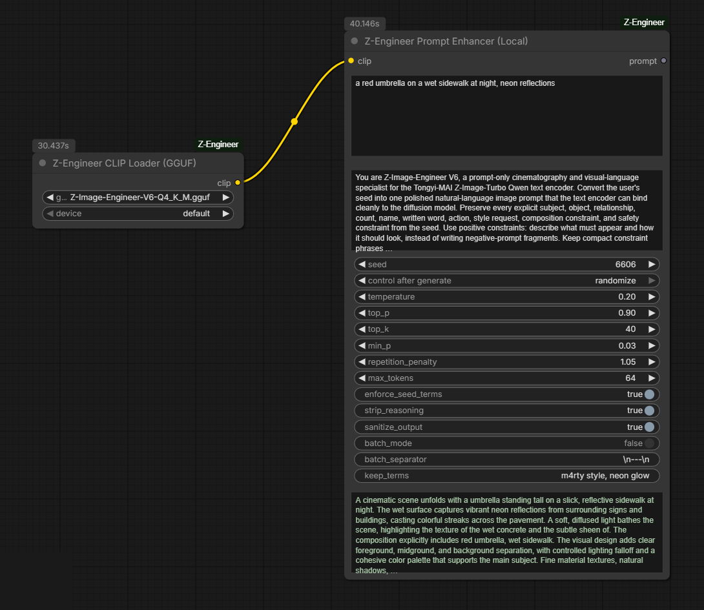

# ComfyUI Z-Engineer

Run [Z-Image-Engineer-V6](https://huggingface.co/BennyDaBall/Z-Image-Engineer-V6) fully inside ComfyUI: load the Qwen3-4B prompt model from sharded HuggingFace safetensors **or** [GGUF quants](https://huggingface.co/BennyDaBall/Z-Image-Engineer-V6-GGUF), use it as the **Z-Image Turbo text encoder (CLIP)**, and use the *same loaded model* as a **local prompt enhancer** with a live preview on the node. No LM Studio or external server required.



## Nodes

| Node | What it does |
| --- | --- |
| **Z-Engineer CLIP Loader (Safetensors / Shards)** | Loads a single `.safetensors` file *or a sharded HF folder* (`model-00001-of-00003.safetensors` + index) as a Z-Image text encoder. This is how you load the 3-piece Z-Image-Engineer-V6 release directly. |
| **Z-Engineer CLIP Loader (GGUF)** | Loads a llama.cpp-style Qwen3 GGUF (Q3_K_M ... F16) as a Z-Image text encoder. Uses [ComfyUI-GGUF](https://github.com/city96/ComfyUI-GGUF) for on-the-fly dequant when installed; otherwise falls back to FP16 dequant at load time. |
| **Z-Engineer Prompt Enhancer (Local)** | Takes the loaded CLIP and generates the polished V6 prompt in-process (ComfyUI's own model management — no server). The enhanced prompt is previewed on the node and returned as a STRING. |
| **Z-Engineer Prompt Enhancer (API)** | Legacy path: OpenAI-compatible `/chat/completions` (LM Studio, llama.cpp server, Ollama). Kept for users who prefer an external server. |

## Installation

### ComfyUI Manager / Registry

Search for **ComfyUI Z-Engineer** in ComfyUI Manager, or:

```bash
comfy node install comfyui-z-engineer
```

### Manual

```bash
cd ComfyUI/custom_nodes
git clone https://github.com/BennyDaBall930/ComfyUI-Z-Engineer.git
pip install -r ComfyUI-Z-Engineer/requirements.txt
```

Restart ComfyUI.

## Model installation

Put the model under `ComfyUI/models/text_encoders/`:

**Sharded safetensors (the published V6 release):**

```text
ComfyUI/models/text_encoders/Z-Image-Engineer-V6/
├── model-00001-of-00003.safetensors
├── model-00002-of-00003.safetensors
├── model-00003-of-00003.safetensors
└── model.safetensors.index.json
```

Download from [BennyDaBall/Z-Image-Engineer-V6](https://huggingface.co/BennyDaBall/Z-Image-Engineer-V6). The folder shows up in the loader dropdown as `Z-Image-Engineer-V6/`.

**GGUF (recommended for low VRAM):**

```text
ComfyUI/models/text_encoders/Z-Image-Engineer-V6-Q4_K_M.gguf
```

Download any quant from [BennyDaBall/Z-Image-Engineer-V6-GGUF](https://huggingface.co/BennyDaBall/Z-Image-Engineer-V6-GGUF) (Q4_K_M is a good default; F16 for maximum fidelity). Installing [ComfyUI-GGUF](https://github.com/city96/ComfyUI-GGUF) is strongly recommended — the quant then stays quantized in VRAM.

## Usage

### As text encoder + prompt enhancer (one model, both jobs)

1. Add **Z-Engineer CLIP Loader (GGUF)** (or the Safetensors/Shards loader) and pick the model.
2. Wire `clip` into your normal **CLIP Text Encode** for the Z-Image Turbo pipeline — the V6 model doubles as the Qwen3-4B text encoder.
3. Add **Z-Engineer Prompt Enhancer (Local)**, wire the same `clip` in, and type your raw seed prompt.
4. Wire the enhancer's `prompt` output into the CLIP Text Encode `text` input.
5. Queue — the enhanced prompt appears right on the enhancer node.

```text
[Z-Engineer CLIP Loader] ──clip──┬──> [Z-Engineer Prompt Enhancer (Local)] ──prompt──> [CLIP Text Encode] ──> ...
                                 └────────────────────────────────clip───────────────────────^
```

### Recommended enhancer settings (V6)

- `temperature`: `0.20`, `top_p`: `0.9`, `top_k`: `40`, `min_p`: `0.03`
- `repetition_penalty`: `1.05`
- `max_tokens`: `320`
- `enforce_seed_terms`: `true` — deterministically re-appends seed phrases (counts, colors, quoted text) if the model drops them
- `strip_reasoning` / `sanitize_output`: `true`

### Trigger words / keep terms

Put LoRA trigger words (or any phrase that must survive verbatim) into the optional `keep_terms` input, separated by commas: `m4rty style, neon glow`. The model is instructed to weave them in unchanged, and any it still drops are deterministically re-appended to the final prompt — exact casing preserved. Available on both the Local and API enhancer nodes.

### Resizable text boxes

Each multiline box on the enhancer nodes (seed prompt, system prompt, previews) can be resized vertically on its own with the grip in its bottom-right corner — no need to grow the whole node. Box heights are saved with the workflow; double-click the grip corner to reset a box to automatic sizing.

### Batch mode

Enable `batch_mode` to process several seed prompts in one call (split by `batch_separator`, default `\n---\n`, falling back to lines). Outputs are joined with the same separator and each one is shown in the preview.

## VRAM notes

- GGUF Q4_K_M with ComfyUI-GGUF: ~3-4 GB during generation.
- Sharded/single safetensors (FP16): ~9 GB during generation.
- Without ComfyUI-GGUF, GGUFs are dequantized to FP16 at load (full FP16 footprint).
- Loading never spikes VRAM: weights stay on the offload device until first use, and the model participates in ComfyUI's normal model management (it unloads like any other model).

## Requirements

- ComfyUI new enough to ship native Z-Image support (`comfy/text_encoders/z_image.py`, v0.3.75+)
- `requests` (API node), `gguf` (GGUF fallback path)
- Optional but recommended: [ComfyUI-GGUF](https://github.com/city96/ComfyUI-GGUF)

## License

MIT
