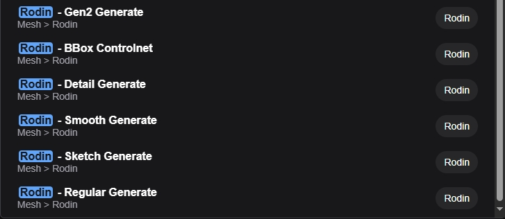
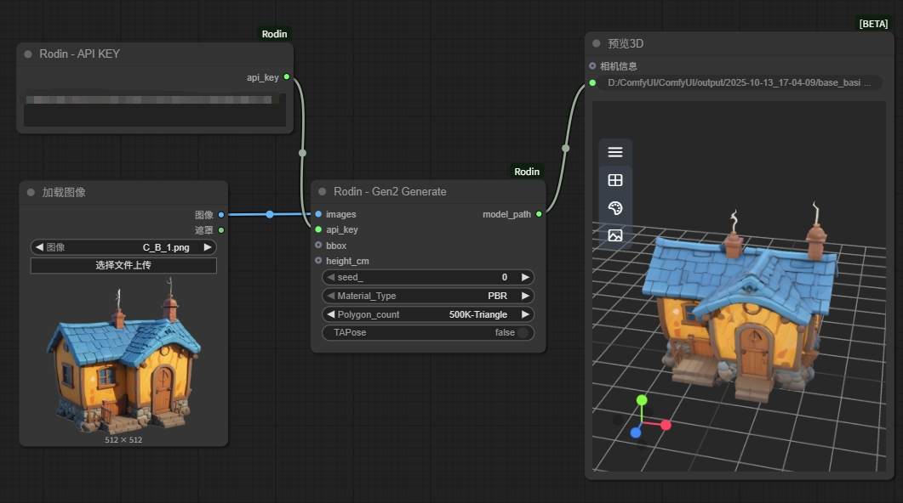
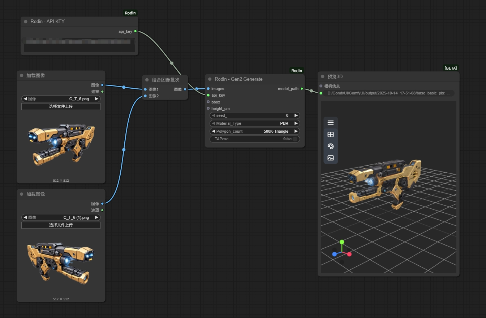
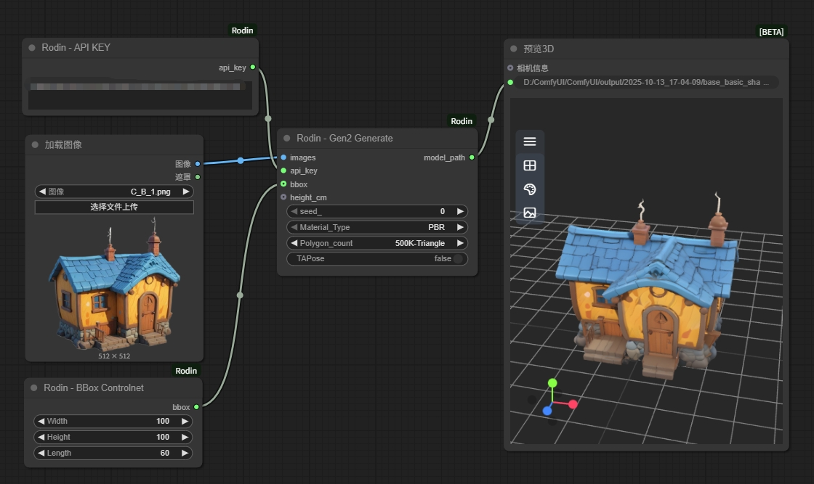
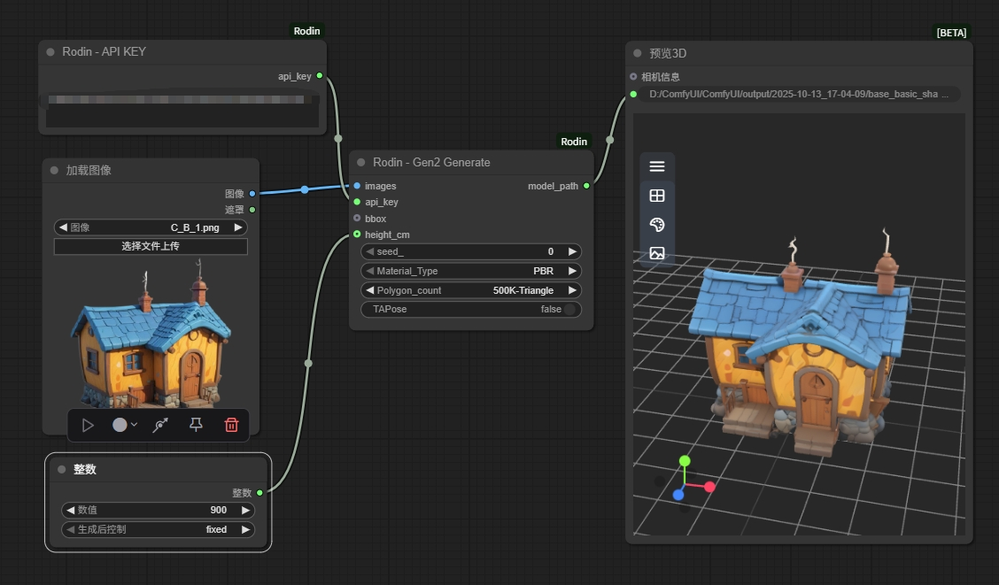
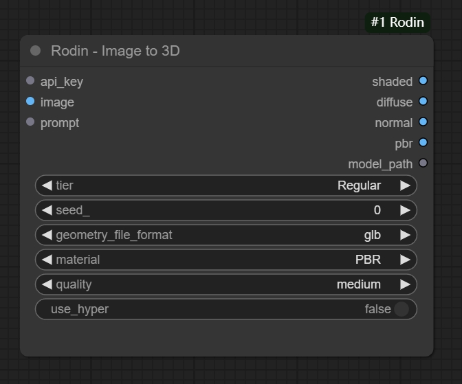
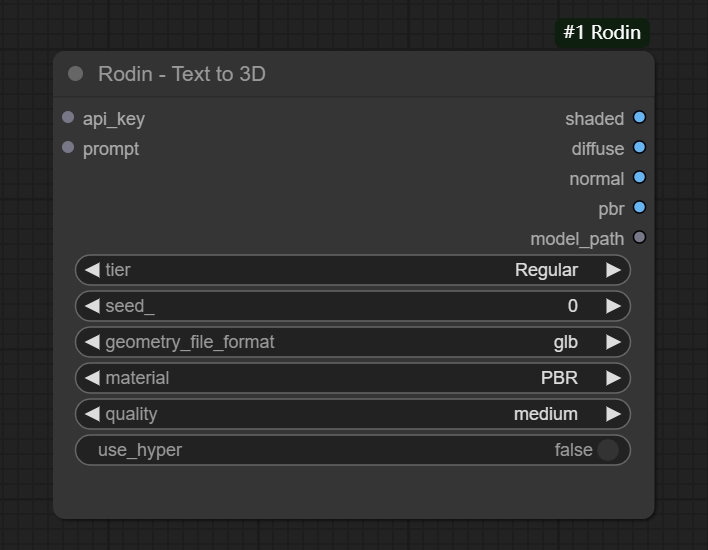
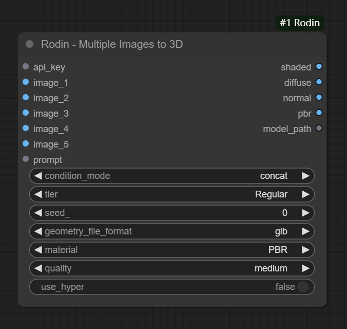
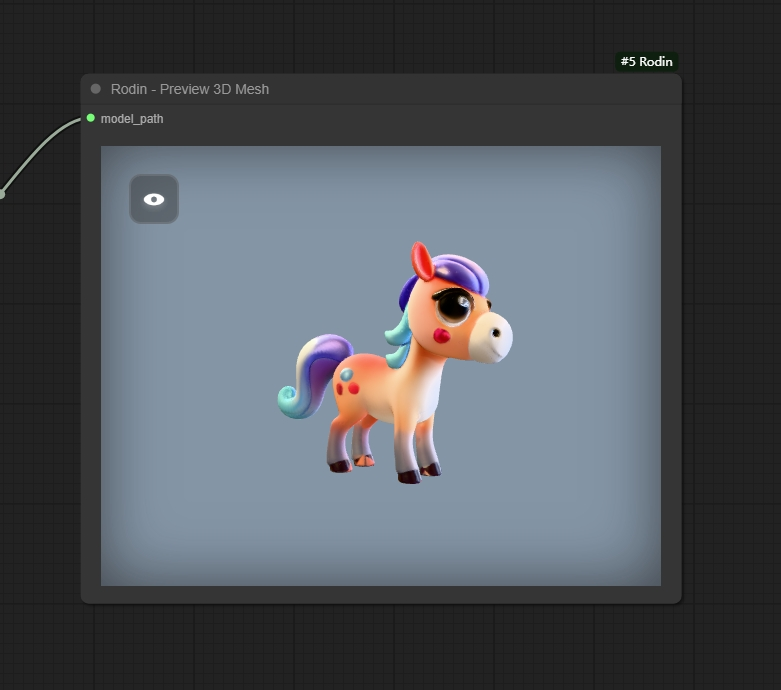

# ComfyUI-Rodin

**Comfyui-rodin** is a 3D generation extension based on [Rodin](https://hyper3d.ai/)-API. It provides many of the functionality nodes currently available in RodinAPI, such as Image-to-3D, Text-to-3D, Multiple Images-to-3D, etc. In addition, the extension provides a 3D preview node for ComfyUI.

## Generate Rodin Models via ComfyUI Custom Node​

This ​​ComfyUI custom node​​ integrates with the Hyper3D API to generate 3D assets using Rodin. Get more information about 'How to use Rodin API' and 'How to get Rodin API KEY' from [Rodin API document](https://developer.hyper3d.ai/)

## Installation

1. **Can be installed directly from [ComfyUI-Rodin](https://github.com/DeemosTech/ComfyUI-Rodin.git)**

    Clone the repository:
    `git clone https://github.com/DeemosTech/ComfyUI-Rodin.git`
    Move the cloned repository to your ComfyUI `custom_nodes` directory.

2. **Can be installed from ComfyUI-Manager**

## Dependencies

This extension requires the following Python packages:

- `aiohttp` - For asynchronous HTTP requests to the Rodin API
- `asyncio` - For asynchronous operations

You can install the dependencies using the provided `requirements.txt` file:

```bash
pip install -r requirements.txt
```

## Update

1. Navigate to the cloned repo e.g. `custom_nodes/ComfyUI-Rodin`
2. `git pull`
3. Reinstall dependencies if needed: `pip install -r requirements.txt`

## Features

- **Rodin Nodes Overview**
    - 
    
    This extension provides several utility nodes for Rodin generation and Controlnet use.

- **The Simplest way to use**
    - 

    Get your API key from [Rodin api-dashboard](https://hyper3d.ai/api-dashboard) and fill it into the <strong>"Rodin - API KEY"</strong> node. 
    
    All the Rodin generation nodes need to be linked with <strong>"Rodin - API KEY"</strong>.

- **Multi-view Rodin Generate**
    - 

- **How to use Boundbox ControlNet**
    - 

- **How to set Model height (in cm)**
    - 

## Node Types

### Gen 1/1.5 Nodes
- **Rodin - Regular Generate** - Standard 3D generation
- **Rodin - Detail Generate** - High-detail 3D generation
- **Rodin - Smooth Generate** - Smooth 3D generation
- **Rodin - Sketch Generate** - Sketch-based 3D generation

### Gen 2 Nodes
- **Rodin - Gen2 Generate** - Gen-2 model generation

### Gen 2.5 Nodes
- **Rodin - Gen 2.5 Fast Image-to-3D** - Fast image-based 3D generation
- **Rodin - Gen 2.5 Fast Text-to-3D** - Fast text-based 3D generation
- **Rodin - Gen 2.5 Regular Image-to-3D** - Regular image-based 3D generation
- **Rodin - Gen 2.5 Regular Text-to-3D** - Regular text-based 3D generation
- **Rodin - Gen 2.5 ExtremeHigh Image-to-3D** - High-quality image-based 3D generation
- **Rodin - Gen 2.5 ExtremeHigh Text-to-3D** - High-quality text-based 3D generation

### Other Nodes
- **Rodin - API KEY** - Input your Rodin API key
- **Rodin - BBox Controlnet** - Control 3D model dimensions

<details>

<summary> Obsolete node​s </summary>

- **Rodin - Image to 3D**
    - Single image to 3D Mesh with Textures(PBR/Shaded)
    - A successful run will download the 3D model to `ComfyUI/output` directory.
    - 
    
    The **image** and **api_key** must be supplied, and other options can be adjusted. Refer to the [RodinAPI documentation](https://developer.hyper3d.ai/api-specification/overview) for parameter information.

- **Rodin - Text to 3D**
    - Prompt text to 3D Mesh with Textures(PBR/Shaded)
    - A successful run will download the 3D model to `ComfyUI/output` directory.
    - 
    
    The **Prompt** and **api_key** must be supplied, and other options can be adjusted. Refer to the [RodinAPI documentation](https://developer.hyper3d.ai/api-specification/overview) for parameter information.

- **Rodin - Multiple Images to 3D**
    - Multiple Images to 3D Mesh with Textures(PBR/Shaded)
    - A successful run will download the 3D model to `ComfyUI/output` directory.
    - Multiple images can be different views of the same object or different objects. At least one image should be supplied.
    - 
    
    The **images(At least one)** and **api_key** must be supplied, and other options can be adjusted. Refer to the [RodinAPI documentation](https://developer.hyper3d.ai/api-specification/overview) for parameter information.

- **Rodin - Preview 3D Mesh**
    - 3D Model preview node with support for multiple formats of PBR and Shaded rendering.
    - The currently supported model types are: `obj`, `glb`, `fbx`, `stl`.
    - The rendering mode can be switched.
    - 

</details>

## Troubleshooting

### Common Issues
1. **API Key Error** - Ensure you've entered a valid Rodin API key from the [Rodin api-dashboard](https://hyper3d.ai/api-dashboard)
2. **Generation Failed** - Check your internet connection and ensure you have sufficient API credits
3. **Model Download Issues** - Ensure you have write permissions to the ComfyUI output directory

### Error Messages
- `MISS_API_KEY` - API key is missing
- `MISS_IMAGES_OR_PROMPT` - No images or prompt provided
- `RODIN_ERROR` - Error from the Rodin API
- `NO_JOBS_FOUND` - No jobs found for the given subscription key
- `MISS_SUBSCRIPTION_KEY` - Subscription key is missing
- `MISS_JOB_UUID` - Job UUID is missing
- `NO_FILES_FOUND` - No files found for download
- `UNKNOWN_ERROR` - Unexpected error occurred


