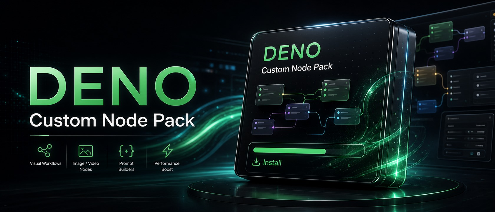
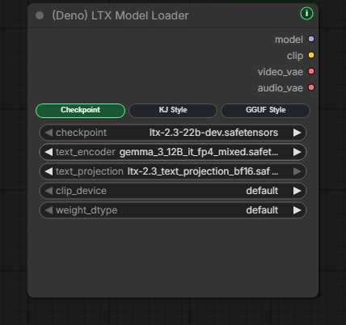
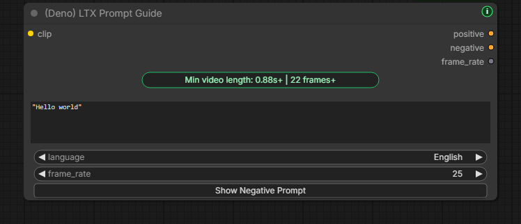

# Deno Custom Nodes

[English](README.md) | [한국어](docs/README.ko.md) | [日本語](docs/README.ja.md) | [简体中文](docs/README.zh-CN.md) | [Español](docs/README.es.md) | [Português](docs/README.pt-PT.md) | [Português (Brasil)](docs/README.pt-BR.md) | [Bahasa Indonesia](docs/README.id.md)

[YouTube Channel](https://www.youtube.com/@Denoise-AI)



You can use this repo freely.

DENO-owned nodes, docs, examples, workflows, and assets in this repo are free to use, copy, modify, publish, redistribute, and use commercially. You do not need to mention DENO, the creator, or this repo when you use them.

Third-party models, checkpoints, LoRAs, libraries, tools, and services keep their own licenses and terms. If a workflow uses a specific model or asset, check and follow that license before sharing or selling outputs.

Practical ComfyUI custom nodes focused on fast real-world workflow improvements.
This repo is built for global creators and production workflows, with a focus on practical UX and reliable daily use.

Most Deno nodes include a small green `i` button in the top-right corner for quick node info without leaving the ComfyUI canvas. If a newer Deno Custom Nodes version is available, the button turns yellow and shows a small `!` badge.
The pack also includes lightweight frontend/browser helpers such as **DENO Visual Fold**, optional **DENO Floating Tools** for Free VRAM, Portable update checks, and GPT/Gemini-ready Error Help reports, the no-install **Video Compare** page, the **Video to GIF/WebP** converter page, and the 한국어 전용 **디스코드용 영상 / 이미지 압축** page.

## Release Notes

Public updates are tracked in [CHANGELOG.md](CHANGELOG.md). GitHub Releases should use the same short format, with optional notes hidden in collapsible sections.

## Web Tools

Run these directly in your browser:

- [DENO Video Compare](https://deno2026.github.io/comfyui-deno-custom-nodes/video-compare/) - compare two rendered videos with slider, side-by-side, difference, and toggle views.
- [DENO Video to GIF/WebP](https://deno2026.github.io/comfyui-deno-custom-nodes/video-to-gif/) - trim, crop, resize, and export short clips as GIF or smaller WebP files.
- [DENO 디스코드용 영상 / 이미지 압축](https://deno2026.github.io/comfyui-deno-custom-nodes/video-to-discord/) - 영상이나 이미지를 줄여 가능하면 10MB 이하 디스코드용 파일로 저장합니다.

## DENO Visual Fold


DENO Visual Fold is a visual-only cleanup helper for large ComfyUI graphs. It is enabled automatically when the latest Deno Custom Nodes package is installed or updated.

Select two or more nodes and the native ComfyUI selection toolbar shows a readable green `Fold` badge. Click it to collapse the selected nodes into one compact visual group; use `Unfold` to restore them.

You can also select one normal ComfyUI group and use `Fold Group` to collapse the nodes inside that group while keeping the workflow logic untouched. When two or more groups are selected, the same toolbar adds readable `Align` badges for left/right/top/bottom alignment and horizontal/vertical spacing.

This is different from ComfyUI Subgraph. Subgraph moves nodes into a child graph, which can be powerful, but it may not be ideal when a workflow depends on keeping `Get` / `Set` nodes or parent-child graph structure visible in the main graph. Visual Fold is meant for simple visual organization only. It does not turn the selected nodes into a subgraph or change the workflow logic.

## DENO Floating Tools

DENO Floating Tools is an optional helper under `Settings > DENO > Tools`. It is off by default.

When enabled, it adds a small draggable DENO icon to the ComfyUI screen. The panel can free ComfyUI VRAM through ComfyUI's built-in memory cleanup endpoint, show read-only update status for Portable installs, and open an Error Help report when a run fails.

Error Help creates a GPT/Gemini-ready report with the current workflow, Python executable and environment type, package versions, GPU details, recent traceback/log context, and custom node summary. It is read-only, opens a report window first, and copies only when you click `Copy Report`. Common secrets such as tokens, cookies, passwords, private keys, and URL credentials are masked before copy.

Floating Tools does not install, update, restart, repair, or modify workflows.

## Included Nodes

### `(Deno) Ideogram Director`

[](https://youtu.be/Z8s27skkIDM)

Visual Ideogram 4 prompt builder for structured JSON captions and bbox layout work.

Main features:

- draw and edit bbox regions directly on the ComfyUI canvas
- import JSON prompts from a Local LLM Loader or other STRING source
- ask before replacing an existing board, or switch to always replace
- reject malformed JSON clearly instead of passing broken prompt text downstream
- style and layout preset galleries with lightweight preview thumbnails
- Language view for reading and editing board descriptions in your language while final output stays model-ready English. Literal TEXT box words such as signs, logos, and headlines are preserved exactly
- outputs: `prompt`, `width`, `height`, `seed`, `bboxes`

### `(Deno) Resize Box`

Resolution helper and image resize node for ComfyUI.


Main features:

- `Preset Ratio` and `Manual Input` modes
- common ratio presets
- megapixel-based size calculation
- `divisible_by` alignment
- `Center Crop (Fill)` and `Fit (Letterbox/Pillarbox)` resize modes
- `lanczos` default interpolation
- live ratio preview inside the node
- outputs: `image`, `width`, `height`

### `(Deno) Multi Image Loader`

Minor-upgrade multi-image loader designed for batch guide workflows.

Inspired by the original workflow ideas from **WhatDreamsCost**, then adapted and refined for the Deno workflow style.


Main features:

- scrollable fixed-height gallery instead of endlessly growing node height
- drag reorder with stable placeholder insertion
- upload button, drag-and-drop upload, and paste image support
- `Input Folder` browser for reusing existing ComfyUI `input` images
- input subfolder browsing with folder tiles, double-click navigation, and a `Parent` button
- nested input images can be added while preserving their ComfyUI subfolder paths
- newest-first input image sorting based on file modified time
- responsive input-folder thumbnails for smoother browsing with many images
- `Keep Input Ratio`, `Preset Ratio`, or `Manual Input` size mode
- ratio preset, megapixels, divisible-by sizing, or direct width/height control
- resize method and interpolation selection
- outputs: `multi_output`, `width`, `height`
- optional crop or fit resizing during export

### `(Deno) Advanced Image Source Loader`

Advanced image source loader for workflows that need external folders, local file paths, web image URLs, and mixed-size image-list output.

This is a separate advanced node. The standard `(Deno) Multi Image Loader` remains the simpler recommended option for normal ComfyUI `input` folder workflows.


Main features:

- keeps the familiar Deno image-loader gallery workflow
- supports existing ComfyUI `input` folder browsing
- supports external local folder paths outside the ComfyUI `input` folder
- supports folder tiles, nested-folder browsing, and a `Parent` button
- supports `URL / Path` input for web image URLs, absolute local image paths, and local folder paths
- supports upload, drag-and-drop, paste, and browser folder upload where the browser allows it
- includes a visible `Paste` button plus normal Ctrl+V image paste
- click thumbnails to disable/enable sources without deleting them
- drag thumbnail cards to reorder output sequence
- the gallery expands vertically when the ComfyUI node is resized
- thumbnails use a masonry-style flow so mixed portrait/landscape references are easier to scan
- `Load Path` reads an external folder directly without first importing it into ComfyUI `input`
- `Upload Folder...` is an optional browser upload/import helper, not required for external path loading
- `recursive_folders` option for loading nested folder images
- `Keep Input Ratio`, `Preset Ratio`, or `Manual Input` size mode
- ratio preset, megapixels, divisible-by sizing, or direct width/height control
- resize method and interpolation selection, including center, top, or bottom crop fill modes
- optional `images` input can chain an upstream image batch/list into the same output stream
- outputs a resized `batch` image tensor for normal batch workflows
- outputs `image_list` for workflows that need per-image list handling
- `Original Size` list mode can preserve mixed source resolutions in `image_list`
- `Match Batch Size` list mode makes `image_list` match the resized batch dimensions
- outputs: `batch`, `image_list`, `width`, `height`, `image_count`

### `(Deno) Image Compare`

Visual A/B comparison node for quickly checking two images on the ComfyUI canvas.


Main features:

- compares `image_a` and `image_b` directly inside the node
- modes: `Slider`, `Side by Side`, `Difference`, and `Toggle`
- hover-move slider interaction for fast before/after inspection
- visible A/B labels and a `Swap` button for checking either direction
- resizes the internal preview area with the node so portrait and landscape images stay readable
- visual-only node with no output connection, keeping the graph cleaner when the comparison is just for inspection

### `(Deno) Video Compare`

Visual A/B comparison node for videos, built for checking upscale and FPS-interpolation results directly on the ComfyUI canvas. All compositing is pure tensor work — no external encoder. The in-node player draws a downscaled WebP frame sequence on a `<canvas>` on a virtual clock (so A/B stay frame-exact) and plays audio via WebAudio; the files are written to ComfyUI's temp dir and served by the existing `/view` route, then auto-cleared on restart.

Main features:

- `video_a` / `video_b` (IMAGE batches) and optional `audio_a` / `audio_b` (AUDIO, e.g. from VHS *Load Video*)
- modes: `Slider`, `Side by Side`, `Difference`, `Toggle` (freeze-frame A/B flip), plus `Swap`
- hover-move slider, click = play/pause, scrub bar, frame step, speed, loop; hover the preview to hear the selected side
- shared timeline: both sides play over the same duration, so an upscale (same frame count) stays frame-locked while an FPS-interpolation result (e.g. RIFE 24 to 48) just looks smoother at the same length
- node resizes to the clip aspect; wheel and middle-drag are passed to the ComfyUI canvas
- `🏷 Output Badges` toggle: optionally adds A/B + resolution badges to the saved output (off by default; the in-node preview always shows them)
- `comparison`: full-resolution **lossless** IMAGE output of the chosen mode (Slider / Side by Side / Difference / Toggle), ready to wire into a save/encode node such as VHS *Video Combine*

Too heavy to run the node? Use the no-install browser tool: **https://deno2026.github.io/comfyui-deno-custom-nodes/video-compare/** (also linked at the bottom of the node).


### `(Deno) Video Preview`

Drop-in, full-resolution preview for checking real encoded output at any point in a graph. It encodes the actual H.264 video at the original resolution in-process with PyAV (no external process is launched) using `+faststart` so the browser plays it inline reliably, then passes the images straight through — so you can insert it **inline at multiple sampling points** without branching the wire.

Main features:

- `images` (IMAGE batch) in, `images` straight-through out, `frame_rate`, and an optional `audio` input that is muxed into the preview as AAC (tolerant of dict / object / `(waveform, sr)` AUDIO and `[C,N]` / `[N,C]` shapes; if audio can't be used it is logged and the video still previews)
- clean auto-looping in-node player like the VHS preview: no control chrome, **hover to hear audio**, **click = play/pause**, a **Full screen** button, and the wheel is passed through to the ComfyUI canvas
- a compact top-left info badge shows the current preview's resolution, FPS, frame count, and duration
- the node fits the clip aspect and stays fitted as it is resized
- each node reuses one temp file, overwritten every run, so heavy iteration never piles up temp storage
- needs PyAV (`pip install av`); if it is missing the node shows a clear one-line install hint instead of failing the graph


### `(Deno) RTX Video Super Resolution`

Optional Windows/NVIDIA RTX Video Super Resolution helper node for users who want to try NVIDIA VFX inside ComfyUI without manually hunting for the right Python environment.

This node is intentionally separate from the core Deno nodes. It only imports NVIDIA VFX during upscale execution, so normal Deno node installs do not require NVIDIA VFX. ComfyUI Manager installs the node pack without auto-installing NVIDIA VFX.


Beginner install flow:

1. Install or update `deno-custom-nodes`, then start ComfyUI.
2. Add `(Deno) RTX Video Super Resolution` and run it once with an image.
3. If NVIDIA VFX is missing, close every ComfyUI window/process.
4. Click the node's `How to install` button.
5. Follow the visual web install guide: download the ZIP from that page, move it into `ComfyUI\custom_nodes\deno-custom-nodes\tools`, extract it there, and run `install_rtx_vfx.bat` from the extracted installer files inside that `tools` folder.
6. If the BAT asks `Install RTX VFX here?`, type `Y` only when the shown Windows path is inside the ComfyUI app you just closed. If it looks wrong, type `N` and stop.
7. Wait for the green `INSTALL COMPLETE` message.
8. Restart ComfyUI completely, then use `(Deno) RTX Video Super Resolution` again.

For the full beginner-friendly visual walkthrough, open the [DENO RTX VFX install page](https://deno2026.github.io/comfyui-deno-custom-nodes/rtx-vfx-install/).
If a tutorial video tells you to open the `tools` folder after installing from ComfyUI Manager, open `tools/OPEN_INSTALL_GUIDE.txt`; it points to the same current install page.

Official NVIDIA references:

- [Video Super Resolution filter](https://docs.nvidia.com/maxine/vfx/latest/Filters/VideoSuperResolution.html)
- [NVIDIA VFX Python bindings](https://docs.nvidia.com/maxine/vfx-python/latest/index.html)
- [VideoSuperRes Python API](https://docs.nvidia.com/maxine/vfx-python/latest/api.html)

Mode guide:

| If your image is... | Use |
| --- | --- |
| small, low-res, or compressed | `VSR` |
| already clean, but needs a larger sharper output | `High Bitrate` |
| noisy or grainy | `Denoise` |
| soft, out of focus, or mildly blurred | `Deblur` |

Main features:

- uses NVIDIA's official `nvidia-vfx` / `nvvfx.VideoSuperRes` package path
- links from the node UI to NVIDIA's official Video Super Resolution documentation
- shows a compact RTX panel with effect buttons, a separate quality selector, a mode-coach line, and only the resize controls that apply to the selected effect
- single-pass and 2-pass RTX panels pass mouse-wheel scrolling through to the ComfyUI canvas, so normal canvas zoom still works while the pointer is over the node
- installer targets the Python used by the current ComfyUI install
- installer refuses to continue if ComfyUI is still running with that Python
- installer asks before installing into the detected Python
- installer stops if no NVIDIA GPU is detected unless the user explicitly overrides the check
- installer reinstalls `nvidia-vfx` cleanly when the user confirms the target Python
- installer first verifies the normal `nvvfx` package path used by the current ComfyUI Python
- installer uses the ASCII Windows runtime fallback only when the normal `nvvfx` path fails verification
- node startup prefers the recorded ASCII fallback path only when that fallback was actually selected
- if another NVIDIA VFX native module is already loaded from a conflicting path, the node stops and asks for a full ComfyUI restart instead of trying to reload the native extension
- installer verifies that NVIDIA's `VideoSuperRes` effect can actually be created after install
- if NVIDIA VFX reports an unsupported runtime feature, the node shows a readable GPU/driver/runtime-path message instead of a raw stack trace
- if NVIDIA Broadcast/NGX VFX DLLs from another RTX node are already loaded, the node reports that native runtime conflict separately from GPU/driver support
- if another Broadcast-based RTX node works while DENO fails, treat it as a native runtime conflict, not proof that the DENO install is broken
- keeps the installer BAT and ZIP on GitHub instead of inside the Manager package, while the node UI provides a `How to install` button that opens the visual web install page plus a `Copy steps` helper
- keeps a small `tools/OPEN_INSTALL_GUIDE.txt` file in Manager installs so the `tools` folder still exists for users following older tutorial videos
- exposes four clear effect buttons: Video SR, High Bitrate, Denoise, and Deblur
- shows a compact mode coach line that explains the selected effect in plain language
- keeps Low, Medium, High, and Ultra quality as a separate selector
- for Video SR and High Bitrate, supports `Scale`, `Keep Ratio`, `Manual`, and `Preset Ratio` resize choices
- `Keep Ratio` and `Preset Ratio` use target megapixels; `Manual` uses width and height
- exposes `divisible_by` alignment for resizable modes, with `1` as the default so standard video sizes such as 1920x1080 stay exact
- higher alignment values such as `32` remain available when a workflow specifically needs forced multiple-of-N output
- shows `Center Crop (Fill)` / `Fit (Letterbox/Pillarbox)` when a manual, preset-ratio, or aligned keep-ratio resize can change aspect ratio
- `Denoise` and `Deblur` keep the original size and hide resize controls, matching NVIDIA's same-size VSR modes
- shows resize controls only when they apply to the selected effect
- Easy Upscale outputs: `images`

### `(Deno) RTX Video Super Resolution (2 Pass)`

Two-pass RTX finishing node for full video workflows. It can run an optional same-size `Denoise` or `Deblur` pass first, then an optional `VSR` or `High Bitrate` upscale pass.

Example workflow:

- [RTX 2-pass upscale workflow](docs/workflows/deno-rtx-lowram-metabatch.json)

Main features:

- includes both `Low System Memory` and `High System Memory` lanes in the example workflow
- the low-memory lane uses VHS Meta Batch so longer videos can be processed in smaller frame chunks
- uses `VHS_VideoInfoSource` to carry the source FPS into `VHS_VideoCombine`
- preserves source audio through the VHS load/combine path
- useful when finishing actual encoded video outputs, not just testing a single image batch
- outputs: `images`

### `(Deno) LTX Sequencer`

LTX guide sequencer tuned for multi-image workflows.

Inspired by **WhatDreamsCost**'s LTX workflow approach, with Deno-side adjustments focused on day-to-day usability.


Main features:

- works with the batch output from `(Deno) Multi Image Loader`
- auto-fills `num_images` from the connected loader when possible
- keeps the existing sync-style workflow
- allows only `strength` values to break out into manual control when needed
- `bypass` switch passes `positive`, `negative`, and `latent` through unchanged for quick A/B tests

### `(Deno) LTX Model Loader`

One compact loader for the common LTX 2.3 model-loading patterns.



Main features:

- `Checkpoint Style`, `KJ Style`, and `GGUF Style` modes
- outputs: `model`, `clip`, `video_vae`, `audio_vae`
- uses ComfyUI's built-in checkpoint / diffusion / DualCLIP loading paths where possible
- uses KJNodes `VAELoaderKJ` for split video/audio VAE workflows
- uses ComfyUI-GGUF UNet loading for GGUF workflows
- includes clearer dependency errors and an audio VAE compatibility fallback for mixed ComfyUI/KJNodes environments

### `(Deno) LTX Tiled Spatial Upscaler`

Helper for high-resolution LTX video-latent second passes. It splits each frame into overlapping spatial tiles, runs the LTX latent spatial upscaler per tile, and blends the result back into one latent.

Use it on video-only LTX latents. If your workflow carries combined video/audio latents, separate the audio path first and rejoin it after the tiled video pass.

### `(Deno) LTX High resolution Tiled Sampler`

Sampler for high-resolution LTX AV refinement passes. It keeps one global sampler trajectory while video predictions are evaluated through overlapping spatial tiles and fused before the sampler update.

The full audio latent is passed to every video tile as context, while the returned audio latent is kept unchanged in `freeze` mode.

### `(Deno) Easy Model Download Helper`

Preset-based setup helper for recommended model file sets. The first built-in preset is the LTX 2.3 8GB VRAM GGUF starter set.


Main features:

- opens official model links in the browser instead of downloading files in Python
- shows detected ComfyUI model roots and lets users copy the selected root
- supports saved creator presets inside the workflow and restores them from browser storage after a page reload
- supports Hugging Face direct links and Civitai page/download links without Python-side network requests
- checks ComfyUI-registered model folders, including custom folder names from `extra_model_paths`
- can find matching files inside model subfolders when users organize large model libraries by project or model family
- shows target ComfyUI model subfolders so viewers know exactly where files should go

Creator preset link guide:

- Hugging Face: right-click the small download icon next to the target file, choose `Copy link address`, then paste that direct file URL into the preset `URL` field.
- Civitai: copy the model page URL from the browser address bar, paste it into the preset `URL` field, then press the `Civitai` button in the editor to convert it to a direct browser download link. If the filename is not visible in the URL, enter the downloaded filename manually.
- For Civitai pages, do not copy the blue `Download` button link unless you intentionally want to provide a direct API download URL.
- `File name` is used only for the target-path check. It should match the downloaded file on disk, especially for Civitai/API links.


### `(Deno) LTX Multi LoRA Loader`

Power-LoRA-style multi LoRA loader for LTX workflows.


Main features:

- add multiple LoRAs in one compact node
- per-slot enable toggle
- per-slot `strength`, `video`, and `audio` strength controls
- per-slot trigger word and LoRA note editor
- copy saved trigger words from the LoRA row
- outputs patched `model` and `clip`
- designed to stay close to the familiar Power LoRA Loader workflow while adding LTX-friendly A/V controls and lightweight LoRA reference notes

### `(Deno) LTX Prompt Guide`

Prompt helper that combines LTX prompt encoding, optional negative prompt handling, built-in LTX conditioning, and dialogue-length planning.



Main features:

- positive prompt text encoding
- optional collapsible negative prompt
- built-in LTX conditioning with `frame_rate`
- estimates minimum video length from quoted dialogue
- supports Auto, Korean, English, Japanese, and Chinese dialogue estimates
- outputs: `positive`, `negative`, `frame_rate`

### `(Deno) Bernini Prompt Guide`

KJ-style Bernini prompt helper that combines positive and negative prompt encoding into one beginner-friendly node.


Main features:

- `System Prompt` selector with readable modes such as `Text to Video`, `Image to Video`, and `Reference Video Edit`
- shows the active system prompt prefix directly on the top of the node
- writes prompts in instruction style, for example `Replace the jacket with the shirt from image0. Keep the camera motion, background, lighting, and shadows unchanged.`
- reference modes automatically add a short `image0`, `image1`, `image2` naming hint internally
- collapsible negative prompt section
- negative presets fill the visible negative prompt box; edit that box directly to change the final encoded negative prompt
- outputs: `positive`, `negative`

Note: this node prepares text conditioning only. Bernini visual conditioning still requires a ComfyUI/KJ backend that supports Bernini context latents.
While that backend support is still a draft ComfyUI PR, use `tools/DENO_Bernini_Preview_Backend_Update.bat` only on a copied/test portable ComfyUI folder.

### `(Deno) Local LLM Loader` and `(Deno) Local LLM Reviewer`

Local LLM workflow helpers for calling models that are already running on your PC and using text reviews to control what gets saved.

Main features:

- call local Ollama or LM Studio models from ComfyUI
- local-only server safety: use `127.0.0.1` or `localhost`
- refresh provider-specific model lists from the node
- stop a running local LLM request before unloading the model
- connect prompt batches through one node run so the local model can stay loaded until the batch finishes
- optionally attach an IMAGE to a vision-capable local model call
- preview Thinking and Result text directly on the node
- use `(Deno) Local LLM Reviewer` as a gate before Save nodes
- pass or block IMAGE and AUDIO outputs from a review text result
- approve the current reviewed result once, or rerun the path before the reviewer

Audio note: the Local LLM Loader does not send AUDIO into a local model. The Reviewer can gate AUDIO when another text-generation node, including ComfyUI audio-capable text generation, creates the review text.

## Why This Exists

These nodes are built to reduce repeated setup friction in actual ComfyUI production work.
The goal is not to chase huge feature lists. The goal is to make the workflows people repeat every day feel faster, cleaner, and easier to teach.

## Search Tips

Useful search terms for GitHub, ComfyUI Manager, and this README:

- `deno custom nodes`
- `(deno)`
- `comfyui custom nodes`
- `ideogram`
- `ideogram 4`
- `ideogram director`
- `json prompt`
- `bbox`
- `bounding boxes`
- `layout prompt`
- `rtx super`
- `rtx video super resolution`
- `rtx 2 pass`
- `2 pass upscale`
- `low ram workflow`
- `meta batch`
- `video super resolution`
- `nvidia vfx`
- `nvvfx`
- `image compare`
- `video compare`
- `video preview`
- `video to gif`
- `gif webp`
- `webp converter`
- `video converter`
- `ltx`
- `ltx 2.3`
- `ltx sequencer`
- `ltx model loader`
- `ltx tiled`
- `ltx tiled sampler`
- `ltx spatial upscaler`
- `ltx multi lora`
- `prompt guide`
- `system prompt`
- `local llm loader`
- `local llm prompt`
- `local llm reviewer`
- `prompt only`
- `final prompt`
- `ai reviewer`
- `media reviewer`
- `audio review gate`
- `ollama`
- `lm studio`
- `bernini`
- `bernini prompt guide`
- `bernini conditioning`
- `comfyui bernini`
- `kj bernini`
- `reference video edit`
- `wan-2.2`
- `wan2.2`
- `multi image loader`
- `advanced image source`
- `external folder`
- `resize`
- `image resize`
- `lora loader`
- `gguf`
- `visual fold`
- `fold selected nodes`
- `workflow tools`
- `floating tools`
- `free vram`
- `update watch`
- `portable update check`

## Install

Clone inside your `custom_nodes` folder:

```bash
git clone https://github.com/Deno2026/comfyui-deno-custom-nodes.git
```

Then restart ComfyUI.

## Links

- YouTube: https://www.youtube.com/@Denoise-AI
- GitHub: https://github.com/Deno2026/comfyui-deno-custom-nodes
- Registry: https://registry.comfy.org/publishers/deno2026/nodes/deno-custom-nodes
