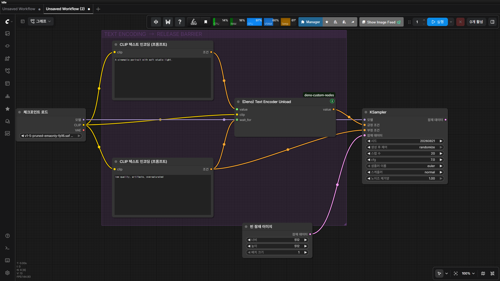
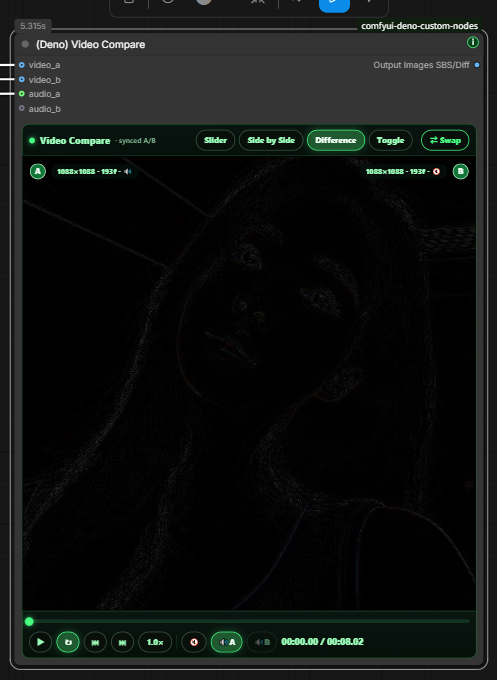
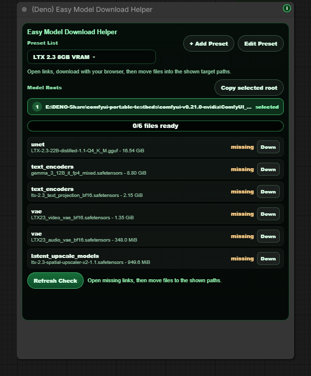
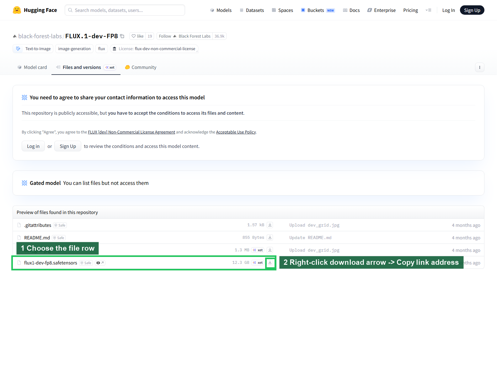
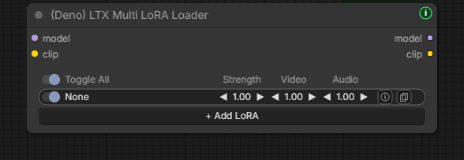
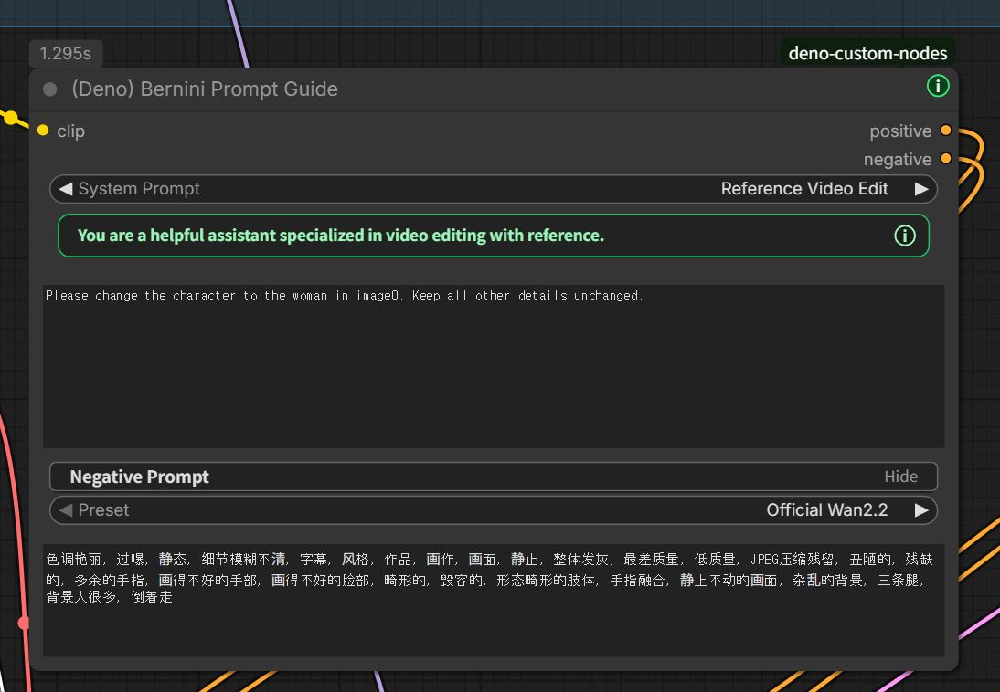

# Deno Custom Nodes

[English](../README.md) | [한국어](README.ko.md) | [日本語](README.ja.md) | [简体中文](README.zh-CN.md) | [Español](README.es.md) | [Português](README.pt-PT.md) | [Português (Brasil)](README.pt-BR.md) | [Bahasa Indonesia](README.id.md)

[YouTube Channel](https://www.youtube.com/@Denoise-AI)


Kamu dapat menggunakan, mempelajari, memodifikasi, dan mendistribusikan ulang repo ini di bawah GPL-3.0.

Node, dokumen, contoh, workflow, dan aset proyek milik DENO di repo ini dirilis dengan GNU GPL v3.0 (`GPL-3.0-only`). Penggunaan komersial diizinkan, tetapi versi modifikasi yang kamu distribusikan harus mengikuti GPL-3.0 dan mempertahankan pemberitahuan lisensi serta hak cipta yang diperlukan.

Model, checkpoint, LoRA, library, tool, dan layanan pihak ketiga tetap mengikuti lisensi dan ketentuannya masing-masing. Jika sebuah workflow memakai model atau aset tertentu, periksa dan ikuti lisensi tersebut sebelum membagikan atau menjual output.

Deno Custom Nodes adalah kumpulan custom node untuk ComfyUI yang membantu workflow nyata untuk gambar, video, LTX, RTX, dan persiapan model terasa lebih cepat, jelas, dan nyaman dipakai setiap hari.

Sebagian besar node Deno memiliki tombol hijau kecil `i` untuk membuka bantuan cepat tanpa meninggalkan canvas ComfyUI. Jika versi Deno Custom Nodes yang lebih baru tersedia, tombol berubah menjadi kuning dan menampilkan badge `!` kecil.

## Release Notes

Catatan pembaruan publik disimpan secara ringkas di [CHANGELOG.md](../CHANGELOG.md).

## Web Tools

Alat berikut bisa dibuka langsung di browser.

- [DENO Video Compare](https://deno2026.github.io/comfyui-deno-custom-nodes/video-compare/) - membandingkan dua video render dengan slider, side-by-side, difference, dan toggle.
- [DENO Video to GIF/WebP](https://deno2026.github.io/comfyui-deno-custom-nodes/video-to-gif/) - memotong, crop, resize, lalu mengekspor klip pendek sebagai GIF atau WebP kecil.
- [DENO Kompresi video / gambar untuk Discord](https://deno2026.github.io/comfyui-deno-custom-nodes/video-to-discord/) - mengecilkan video atau gambar dan, jika memungkinkan, menyimpannya di bawah 10 MB agar mudah dibagikan lewat Discord. Antarmukanya hanya tersedia dalam bahasa Korea.

## DENO Visual Fold


DENO Visual Fold adalah alat visual untuk merapikan graph ComfyUI yang besar. Melipat node atau group tidak mengubah logika workflow.

Saat memilih dua node atau lebih, tombol hijau `Fold` muncul di dekat kanan atas canvas. Klik tombol itu untuk melipat node terpilih menjadi satu group visual yang ringkas, lalu gunakan `Unfold` untuk membukanya kembali. Jika memilih satu group ComfyUI biasa, `Fold Group` melipat node di dalam group tersebut; jika memilih beberapa group, aksi align juga muncul.

Berbeda dari Subgraph, Visual Fold tidak memindahkan node ke child graph. Ini hanya untuk kerapian visual, berguna saat node `Get` / `Set` atau struktur parent-child tetap ingin terlihat di graph utama.

## DENO Floating Tools

DENO Floating Tools adalah helper opsional di `Settings > DENO > Tools`. Fitur ini nonaktif secara default.

Saat diaktifkan, sebuah ikon DENO kecil yang bisa diseret muncul di layar ComfyUI. Panelnya dapat membebaskan VRAM melalui endpoint pembersihan memori bawaan ComfyUI, menampilkan status read-only untuk versi ComfyUI Stable yang sedang dipakai dan yang terbaru, serta membuka laporan Error Help saat sebuah eksekusi gagal.

Error Help membuat laporan siap pakai untuk GPT / Gemini yang berisi workflow saat ini, executable dan jenis environment Python, versi package, detail GPU, konteks traceback / log terbaru, dan ringkasan custom node. Fitur ini read-only, membuka jendela laporan terlebih dahulu, dan hanya menyalin saat kamu menekan `Copy Report`. Rahasia umum seperti token, cookie, password, private key, dan kredensial URL disamarkan sebelum disalin.

Floating Tools tidak menginstal, meng-update, me-restart, memperbaiki, atau mengubah workflow.

## Included Nodes

### `(Deno) Ideogram Director`

Builder prompt visual untuk Ideogram 4 yang membantu mengedit caption JSON terstruktur dan layout bbox langsung di canvas ComfyUI.


Fitur utama: menggambar dan mengedit area bbox, mengimpor prompt JSON dari Local LLM Loader atau sumber STRING lain, meminta konfirmasi sebelum mengganti board yang sudah ada, menolak JSON yang salah format dengan jelas, memakai galeri preset style/layout, serta membaca atau mengedit deskripsi dalam bahasamu lewat Language view sementara output akhir tetap dalam bahasa Inggris siap-model dan kata literal pada kotak TEXT seperti papan, logo, atau judul tetap persis sama.

### `(Deno) Resize Box`

Node pembantu resolusi dan resize gambar untuk ComfyUI.


Fitur utama: preset rasio, input manual, kalkulasi megapixel, alignment `divisible_by`, mode Center Crop, Crop Position yang dapat diseret, dan Fit, preview rasio serta gambar sumber semi-transparan yang dipotong tepat ke frame output di Crop Position dan dapat digeser dengan menyeret gambar, output `image`, `width`, `height`.

### `(Deno) Multi Image Loader`

Loader beberapa gambar untuk workflow batch guide.


Fitur utama: galeri tinggi tetap, drag reorder, upload, drag-and-drop, paste gambar, browser folder `input`, dukungan nested folder, sorting terbaru, resize Keep Ratio/Preset/Manual, output `multi_output`, `width`, `height`.

### `(Deno) MiniMax H3 Multi Reference Image Loader`

Loader satu-kabel untuk beberapa gambar referensi pada workflow bawaan MiniMax H3 Reference to Video di ComfyUI.

Node ini mempertahankan pengalaman upload, paste, drag-and-drop, Input Folder, pengurutan kartu, dan clear yang sama seperti `(Deno) Multi Image Loader`. Hingga 9 referensi berurutan dikirim melalui satu socket khusus `ref_images`, sementara ukuran dan rasio aspek asli tiap gambar disimpan terpisah tanpa resize, crop, atau padding. Urutan kartu sesuai dengan `<Picture 1>`, `<Picture 2>`, dan seterusnya; gambar yang sama juga tersedia lewat output `image_list` untuk langsung dihubungkan ke input `image` pada `(Deno) Local LLM Loader`.

Node pendamping `(Deno) MiniMax H3 Reference to Video` hanya menyatukan input gambar; input Autogrow bawaan untuk video referensi, audio pasangan video, dan audio mandiri tetap dipertahankan. Kedua node MiniMax H3 ini membutuhkan ComfyUI 0.30.0 atau lebih baru. Lihat [workflow contoh multi-reference MiniMax H3](workflows/minimax-h3-multi-reference.json).

### Workflow referensi audio MiniMax H3 R2V

[Workflow referensi audio untuk pemula](workflows/minimax-h3-r2v-audio-reference.json) mempertahankan jalur audio referensi bawaan MiniMax H3 dan menambahkan jalur pengarahan prompt otomatis.

- `(Deno) Audio Transcript`: memakai OpenAI Whisper lokal untuk membuat lirik atau dialog, waktu per segmen, bahasa yang terdeteksi, dan ringkasan confidence. Jika pengguna memasukkan lirik atau dialog sendiri, teks itu menjadi acuan utama.
- `(Deno) Audio Analysis Finalizer`: hanya menyimpan field analisis akustik yang didokumentasikan dari hasil ComfyUI `TextGenerate`, serta dapat melakukan unload model CLIP analisis setelah proses selesai.
- `(Deno) Local LLM Loader`: menerima transkrip dan laporan akustik melalui input STRING opsional `audio_context`. AUDIO mentah tidak dikirim ke LLM lokal dan analisis otomatis diperlakukan sebagai data referensi, bukan instruksi.
- Potongan audio sumber yang dipilih menjadi referensi `<Audio 1>` H3 sekaligus suara yang dimux ke MP4 akhir. Workflow ini tidak mendecode audio yang dibuat secara internal oleh H3.

Persyaratan: ComfyUI Stable terbaru dengan MiniMax H3 dan `TextGenerate` yang mendukung input audio; [ComfyUI-VideoHelperSuite](https://github.com/Kosinkadink/ComfyUI-VideoHelperSuite) untuk `Load Audio (Upload)`; `gemma4_e4b_it_fp8_scaled.safetensors` di `ComfyUI/models/text_encoders/` untuk analisis akustik; serta LM Studio dengan `google/gemma-4-12b-qat` yang sudah dimuat dan Local Server aktif untuk tahap akhir pengarah prompt.

`openai-whisper` diinstal sebagai dependency node. Checkpoint Whisper yang dipilih akan didownload dari alamat resmi OpenAI saat `(Deno) Audio Transcript` pertama kali dijalankan, checksum-nya diverifikasi oleh loader resmi, lalu disimpan di cache `ComfyUI/models/stt/whisper/`.

### `(Deno) Text Encoder Unload`

Barrier VRAM opsional yang dipasang pada workflow yang menyelesaikan semua text encoding sebelum memulai sampling.



- lewatkan salah satu conditioning positive atau negative yang menuju sampler melalui `value`; objek dan tipe socket yang sama diteruskan tanpa perubahan
- hubungkan `CLIP` persis yang dipakai node Text Encode di atas ke `clip`
- hubungkan cabang encoding positive / negative independen lainnya ke `wait_for` agar keduanya selesai sebelum unload
- hanya melakukan unload pada CLIP / text encoder yang terhubung, clone, dan komponen terkelolanya lewat pengelolaan model ComfyUI; diffusion model, VAE, dan ControlNet tidak di-unload secara global
- berjalan pada setiap queue agar cache tidak melewati efek unload

Dynamic VRAM memindahkan weight sesuai tekanan memori dan dapat sengaja membiarkan sebagian text encoder tetap resident. Node ini menyediakan titik pelepasan yang deterministik, tetapi tidak dapat membuat seluruh proses ComfyUI menjadi `0 MiB`: CUDA context, conditioning tensor, model lain, custom node, dan aplikasi lain memiliki alokasi terpisah. Node ini juga tidak langsung meningkatkan kualitas sampling; fungsinya menyediakan ruang VRAM yang dapat mengurangi model offload atau mencegah OOM. Text encode berikutnya harus memuat ulang model, dan `--gpu-only` tidak dapat memindahkan encoder keluar dari VRAM.

### `(Deno) Advanced Image Source Loader`

Loader sumber gambar lanjutan untuk folder eksternal, path lokal, URL gambar web, dan daftar gambar dengan ukuran campuran.


Fitur utama: dukungan folder `input` dan folder lokal eksternal, input URL/Path, upload dan paste, enable/disable thumbnail, drag reorder, galeri masonry, recursive folder, output batch tensor dan `image_list`.

### `(Deno) Image Compare`

Node A/B compare untuk membandingkan dua gambar langsung di canvas ComfyUI.


Fitur utama: membandingkan `image_a` dan `image_b`, mode Slider/Side by Side/Difference/Toggle, slider hover, label A/B, tombol Swap, preview internal yang mengikuti ukuran node.

### `(Deno) Video Compare`

Node A/B compare untuk mengecek hasil upscale dan interpolasi FPS langsung di canvas ComfyUI.

Fitur utama: `video_a`, `video_b`, audio opsional, mode Slider/Side by Side/Difference/Toggle, play/pause, scrub, frame step, speed, loop, output badges opsional, dan output gambar `comparison`.

Jika node terasa berat, gunakan alat web: https://deno2026.github.io/comfyui-deno-custom-nodes/video-compare/




### `(Deno) Video Preview`

Preview video resolusi penuh untuk mengecek output encoded sungguhan di titik mana pun dalam graph.


Fitur utama: input IMAGE batch dan output pass-through, audio opsional, hover untuk mendengar audio, klik untuk play/pause, tombol Full screen, badge resolusi/FPS/frame/durasi, dan petunjuk jelas jika PyAV belum terpasang.

### `(Deno) RTX Video Super Resolution`

Node opsional untuk Windows/NVIDIA RTX agar pengguna bisa mencoba NVIDIA RTX Video Super Resolution di dalam ComfyUI.


Alur pemula: instal atau update `deno-custom-nodes`, jalankan ComfyUI, tambahkan node lalu jalankan sekali. Jika NVIDIA VFX belum ada, tutup ComfyUI sepenuhnya, buka `How to install`, ikuti panduan, pastikan path BAT berada di ComfyUI yang benar, lalu restart ComfyUI setelah selesai.

Link resmi NVIDIA: [NVIDIA Maxine Windows Getting Started](https://docs.nvidia.com/deeplearning/maxine/vfx-sdk-programming-guide/index.html), [RTX Video FAQ](https://nvidia.custhelp.com/app/answers/detail/a_id/5448/~/rtx-video-faq).

### `(Deno) RTX Video Super Resolution (2 Pass)`

Node RTX dua pass untuk finishing video. Node ini bisa menjalankan `Denoise` atau `Deblur` pada ukuran yang sama terlebih dahulu, lalu menjalankan upscale `VSR` atau `High Bitrate`.

Contoh workflow: [RTX 2-pass upscale workflow](workflows/deno-rtx-lowram-metabatch.json)

Fitur utama: jalur Low System Memory dan High System Memory, proses chunk dengan VHS Meta Batch, mempertahankan FPS dan audio sumber, cocok untuk output video encoded nyata.

### `(Deno) LTX Sequencer`

Guide sequencer untuk workflow LTX multi-gambar.


Fitur utama: bekerja dengan output batch dari `(Deno) Multi Image Loader`, bisa mengisi `num_images`, mempertahankan alur sync, memungkinkan kontrol manual strength saat perlu, dan menyediakan bypass untuk A/B cepat.

### `(Deno) LTX Model Loader`

Loader ringkas untuk pola loading model LTX 2.3 yang umum.


Fitur utama: Checkpoint Style, KJ Style, GGUF Style, output `model`, `clip`, `video_vae`, `audio_vae`, kompatibel dengan loader ComfyUI, KJNodes, dan ComfyUI-GGUF.

### `(Deno) LTX Tiled Spatial Upscaler`

Helper untuk second pass video latent LTX resolusi tinggi. Node ini membagi video latent menjadi spatial tile yang saling overlap, menjalankan upscaler per tile, lalu menggabungkannya kembali menjadi satu latent.

Gunakan untuk latent LTX khusus video. Jika workflow membawa latent video/audio gabungan, pisahkan jalur audio lebih dulu dan gabungkan lagi setelah tiled video pass.

### `(Deno) LTX High resolution Tiled Sampler`

Sampler untuk refinement LTX AV. Sampler mempertahankan satu global sampler trajectory, sementara prediksi video dihitung lewat spatial tile yang overlap dan digabungkan sebelum update sampler.

Audio lengkap diberikan ke setiap video tile sebagai konteks, sementara latent audio yang dikembalikan tetap tidak berubah dalam mode `freeze`.

### `(Deno) Easy Model Download Helper`

Helper setup berbasis preset untuk kumpulan file model yang direkomendasikan. Preset bawaan mencakup set pemula LTX 2.3 GGUF untuk VRAM 8 GB dan set model resmi LTX 2.5 Distilled INT8 dua tahap.



Fitur utama: membuka link model resmi di browser, bukan mengunduh lewat Python; menampilkan root folder model ComfyUI; menyimpan creator preset di workflow; mendukung Hugging Face dan Civitai; memeriksa apakah file sudah berada di folder yang benar. Preset LTX 2.5 mencakup diffusion model, text encoder Gemma 4 dengan projection, VAE video dan audio, serta x2 spatial upscaler yang dibutuhkan oleh proses dua tahap.

File LTX 2.5 memerlukan login Hugging Face dan persetujuan **Agree and Access** sebelum dapat didownload. Helper ini tidak melewati pembatasan akses dan tidak mendownload model secara otomatis. Baca [LTX-2 Community License](https://github.com/Lightricks/LTX-2/blob/main/LICENSE.md), minta akses di [repository resmi LTX 2.5](https://huggingface.co/Lightricks/LTX-2.5), gunakan link browser yang dibuka node, lalu pindahkan setiap file yang didownload ke folder model ComfyUI yang ditampilkan.




### `(Deno) Multi LoRA Loader`

Loader multi LoRA serbaguna untuk workflow diffusion ComfyUI biasa. Terapkan hingga delapan LoRA pada `MODEL` yang terhubung dan `CLIP` opsional; aktifkan atau nonaktifkan setiap slot tanpa kehilangan pilihan yang tersimpan, atur strength model dan CLIP secara terpisah, simpan trigger word dan catatan, ubah urutan slot, lalu teruskan output `model` dan `clip` yang sudah dipatch.

### `(Deno) LTX Multi LoRA Loader`

Loader multi LoRA gaya Power-LoRA untuk workflow LTX.



Fitur utama: banyak LoRA dalam satu node, enable per slot, strength/video/audio strength, trigger word dan catatan LoRA, copy trigger word, output `model` dan `clip` yang sudah dipatch.

### `(Deno) LTX Prompt Guide`

Helper prompt yang menggabungkan prompt encoding LTX, negative prompt opsional, LTX conditioning, dan perencanaan durasi dialog.


Fitur utama: positive prompt encoding, negative prompt yang bisa dilipat, LTX conditioning dengan `frame_rate`, estimasi durasi dari dialog di dalam tanda kutip, dukungan Auto/Korean/English/Japanese/Chinese.

### `(Deno) Bernini Prompt Guide`

Helper prompt untuk prefix KJ-style Bernini. Node ini menggabungkan positive dan negative prompt encoding dalam satu node yang lebih mudah untuk pemula, lalu menampilkan system prompt aktif sesuai mode `System Prompt` yang dipilih.



Fitur utama: pilihan `System Prompt` yang mudah dibaca seperti `Text to Video`, `Image to Video`, dan `Reference Video Edit`, hint nama `image0` / `image1` otomatis untuk mode reference, negative prompt yang bisa dilipat, autofill preset negative Official Wan2.2, dan output `positive` / `negative`.

Negative preset bukan mode output. Preset itu hanya mengisi kotak negative prompt; setelah itu kamu bisa mengedit kotak tersebut langsung, dan teks terakhir akan dipakai sebagai negative conditioning.

Tulis prompt seperti memberi instruksi ke chatbot, bukan hanya daftar tag. Contoh: `Replace the jacket with the shirt from image0. Keep the camera motion, background, lighting, and shadows unchanged.`

Node ini hanya menyiapkan text conditioning. Hubungkan output `positive` dan `negative` ke node bawaan `(Bernini) Conditioning` pada ComfyUI Stable terbaru untuk menyusun visual / context-latent conditioning Bernini. Backend Bernini sudah digabung secara resmi melalui [ComfyUI PR #14216](https://github.com/Comfy-Org/ComfyUI/pull/14216), jadi updater preview lama tidak lagi diperlukan; update ComfyUI Stable terlebih dahulu jika node conditioning bawaan belum terlihat.

### `(Deno) Prompt Text`

Sumber STRING multiline kecil untuk menyimpan system prompt, user prompt, template, atau teks JSON panjang agar tetap mudah dibaca dalam node tersendiri. Gunakan saat teks perlu diteruskan tanpa perubahan ke Ideogram Director, Local LLM Loader, atau input STRING lain.

### `(Deno) Local LLM Loader` / `(Deno) Local LLM Reviewer`

Node untuk memanggil LLM lokal yang sudah berjalan di PC dari ComfyUI dan memakai review text dari LLM untuk meneruskan atau memblokir hasil sebelum disimpan.

Fitur utama: memanggil model Ollama, LM Studio, llama.cpp, vLLM, server Custom OpenAI-compatible, llama-swap, atau Unsloth Studio; membatasi alamat ke `127.0.0.1` / `localhost`; me-refresh daftar model tiap provider; menghentikan request yang sedang berjalan; memakai API management llama-swap / Unsloth Studio untuk unload manual atau setelah proses; memproses prompt batch secara berurutan dalam satu eksekusi node; melampirkan IMAGE ke model vision; menampilkan Thinking / Result; menjadi gate IMAGE / AUDIO sebelum node Save; menyetujui sekali hasil review saat ini atau menjalankan ulang hanya jalur sebelum reviewer. Result akhir disimpan di metadata PNG / workflow dan dipulihkan saat dibuka kembali; Thinking / reasoning tidak disimpan.

Provider `Unsloth` hanya untuk server Unsloth Studio dengan alamat default `http://127.0.0.1:8888/v1`. Jika GGUF dari Unsloth dijalankan di LM Studio, pilih `LM Studio`, bukan `Unsloth`. Sebelum memulai ComfyUI, set environment variable `DENO_LOCAL_LLM_UNSLOTH_API_KEY`; key tidak disimpan di workflow atau metadata PNG.

Jika LM Studio menolak field kontrol reasoning opsional sebelum mulai menghasilkan output, node mencoba satu kali lagi tanpa field itu. Setelahnya, perilaku reasoning ditentukan oleh server dan model yang dipilih.

Catatan audio: Local LLM Loader tidak mengirim AUDIO mentah langsung ke model lokal. Input STRING opsional `audio_context` dapat menerima transkrip dan laporan akustik dari upstream sebagai data referensi tanpa mengubah prompt pengguna. Local LLM Reviewer dapat meneruskan atau memblokir AUDIO saat node text generation lain yang mendukung audio menghasilkan review text.

## Why This Exists

Node ini dibuat untuk mengurangi gesekan setup yang berulang dalam pekerjaan ComfyUI nyata. Tujuannya bukan mengejar daftar fitur besar, tetapi membuat workflow harian lebih cepat, rapi, dan mudah diajarkan.

## Search Tips

Cari `Deno Custom Nodes` terlebih dahulu di ComfyUI Manager. Di GitHub, Manager, dan Registry, kamu juga dapat memakai `deno custom nodes`, `ideogram director`, `minimax h3`, `audio transcript`, `whisper`, `text encoder unload`, `clip unload`, `dynamic vram`, `vram barrier`, `multi lora`, `ltx 2.5`, `ltx model loader`, `local llm loader`, `local llm reviewer`, `prompt text`, `ollama`, `lm studio`, `llama.cpp`, `vllm`, `llama-swap`, `unsloth studio`, `bernini conditioning`, `image compare`, `video compare`, `video preview`, `visual fold`, `floating tools`, `free vram`, `comfyui stable`, `error help`, `workflow diagnostics`.

## Install

Cara yang direkomendasikan: cari `Deno Custom Nodes` di ComfyUI Manager, instal, lalu restart ComfyUI.

Untuk instalasi manual, clone repository di dalam folder `custom_nodes` ComfyUI lalu instal dependency dengan Python yang sama dengan yang digunakan untuk menjalankan ComfyUI:

```bash
git clone https://github.com/Deno2026/comfyui-deno-custom-nodes.git
cd comfyui-deno-custom-nodes
python -m pip install -r requirements.txt
```

Untuk update manual, jalankan `git pull --ff-only` di folder repository, instal ulang `requirements.txt` dengan Python yang sama, lalu restart ComfyUI. Instalasi melalui ComfyUI Manager / Registry menangani dependency package secara otomatis.

## Links

- YouTube: https://www.youtube.com/@Denoise-AI
- GitHub: https://github.com/Deno2026/comfyui-deno-custom-nodes
- Registry: https://registry.comfy.org/publishers/deno2026/nodes/deno-custom-nodes
