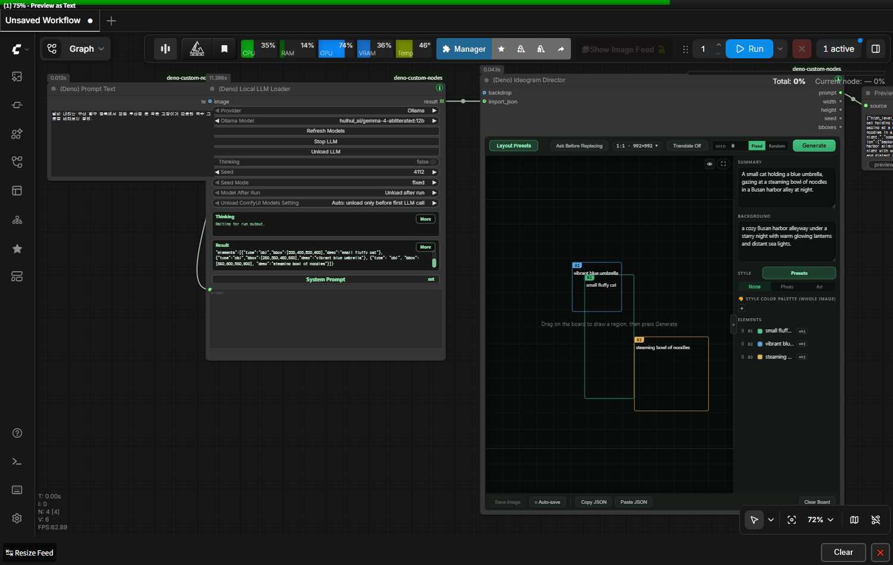
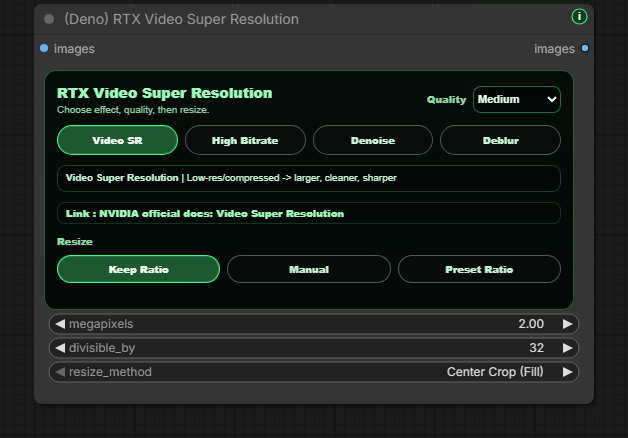
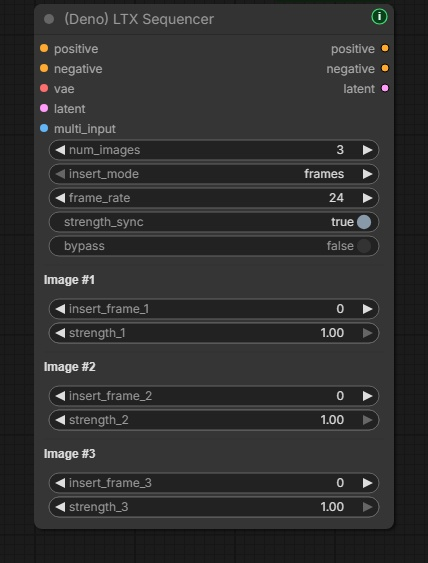
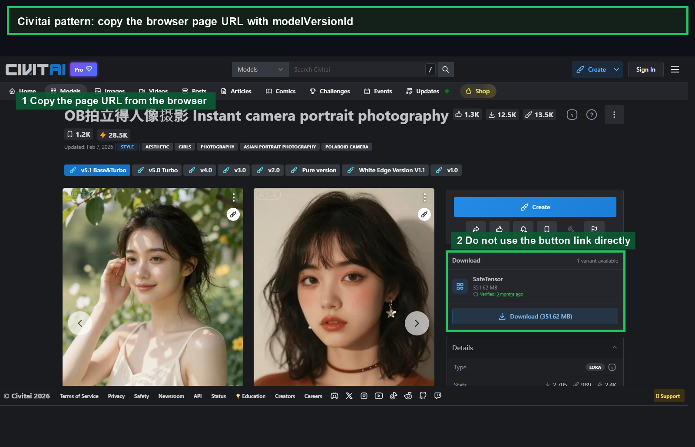

# Deno Custom Nodes

[English](../README.md) | [한국어](README.ko.md) | [日本語](README.ja.md) | [简体中文](README.zh-CN.md) | [Español](README.es.md) | [Português](README.pt-PT.md) | [Português (Brasil)](README.pt-BR.md) | [Bahasa Indonesia](README.id.md)

[YouTube Channel](https://www.youtube.com/@Denoise-AI)


Podes usar, estudar, modificar e redistribuir este repo sob GPL-3.0.

Os nós, documentos, exemplos, workflows e assets do projeto pertencentes à DENO neste repo são publicados sob GNU GPL v3.0 (`GPL-3.0-only`). O uso comercial é permitido, mas as versões modificadas que forem distribuídas devem seguir a GPL-3.0 e manter os avisos de licença e copyright exigidos.

Modelos, checkpoints, LoRAs, bibliotecas, ferramentas e serviços de terceiros mantêm as suas próprias licenças e condições. Se um workflow usar um modelo ou asset específico, confirma e segue essa licença antes de partilhar ou vender resultados.

Deno Custom Nodes é um conjunto de nós personalizados para ComfyUI, criado para tornar workflows reais de imagem, vídeo, LTX, RTX e preparação de modelos mais rápidos, claros e práticos no dia a dia.

A maioria dos nós Deno inclui um pequeno botão verde `i` para consultar ajuda rápida sem sair do canvas do ComfyUI. Se existir uma nova versão do Deno Custom Nodes, o botão fica amarelo e mostra um pequeno emblema `!`.

## Release Notes

As atualizações públicas são registadas em [CHANGELOG.md](../CHANGELOG.md) num formato curto.

## Web Tools

Ferramentas que podes executar diretamente no navegador.

- [DENO Video Compare](https://deno2026.github.io/comfyui-deno-custom-nodes/video-compare/) - compara dois vídeos renderizados com slider, lado a lado, diferença e toggle.
- [DENO Video to GIF/WebP](https://deno2026.github.io/comfyui-deno-custom-nodes/video-to-gif/) - corta, recorta, redimensiona e exporta clips curtos como GIF ou WebP mais leve.
- [DENO Compressão de vídeo / imagem para Discord](https://deno2026.github.io/comfyui-deno-custom-nodes/video-to-discord/) - reduz vídeos ou imagens e guarda-os, quando possível, com menos de 10 MB para partilha no Discord. A interface está disponível apenas em coreano.

## DENO Visual Fold


DENO Visual Fold é uma ajuda visual para organizar grandes grafos do ComfyUI. Dobrar nós ou grupos não altera a lógica do workflow.

Ao selecionar dois ou mais nós, aparece um botão verde `Fold` perto do canto superior direito do canvas. Ao clicar, os nós selecionados ficam compactados num grupo visual e podem ser restaurados com `Unfold`. Ao selecionar um grupo normal do ComfyUI, `Fold Group` dobra os nós dentro desse grupo; com vários grupos selecionados aparecem também ações de alinhamento.

Ao contrário do Subgraph, Visual Fold não move os nós para um grafo filho. É apenas organização visual, útil quando queres manter nós `Get` / `Set` ou a estrutura pai-filho visível no grafo principal.

## DENO Floating Tools

DENO Floating Tools é um assistente opcional em `Settings > DENO > Tools`. Está desativado por predefinição.

Quando ativado, adiciona um pequeno ícone DENO arrastável ao ecrã do ComfyUI. O painel pode libertar VRAM através do endpoint de limpeza de memória integrado do ComfyUI, mostrar em modo só de leitura o estado da versão atual e mais recente do ComfyUI Stable, e abrir um relatório Error Help quando uma execução falha.

Error Help cria um relatório preparado para GPT / Gemini com o workflow atual, executável e tipo de ambiente Python, versões de pacotes, GPU, contexto recente de traceback / log e resumo de custom nodes. É só de leitura, abre primeiro uma janela de relatório e só copia ao clicar em `Copy Report`. Segredos comuns como tokens, cookies, passwords, private keys e credenciais em URLs são ocultados antes da cópia.

Floating Tools não instala, atualiza, reinicia, repara nem modifica workflows.

## Included Nodes

### `(Deno) Ideogram Director`

Construtor visual de prompts para Ideogram 4, destinado a captions JSON estruturados e layouts bbox dentro do canvas do ComfyUI.



Funcionalidades principais: desenhar e editar regiões bbox, importar prompts JSON do Local LLM Loader ou de outra fonte STRING, confirmar antes de substituir um board existente, rejeitar claramente JSON inválido, usar galerias de presets de estilo/layout e ler ou editar descrições no teu idioma com Language view, mantendo a saída final em inglês pronto para o modelo e preservando exatamente as palavras literais das caixas TEXT, como letreiros, logótipos e títulos.

### `(Deno) Resize Box`

Nó de resolução e redimensionamento de imagem para ComfyUI.


Funcionalidades principais: presets de proporção, entrada manual, cálculo por megapíxeis, alinhamento `divisible_by`, modos Center Crop, Crop Position arrastável e Fit, preview de proporção e, em Crop Position, a imagem de origem semitransparente recortada exatamente na moldura de saída e movida ao arrastar, saídas `image`, `width`, `height`.

### `(Deno) Multi Image Loader`

Carregador de várias imagens pensado para workflows de guia por batch.


Funcionalidades principais: galeria de altura fixa, reordenação por arrastar, upload, drag-and-drop, colar imagem, navegação pela pasta `input`, suporte a subpastas, ordenação por data recente, redimensionamento por proporção/preset/manual, saídas `multi_output`, `width`, `height`.

### `(Deno) MiniMax H3 Multi Reference Image Loader`

Carregador de imagens de referência com uma única ligação para o workflow nativo MiniMax H3 Reference to Video do ComfyUI.

Mantém a mesma experiência de upload, paste, drag-and-drop, Input Folder, reordenação de cartões e limpeza de `(Deno) Multi Image Loader`. Envia até 9 referências ordenadas através de um socket `ref_images`, preservando separadamente as dimensões e proporções originais de cada imagem, sem resize, crop ou padding. A ordem dos cartões corresponde a `<Picture 1>`, `<Picture 2>` e seguintes; as mesmas imagens também são expostas como `image_list` para ligação direta à entrada `image` de `(Deno) Local LLM Loader`.

O nó incluído `(Deno) MiniMax H3 Reference to Video` apenas reúne as imagens numa entrada; mantém as entradas Autogrow nativas de vídeo de referência, áudio associado ao vídeo e áudio independente. Estes dois nós MiniMax H3 exigem ComfyUI 0.30.0 ou posterior. Consulta o [workflow de exemplo MiniMax H3 com múltiplas referências](workflows/minimax-h3-multi-reference.json).

### Workflow MiniMax H3 R2V com referência de áudio

O [workflow de referência de áudio para iniciantes](workflows/minimax-h3-r2v-audio-reference.json) mantém o caminho de áudio de referência nativo do MiniMax H3 e acrescenta uma linha automática de direção de prompts.

- `(Deno) Audio Transcript`: usa OpenAI Whisper local para criar letras ou diálogo, tempos por segmento, idioma detetado e resumo de confiança. Se o utilizador inserir letras ou diálogo, esse texto tem prioridade.
- `(Deno) Audio Analysis Finalizer`: conserva apenas os campos documentados de análise acústica do resultado ComfyUI `TextGenerate` e pode descarregar o modelo CLIP usado na análise depois da execução.
- `(Deno) Local LLM Loader`: recebe a transcrição e o relatório acústico pela entrada STRING opcional `audio_context`. O AUDIO original não é enviado para o LLM local e a análise automática é tratada como dados de referência, não como instruções.
- A secção escolhida do áudio original serve simultaneamente como referência `<Audio 1>` do H3 e como som incluído no MP4 final. Este workflow não descodifica o áudio gerado internamente pelo H3.

Requisitos: ComfyUI Stable atualizado com MiniMax H3 e `TextGenerate` compatível com entrada de áudio; [ComfyUI-VideoHelperSuite](https://github.com/Kosinkadink/ComfyUI-VideoHelperSuite) para `Load Audio (Upload)`; `gemma4_e4b_it_fp8_scaled.safetensors` em `ComfyUI/models/text_encoders/` para análise acústica; e LM Studio com `google/gemma-4-12b-qat` carregado e Local Server ativo para o passo final de direção do prompt.

`openai-whisper` é instalado como dependência do nó. O checkpoint Whisper escolhido é descarregado do endereço oficial da OpenAI na primeira execução de `(Deno) Audio Transcript`, validado por checksum pelo loader oficial e guardado em cache em `ComfyUI/models/stt/whisper/`.

### `(Deno) Text Encoder Unload`

Barreira de VRAM inline e opcional para o fluxo habitual apenas com prompt positive ou com prompts positive/negative.


- liga o conditioning positive através de `Positive Conditioning`; esta entrada é obrigatória e passa sem alterações
- opcionalmente, liga um prompt negative já codificado ou `Conditioning Zero Out` através de `Negative Conditioning`; esta entrada também passa sem alterações
- liga o `CLIP` exato usado pelos text encoders anteriores a `Text Encoder (CLIP)`
- deixa `Negative Conditioning` vazio num workflow de guider que use apenas positive
- descarrega pela gestão de modelos do ComfyUI apenas esse CLIP / text encoder, os seus clones e componentes geridos; não descarrega globalmente diffusion models, VAEs ou ControlNets
- executa em cada queue para que a cache não omita o efeito de unload

Dynamic VRAM desloca pesos conforme a pressão de memória e pode deixar intencionalmente parte do text encoder residente. Este nó cria um ponto determinístico de libertação, mas não consegue levar todo o processo ComfyUI a `0 MiB`: contexto CUDA, conditioning tensors, outros modelos, custom nodes e outras aplicações mantêm alocações independentes. Também não melhora por si só a qualidade do sampling; cria margem de VRAM que pode reduzir model offload ou evitar um OOM. Um text encode posterior terá de voltar a carregar o modelo e `--gpu-only` não permite retirar o encoder da VRAM.

### `(Deno) Advanced Image Source Loader`

Carregador avançado para workflows que precisam de pastas externas, caminhos locais, URLs de imagens e listas com tamanhos mistos.


Funcionalidades principais: suporte a `input` e pastas locais externas, entrada URL/Path, upload e paste, ativar/desativar miniaturas, reordenação, galeria estilo masonry, pastas recursivas, saída batch tensor e `image_list`.

### `(Deno) Image Compare`

Nó de comparação A/B para verificar duas imagens diretamente no canvas do ComfyUI.


Funcionalidades principais: compara `image_a` e `image_b`, modos Slider/Side by Side/Difference/Toggle, slider por hover, etiquetas A/B, botão Swap e preview interno redimensionável.

### `(Deno) Video Compare`

Nó de comparação A/B para verificar resultados de upscale e interpolação FPS dentro do canvas do ComfyUI.

Funcionalidades principais: `video_a`, `video_b`, áudio opcional, modos Slider/Side by Side/Difference/Toggle, play/pause, scrub, frame step, velocidade, loop, badges opcionais e saída `comparison`.

Se o nó for pesado para o teu fluxo, usa a ferramenta web: https://deno2026.github.io/comfyui-deno-custom-nodes/video-compare/


### `(Deno) Video Preview`

Preview de vídeo em resolução completa para verificar uma saída codificada real em qualquer ponto do grafo.


Funcionalidades principais: entrada IMAGE batch e saída direta, áudio opcional, hover para ouvir, clique para play/pause, botão Full screen, badge de resolução/FPS/frames/duração e aviso claro se faltar PyAV.

### `(Deno) RTX Video Super Resolution`

Nó opcional para Windows/NVIDIA RTX que permite experimentar NVIDIA RTX Video Super Resolution dentro do ComfyUI.



Fluxo para iniciantes: instala ou atualiza `deno-custom-nodes`, inicia o ComfyUI, adiciona o nó e executa uma vez. Se faltar NVIDIA VFX, fecha completamente o ComfyUI, abre `How to install`, segue o guia, confirma que o caminho mostrado pelo BAT pertence ao ComfyUI correto e reinicia o ComfyUI no final.

Ligações oficiais NVIDIA: [NVIDIA Maxine Windows Getting Started](https://docs.nvidia.com/deeplearning/maxine/vfx-sdk-programming-guide/index.html), [RTX Video FAQ](https://nvidia.custhelp.com/app/answers/detail/a_id/5448/~/rtx-video-faq).

### `(Deno) RTX Video Super Resolution (2 Pass)`

Nó RTX de duas passagens para acabamento de vídeo. Pode executar primeiro `Denoise` ou `Deblur` no mesmo tamanho, e depois um upscale `VSR` ou `High Bitrate`.

Workflow de exemplo: [RTX 2-pass upscale workflow](workflows/deno-rtx-lowram-metabatch.json)

Funcionalidades principais: rotas Low System Memory e High System Memory, processamento em chunks com VHS Meta Batch, preservação de FPS e áudio, pensado para saídas reais de vídeo.

### `(Deno) LTX Sequencer`

Sequenciador de guias para workflows LTX com várias imagens.



Funcionalidades principais: trabalha com a saída batch do `(Deno) Multi Image Loader`, pode preencher `num_images`, mantém o fluxo sync, permite controlo manual de strength quando necessário e inclui bypass para A/B rápido.

### `(Deno) LTX Model Loader`

Carregador compacto para padrões comuns de modelos LTX 2.3.


Funcionalidades principais: Checkpoint Style, KJ Style e GGUF Style, saídas `model`, `clip`, `video_vae`, `audio_vae`, compatível com loaders do ComfyUI, KJNodes e ComfyUI-GGUF.

### `(Deno) LTX Tiled Spatial Upscaler`

Helper para segundas passagens de video latent LTX em alta resolução. Divide o video latent em spatial tiles sobrepostos, executa o upscaler por tile e mistura o resultado de volta num único latent.

Usa-o em latents LTX apenas de vídeo. Se o workflow transportar video/audio combinados, separa primeiro o caminho de áudio e volta a juntar depois do passe tiled de vídeo.

### `(Deno) LTX High resolution Tiled Sampler`

Sampler para passes de refinement LTX AV. Mantém uma trajetória global do sampler enquanto as predições de vídeo são avaliadas por spatial tiles sobrepostos e fundidas antes do update.

O áudio completo é passado para cada tile de vídeo como contexto, enquanto o latent de áudio devolvido permanece inalterado no modo `freeze`.

### `(Deno) Easy Model Download Helper`

Assistente baseado em presets para instalar conjuntos recomendados de ficheiros de modelo. Os presets incluídos abrangem o conjunto inicial LTX 2.3 GGUF para 8 GB de VRAM e o conjunto oficial LTX 2.5 Distilled INT8 de duas etapas.


Funcionalidades principais: abre ligações oficiais no navegador em vez de descarregar via Python, mostra raízes de modelos do ComfyUI, guarda creator presets no workflow, suporta Hugging Face e Civitai, e verifica se os ficheiros estão na pasta correta. O preset LTX 2.5 inclui o diffusion model, o text encoder Gemma 4 com projection, os VAE de vídeo e áudio e o x2 spatial upscaler necessário para o processo de duas etapas.

Os ficheiros LTX 2.5 exigem início de sessão no Hugging Face e aprovação em **Agree and Access** antes do download. O assistente não contorna essa restrição nem descarrega modelos automaticamente. Consulta a [LTX-2 Community License](https://github.com/Lightricks/LTX-2/blob/main/LICENSE.md), pede acesso no [repositório oficial LTX 2.5](https://huggingface.co/Lightricks/LTX-2.5), usa as ligações abertas pelo nó e move cada ficheiro descarregado para a pasta de modelos do ComfyUI apresentada no ecrã.





### `(Deno) Multi LoRA Loader`

Carregador multi LoRA genérico para workflows normais de diffusion no ComfyUI. Aplica até oito LoRAs ao `MODEL` ligado e ao `CLIP` opcional; permite ativar ou desativar cada slot sem perder a seleção guardada, definir strengths separados para model e CLIP, guardar trigger words e notas, reordenar slots e enviar os resultados `model` e `clip` corrigidos.

### `(Deno) LTX Multi LoRA Loader`

Carregador multi LoRA estilo Power-LoRA para workflows LTX.


Funcionalidades principais: vários LoRA num só nó, ativação por slot, strength/video/audio strength, trigger word e notas por LoRA, cópia de trigger words, saídas `model` e `clip` corrigidas.

### `(Deno) LTX Prompt Guide`

Assistente que combina prompt encoding para LTX, negative prompt opcional, conditioning LTX e planeamento de duração de diálogo.


Funcionalidades principais: positive prompt encoding, negative prompt dobrável, LTX conditioning com `frame_rate`, estimativa de duração a partir de diálogo entre aspas e suporte Auto/Korean/English/Japanese/Chinese.

### `(Deno) Bernini Prompt Guide`

Assistente de prompts para prefixos KJ-style Bernini. Junta positive e negative prompt encoding num nó mais fácil para iniciantes e mostra no topo o system prompt correspondente ao modo `System Prompt` escolhido.


Funcionalidades principais: seletor `System Prompt` com modos legíveis como `Text to Video`, `Image to Video` e `Reference Video Edit`, hint automático de nomes `image0` / `image1` em modos de referência, negative prompt dobrável, preenchimento automático do preset negativo Official Wan2.2 e saídas `positive` / `negative`.

O negative preset não é um modo de saída. Apenas preenche a caixa de negative prompt; depois podes editar essa caixa diretamente e o texto final será codificado como negative conditioning.

Escreve o prompt como uma instrução para um chatbot, não como uma lista de tags. Exemplo: `Replace the jacket with the shirt from image0. Keep the camera motion, background, lighting, and shadows unchanged.`

Este nó prepara apenas text conditioning. Liga as saídas `positive` e `negative` ao nó nativo `(Bernini) Conditioning` da versão atual do ComfyUI Stable para construir o conditioning visual / context-latent do Bernini. O backend do Bernini foi integrado oficialmente pelo [PR #14216 do ComfyUI](https://github.com/Comfy-Org/ComfyUI/pull/14216), por isso o antigo updater de preview deixou de ser necessário; atualiza o ComfyUI Stable se o nó nativo de conditioning não aparecer.

### `(Deno) Prompt Text`

Pequena fonte STRING multiline para manter system prompts, user prompts, templates ou texto JSON longo legível no seu próprio nó. Usa-a para ligar o texto sem alterações ao Ideogram Director, Local LLM Loader ou a outra entrada STRING.

### `(Deno) Local LLM Loader` / `(Deno) Local LLM Reviewer`

Nós para chamar, a partir do ComfyUI, LLM locais que já estejam a correr no PC e usar um review text do LLM para permitir ou bloquear resultados antes de serem guardados.

Funcionalidades principais: chama modelos Ollama, LM Studio, llama.cpp, vLLM, servidores Custom OpenAI-compatible, llama-swap ou Unsloth Studio; limita endereços a `127.0.0.1` / `localhost`; atualiza listas de modelos por provider; interrompe requests em curso; usa APIs de gestão do llama-swap / Unsloth Studio para unload manual ou após a execução; processa prompt batches sequencialmente numa única execução; anexa IMAGE a modelos de visão; mostra Thinking / Result; controla IMAGE / AUDIO antes dos nós Save; aprova uma vez o resultado atual ou volta a executar apenas o caminho anterior ao reviewer. O Result final é guardado nos metadata PNG / workflow e restaurado ao reabrir; Thinking / reasoning não é guardado.

O provider `Unsloth` destina-se apenas ao Unsloth Studio e usa por predefinição `http://127.0.0.1:8888/v1`. Se executares no LM Studio um GGUF obtido do Unsloth, seleciona `LM Studio`, não `Unsloth`. Antes de iniciar o ComfyUI é necessário definir a variável de ambiente `DENO_LOCAL_LLM_UNSLOTH_API_KEY`; a chave não é guardada em workflows nem metadata PNG.

Se o LM Studio rejeitar o campo opcional de controlo de reasoning antes de iniciar a geração, o nó volta a tentar uma vez sem esse campo. Depois disso, o comportamento de reasoning depende do server e model selecionados.

Nota de áudio: Local LLM Loader não envia AUDIO original diretamente ao modelo local. A entrada STRING opcional `audio_context` pode receber uma transcrição e um relatório acústico anteriores como dados de referência, sem alterar o prompt do utilizador. Local LLM Reviewer pode permitir ou bloquear AUDIO quando outro nó de geração de texto compatível com áudio produz o review text.

## Why This Exists

Estes nós reduzem fricções repetidas no trabalho real com ComfyUI. O objetivo não é ter uma lista enorme de funcionalidades, mas tornar os workflows diários mais rápidos, limpos e fáceis de ensinar.

## Search Tips

Procura primeiro `Deno Custom Nodes` no ComfyUI Manager. No GitHub, Manager e Registry também podes usar `deno custom nodes`, `ideogram director`, `minimax h3`, `audio transcript`, `whisper`, `text encoder unload`, `clip unload`, `dynamic vram`, `vram barrier`, `multi lora`, `ltx 2.5`, `ltx model loader`, `local llm loader`, `local llm reviewer`, `prompt text`, `ollama`, `lm studio`, `llama.cpp`, `vllm`, `llama-swap`, `unsloth studio`, `bernini conditioning`, `image compare`, `video compare`, `video preview`, `visual fold`, `floating tools`, `free vram`, `comfyui stable`, `error help`, `workflow diagnostics`.

## Install

Método recomendado: procura `Deno Custom Nodes` no ComfyUI Manager, instala-o e reinicia o ComfyUI.

Para uma instalação manual, clona o repositório dentro da pasta `custom_nodes` do ComfyUI e instala as dependências com o mesmo Python que inicia o ComfyUI:

```bash
git clone https://github.com/Deno2026/comfyui-deno-custom-nodes.git
cd comfyui-deno-custom-nodes
python -m pip install -r requirements.txt
```

Para atualizar manualmente, executa `git pull --ff-only` na pasta do repositório, volta a instalar `requirements.txt` com o mesmo Python e reinicia o ComfyUI. As instalações via ComfyUI Manager / Registry tratam automaticamente das dependências do pacote.

## Links

- YouTube: https://www.youtube.com/@Denoise-AI
- GitHub: https://github.com/Deno2026/comfyui-deno-custom-nodes
- Registry: https://registry.comfy.org/publishers/deno2026/nodes/deno-custom-nodes
