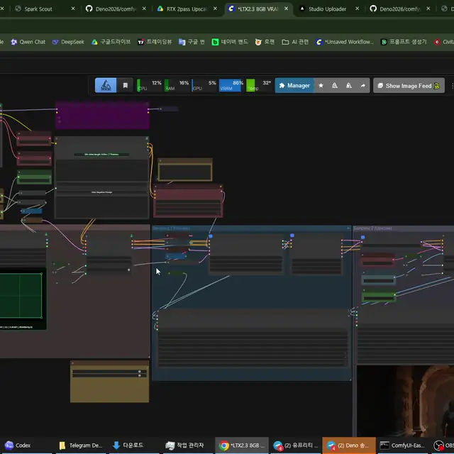
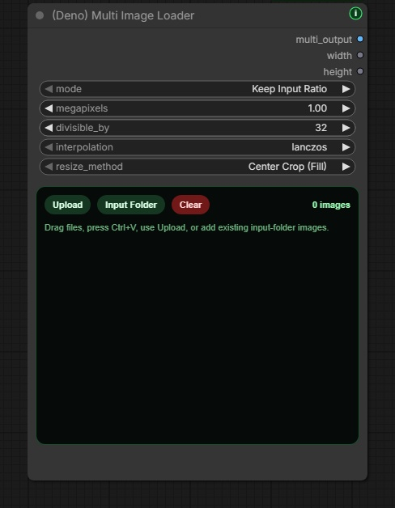

# Deno Custom Nodes

[English](../README.md) | [한국어](README.ko.md) | [日本語](README.ja.md) | [简体中文](README.zh-CN.md) | [Español](README.es.md) | [Português](README.pt-PT.md) | [Português (Brasil)](README.pt-BR.md) | [Bahasa Indonesia](README.id.md)

[YouTube Channel](https://www.youtube.com/@Denoise-AI)


你可以在 GPL-3.0 下使用、学习、修改和再分发这个 repo。

本 repo 中由 DENO 拥有的节点、文档、示例、工作流和项目内素材采用 GNU GPL v3.0 (`GPL-3.0-only`) 发布。可以用于商业用途，但分发修改版本时必须遵循 GPL-3.0，并保留所需的许可证和版权声明。

第三方模型、checkpoint、LoRA、库、工具和服务仍然适用各自的许可证和使用条款。如果某个工作流使用了特定模型或素材，请在分享或销售输出前确认并遵守对应许可证。

Deno Custom Nodes 是一组面向 ComfyUI 实际制作流程的自定义节点，帮助图像、视频、LTX、RTX、模型准备等重复任务变得更快、更清晰、更适合日常使用。

大多数 Deno 节点都带有一个小的绿色 `i` 按钮，可以在不离开 ComfyUI 画布的情况下查看节点说明。如果有新的 Deno Custom Nodes 版本，按钮会变成黄色并显示一个小 `!` 徽标。

## Release Notes

公开更新记录在 [CHANGELOG.md](../CHANGELOG.md) 中保持简洁。

## Web Tools

这些工具可以直接在浏览器中运行。

- [DENO Video Compare](https://deno2026.github.io/comfyui-deno-custom-nodes/video-compare/) - 用滑块、并排、差异和切换视图比较两个渲染视频。
- [DENO Video to GIF/WebP](https://deno2026.github.io/comfyui-deno-custom-nodes/video-to-gif/) - 裁剪、截取、缩放短视频，并导出为 GIF 或更小的 WebP。
- [DENO Discord 视频 / 图片压缩](https://deno2026.github.io/comfyui-deno-custom-nodes/video-to-discord/) - 缩小视频或图片，并尽可能保存为 10MB 以下、适合 Discord 分享的文件。界面仅提供韩语。

## DENO Visual Fold



DENO Visual Fold 是用于整理大型 ComfyUI 图的视觉辅助功能。折叠节点或组不会改变工作流逻辑。

选择两个或更多节点时，画布右上附近会出现绿色 `Fold` 按钮。点击后，所选节点会折叠成一个紧凑的视觉组，并可用 `Unfold` 恢复。选择一个普通 ComfyUI 组时，可以用 `Fold Group` 折叠组内节点；选择多个组时，还会出现对齐操作。

ComfyUI Subgraph 会把节点移动到子图中，而 Visual Fold 只做视觉整理。当你希望 `Get` / `Set` 节点或父子图结构仍留在主图中时，它更适合。

## DENO Floating Tools

DENO Floating Tools 是位于 `Settings > DENO > Tools` 的可选辅助功能，默认关闭。

启用后，ComfyUI 画面中会出现一个可拖动的小型 DENO 图标。面板可通过 ComfyUI 内置的内存清理接口释放 VRAM，以只读方式显示当前与最新的 ComfyUI Stable 版本状态，并在运行失败时打开 Error Help 报告。

Error Help 会生成适合交给 GPT / Gemini 的报告，其中包含当前工作流、Python 可执行文件与环境类型、软件包版本、GPU 信息、最近的 traceback / log 以及自定义节点摘要。它只读并先打开报告窗口，只有点击 `Copy Report` 才会复制。token、cookie、password、private key 和 URL 凭据等常见敏感信息会在复制前遮蔽。

Floating Tools 不会安装、更新、重启、修复或修改工作流。

## Included Nodes

### `(Deno) Ideogram Director`

用于在 ComfyUI 画布中编辑结构化 JSON 描述和 bbox 布局的 Ideogram 4 可视化提示词构建器。


主要功能：绘制和编辑 bbox 区域；从 Local LLM Loader 或其他 STRING 来源导入 JSON 提示词；替换现有画板前先确认；明确拒绝格式错误的 JSON；提供 style / layout 预设图库；通过 Language 视图用你的语言阅读和编辑场景说明，同时最终输出保持为模型可用的英语，并原样保留招牌、Logo、标题等 TEXT 框中的文字。

### `(Deno) Resize Box`

ComfyUI 的分辨率辅助与图像缩放节点。


主要功能：比例预设、手动输入、基于百万像素的尺寸计算、`divisible_by` 对齐、Center Crop、可拖动的 Crop Position 与 Fit 缩放、节点内比例预览；Crop Position 会将已连接的源图以半透明方式仅显示在实际输出框内，并可拖动图像调整可见位置；输出 `image`、`width`、`height`。

### `(Deno) Multi Image Loader`

面向批量参考图工作流的多图加载器。



主要功能：固定高度图库、拖拽排序、上传、拖放、粘贴图像、浏览 ComfyUI `input` 文件夹、支持嵌套文件夹、按最新修改时间排序、保持比例/预设/手动缩放、`multi_output`、`width`、`height` 输出。

### `(Deno) MiniMax H3 Multi Reference Image Loader`

面向 ComfyUI 原生 MiniMax H3 Reference to Video 工作流的一线连接多参考图加载器。

它保留与 `(Deno) Multi Image Loader` 相同的上传、粘贴、拖放、Input Folder、卡片排序与清除操作。最多通过一个专用 `ref_images` 接口传入 9 张有序参考图；每张图的原始尺寸和宽高比都会单独保留，不做缩放、裁剪或填充。卡片顺序对应 `<Picture 1>`、`<Picture 2>` 等编号，相同图片还会通过 `image_list` 输出，可直接连接到 `(Deno) Local LLM Loader` 的 `image` 输入。

配套的 `(Deno) MiniMax H3 Reference to Video` 只把图片输入合并为一个接口，原生的参考视频、视频音频和独立音频 Autogrow 输入保持不变。这两个 MiniMax H3 节点需要 ComfyUI 0.30.0 或更高版本。完整配置可查看 [MiniMax H3 多参考图示例工作流](workflows/minimax-h3-multi-reference.json)。

### MiniMax H3 R2V 音频参考工作流

[新手音频参考工作流](workflows/minimax-h3-r2v-audio-reference.json) 保留 ComfyUI 原生 MiniMax H3 音频参考路径，并添加自动提示词导演流程。

- `(Deno) Audio Transcript`：使用本地 OpenAI Whisper 生成歌词或对白、分段时间、检测语言和置信度摘要。若用户手动输入了歌词或对白，则以用户文字为准。
- `(Deno) Audio Analysis Finalizer`：只保留 ComfyUI `TextGenerate` 结果中已文档化的声学分析字段，并可在分析后卸载分析用 CLIP 模型。
- `(Deno) Local LLM Loader`：通过可选的 `audio_context` STRING 输入接收转录和声学报告。原始 AUDIO 不会发送给本地 LLM，自动分析会被视为参考数据而不是指令。
- 选中的源音频片段既是 H3 的 `<Audio 1>` 参考，也是最终 MP4 中混入的声音。此工作流不会解码 H3 内部生成的音频。

需要：支持 MiniMax H3 与音频输入 `TextGenerate` 的最新 ComfyUI Stable；用于 `Load Audio (Upload)` 的 [ComfyUI-VideoHelperSuite](https://github.com/Kosinkadink/ComfyUI-VideoHelperSuite)；放在 `ComfyUI/models/text_encoders/` 中用于声学分析的 `gemma4_e4b_it_fp8_scaled.safetensors`；以及为最终提示词导演步骤加载了 `google/gemma-4-12b-qat` 且 Local Server 正在运行的 LM Studio。

`openai-whisper` 会作为节点依赖安装。选择的 Whisper checkpoint 会在首次运行 `(Deno) Audio Transcript` 时从 OpenAI 官方地址下载，由官方 Whisper loader 校验 checksum，并缓存在 `ComfyUI/models/stt/whisper/`。

### `(Deno) Text Encoder Unload`

一种可选的内联 VRAM 屏障节点，适用于常见的仅 positive 或 positive/negative 提示词流程。


- 将 positive conditioning 连接到必填的 `Positive Conditioning`；它会原样传递，不作任何修改。
- 可选择将已编码的 negative prompt 或 `Conditioning Zero Out` 连接到 `Negative Conditioning`；它同样会原样传递。
- 将上游 text encoder 实际使用的准确 `CLIP` 连接到 `Text Encoder (CLIP)`。
- 仅使用 positive 的 guider 工作流可将 `Negative Conditioning` 留空。
- 只通过 ComfyUI 模型管理卸载该 CLIP / text encoder、它的 clone 与受管组件；不会全局卸载 diffusion model、VAE 或 ControlNet。
- 遵循 ComfyUI 的常规输入缓存，因此可复用未改变的 preview sampling；conditioning 或 CLIP 路径发生变化时仍会重新触发卸载。

Dynamic VRAM 会根据显存压力移动权重，因此可能有意保留部分 text encoder。此节点提供确定的释放时点，但无法让整个 ComfyUI 进程变成 `0 MiB`；CUDA context、conditioning tensor、其他模型、自定义节点与其他应用的显存占用彼此独立。它也不会直接提高采样质量，而是提供额外 VRAM 空间，以减少 model offload 或避免 OOM。之后再次 text encode 时需要重载模型，`--gpu-only` 模式下也无法把 encoder 移出 VRAM。

### `(Deno) Advanced Image Source Loader`

适合需要外部文件夹、本地路径、网络图片 URL 和混合尺寸图像列表的高级图像源加载器。


主要功能：支持 ComfyUI `input` 与外部本地文件夹、URL/Path 输入、上传与粘贴、缩略图启用/禁用、拖拽排序、masonry 样式图库、递归文件夹加载、batch tensor 与 `image_list` 输出。

### `(Deno) Image Compare`

在 ComfyUI 画布中快速比较两张图像的 A/B 对比节点。


主要功能：比较 `image_a` 与 `image_b`，Slider/Side by Side/Difference/Toggle 模式，悬停滑块，A/B 标签，Swap 按钮，可随节点尺寸变化的内部预览。

### `(Deno) Video Compare`

用于在 ComfyUI 画布中检查超分辨率和 FPS 插帧结果的视频 A/B 对比节点。

主要功能：`video_a`、`video_b`，可选 `audio_a`、`audio_b`，Slider/Side by Side/Difference/Toggle 模式，播放/暂停，时间轴拖动，逐帧步进，速度，循环，输出徽章开关，`comparison` 图像输出。

如果运行节点太重，也可以使用浏览器工具：https://deno2026.github.io/comfyui-deno-custom-nodes/video-compare/


### `(Deno) Video Preview`

用于在图中任意位置查看真实编码视频输出的全分辨率预览节点。


主要功能：IMAGE batch 输入与直通输出，可选音频 mux，悬停播放音频，点击播放/暂停，Full screen 按钮，分辨率/FPS/帧数/时长信息徽章，缺少 PyAV 时显示清晰安装提示。

### `(Deno) RTX Video Super Resolution`

面向 Windows/NVIDIA RTX 用户的可选辅助节点，用于在 ComfyUI 中尝试 NVIDIA RTX Video Super Resolution。


新手流程：安装或更新 `deno-custom-nodes`，启动 ComfyUI，添加节点并运行一次。如果提示缺少 NVIDIA VFX，完全关闭 ComfyUI，点击 `How to install` 并按网页指南操作。BAT 显示路径时确认它位于刚关闭的 ComfyUI 目录内，再输入 `Y`，完成后重启 ComfyUI。

NVIDIA 官方链接：[NVIDIA Maxine Windows Getting Started](https://docs.nvidia.com/deeplearning/maxine/vfx-sdk-programming-guide/index.html)，[RTX Video FAQ](https://nvidia.custhelp.com/app/answers/detail/a_id/5448/~/rtx-video-faq)。

### `(Deno) RTX Video Super Resolution (2 Pass)`

面向完整视频流程的 2-pass RTX 处理节点。可以先执行同尺寸的 `Denoise` 或 `Deblur`，再执行 `VSR` 或 `High Bitrate` 超分辨率处理。

示例工作流：[RTX 2-pass upscale workflow](workflows/deno-rtx-lowram-metabatch.json)

主要功能：包含 Low System Memory 与 High System Memory 两条路线，低内存路线使用 VHS Meta Batch 分块处理长视频，保留源 FPS 和音频，更适合实际视频输出收尾。

### `(Deno) LTX Sequencer`

面向多图 LTX 工作流的 guide sequencer。


主要功能：配合 `(Deno) Multi Image Loader` 的 batch 输出使用，可自动填充 `num_images`，保留 sync 风格工作流，只在需要时手动控制 strength，通过 bypass 快速做 A/B 测试。

### `(Deno) LTX Model Loader`

把常见 LTX 2.3 模型加载模式整理到一个紧凑节点中。


主要功能：Checkpoint Style、KJ Style、GGUF Style，输出 `model`、`clip`、`video_vae`、`audio_vae`，尽量使用 ComfyUI 内置加载路径，并兼容 KJNodes 与 ComfyUI-GGUF。

### `(Deno) LTX Tiled Spatial Upscaler`

用于高分辨率 LTX video latent 二次处理的辅助节点。它会把 video latent 切成带重叠区域的 spatial tile，逐 tile 运行 latent spatial upscaler，再混合回一个 latent。

请用于 video-only LTX latent。如果 workflow 中使用的是 video/audio 合并 latent，建议先分离音频路径，再在 tiled video pass 后重新合并。

### `(Deno) LTX High resolution Tiled Sampler`

用于 LTX AV refinement pass 的 sampler。它保持一条全局 sampler trajectory，同时通过重叠 spatial tile 计算并融合 video prediction。

完整 audio latent 会作为上下文传给每个 video tile，而 `freeze` 模式下返回的 audio latent 保持不变。

### `(Deno) Easy Model Download Helper`

基于预设的推荐模型文件安装辅助工具。内置预设同时包含原有的 LTX 2.3 8GB VRAM GGUF 入门文件组和官方 LTX 2.5 Distilled INT8 两阶段模型组。


主要功能：在浏览器中打开官方模型链接而不是让 Python 下载，显示 ComfyUI 模型根目录，在 workflow 中保存 creator preset，支持 Hugging Face 与 Civitai 链接，检查目标模型文件是否已放在正确位置。LTX 2.5 预设包括 diffusion model、带 projection 的 Gemma 4 text encoder、video / audio VAE，以及两阶段处理需要的 x2 spatial upscaler。

下载 LTX 2.5 文件前必须登录 Hugging Face 并完成 **Agree and Access** 授权。此工具不会绕过访问限制，也不会自动下载模型。请先阅读 [LTX-2 Community License](https://github.com/Lightricks/LTX-2/blob/main/LICENSE.md)，在[官方 LTX 2.5 仓库](https://huggingface.co/Lightricks/LTX-2.5)申请访问权限，再使用节点打开的浏览器链接下载文件，并将其移动到画面显示的 ComfyUI 模型文件夹。


### `(Deno) Multi LoRA Loader`

用于普通 ComfyUI diffusion 工作流的通用多 LoRA 加载器。它可把最多 8 个 LoRA 应用到已连接的 `MODEL` 与可选 `CLIP`，在不丢失已保存选择的情况下逐槽启用/禁用，管理 model / CLIP strength、trigger word、note 与槽位顺序，并输出修补后的 `model` 和 `clip`。

### `(Deno) LTX Multi LoRA Loader`

面向 LTX 工作流的 Power-LoRA 风格多 LoRA 加载器。


主要功能：在一个节点中添加多个 LoRA，逐槽启用，分别设置 strength、video、audio strength，管理 trigger word 与 LoRA note，复制触发词，输出修补后的 `model` 与 `clip`。

### `(Deno) LTX Prompt Guide`

整合 LTX prompt encoding、可选 negative prompt、内置 LTX conditioning 与对白长度规划的提示词辅助节点。


主要功能：positive prompt 编码，可折叠 negative prompt，带 `frame_rate` 的 LTX conditioning，根据引号内对白估算最小视频长度，支持 Auto、Korean、English、Japanese、Chinese 估算。

### `(Deno) Bernini Prompt Guide`

面向 KJ-style Bernini prompt prefix 的提示词辅助节点。它把 positive/negative prompt encoding 放在一个更适合新手的节点中，并在节点顶部显示当前 `System Prompt` 模式对应的 system prompt。


主要功能：可读的 `Text to Video`、`Image to Video`、`Reference Video Edit` 等 System Prompt 选择，reference 模式中的 `image0` / `image1` naming hint，可折叠 negative prompt，Official Wan2.2 negative preset 自动填充，`positive` / `negative` 输出。

Negative preset 不是输出模式，而是自动填充下方 negative prompt 输入框。用 preset 填充后，用户可以直接编辑该输入框，最终编辑后的内容会被编码为 negative conditioning。

提示词建议像给聊天机器人下指令一样书写，而不是只堆标签。例如：`Replace the jacket with the shirt from image0. Keep the camera motion, background, lighting, and shadows unchanged.`

此节点只准备 text conditioning。将其 `positive` 和 `negative` 输出连接到当前 ComfyUI Stable 原生的 `(Bernini) Conditioning` 节点，即可构建 Bernini visual / context-latent conditioning。Bernini 后端已通过 [ComfyUI PR #14216](https://github.com/Comfy-Org/ComfyUI/pull/14216) 正式合并，因此不再需要旧版 preview-backend updater；如果看不到原生 conditioning 节点，请先更新 ComfyUI Stable。

### `(Deno) Prompt Text`

一个小型 multiline STRING 输入节点，用于在独立节点中清晰保存 system prompt、user prompt、template 或 JSON 等长文本。需要不改动文字地连接到 Ideogram Director、Local LLM Loader 或其他 STRING 输入时使用。

### `(Deno) Local LLM Loader` / `(Deno) Local LLM Reviewer`

用于从 ComfyUI 调用已经在本机运行的本地 LLM，并用 LLM 生成的 review text 决定保存前结果通过或阻止的节点。

主要功能：调用 Ollama、LM Studio、llama.cpp、vLLM、Custom OpenAI-compatible server、llama-swap 或 Unsloth Studio 模型；仅允许 `127.0.0.1` / `localhost` 的本地安全限制；刷新各 provider 的模型列表；停止正在运行的请求；通过 llama-swap / Unsloth Studio 管理 API 手动或在运行后卸载；在一次节点运行中顺序处理 prompt batch；向 vision 模型附加 IMAGE；预览 Thinking / Result；在 Save 节点前 gate IMAGE / AUDIO；一次性批准当前 review 结果；或只重跑 reviewer 前的路径。Local LLM 节点的最终 Result 会写入 PNG / workflow metadata，重新打开时恢复到节点中，而 Thinking / reasoning 不会保存。

`Unsloth` provider 仅用于 Unsloth Studio server，默认地址是 `http://127.0.0.1:8888/v1`。若在 LM Studio 中运行来自 Unsloth 的 GGUF，请选择 `LM Studio` 而非 `Unsloth`。使用前需要在启动 ComfyUI 之前设置 `DENO_LOCAL_LLM_UNSLOTH_API_KEY` 环境变量；该 key 不会保存到 workflow 或 PNG metadata。

如果 LM Studio 在开始生成前拒绝可选的 reasoning-control 字段，节点会去掉该字段并重试一次。之后的 reasoning 行为由所选 server 与 model 的默认设置决定。

音频说明：Local LLM Loader 不会把原始 AUDIO 直接发送给本地模型。可选的 `audio_context` STRING 输入可把上游转录与声学报告作为参考数据传入，而不改变用户 prompt。若其他 audio-capable text generation 节点生成 review text，Local LLM Reviewer 可根据该文字让 AUDIO 通过或阻止。

## Why This Exists

这些节点的目标是减少实际 ComfyUI 制作中反复出现的设置摩擦。重点不是堆功能，而是让每天重复的工作流更快、更清晰、更容易教学。

## Search Tips

请优先在 ComfyUI Manager 中搜索 `Deno Custom Nodes`。在 GitHub、Manager 与 Registry 中还可使用：`deno custom nodes`、`ideogram director`、`minimax h3`、`audio transcript`、`whisper`、`text encoder unload`、`clip unload`、`dynamic vram`、`vram barrier`、`multi lora`、`ltx 2.5`、`ltx model loader`、`local llm loader`、`local llm reviewer`、`prompt text`、`ollama`、`lm studio`、`llama.cpp`、`vllm`、`llama-swap`、`unsloth studio`、`bernini conditioning`、`image compare`、`video compare`、`video preview`、`visual fold`、`floating tools`、`free vram`、`comfyui stable`、`error help`、`workflow diagnostics`。

## Install

推荐方法：在 ComfyUI Manager 中搜索 `Deno Custom Nodes` 并安装，然后重启 ComfyUI。

手动安装时，请在 ComfyUI 的 `custom_nodes` 文件夹中 clone，并使用启动 ComfyUI 的同一个 Python 安装依赖：

```bash
git clone https://github.com/Deno2026/comfyui-deno-custom-nodes.git
cd comfyui-deno-custom-nodes
python -m pip install -r requirements.txt
```

手动更新时，在仓库文件夹中运行 `git pull --ff-only`，再用同一个 Python 重新安装 `requirements.txt`，最后重启 ComfyUI。通过 ComfyUI Manager / Registry 安装时，软件包依赖会自动处理。

## Links

- YouTube: https://www.youtube.com/@Denoise-AI
- GitHub: https://github.com/Deno2026/comfyui-deno-custom-nodes
- Registry: https://registry.comfy.org/publishers/deno2026/nodes/deno-custom-nodes
