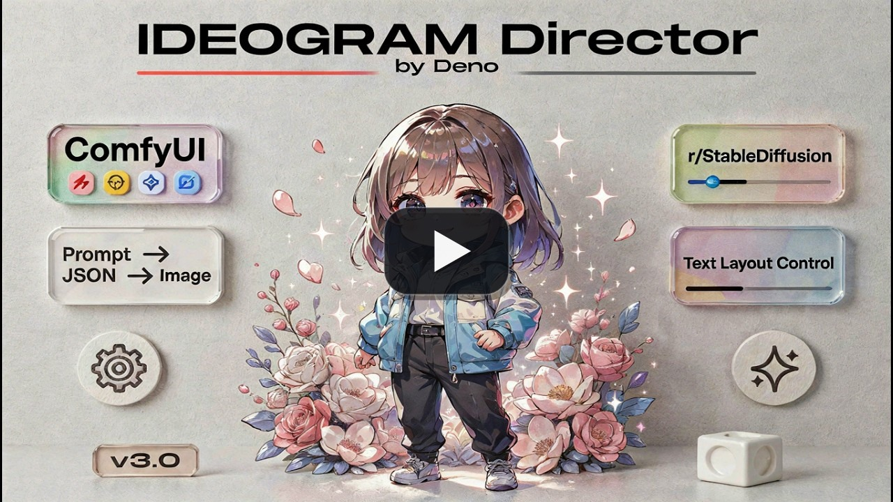
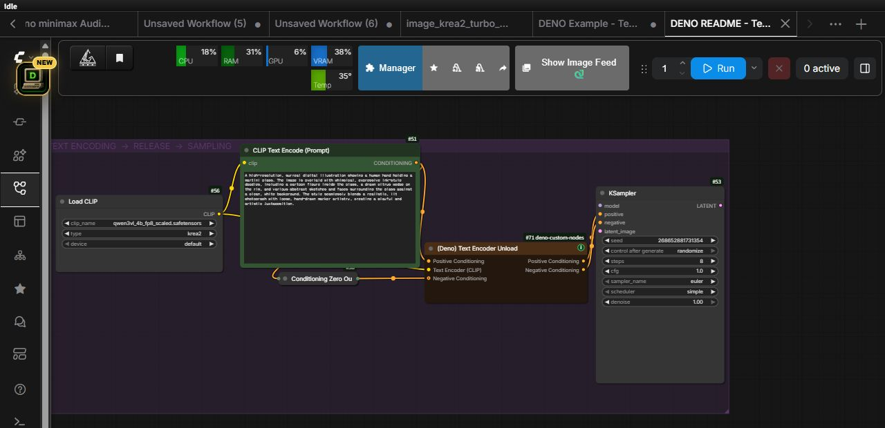
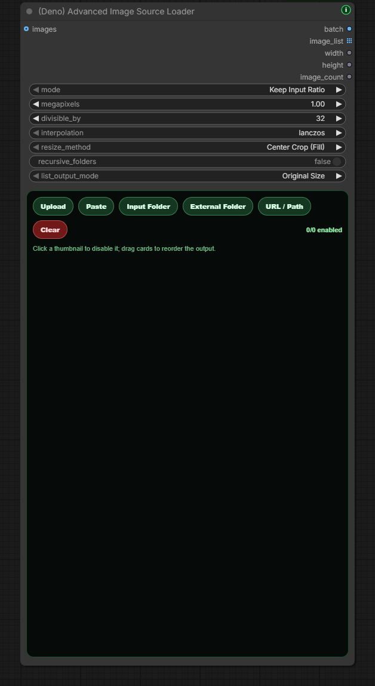
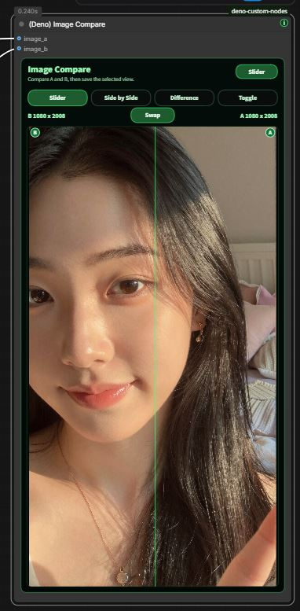
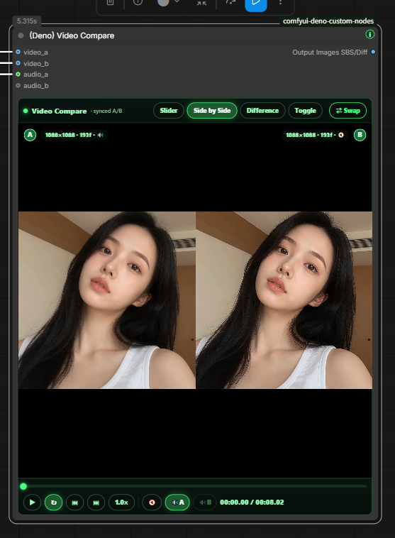
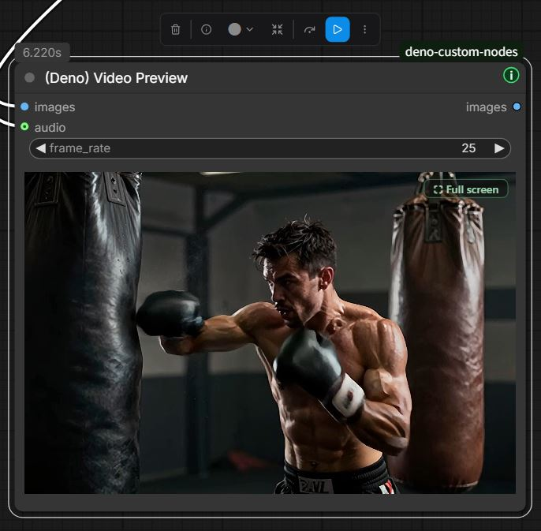

# Deno Custom Nodes

[English](../README.md) | [한국어](README.ko.md) | [日本語](README.ja.md) | [简体中文](README.zh-CN.md) | [Español](README.es.md) | [Português](README.pt-PT.md) | [Português (Brasil)](README.pt-BR.md) | [Bahasa Indonesia](README.id.md)

[YouTube Channel](https://www.youtube.com/@Denoise-AI)


이 repo는 GPL-3.0에 따라 사용, 학습, 수정, 재배포할 수 있습니다.

이 repo에 포함된 DENO 소유 노드, 문서, 예시, 워크플로우, 프로젝트 내 에셋은 GNU GPL v3.0 (`GPL-3.0-only`)으로 배포됩니다. 상업적 이용도 가능하지만, 수정본을 배포할 때는 GPL-3.0을 따라야 하며 필요한 라이선스와 저작권 고지를 유지해야 합니다.

외부 모델, 체크포인트, LoRA, 라이브러리, 도구, 서비스는 각각의 라이선스와 이용 조건을 따릅니다. 특정 모델이나 에셋을 사용하는 워크플로우라면 공유하거나 판매하기 전에 해당 라이선스를 확인해 주세요.

실제 ComfyUI 작업에서 반복되는 이미지, 비디오, LTX, RTX, 모델 설치 흐름을 더 빠르고 편하게 만들기 위한 Deno 커스텀 노드 모음입니다.

대부분의 Deno 노드는 ComfyUI 캔버스를 벗어나지 않고 도움말을 볼 수 있는 작은 초록색 `i` 버튼을 포함합니다. 새 Deno Custom Nodes 버전이 있으면 버튼이 노란색으로 바뀌고 작은 `!` 배지가 표시됩니다.

## Release Notes

공개 업데이트 내역은 [CHANGELOG.md](../CHANGELOG.md)에 짧게 정리합니다.

## Web Tools

브라우저에서 바로 실행할 수 있는 도구입니다.

- [DENO Video Compare](https://deno2026.github.io/comfyui-deno-custom-nodes/video-compare/) - 두 렌더 영상을 슬라이더, 나란히 보기, 차이 보기, 토글 방식으로 비교합니다.
- [DENO Video to GIF/WebP](https://deno2026.github.io/comfyui-deno-custom-nodes/video-to-gif/) - 짧은 영상을 자르고, 크롭하고, 리사이즈해서 GIF 또는 작은 WebP로 내보냅니다.
- [DENO 디스코드용 영상 / 이미지 압축](https://deno2026.github.io/comfyui-deno-custom-nodes/video-to-discord/) - 영상이나 이미지를 줄여 가능하면 10MB 이하 디스코드용 파일로 저장합니다.

## DENO Visual Fold


DENO Visual Fold는 큰 ComfyUI 그래프를 시각적으로 정리하는 기능입니다. 여러 노드 또는 그룹을 접어도 워크플로우 로직은 바뀌지 않습니다.

두 개 이상의 노드를 선택하면 캔버스 오른쪽 위 근처에 초록색 `Fold` 버튼이 나타납니다. 누르면 선택한 노드가 하나의 시각적 그룹처럼 접히고, `Unfold`로 다시 펼칠 수 있습니다. 일반 ComfyUI 그룹 하나를 선택하면 `Fold Group`으로 그룹 안의 노드를 접을 수 있고, 여러 그룹을 선택하면 정렬 버튼도 함께 나타납니다.

ComfyUI Subgraph는 노드를 하위 그래프로 이동시키는 기능입니다. Visual Fold는 그와 달리 정리 목적의 시각 기능입니다. `Get` / `Set` 노드나 부모-자식 그래프 구조를 그대로 보이게 두고 싶을 때 유용합니다.

## DENO Floating Tools

DENO Floating Tools는 `Settings > DENO > Tools`에서 직접 켜는 선택 기능이며 기본값은 꺼짐입니다.

활성화하면 ComfyUI 화면에 작은 DENO 아이콘이 나타납니다. 이 패널에서 ComfyUI 기본 메모리 정리 endpoint를 이용해 VRAM을 비우고, 현재 ComfyUI Stable과 최신 공개 버전을 읽기 전용으로 비교하며, 실행 실패 시 GPT/Gemini에 전달할 Error Help 보고서를 열 수 있습니다.

Error Help는 현재 워크플로, Python 환경과 패키지 버전, GPU 정보, 최근 traceback·로그 문맥, 커스텀 노드 요약을 먼저 별도 창에 보여줍니다. 사용자가 `Copy Report`를 눌렀을 때만 복사하며 token, cookie, password, private key, URL credential처럼 흔한 비밀 값은 복사 전에 가립니다.

Floating Tools 자체는 설치, 업데이트, 재시작, 복구 또는 워크플로 수정을 실행하지 않습니다.

## Included Nodes

### `(Deno) Ideogram Director`

[](https://youtu.be/Z8s27skkIDM)

Ideogram 4용 구조화 JSON 프롬프트와 bbox 배치를 ComfyUI 캔버스 안에서 편집하는 시각형 프롬프트 빌더입니다.

주요 기능:

- 캔버스 위에서 bbox 영역을 직접 그리고 편집
- 개별 bbox 요소를 삭제하거나 순서를 바꾸지 않고 임시로 비활성화
- bbox를 더블클릭하면 포인터 옆에서 편집하고, 겹친 영역은 `Alt`+클릭을 반복해 아래쪽 bbox까지 순환 선택
- Local LLM Loader 또는 다른 STRING 출력에서 JSON 프롬프트 가져오기
- Summary와 Background STRING 입력을 연결하면 해당 실행에서 두 보드 값을 덮어쓰며, 연결하지 않으면 저장된 보드 내용을 그대로 사용
- 기존 보드가 있을 때 새 JSON으로 교체할지 먼저 확인
- 잘못된 JSON은 명확하게 거절하고 깨진 프롬프트를 샘플러로 보내지 않음
- 스타일/레이아웃 프리셋 갤러리와 가벼운 미리보기 썸네일
- Language 보기로 장면 설명을 원하는 언어로 읽고 수정할 수 있으며, 최종 출력은 생성용 영어로 유지. 실제 TEXT 박스 단어는 간판, 로고, 제목처럼 그대로 보존
- 출력: `prompt`, `width`, `height`, `seed`, `bboxes`

### `(Deno) Resize Box`

ComfyUI용 해상도 도우미와 이미지 리사이즈 노드입니다.


주요 기능: 비율 프리셋, 직접 입력, 메가픽셀 기반 계산, `divisible_by` 정렬, Center Crop·드래그 Crop Position·Fit 리사이즈, 노드 안 비율 미리보기, Crop Position에서 연결된 원본을 반투명하게 실제 출력 프레임 안에만 표시하고 이미지 드래그로 보일 위치 조정, `image`, `width`, `height` 출력.

### `(Deno) Multi Image Loader`

배치 가이드 워크플로우에 맞춘 다중 이미지 로더입니다.


주요 기능: 고정 높이 갤러리, 드래그 정렬, 업로드, 드래그 앤 드롭, 이미지 붙여넣기, ComfyUI `input` 폴더 탐색, 중첩 폴더 이미지 추가, 최신순 정렬, 비율 유지/프리셋/직접 입력 리사이즈, `multi_output`, `width`, `height` 출력. 보안을 위해 `input` 폴더 밖으로 나가는 외부 심볼릭 링크·정션은 건너뛰며, 이런 소스는 `(Deno) Advanced Image Source Loader`의 External Folder를 사용합니다.

### `(Deno) MiniMax H3 Multi Reference Image Loader`

ComfyUI 순정 MiniMax H3 Reference to Video용 한 줄 연결 다중 참조 이미지 로더입니다.

기존 `(Deno) Multi Image Loader`와 동일한 업로드, 붙여넣기, 드래그 앤 드롭, Input Folder, 카드 정렬, 삭제 사용감을 유지합니다. 최대 9장을 전용 `ref_images` 소켓 하나로 전달하며, 각 이미지의 디코딩된 원본 크기와 비율을 리사이즈·크롭·패딩 없이 개별 보존합니다. 미리보기 카드도 각 원본 비율을 그대로 사용하므로 가로·세로 이미지가 섞여 있어도 잘림 없이 표시됩니다. 카드 순서는 `<Picture 1>`, `<Picture 2>` 순서로 대응합니다. 같은 이미지들은 별도의 `image_list` 출력으로도 제공되어 `(Deno) Local LLM Loader`의 `image` 입력에 바로 연결할 수 있습니다.

함께 제공되는 `(Deno) MiniMax H3 Reference to Video`는 이미지 입력만 한 단자로 바꾸고, 참조 비디오·비디오 오디오·단독 오디오의 순정 Autogrow 입력은 그대로 유지합니다. 일반 `IMAGE` 배치는 모든 이미지가 같은 가로·세로 크기여야 하므로 혼합 원본 크기 보존에는 사용할 수 없습니다. 추가된 `image_list`는 동일 크기 배치가 아니라 각 원본을 분리해 유지하는 리스트 출력입니다. H3 내부의 `ref_image_size` 처리는 실행 시 비율을 유지한 채 참조 이미지를 축소할 수 있습니다.

이 두 MiniMax H3 노드는 ComfyUI 0.30.0 이상이 필요합니다. 순정 H3 전체 구성에서 여러 `Load Image` 노드만 DENO 한 줄 로더로 교체한 [MiniMax H3 다중 참조 예제 워크플로](workflows/minimax-h3-multi-reference.json)를 함께 제공합니다.

### `(Deno) MiniMax H3 Acc LoRA Loader`

Alibaba PAI가 공개한 공식 [MiniMax-H3-Acc-LoRAs](https://huggingface.co/alibaba-pai/MiniMax-H3-Acc-LoRAs)를 변환하거나 복사본을 만들지 않고 직접 불러옵니다.

1. 공식 FL2VA 또는 Ref2VA `Acc-8Step.safetensors`를 내려받아 기존 `ComfyUI/models/loras/` 또는 전용 `ComfyUI/models/minimax_h3_acc_loras/` 폴더 중 한 곳에 넣습니다.
2. 계열이 맞는 순정 MiniMax H3 diffusion model을 `model`에 연결합니다. 완전판과 Comfy-Org `*_pruned_*` 모델을 모두 연결할 수 있습니다.
3. FL2VA/T2VA 모델에는 FL2VA Acc-LoRA, Ref2VA 모델에는 Ref2VA Acc-LoRA를 선택합니다.
4. 노드의 단일 `model` 출력을 기존 guider 경로에 연결합니다.
5. ComfyUI 순정 샘플링 노드에서 `BasicScheduler: simple, steps: 8`, `KSamplerSelect: euler`로 시작해 `SamplerCustomAdvanced`에 연결하는 구성을 권장합니다.

노드가 일반 LoRA 가중치와 체크포인트의 32개 시간 구간별 PDD 출력 헤드를 함께 적용합니다. 샘플링할 때 실제 sigma 경계를 읽고 해당 구간에 필요한 PDD 헤드를 자동으로 다시 묶으므로 sampler, scheduler, step은 ComfyUI 순정 노드에서 조절할 수 있습니다. 공식 학습·권장 설정은 Simple/Euler 8-step입니다. 사용자는 로더를 바꾸지 않고 Simple Scheduler의 4~12 step을 선택할 수 있으며, 그 밖의 내림차순 스케줄과 레이턴트 업스케일용 분할 sigma 패스도 실험할 수 있습니다. 다만 공식값 밖의 설정이 화질 향상을 보장하지는 않습니다. LoRA strength는 `1.0`, 영상/오디오 sigma shift는 순정 값인 `12.0 / 3.0`을 유지하세요.

완전판 non-pruned 모델은 ComfyUI 순정 INT8 모델을 포함해 전체 어댑터를 일반 양자화 대응 LoRA 경로로 적용합니다. 곡선 압축된 pruned 모델을 연결하면 `models/diffusion_models/`에 이미 있는 같은 계열의 non-pruned MiniMax H3 체크포인트를 자동으로 찾습니다. 그 파일 전체를 올리지 않고 작은 FP32 time-embedder 부분만 읽어, AdaLN LoRA 50개를 pruned 8차원 곡선에 맞게 메모리에서 변환합니다. 맞는 full 체크포인트가 없더라도 실행을 막지 않습니다. 경고를 남기고 그 50개만 건너뛴 뒤 나머지 LoRA와 PDD 헤드는 모두 적용합니다.

v0.7.92~v0.7.94의 3출력 버전으로 저장한 표준 활성 UI 워크플로우는 ComfyUI 캔버스에서 열 때 자동 변환됩니다. 기존 model 연결은 그대로 두고, 예전 sampler와 sigmas 연결을 각각 사용자가 수정할 수 있는 순정 `KSamplerSelect: euler`와 `BasicScheduler: simple, steps: 8` 노드로 옮깁니다. 열린 뒤 UI 워크플로우를 한 번 저장하세요. 현재 단일 출력 워크플로우는 건드리지 않습니다. mute/bypass 상태, 정확히 판별할 수 없는 사용자 변경형, 손상된 그래프도 임의로 바꾸지 않습니다. raw API prompt JSON에는 이 frontend 변환이 실행되지 않으므로 변환된 UI 워크플로우에서 다시 API 형식으로 내보내야 합니다. 예전 sampler/sigmas 링크가 이미 사라진 채 저장된 파일은 순정 노드를 수동으로 다시 연결해야 합니다.

Deno Custom Nodes에는 LoRA 가중치와 워크플로우를 포함하지 않습니다. 가중치는 Alibaba 저장소에서 각자 내려받고, ComfyUI 순정 워크플로우를 직접 구성하거나 기존 그래프에 연결해 사용합니다.

### MiniMax H3 R2V 오디오 레퍼런스 워크플로

[초보자용 오디오 레퍼런스 워크플로](workflows/minimax-h3-r2v-audio-reference.json)는 ComfyUI 순정 MiniMax H3 오디오 레퍼런스 경로를 유지하면서 자동 프롬프트 연출 단계를 더합니다.

- `(Deno) Audio Transcript`: 로컬 OpenAI Whisper로 가사·대사, 구간 시간, 감지 언어, 신뢰도 요약을 만듭니다. 사용자가 직접 입력한 가사·대사가 있으면 그 문구를 최우선으로 사용합니다.
- `(Deno) Audio Analysis Finalizer`: ComfyUI `TextGenerate` 결과에서 문서화된 음향 분석 항목만 남기고, 선택에 따라 분석용 CLIP 모델을 실행 후 내립니다.
- `(Deno) Local LLM Loader`: 선택형 `audio_context` STRING 입력으로 받아쓰기와 음향 보고서를 받습니다. 원본 AUDIO를 로컬 LLM에 직접 보내지 않으며, 자동 분석 결과는 지시가 아니라 참고 데이터로 취급합니다.
- 선택한 원본 오디오 구간은 H3의 `<Audio 1>` 레퍼런스이면서 최종 MP4에 그대로 들어가는 소리입니다. 이 워크플로에서는 H3 내부 생성음을 디코딩하지 않습니다.

필수 준비:

- MiniMax H3와 오디오 입력 `TextGenerate`를 지원하는 최신 ComfyUI Stable
- `Load Audio (Upload)`용 [ComfyUI-VideoHelperSuite](https://github.com/Kosinkadink/ComfyUI-VideoHelperSuite)
- 음향 분석용 `gemma4_e4b_it_fp8_scaled.safetensors`를 `ComfyUI/models/text_encoders/`에 저장
- 최종 프롬프트 감독용 LM Studio의 `google/gemma-4-12b-qat` 모델과 실행 중인 Local Server

`openai-whisper`는 노드 의존성으로 설치됩니다. 선택한 Whisper 체크포인트는 `(Deno) Audio Transcript` 첫 실행 때 OpenAI 공식 주소에서 내려받고 공식 Whisper 로더가 체크섬을 검증하며, `ComfyUI/models/stt/whisper/`에 캐시됩니다.

### `(Deno) Text Encoder Unload`

일반적인 positive-only 또는 positive/negative 프롬프트 흐름에 직접 넣는 선택형 VRAM 장벽 노드입니다.



- positive conditioning을 필수 `Positive Conditioning`에 연결하면 같은 객체가 그대로 출력됩니다.
- 실제 negative prompt의 인코딩 결과나 `Conditioning Zero Out`은 선택 `Negative Conditioning`에 연결하면 그대로 출력됩니다.
- positive-only guider 흐름에서는 `Negative Conditioning`을 비워 둡니다.
- 위쪽 Text Encode가 실제 사용한 정확한 CLIP을 `Text Encoder (CLIP)`에 연결합니다.
- 연결한 CLIP/text encoder와 clone, 그 관리 구성요소만 ComfyUI 모델 관리 경로로 내리며 diffusion model, VAE, ControlNet을 전역으로 내리지 않습니다.
- ComfyUI의 일반 입력 캐시를 따르므로 conditioning이나 CLIP 경로가 바뀌면 unload를 다시 실행하고, 입력이 같은 프리뷰 샘플링은 캐시를 재사용할 수 있습니다.

Dynamic VRAM은 메모리 압력에 따라 weight를 옮기므로 text encoder 일부가 의도적으로 남을 수 있습니다. 이 노드는 그 인코더를 확실히 내릴 시점을 직접 만드는 기능이지만, ComfyUI 프로세스 전체를 `0 MiB`로 만들지는 않습니다. CUDA context, conditioning tensor, 다른 모델과 커스텀 노드 할당, 다른 앱의 VRAM은 별개입니다. 또한 샘플링 품질 자체를 높이는 기능이 아니라, model offload나 OOM을 줄일 VRAM 여유를 만드는 기능입니다. 다음 text encode에서는 모델을 다시 불러오므로 더 느릴 수 있고, `--gpu-only`에서는 인코더를 VRAM 밖으로 옮길 수 없습니다.

### `(Deno) Advanced Image Source Loader`

외부 폴더, 로컬 경로, 웹 이미지 URL, 혼합 크기 이미지 리스트가 필요한 워크플로우용 고급 이미지 소스 로더입니다.



주요 기능: ComfyUI `input` 폴더와 외부 로컬 폴더 지원, URL/Path 입력, 업로드와 붙여넣기, 썸네일 enable/disable, 드래그 정렬, masonry 스타일 갤러리, 재귀 폴더 로드, 배치 텐서와 `image_list` 출력. 비활성 이미지는 삭제하지 않은 채 알아볼 수 있는 밝기로 유지되고, 갤러리는 기존 캔버스와 Nodes 2.0에서 노드 높이에 맞춰 유동적으로 배치됩니다.

### `(Deno) Image Compare`

ComfyUI 캔버스 안에서 두 이미지를 빠르게 비교하는 A/B 비교 노드입니다.



주요 기능: `image_a`와 `image_b` 비교, Slider/Side by Side/Difference/Toggle 모드, hover 슬라이더, A/B 라벨, Swap 버튼, 리사이즈 가능한 내부 미리보기.

### `(Deno) Video Compare`

업스케일과 FPS 보간 결과를 ComfyUI 캔버스 안에서 확인하기 위한 비디오 A/B 비교 노드입니다.

주요 기능: `video_a`, `video_b`, 선택적 `audio_a`, `audio_b`, Slider/Side by Side/Difference/Toggle 모드, 재생/일시정지, 스크럽바, 프레임 스텝, 속도, 루프, 출력 배지 토글, `comparison` 이미지 출력.

설치가 부담스러우면 브라우저 도구를 사용할 수 있습니다: https://deno2026.github.io/comfyui-deno-custom-nodes/video-compare/





### `(Deno) Video Preview`

그래프 중간에서 실제 인코딩된 비디오 결과를 확인하는 풀 해상도 미리보기 노드입니다.



주요 기능: IMAGE batch 입력과 straight-through 출력, 선택적 오디오 mux, hover 오디오, 클릭 재생/일시정지, Full screen 버튼, 해상도/FPS/프레임/길이 배지, PyAV 누락 시 친절한 설치 힌트.

### `(Deno) RTX Video Super Resolution`

NVIDIA RTX Video Super Resolution을 ComfyUI 안에서 간단히 시도할 수 있는 선택형 Windows/NVIDIA RTX 도우미 노드입니다.


초보자 흐름: `deno-custom-nodes` 설치 또는 업데이트, ComfyUI 시작, 노드 추가 후 한 번 실행, NVIDIA VFX가 없다는 안내가 나오면 ComfyUI를 완전히 종료, `How to install` 버튼의 설치 가이드 순서대로 진행, BAT에서 경로를 확인하고 `Y`, 완료 후 ComfyUI 재시작.

NVIDIA 공식 참고 링크: [NVIDIA Maxine Windows Getting Started](https://docs.nvidia.com/deeplearning/maxine/vfx-sdk-programming-guide/index.html), [RTX Video FAQ](https://nvidia.custhelp.com/app/answers/detail/a_id/5448/~/rtx-video-faq).

### `(Deno) RTX Video Super Resolution (2 Pass)`

비디오 전체 마감용 2-pass RTX 처리 노드입니다. 먼저 같은 크기의 `Denoise` 또는 `Deblur`를 선택적으로 실행하고, 그 다음 `VSR` 또는 `High Bitrate` 업스케일을 선택적으로 실행할 수 있습니다.

예제 워크플로우: [RTX 2-pass upscale workflow](workflows/deno-rtx-lowram-metabatch.json)

주요 기능: Low System Memory와 High System Memory 흐름, VHS Meta Batch 기반 저메모리 처리, 원본 FPS 전달, 오디오 보존, 실제 인코딩 비디오 마감에 적합.

### `(Deno) LTX Sequencer`

멀티 이미지 LTX 워크플로우에 맞춘 가이드 시퀀서입니다.


주요 기능: `(Deno) Multi Image Loader` 배치 출력과 함께 사용, 가능한 경우 `num_images` 자동 채움, 기존 sync 스타일 유지, 필요한 strength만 수동 제어, bypass로 빠른 A/B 테스트.

### `(Deno) LTX Model Loader`

LTX 2.3 모델 로딩 패턴을 한 노드로 정리한 로더입니다.


주요 기능: Checkpoint Style, KJ Style, GGUF Style, `model`, `clip`, `video_vae`, `audio_vae` 출력, ComfyUI 기본 로더와 KJNodes/ComfyUI-GGUF 흐름을 함께 지원.

### `(Deno) LTX Tiled Spatial Upscaler`

고해상도 LTX 비디오 latent 2차 패스를 위한 타일 업스케일러입니다. 비디오 latent를 겹치는 spatial tile로 나눠 처리한 뒤 다시 하나의 latent로 섞습니다.

비디오 전용 LTX latent에 사용하세요. 비디오/오디오가 결합된 latent는 먼저 오디오 경로를 분리하고, 타일 비디오 패스 뒤에 다시 합치는 흐름을 권장합니다.

### `(Deno) LTX High resolution Tiled Sampler`

LTX AV refinement 패스를 위한 샘플러입니다. 하나의 global sampler trajectory를 유지하면서 video prediction을 겹치는 spatial tile로 계산하고 합칩니다.

전체 audio latent를 모든 video tile에 문맥으로 전달하고, `freeze` mode에서는 반환되는 audio latent를 입력 상태 그대로 유지합니다.

### `(Deno) Easy Model Download Helper`

권장 모델 파일 세트를 안내하는 프리셋 기반 설치 도우미입니다. 내장 프리셋은 기존 LTX 2.3 8GB VRAM GGUF 세트와 공식 LTX 2.5 Distilled INT8 2단계 모델 세트를 함께 제공합니다.


주요 기능: Python에서 직접 다운로드하지 않고 공식 모델 링크를 브라우저로 열기, ComfyUI 모델 루트 표시, workflow 안 creator preset 저장, Hugging Face와 Civitai 링크 지원, 파일이 올바른 모델 폴더에 있는지 확인. LTX 2.5 프리셋에는 diffusion model, projection이 포함된 Gemma 4 text encoder, video/audio VAE, 2단계 처리용 x2 spatial upscaler가 모두 포함됩니다.

LTX 2.5 파일은 Hugging Face 로그인 후 **Agree and Access** 승인이 필요합니다. 이 도우미는 접근 제한을 우회하거나 모델을 자동 다운로드하지 않습니다. 먼저 [LTX-2 Community License](https://github.com/Lightricks/LTX-2/blob/main/LICENSE.md)를 확인하고 [공식 LTX 2.5 저장소](https://huggingface.co/Lightricks/LTX-2.5)에서 접근 권한을 받은 뒤, 노드가 여는 브라우저 링크로 파일을 내려받아 화면에 표시된 ComfyUI 모델 폴더에 옮기세요.


### `(Deno) Multi LoRA Loader`

일반 ComfyUI diffusion 워크플로용 다중 LoRA 로더입니다. 연결한 `MODEL`과 선택형 `CLIP`에 최대 8개 LoRA를 적용하고, 저장된 선택을 잃지 않은 채 슬롯별 enable/disable, model/CLIP strength, trigger word와 note, 슬롯 순서 변경을 관리한 뒤 패치된 `model`과 `clip`을 출력합니다.

### `(Deno) LTX Multi LoRA Loader`

LTX 워크플로우용 Power-LoRA 스타일 다중 LoRA 로더입니다.


주요 기능: 여러 LoRA 추가, 슬롯별 enable, strength/video/audio strength, trigger word와 note 관리, trigger word 복사, 패치된 `model`과 `clip` 출력.

### `(Deno) LTX Prompt Guide`

LTX 프롬프트 인코딩, 선택적 negative prompt, LTX conditioning, 대사 길이 계획을 함께 다루는 프롬프트 도우미입니다.


주요 기능: positive prompt 인코딩, 접을 수 있는 negative prompt, `frame_rate`가 포함된 LTX conditioning, 따옴표 안 대사 길이 추정, Auto/Korean/English/Japanese/Chinese 대사 추정.

### `(Deno) Bernini Prompt Guide`

KJ Bernini 방식의 프롬프트 prefix를 쉽게 쓰도록 만든 프롬프트 도우미입니다. positive/negative prompt를 한 노드에서 인코딩하고, 선택한 `System Prompt` 모드에 맞는 system prompt를 노드 맨 위에 보여줍니다.


주요 기능: `Text to Video`, `Image to Video`, `Reference Video Edit` 같은 읽기 쉬운 System Prompt 선택, reference 모드의 `image0`/`image1` naming hint 자동 적용, 접을 수 있는 negative prompt, 공식 Wan2.2 negative preset 자동입력, `positive`/`negative` 출력.

Negative preset은 출력 모드가 아니라 아래 negative prompt 칸을 자동으로 채우는 용도입니다. 프리셋으로 채운 뒤 사용자가 그 칸에서 직접 추가하거나 수정한 문구가 최종 negative conditioning으로 인코딩됩니다.

프롬프트는 평소 태그를 나열하는 방식보다 챗봇에게 시키듯이 씁니다. 예: `Replace the jacket with the shirt from image0. Keep the camera motion, background, lighting, and shadows unchanged.`

이 노드는 텍스트 conditioning만 준비합니다. `positive`와 `negative` 출력을 현재 ComfyUI Stable의 순정 `(Bernini) Conditioning` 노드에 연결하면 Bernini visual/context-latent conditioning을 구성할 수 있습니다. 최신 ComfyUI에는 [Bernini backend가 정식 병합](https://github.com/Comfy-Org/ComfyUI/pull/14216)되어 있으므로 예전 preview backend updater가 필요하지 않습니다. 순정 conditioning 노드가 보이지 않으면 ComfyUI Stable을 먼저 업데이트하세요.

### `(Deno) Prompt Text`

system prompt, user prompt, template, JSON 같은 긴 문구를 별도 노드에서 읽기 쉽게 보관하고 STRING으로 연결하는 작은 multiline 입력 노드입니다. 문구를 바꾸지 않은 채 Ideogram Director, Local LLM Loader 또는 다른 STRING 입력으로 전달할 때 사용합니다.

### `(Deno) Local LLM Loader` / `(Deno) Local LLM Reviewer`

내 PC에서 실행 중인 로컬 LLM을 ComfyUI 안에서 호출하고, LLM이 만든 review text로 저장 전 결과를 통과하거나 막는 노드입니다.

주요 기능: Ollama, LM Studio, llama.cpp, vLLM, Custom OpenAI-compatible 서버, llama-swap 또는 Unsloth Studio 로컬 모델 호출, `127.0.0.1`/`localhost` 전용 안전 제한, provider별 모델 새로고침, 실행 중인 로컬 LLM 요청 중단, llama-swap과 Unsloth Studio의 관리 API를 이용한 수동/실행 후 unload, prompt batch를 한 번의 노드 실행으로 순차 처리, vision 모델용 IMAGE 첨부, Thinking/Result 프리뷰, Save 노드 앞 IMAGE/AUDIO gate, 현재 리뷰 결과 1회 승인, reviewer 앞 경로만 다시 실행. Local LLM 노드가 실행되어 반환한 최종 Result는 PNG/워크플로 메타데이터에 저장되어 파일을 다시 열면 노드 안에서 복원되며, Thinking/reasoning 내용은 저장하지 않습니다. llama-swap에 설정된 서버 timeout은 자동 unload 시점을 계속 관리합니다.

`Unsloth` provider는 Unsloth Studio 서버 전용이며 기본 주소는 `http://127.0.0.1:8888/v1`입니다. Unsloth에서 받은 GGUF를 LM Studio에 불러 실행하는 경우에는 `Unsloth`가 아니라 `LM Studio`를 선택하세요. 이 연동은 Unsloth Studio의 모델 조회와 OpenAI-compatible chat 요청을 사용하고 tool definition/tool choice 필드는 보내지 않으며, 수동 unload와 실행 후 unload에는 Unsloth Studio 관리 API를 사용합니다. `Keep for minutes`는 Unsloth timed unload를 예약하지 않으므로 실제 종료가 필요하면 `Unload after run` 또는 `Unload LLM`을 사용하세요.

`Unsloth` provider를 사용하려면 ComfyUI를 시작하기 전에 `DENO_LOCAL_LLM_UNSLOTH_API_KEY` 환경변수에 API key를 설정해야 합니다. 이 키는 workflow나 PNG 메타데이터에 저장되지 않습니다.

LM Studio 호환 참고: LM Studio가 생성 출력을 시작하기 전에 선택형 reasoning 제어 필드를 거부하면 노드는 그 필드만 뺀 요청으로 한 번 재시도합니다. 그 이후 reasoning 기본 동작은 선택한 서버와 모델이 결정하므로, Thinking toggle만으로 서버가 노출하지 않는 reasoning 모드를 강제할 수는 없습니다.

오디오 참고: Local LLM Loader는 원본 AUDIO를 로컬 모델에 직접 보내지 않습니다. 선택형 `audio_context` STRING 입력으로 상위 노드의 받아쓰기와 음향 보고서를 사용자 prompt를 바꾸지 않는 참고 데이터로 받을 수 있습니다. ComfyUI 기본 또는 다른 audio-capable text generation 노드가 review text를 만들면, Local LLM Reviewer가 그 review text 기준으로 AUDIO도 함께 통과하거나 차단할 수 있습니다.

## Why This Exists

이 노드들은 실제 ComfyUI 제작 과정에서 반복되는 세팅 피로를 줄이기 위해 만들어졌습니다. 목표는 거대한 기능 목록이 아니라, 매일 반복하는 워크플로우를 더 빠르고 깨끗하고 가르치기 쉽게 만드는 것입니다.

## Search Tips

GitHub, ComfyUI Manager, Registry에서 `deno custom nodes`, `ideogram`, `ideogram 4`, `ideogram director`, `json prompt`, `bbox`, `bounding boxes`, `layout prompt`, `rtx video super resolution`, `nvidia vfx`, `image compare`, `video compare`, `video preview`, `video to gif`, `gif webp`, `ltx 2.3`, `ltx model loader`, `ltx tiled`, `ltx tiled sampler`, `ltx spatial upscaler`, `ltx multi lora`, `prompt guide`, `system prompt`, `local llm loader`, `local llm prompt`, `local llm reviewer`, `prompt only`, `final prompt`, `ai reviewer`, `media reviewer`, `audio review gate`, `ollama`, `lm studio`, `llama.cpp`, `vllm`, `llama-swap`, `unsloth`, `unsloth studio`, `minimax h3`, `audio transcript`, `whisper`, `text encoder unload`, `clip unload`, `dynamic vram`, `vram barrier`, `bernini`, `bernini prompt guide`, `bernini conditioning`, `comfyui bernini`, `kj bernini`, `reference video edit`, `wan-2.2`, `wan2.2`, `visual fold`, `floating tools`, `free vram`, `comfyui stable`, `stable update check`, `error help`, `comfyui error help`, `sos report`, `gpt gemini report`, `workflow diagnostics` 같은 키워드로 찾을 수 있습니다.

## Install

권장 방법: ComfyUI Manager에서 `Deno Custom Nodes`를 검색해 설치한 뒤 ComfyUI를 다시 시작합니다.

수동 설치는 ComfyUI의 `custom_nodes` 폴더 안에서 clone하고, ComfyUI를 실행하는 동일한 Python으로 의존성을 설치합니다.

```bash
git clone https://github.com/Deno2026/comfyui-deno-custom-nodes.git
cd comfyui-deno-custom-nodes
python -m pip install -r requirements.txt
```

수동 업데이트는 저장소 폴더에서 `git pull --ff-only`를 실행하고, 같은 Python으로 `requirements.txt`를 다시 설치한 뒤 ComfyUI를 재시작하세요. ComfyUI Manager/Registry 설치는 패키지 의존성을 자동으로 처리합니다.

## Links

- YouTube: https://www.youtube.com/@Denoise-AI
- GitHub: https://github.com/Deno2026/comfyui-deno-custom-nodes
- Registry: https://registry.comfy.org/publishers/deno2026/nodes/deno-custom-nodes
