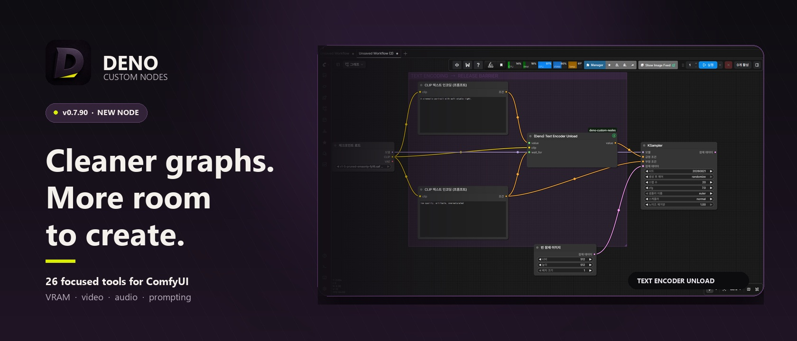
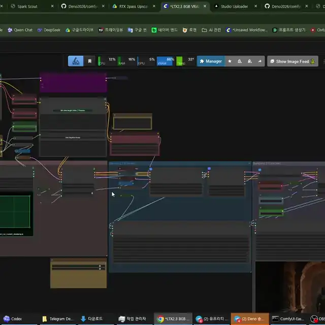
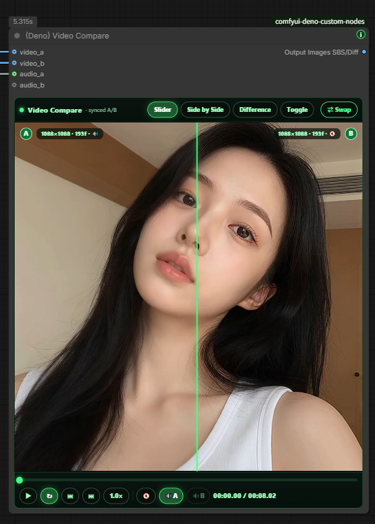
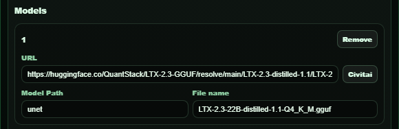

# Deno Custom Nodes

[English](../README.md) | [한국어](README.ko.md) | [日本語](README.ja.md) | [简体中文](README.zh-CN.md) | [Español](README.es.md) | [Português](README.pt-PT.md) | [Português (Brasil)](README.pt-BR.md) | [Bahasa Indonesia](README.id.md)

[YouTube Channel](https://www.youtube.com/@Denoise-AI)



Nós práticos do ComfyUI para preparar imagens e vídeos, carregar modelos e organizar o canvas.

[GPL-3.0](../LICENSE)

- **Preparar e comparar imagens:** [Resize Box, carregadores e nós de comparação](#deno-resize-box).
- **Criar workflows de geração:** [MiniMax H3](#deno-minimax-h3-multi-reference-image-loader), [LTX](#deno-ltx-model-loader) e [LLMs locais](#deno-local-llm-loader--deno-local-llm-reviewer).
- **Organizar o canvas e os resultados:** [Visual Fold](#deno-visual-fold), [Floating Tools](#deno-floating-tools) e [ferramentas no navegador](#web-tools).

## Quick Start

Comece com o ComfyUI já instalado.

1. Abra o ComfyUI Manager e pesquise `Deno Custom Nodes`.
2. Instale o pacote e reinicie o ComfyUI.
3. Clique duas vezes em uma área vazia do canvas, pesquise `(Deno) Resize Box` e adicione o nó.
4. Escolha `Preset Ratio` e os megapixels para definir `width` / `height` de saída.
5. Adicione `Load Image`, selecione ou envie uma imagem e conecte a saída `IMAGE` à entrada `image` do Resize Box. Conecte a saída `image` do Resize Box a `Preview Image` e clique em `Run` para ver o resultado.

[Todos os nós](#included-nodes) · [Ferramentas web](#web-tools) · [Visual Fold](#deno-visual-fold) · [Floating Tools](#deno-floating-tools) · [Instalação manual](#install) · [Licença](#license)

A maioria dos nós Deno inclui um pequeno botão verde `i` para abrir uma ajuda rápida sem sair do canvas do ComfyUI. Se uma nova versão do Deno Custom Nodes estiver disponível, o botão fica amarelo e mostra um pequeno selo `!`.

## Web Tools

Ferramentas que rodam direto no navegador.

- [DENO Video Compare](https://deno2026.github.io/comfyui-deno-custom-nodes/video-compare/) - compara dois vídeos renderizados com slider, lado a lado, diferença e toggle.
- [DENO Video to GIF/WebP](https://deno2026.github.io/comfyui-deno-custom-nodes/video-to-gif/) - corta, recorta, redimensiona e exporta clipes curtos como GIF ou WebP menor.
- [DENO Compressão de vídeo / imagem para Discord](https://deno2026.github.io/comfyui-deno-custom-nodes/video-to-discord/) - reduz vídeos ou imagens e salva, quando possível, com menos de 10 MB para compartilhar no Discord. A interface está disponível apenas em coreano.

## DENO Visual Fold

[](images/deno-visual-fold.webp)

DENO Visual Fold é uma ajuda visual para organizar grafos grandes do ComfyUI. Dobrar nós ou grupos não muda a lógica do workflow.

Ao selecionar dois ou mais nós, aparece um botão verde `Fold` na barra de seleção nativa do ComfyUI. Ao clicar, os nós selecionados ficam compactados em um grupo visual e podem voltar com `Unfold`. Ao selecionar um grupo comum do ComfyUI, `Fold Group` dobra os nós dentro do grupo; com vários grupos selecionados também aparecem ações de alinhamento.

Diferente do Subgraph, o Visual Fold não move nós para um grafo filho. Ele serve apenas para organização visual, útil quando você quer manter nós `Get` / `Set` ou a estrutura pai-filho visível no grafo principal.

## DENO Floating Tools

DENO Floating Tools é um assistente opcional em `Settings > DENO > Tools`. Ele vem desativado por padrão.

Quando ativado, adiciona um pequeno ícone DENO arrastável à tela do ComfyUI. O painel pode liberar VRAM pelo endpoint de limpeza de memória integrado do ComfyUI, mostrar em modo somente leitura o status da versão atual e mais recente do ComfyUI Stable e abrir um relatório Error Help quando uma execução falha.

Error Help cria um relatório pronto para GPT / Gemini com o workflow atual, executável e tipo de ambiente Python, versões de pacotes, GPU, contexto recente de traceback / log e resumo de custom nodes. O recurso é somente leitura, abre primeiro uma janela de relatório e só copia quando você clica em `Copy Report`. Segredos comuns como tokens, cookies, senhas, chaves privadas e credenciais em URLs são ocultados antes da cópia.

Floating Tools não instala, atualiza, reinicia, repara nem modifica workflows.

## Included Nodes

### `(Deno) Ideogram Director`

Construtor visual de prompts para Ideogram 4, feito para editar captions JSON estruturadas e layouts bbox dentro do canvas do ComfyUI.

[](https://youtu.be/Z8s27skkIDM)

- Desenhe e edite regiões bbox; desative temporariamente cada caixa sem excluí-la nem alterar a ordem.
- Clique duas vezes em uma bbox para editar perto do ponteiro, ou use `Alt`+clique repetidamente em uma sobreposição para percorrer as caixas por baixo.
- Importe prompts JSON do Local LLM Loader ou de outra fonte STRING, confirme antes de substituir um board e rejeite claramente JSON inválido.
- As entradas STRING opcionais Summary e Background substituem esses campos do board durante a execução; sem conexão, é usado o texto salvo.
- Use galerias de presets de estilo/layout e Language view para editar descrições no seu idioma. A saída final continua em inglês pronto para o modelo e as palavras de caixas TEXT, como placas, logos e títulos, são preservadas exatamente.
- Saídas: `prompt`, `width`, `height`, `seed`, `bboxes`.
- `bboxes` conecta tanto a `BBOX` padrão quanto a entradas `BOUNDING_BOX`, por exemplo `Ideogram4_MultiLora_BoundingBoxNode_Fedor`. O número de linhas de regiões desse nó acompanha as caixas ativas do Director sem acrescentar campos salvos ao Director. A sincronização atual apenas conta caixas e não acompanha sua identidade: revise as atribuições LoRA depois de excluir ou reordenar uma caixa intermediária.

### `(Deno) Resize Box`

Nó de resolução e redimensionamento de imagem para ComfyUI.


Principais recursos: `Preset Ratio` / `Manual Input`, presets de proporção, cálculo por megapixels, alinhamento `divisible_by`, `Center Crop (Fill)`, `Crop Position (Fill)` com zoom e proporção fixa, `Fit (Letterbox/Pillarbox)`, interpolação `lanczos` por padrão e saídas `image`, `width`, `height`.

`Crop Position (Fill)` mostra a imagem de origem completa. Arraste o quadro de recorte para reposicioná-lo ou qualquer canto para ajustar o zoom, mantendo fixos a proporção e os megapixels de saída.

### `(Deno) Multi Image Loader`

Carregador de várias imagens pensado para workflows de guia em lote.


Principais recursos: galeria de altura fixa, reordenação por arrastar, upload, drag-and-drop, colar imagem, navegação pela pasta `input`, subpastas, ordenação por data recente, redimensionamento por proporção/preset/manual, saídas `multi_output`, `width`, `height`.

### `(Deno) MiniMax H3 Multi Reference Image Loader`

Carregador de imagens de referência com uma única conexão para o workflow nativo MiniMax H3 Reference to Video do ComfyUI.

Mantém a mesma experiência de upload, paste, drag-and-drop, Input Folder, reordenação de cartões e limpeza do `(Deno) Multi Image Loader`. Envia até 9 referências ordenadas por um socket `ref_images`, preservando separadamente as dimensões e proporções originais de cada imagem, sem resize, crop ou padding. A ordem dos cartões corresponde a `<Picture 1>`, `<Picture 2>` e seguintes; as mesmas imagens também saem como `image_list` para conexão direta à entrada `image` do `(Deno) Local LLM Loader`.

O nó incluído `(Deno) MiniMax H3 Reference to Video` apenas reúne as imagens em uma entrada; as entradas Autogrow nativas de vídeo de referência, áudio associado ao vídeo e áudio independente continuam disponíveis. Esses dois nós MiniMax H3 exigem ComfyUI 0.30.0 ou mais recente. Consulte o [workflow de exemplo MiniMax H3 com múltiplas referências](workflows/minimax-h3-multi-reference.json).

### `(Deno) MiniMax H3 Acc LoRA Loader`

Carrega diretamente os [MiniMax-H3-Acc-LoRAs](https://huggingface.co/alibaba-pai/MiniMax-H3-Acc-LoRAs) oficiais da Alibaba PAI, sem converter nem duplicar o arquivo safetensors.

1. Baixe o arquivo oficial `Acc-8Step.safetensors` de FL2VA ou Ref2VA e coloque-o na pasta habitual `ComfyUI/models/loras/` ou na pasta dedicada `ComfyUI/models/minimax_h3_acc_loras/`.
2. Conecte a `model` um modelo de difusão nativo MiniMax H3 compatível; são aceitos modelos completos e variantes `*_pruned_*` da Comfy-Org.
3. Selecione o Acc-LoRA correspondente: FL2VA para FL2VA/T2VA ou Ref2VA para Ref2VA.
4. Conecte a única saída `model` do nó ao caminho habitual do guider.
5. Monte o caminho de amostragem com nós padrão do ComfyUI. Recomenda-se começar com `BasicScheduler: simple, steps: 8` e `KSamplerSelect: euler`, conectados a `SamplerCustomAdvanced`.

O nó aplica os pesos LoRA estáticos e as 32 cabeças de saída PDD dependentes do tempo do checkpoint. Durante a amostragem, lê os limites sigma reais fornecidos pelo ComfyUI e funde automaticamente as cabeças PDD para esses intervalos. Assim, o sampler, o scheduler e os passos continuam sendo controlados nos nós habituais do ComfyUI. A configuração oficial Simple/Euler de 8 passos continua sendo a recomendada e a usada no treinamento. Você pode selecionar de 4 a 12 passos no Simple Scheduler sem mudar este loader; outros schedules descendentes ou passes sigma divididos para workflows de ampliação de latentes estão disponíveis para experimentação, sem garantia de melhoria da qualidade. Mantenha os deslocamentos sigma nativos de vídeo/áudio do MiniMax H3 em `12.0 / 3.0` e a força LoRA em `1.0`.

Os modelos completos sem poda, incluindo as variantes INT8 nativas do ComfyUI, aplicam o adaptador completo pelo caminho LoRA do ComfyUI compatível com quantização. Para um modelo curve-pruned, o loader procura um checkpoint MiniMax H3 completo compatível já instalado em `models/diffusion_models/`, lê apenas a pequena seção FP32 time-embedder e calcula em memória uma ponte que adapta todas as 50 atualizações AdaLN LoRA de largura completa à curva podada de largura 8. Não carrega o checkpoint completo para esse cálculo. Se não houver um checkpoint completo compatível, continua utilizável em modo de compatibilidade: avisa uma vez, ignora essas 50 atualizações AdaLN e aplica todas as demais atualizações LoRA e cabeças PDD.

Os workflows UI padrão com o loader de três saídas de v0.7.92–v0.7.94 ativo são migrados ao serem abertos no canvas do ComfyUI. As conexões do modelo são mantidas, e as antigas conexões sampler e sigmas passam para nós padrão editáveis `KSamplerSelect: euler` e `BasicScheduler: simple, steps: 8`. Salve o workflow UI uma vez depois de abri-lo. Os workflows atuais de uma saída não mudam. Nós silenciados ou em bypass, layouts personalizados desconhecidos e grafos malformados ficam intactos. O JSON de prompts API não executa essa migração frontend; exporte-o novamente a partir do workflow UI migrado. Se o arquivo já tiver sido salvo depois de perder as conexões sampler/sigmas, reconecte manualmente esses nós padrão.

O Deno Custom Nodes não inclui pesos LoRA nem workflows para este loader. Baixe os pesos da Alibaba e crie ou adapte seu próprio workflow nativo do ComfyUI.

### Workflow MiniMax H3 R2V com referência de áudio

O [workflow de referência de áudio para iniciantes](workflows/minimax-h3-r2v-audio-reference.json) mantém o caminho de áudio de referência nativo do MiniMax H3 e acrescenta uma linha automática de direção de prompts.

- `(Deno) Audio Transcript`: usa OpenAI Whisper local para criar letras ou diálogos, tempos por segmento, idioma detectado e resumo de confiança. Se o usuário inserir letras ou diálogos, esse texto tem prioridade.
- `(Deno) Audio Analysis Finalizer`: mantém somente os campos documentados de análise acústica do resultado do ComfyUI `TextGenerate` e pode descarregar o modelo CLIP usado na análise após a execução.
- `(Deno) Local LLM Loader`: recebe a transcrição e o relatório acústico pela entrada STRING opcional `audio_context`. O AUDIO original não é enviado ao LLM local e a análise automática é tratada como dados de referência, não como instruções.
- A seção escolhida do áudio original é, ao mesmo tempo, a referência `<Audio 1>` do H3 e o som inserido no MP4 final. Este workflow não decodifica o áudio gerado internamente pelo H3.

Requisitos: ComfyUI Stable atualizado com MiniMax H3 e `TextGenerate` compatível com entrada de áudio; [ComfyUI-VideoHelperSuite](https://github.com/Kosinkadink/ComfyUI-VideoHelperSuite) para `Load Audio (Upload)`; `gemma4_e4b_it_fp8_scaled.safetensors` em `ComfyUI/models/text_encoders/` para análise acústica; e LM Studio com `google/gemma-4-12b-qat` carregado e Local Server ativo para a etapa final de direção do prompt.

`openai-whisper` é instalado como dependência do nó. O checkpoint Whisper escolhido é baixado do endereço oficial da OpenAI na primeira execução do `(Deno) Audio Transcript`, validado por checksum pelo loader oficial e armazenado em cache em `ComfyUI/models/stt/whisper/`.

### `(Deno) Text Encoder Unload`

Barreira de VRAM inline e opcional para o fluxo comum com apenas prompt positive ou com prompts positive/negative.


- conecte o conditioning positive por `Positive Conditioning`; essa entrada é obrigatória e passa sem alteração
- opcionalmente, conecte um prompt negative já codificado ou `Conditioning Zero Out` por `Negative Conditioning`; essa entrada também passa sem alteração
- conecte o `CLIP` exato usado pelos text encoders anteriores a `Text Encoder (CLIP)`
- deixe `Negative Conditioning` vazio para um workflow de guider que use apenas positive
- descarrega pelo gerenciamento de modelos do ComfyUI somente esse CLIP / text encoder, seus clones e componentes gerenciados; não descarrega globalmente diffusion models, VAEs ou ControlNets
- segue o cache normal de entradas do ComfyUI, permitindo reutilizar o sampling de preview sem alterações; mudanças no conditioning ou no caminho do CLIP ainda acionam o unload

Dynamic VRAM move pesos conforme a pressão de memória e pode deixar intencionalmente parte do text encoder residente. Este nó cria um ponto determinístico de liberação, mas não consegue levar todo o processo ComfyUI a `0 MiB`: contexto CUDA, conditioning tensors, outros modelos, custom nodes e outros aplicativos mantêm alocações independentes. Ele também não melhora sozinho a qualidade do sampling; cria margem de VRAM que pode reduzir model offload ou evitar um OOM. Um text encode posterior precisa recarregar o modelo e `--gpu-only` não permite retirar o encoder da VRAM.

### `(Deno) Advanced Image Source Loader`

Carregador avançado para workflows que usam pastas externas, caminhos locais, URLs de imagem e listas com tamanhos mistos.


Principais recursos: suporte a `input` e pastas locais externas, entrada URL/Path, upload e paste, ativar/desativar miniaturas, reordenar, galeria estilo masonry, pastas recursivas, saída batch tensor e `image_list`.

### `(Deno) Image Compare`

Nó de comparação A/B para verificar duas imagens diretamente no canvas do ComfyUI.


Principais recursos: compara `image_a` e `image_b`, modos Slider/Side by Side/Difference/Toggle, slider por hover, etiquetas A/B, botão Swap e preview interno redimensionável.

### `(Deno) Video Compare`

Nó de comparação A/B para revisar resultados de upscale e interpolação FPS dentro do canvas do ComfyUI.

Principais recursos: `video_a`, `video_b`, áudio opcional, modos Slider/Side by Side/Difference/Toggle, play/pause, scrub, frame step, velocidade, loop, badges opcionais e saída `comparison`.

Se o nó for pesado para o seu fluxo, use a ferramenta web: https://deno2026.github.io/comfyui-deno-custom-nodes/video-compare/




### `(Deno) Video Preview`

Preview de vídeo em resolução completa para conferir uma saída codificada real em qualquer ponto do grafo.


Principais recursos: entrada IMAGE batch e saída direta, áudio opcional, hover para ouvir, clique para play/pause, botão Full screen, badge de resolução/FPS/frames/duração e aviso claro se faltar PyAV.

### `(Deno) RTX Video Super Resolution`

Nó opcional para Windows/NVIDIA RTX que permite testar NVIDIA RTX Video Super Resolution dentro do ComfyUI.


Fluxo para iniciantes: instale ou atualize `deno-custom-nodes`, inicie o ComfyUI, adicione o nó e execute uma vez. Se faltar NVIDIA VFX, feche o ComfyUI completamente, abra `How to install`, siga o guia, confirme que o caminho mostrado pelo BAT pertence ao ComfyUI certo e reinicie o ComfyUI no final.

Links oficiais da NVIDIA: [NVIDIA Maxine Windows Getting Started](https://docs.nvidia.com/deeplearning/maxine/vfx-sdk-programming-guide/index.html), [RTX Video FAQ](https://nvidia.custhelp.com/app/answers/detail/a_id/5448/~/rtx-video-faq).

### `(Deno) RTX Video Super Resolution (2 Pass)`

Nó RTX de duas passagens para acabamento de vídeo. Ele pode executar primeiro `Denoise` ou `Deblur` no mesmo tamanho, e depois um upscale `VSR` ou `High Bitrate`.

Workflow de exemplo: [RTX 2-pass upscale workflow](workflows/deno-rtx-lowram-metabatch.json)

Principais recursos: rotas Low System Memory e High System Memory, processamento em chunks com VHS Meta Batch, preservação de FPS e áudio, pensado para saídas reais de vídeo.

### `(Deno) LTX Sequencer`

Sequenciador de guias para workflows LTX com várias imagens.


Principais recursos: trabalha com a saída batch do `(Deno) Multi Image Loader`, pode preencher `num_images`, mantém o fluxo sync, permite controle manual de strength quando necessário e inclui bypass para A/B rápido.

### `(Deno) LTX Model Loader`

Carregador compacto para padrões comuns de modelos LTX 2.3.


Principais recursos: Checkpoint Style, KJ Style e GGUF Style, saídas `model`, `clip`, `video_vae`, `audio_vae`, compatível com loaders do ComfyUI, KJNodes e ComfyUI-GGUF.

### `(Deno) LTX Tiled Spatial Upscaler`

Helper para segundas passagens de video latent LTX em alta resolução. Ele divide o video latent em spatial tiles sobrepostos, executa o upscaler por tile e mistura o resultado de volta em um único latent.

Use em latents LTX somente de vídeo. Se o workflow carregar video/audio combinados, separe o caminho de áudio primeiro e junte novamente depois do passe tiled de vídeo.

### `(Deno) LTX High resolution Tiled Sampler`

Sampler para passes de refinement LTX AV. Ele mantém uma trajetória global do sampler enquanto as predições de vídeo são avaliadas por spatial tiles sobrepostos e fundidas antes do update.

O áudio completo é passado para cada tile de vídeo como contexto, enquanto o latent de áudio retornado permanece inalterado no modo `freeze`.

### `(Deno) Easy Model Download Helper`

Assistente baseado em presets para instalar conjuntos recomendados de arquivos de modelo. Os presets incluídos cobrem o conjunto inicial LTX 2.3 GGUF para 8 GB de VRAM e o conjunto oficial LTX 2.5 Distilled INT8 de duas etapas.


Principais recursos: abre links oficiais no navegador em vez de baixar via Python, mostra raízes de modelos do ComfyUI, salva creator presets no workflow, suporta Hugging Face e Civitai, e verifica se os arquivos estão na pasta correta. O preset LTX 2.5 inclui o diffusion model, o text encoder Gemma 4 com projection, os VAE de vídeo e áudio e o x2 spatial upscaler necessário para o processo de duas etapas.

Os arquivos LTX 2.5 exigem login no Hugging Face e aprovação em **Agree and Access** antes do download. O assistente não contorna essa restrição nem baixa modelos automaticamente. Consulte a [LTX-2 Community License](https://github.com/Lightricks/LTX-2/blob/main/LICENSE.md), solicite acesso no [repositório oficial LTX 2.5](https://huggingface.co/Lightricks/LTX-2.5), use os links abertos pelo nó e mova cada arquivo baixado para a pasta de modelos do ComfyUI mostrada na tela.




### `(Deno) Multi LoRA Loader`

Carregador multi LoRA de uso geral para workflows comuns de diffusion no ComfyUI. Aplica até oito LoRAs ao `MODEL` conectado e ao `CLIP` opcional; permite ativar ou desativar cada slot sem perder a seleção salva, ajustar strengths separados para model e CLIP, guardar trigger words e notas, reordenar slots e enviar os resultados `model` e `clip` corrigidos.

### `(Deno) LTX Multi LoRA Loader`

Carregador multi LoRA estilo Power-LoRA para workflows LTX.


Principais recursos: vários LoRAs em um nó, ativação por slot, strength/video/audio strength, trigger word e notas por LoRA, copiar trigger words, saídas `model` e `clip` corrigidas.

### `(Deno) LTX Prompt Guide`

Assistente que combina prompt encoding para LTX, negative prompt opcional, conditioning LTX e planejamento de duração de diálogo.


Principais recursos: positive prompt encoding, negative prompt dobrável, LTX conditioning com `frame_rate`, estimativa de duração a partir de diálogos entre aspas e suporte Auto/Korean/English/Japanese/Chinese.

### `(Deno) Bernini Prompt Guide`

Assistente de prompts para prefixos KJ-style Bernini. Ele junta positive e negative prompt encoding em um nó mais fácil para iniciantes e mostra no topo o system prompt correspondente ao modo `System Prompt` escolhido.


Principais recursos: seletor `System Prompt` com modos legíveis como `Text to Video`, `Image to Video` e `Reference Video Edit`, hint automático de nomes `image0` / `image1` em modos de referência, negative prompt dobrável, preenchimento automático do preset negativo Official Wan2.2 e saídas `positive` / `negative`.

O negative preset não é um modo de saída. Ele apenas preenche a caixa de negative prompt; depois você pode editar essa caixa diretamente e o texto final será codificado como negative conditioning.

Escreva o prompt como uma instrução para um chatbot, não como uma lista de tags. Exemplo: `Replace the jacket with the shirt from image0. Keep the camera motion, background, lighting, and shadows unchanged.`

Este nó prepara apenas text conditioning. Conecte as saídas `positive` e `negative` ao nó nativo `(Bernini) Conditioning` da versão atual do ComfyUI Stable para montar o conditioning visual / context-latent do Bernini. O backend do Bernini foi integrado oficialmente pelo [PR #14216 do ComfyUI](https://github.com/Comfy-Org/ComfyUI/pull/14216), então o antigo updater de preview não é mais necessário; atualize o ComfyUI Stable se o nó nativo de conditioning não aparecer.

### `(Deno) Prompt Text`

Pequena fonte STRING multiline para manter system prompts, user prompts, templates ou texto JSON longo legível em seu próprio nó. Use para conectar o texto sem alteração ao Ideogram Director, Local LLM Loader ou a outra entrada STRING.

### `(Deno) Local LLM Loader` / `(Deno) Local LLM Reviewer`

Nós para chamar pelo ComfyUI LLMs locais que já estejam rodando no PC e usar um review text do LLM para liberar ou bloquear resultados antes que sejam salvos.

Principais recursos: chama modelos Ollama, LM Studio, llama.cpp, vLLM, servidores Custom OpenAI-compatible, llama-swap ou Unsloth Studio; usa `127.0.0.1` / `localhost` por padrão e permite autorizar um endereço privado LAN `IP:port` exato com `DENO_LOCAL_LLM_ALLOWED_HOSTS`; atualiza listas de modelos por provider; interrompe requests em andamento; usa APIs de gerenciamento do llama-swap / Unsloth Studio para unload manual ou após a execução; processa prompt batches em sequência dentro de uma única execução; anexa IMAGE a modelos de visão; mostra Thinking / Result; controla IMAGE / AUDIO antes de nós Save; aprova uma vez o resultado atual ou executa novamente apenas o caminho anterior ao reviewer. O Result final é salvo nos metadados PNG / workflow e restaurado ao reabrir; Thinking / reasoning não é salvo.

O provider `Unsloth` é exclusivo do Unsloth Studio e usa por padrão `http://127.0.0.1:8888/v1`. Se você executar no LM Studio um GGUF obtido do Unsloth, selecione `LM Studio`, não `Unsloth`. Antes de iniciar o ComfyUI é preciso definir a variável de ambiente `DENO_LOCAL_LLM_UNSLOTH_API_KEY`; a chave não é salva em workflows nem metadados PNG.

LM Studio remoto: o provider dedicado `LM Studio` usa atualmente `http://127.0.0.1:1234/v1`. Para conectar ao LM Studio em outro PC seu na mesma LAN de confiança, ative **Serve on Local Network** nesse PC, defina uma lista exata de destinos permitidos antes de iniciar o ComfyUI (por exemplo `DENO_LOCAL_LLM_ALLOWED_HOSTS=192.168.1.50:1234`), reinicie o ComfyUI e selecione `Custom`, com `http://192.168.1.50:1234/v1` como Custom Server URL. A lista só aceita pares exatos de IP privado e porta e não é salva em workflows nem metadados PNG. O conector Custom não envia tokens de autenticação nem usa as funções de liberação de memória específicas do LM Studio: limite o acesso à porta do servidor ao PC do ComfyUI no firewall do host e gerencie o modelo remoto no LM Studio.

Se o LM Studio rejeitar o campo opcional de controle de reasoning antes de iniciar a geração, o nó tenta novamente uma vez sem esse campo. Depois disso, o comportamento de reasoning depende do server e model selecionados.

Nota de áudio: Local LLM Loader não envia AUDIO original diretamente ao modelo local. A entrada STRING opcional `audio_context` pode receber uma transcrição e um relatório acústico anteriores como dados de referência, sem alterar o prompt do usuário. Local LLM Reviewer pode liberar ou bloquear AUDIO quando outro nó de geração de texto compatível com áudio produz o review text.

## Why This Exists

Esses nós reduzem atritos repetidos no trabalho real com ComfyUI. O objetivo não é ter uma lista enorme de recursos, mas tornar os workflows diários mais rápidos, limpos e fáceis de ensinar.

## Search Tips

- No Manager, pesquise `Deno Custom Nodes` para encontrar o pacote.
- No canvas, pesquise `(Deno)` para filtrar seus nós ou um nome específico, como `Resize Box`.
- Use o botão verde `i` de um nó para consultar a ajuda sem sair do canvas.

## Install

<details>
<summary>Instalação e atualização manual</summary>

Para uma instalação manual, clone o repositório dentro da pasta `custom_nodes` do ComfyUI e instale as dependências com o mesmo Python que inicia o ComfyUI:

```bash
git clone https://github.com/Deno2026/comfyui-deno-custom-nodes.git
cd comfyui-deno-custom-nodes
python -m pip install -r requirements.txt
```

Para atualizar manualmente, execute `git pull --ff-only` dentro da pasta do repositório, reinstale `requirements.txt` com o mesmo Python e reinicie o ComfyUI. Instalações pelo ComfyUI Manager / Registry tratam automaticamente as dependências do pacote.

</details>

## License

Você pode usar, estudar, modificar e redistribuir este repo sob GPL-3.0.

Os nós, documentos, exemplos, workflows e assets do projeto pertencentes à DENO neste repo são publicados sob GNU GPL v3.0 (`GPL-3.0-only`). Uso comercial é permitido, mas versões modificadas distribuídas devem seguir a GPL-3.0 e manter os avisos de licença e copyright exigidos.

Modelos, checkpoints, LoRAs, bibliotecas, ferramentas e serviços de terceiros continuam com suas próprias licenças e termos. Se um workflow usa um modelo ou asset específico, confira e siga essa licença antes de compartilhar ou vender resultados.

## Release Notes

Consulte as mudanças em [CHANGELOG.md](../CHANGELOG.md).

## Links

- YouTube: https://www.youtube.com/@Denoise-AI
- GitHub: https://github.com/Deno2026/comfyui-deno-custom-nodes
- Registry: https://registry.comfy.org/publishers/deno2026/nodes/deno-custom-nodes
