# Deno Custom Nodes

[English](../README.md) | [한국어](README.ko.md) | [日本語](README.ja.md) | [简体中文](README.zh-CN.md) | [Español](README.es.md) | [Português](README.pt-PT.md) | [Português (Brasil)](README.pt-BR.md) | [Bahasa Indonesia](README.id.md)

[YouTube Channel](https://www.youtube.com/@Denoise-AI)

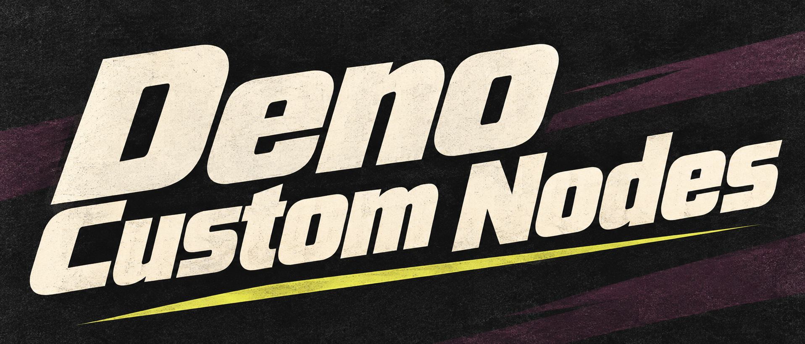

이미지 불러오기·크기 조절, 영상 비교, 모델 워크플로 구성을 돕는 실용 ComfyUI 노드 모음입니다.

- **미디어 준비:** 이미지 로더, Resize Box, 이미지·영상 비교 도구.
- **생성 워크플로 구성:** Ideogram, MiniMax H3, LTX, RTX 영상 도구, 로컬 LLM 연동.
- **캔버스 정리:** Visual Fold와 선택형 Floating Tools.

[빠른 시작](#quick-start) · [노드 목록](#included-nodes) · [브라우저 도구](#web-tools) · [최신 릴리스](https://github.com/Deno2026/comfyui-deno-custom-nodes/releases/latest) · [GPL-3.0-only](#license)

## Quick Start

ComfyUI가 설치되어 정상 실행되는 환경에서 시작하세요.

1. **ComfyUI Manager**에서 `Deno Custom Nodes`를 검색해 설치합니다.
2. ComfyUI를 다시 시작하고 브라우저 페이지를 새로고침합니다.
3. 캔버스의 빈 곳을 더블클릭하고 `(Deno) Resize Box`를 검색해 추가합니다.
4. 기본 `Load Image` 노드를 추가하고 이미지를 선택합니다. 이 노드를 Resize Box에 연결하고, Resize Box의 `image` 출력을 `Preview Image`에 연결합니다. 크기를 선택한 뒤 실행하면 조절된 이미지를 확인할 수 있습니다.

이 첫 예제에는 생성 모델이 필요하지 않습니다. 모델별 노드와 RTX 노드의 추가 요구사항은 아래 설명을 확인하세요. Manager를 사용하지 않는 경우에는 [수동 설치](#install)를 참고하세요.

### 다음 작업 선택

- **미디어 준비·비교:** [Resize Box](#deno-resize-box), [Multi Image Loader](#deno-multi-image-loader), [Video Compare](#deno-video-compare)에서 시작하세요.
- **사진·영상 마무리:** 최종 크기 조절 뒤, 저장 전에 [Film Grain](#deno-film-grain)을 연결하세요.
- **모델로 생성:** [Ideogram Director](#deno-ideogram-director), [MiniMax H3](#deno-minimax-h3-multi-reference-image-loader), [LTX Model Loader](#deno-ltx-model-loader)의 요구사항과 예제를 확인하세요.
- **정리·브라우저 작업:** [Visual Fold](#deno-visual-fold), [Floating Tools](#deno-floating-tools), 설치 없는 [웹 도구](#web-tools)를 사용하세요.

대부분의 Deno 노드는 ComfyUI 캔버스를 벗어나지 않고 도움말을 볼 수 있는 작은 초록색 `i` 버튼을 포함합니다. 새 Deno Custom Nodes 버전이 있으면 버튼이 노란색으로 바뀌고 작은 `!` 배지가 표시됩니다.

## Web Tools

브라우저에서 바로 실행할 수 있는 도구입니다.

- [Deno Video Compare](https://deno2026.github.io/comfyui-deno-custom-nodes/video-compare/) - 두 렌더 영상을 슬라이더, 나란히 보기, 차이 보기, 토글 방식으로 비교합니다.
- [Deno Video to GIF/WebP](https://deno2026.github.io/comfyui-deno-custom-nodes/video-to-gif/) - 짧은 영상을 자르고, 크롭하고, 리사이즈해서 GIF 또는 작은 WebP로 내보냅니다.
- [Deno 디스코드용 영상 / 이미지 압축](https://deno2026.github.io/comfyui-deno-custom-nodes/video-to-discord/) - 영상이나 이미지를 줄여 가능하면 10MB 이하 디스코드용 파일로 저장합니다.

## Deno Visual Fold

[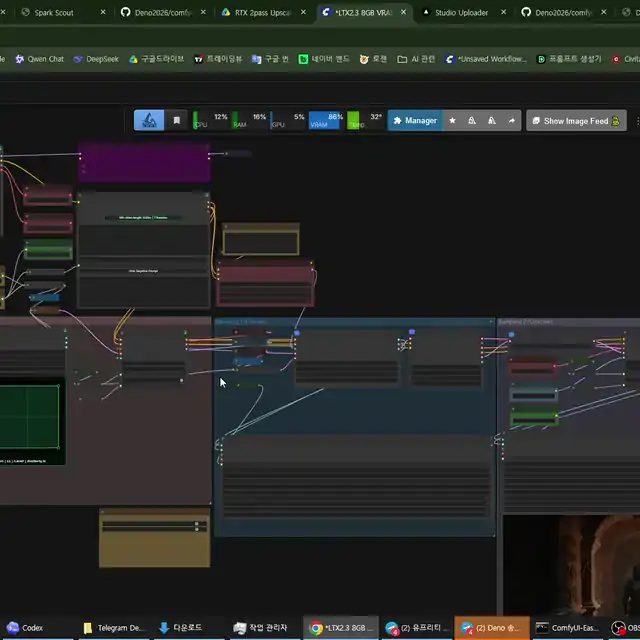](images/deno-visual-fold.webp)

미리보기를 클릭하면 전체 데모를 볼 수 있습니다.

Deno Visual Fold는 큰 ComfyUI 그래프를 시각적으로 정리하는 기능입니다. 여러 노드 또는 그룹을 접어도 워크플로우 로직은 바뀌지 않습니다.

두 개 이상의 노드를 선택하면 ComfyUI의 기본 선택 툴바에 초록색 `Fold` 버튼이 나타납니다. 누르면 선택한 노드가 하나의 시각적 그룹처럼 접히고, `Unfold`로 다시 펼칠 수 있습니다. 일반 ComfyUI 그룹 하나를 선택하면 `Fold Group`으로 그룹 안의 노드를 접을 수 있고, 여러 그룹을 선택하면 정렬 버튼도 함께 나타납니다.

ComfyUI Subgraph는 노드를 하위 그래프로 이동시키는 기능입니다. Visual Fold는 그와 달리 정리 목적의 시각 기능입니다. `Get` / `Set` 노드나 부모-자식 그래프 구조를 그대로 보이게 두고 싶을 때 유용합니다.

## Deno Floating Tools

Deno Floating Tools는 `Settings > DENO > Tools`에서 직접 켜는 선택 기능이며 기본값은 꺼짐입니다.

활성화하면 ComfyUI 화면에 작은 Deno 아이콘이 나타납니다. 이 패널에서 ComfyUI 기본 메모리 정리 endpoint를 이용해 VRAM을 비우고, 현재 ComfyUI Stable과 최신 공개 버전을 읽기 전용으로 비교하며, 실행 실패 시 GPT/Gemini에 전달할 Error Help 보고서를 열 수 있습니다.

Error Help는 현재 워크플로, Python 환경과 패키지 버전, GPU 정보, 최근 traceback·로그 문맥, 커스텀 노드 요약을 먼저 별도 창에 보여줍니다. 사용자가 `Copy Report`를 눌렀을 때만 복사하며 token, cookie, password, private key, URL credential처럼 흔한 비밀 값은 복사 전에 가립니다.

Floating Tools 자체는 설치, 업데이트, 재시작, 복구 또는 워크플로 수정을 실행하지 않습니다.

## Deno Resource Monitor

Deno Resource Monitor는 ComfyUI 상단에 CPU, RAM, GPU, VRAM, GPU 온도와 모델·캐시 정리 버튼을 제공합니다. 수치 표시와 정리 버튼은 **서로 독립적**이며, `Settings > DENO > Tools > Resource Monitor`에서 각각 기본값인 `Auto`로 동작합니다.

계기판은 Crystools의 기본 가로형 외관과 맞췄습니다. 각 칸은 60 × 30 px, 간격은 5 px이며 항목명·숫자의 위치와 색상, 초록에서 빨강으로 바뀌는 온도 막대도 동일한 기준을 사용합니다. DENO 정리 버튼은 옆에 유지하고, 좁은 창에서는 기존 도구를 옮기지 않고 DENO만 별도 줄에 표시합니다.

| 기존 환경 | Auto 수치 표시 | Auto 정리 버튼 |
| --- | --- | --- |
| Crystools와 기존 전체 정리 버튼이 보임 | Crystools 그대로 유지 | 기존 버튼 그대로 유지 |
| Crystools는 있고 전체 정리 버튼은 없음 | Crystools 그대로 유지 | DENO 버튼만 추가 |
| Crystools는 없고 기존 전체 정리 버튼은 보임 | DENO 계기판 추가 | DENO 버튼 추가, 기존 버튼도 그대로 유지 |
| 둘 다 없음 | DENO 계기판 추가 | DENO 버튼 추가 |

Crystools가 없으면 다른 정리 버튼 유무와 관계없이 **DENO 계기판과 정리 버튼을 모두 표시하는 것이 기본**입니다. Crystools가 있을 때만 기존 전체 정리 버튼을 우선하고, 그 버튼이 없으면 DENO 버튼으로 보충합니다. 사용자가 명시적으로 선택한 `Off`는 그대로 존중합니다.

Auto는 다른 확장의 설정·요소·클릭 동작을 바꾸지 않습니다. 사용자가 일부러 숨긴 Crystools도 존중하며, Crystools 확장이 등록돼 있으면 DENO 하드웨어 조회를 시작하지 않습니다. 확장 확인에 실패한 경우에도 중복 방지를 위해 계기판을 켜지 않습니다. 데스크탑·포터블 이름이나 Manager 실행 옵션만으로 추측하지 않고, Crystools 유무를 먼저 판단한 뒤 실제 상단 버튼을 확인합니다. 모델만 해제하는 버튼은 모델·실행 캐시를 함께 비우는 버튼과 구분합니다.

`DENO resource monitor`는 `Auto / DENO / Off`를 제공합니다. `DENO`는 사용자가 명시적으로 Crystools 계기판 대신 DENO를 선택하는 옵션입니다. `DENO memory cleanup button`은 별도로 `Auto / Show / Off`를 제공합니다. 두 기능을 모두 끄려면 각각 `Off`로 설정하세요. 정리는 ComfyUI 기본 `/free` 요청을 사용하며, 생성·대기 큐가 있거나 큐 상태를 확인할 수 없거나 ComfyUI에서 수동 메모리 해제를 금지한 경우 실행하지 않습니다. 알림은 정리 요청 접수를 뜻하며 특정 VRAM 감소량을 보장하지 않습니다. 모델 파일이나 디스크 캐시는 삭제하지 않습니다.

현재 GPU 수치는 NVIDIA NVML을 사용합니다. 지원되지 않거나 읽을 수 없는 GPU 항목은 숨기고 CPU·RAM과 정리 버튼은 사용할 수 있습니다. 여러 GPU가 있으면 NVIDIA GPU index 0(없으면 첫 번째로 확인된 GPU)을 표시하므로 생성에 선택한 GPU와 다를 수 있습니다. 수치는 탭이 보일 때만 조회하고 상시 방송 스레드는 실행하지 않습니다. 정리 버튼만 표시되는 상태에서는 DENO 하드웨어 조회가 발생하지 않습니다. 리소스 항목과 NVIDIA 측정 방식은 MIT 라이선스의 ComfyUI-Crystools를 바탕으로 조정했으며 고지는 [Third-Party Notices](../THIRD_PARTY_NOTICES.md)에 있습니다.

왼쪽 여섯 점 손잡이를 끌면 DENO 표시를 창 안에서 자유롭게 옮길 수 있습니다. 끄는 동안 원래 상단 자리에 **상단에 고정** 영역이 나타나며, 그곳에 놓으면 다시 붙습니다. 분리된 표시의 회전 버튼을 누르면 숫자와 항목명을 똑바로 유지하면서 가로형·세로형으로 전환합니다. 위치와 방향은 이 브라우저에 저장됩니다. `Settings > DENO > Tools > Resource Monitor`의 `DENO resource monitor placement`에서 `Top / Floating`을 선택할 수도 있으며, 위치를 찾기 어려울 때 `Top`으로 되돌리면 됩니다.

세로형은 폭 44px의 얇은 띠 형태입니다. 작은 항목명 아래에 자릿수 폭이 일정한 수치를 가운데 정렬하고, 단위는 작게 구분해 표시합니다. 얇은 사용량 선과 손잡이·정리·회전 버튼도 한 열로 배치해 캔버스 옆에 붙여 두기 편하게 구성했습니다.

`Top`에서는 창이 좁거나 상단 공간이 부족하면 DENO 표시만 그 아래 별도 줄로 내려갑니다. 기존 버튼은 그대로 두며, 창을 넓혀 공간이 생기면 DENO도 다시 상단에 붙습니다. `Floating`에서는 선택한 위치를 유지하고 창 크기가 바뀌어도 표시가 창 안에 들어오도록 조정합니다. 상단에 붙일 때는 항상 가로형으로 표시합니다.

## Included Nodes

### `(Deno) Ideogram Director`

[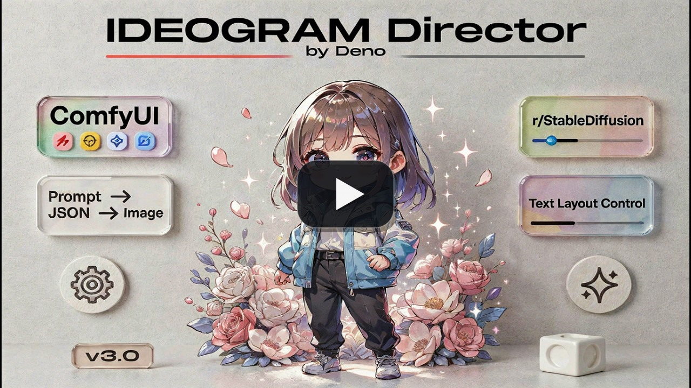](https://youtu.be/Z8s27skkIDM)

Ideogram 4용 구조화 JSON 프롬프트와 bbox 배치를 ComfyUI 캔버스 안에서 편집하는 시각형 프롬프트 빌더입니다.

주요 기능:

- 캔버스 위에서 bbox 영역을 직접 그리고 편집
- 개별 bbox 요소를 삭제하거나 순서를 바꾸지 않고 임시로 비활성화
- bbox를 더블클릭하면 포인터 옆에서 편집하고, 겹친 영역은 `Alt`+클릭을 반복해 아래쪽 bbox까지 순환 선택
- Local LLM Loader 또는 다른 STRING 출력에서 JSON 프롬프트 가져오기
- Summary와 Background STRING 입력을 연결하면 해당 실행에서 두 보드 값을 덮어쓰며, 연결하지 않으면 저장된 보드 내용을 그대로 사용
- 기존 보드가 있을 때 새 JSON으로 교체할지 먼저 확인
- 잘못된 JSON은 명확하게 거절하고 깨진 프롬프트를 샘플러로 보내지 않음
- 스타일/레이아웃 프리셋 갤러리와 가벼운 미리보기 썸네일
- Language 보기로 장면 설명을 원하는 언어로 읽고 수정할 수 있으며, 최종 출력은 생성용 영어로 유지. 실제 TEXT 박스 단어는 간판, 로고, 제목처럼 그대로 보존
- 출력: `prompt`, `width`, `height`, `seed`, `bboxes`
- 기존 `bboxes` 출력은 일반 `BBOX` 소비자와 `Ideogram4_MultiLora_BoundingBoxNode_Fedor` 같은 `BOUNDING_BOX` 입력에 모두 연결할 수 있으며, 저장 필드를 추가하지 않고 Director의 활성 박스 수에 맞춰 해당 노드의 region 행 수를 동기화합니다. 상대 노드는 현재 박스 ID가 아니라 개수만 동기화하므로 중간 박스를 삭제하거나 순서를 바꾼 뒤에는 LoRA 행 배치를 다시 확인하세요

### `(Deno) Resize Box`

ComfyUI용 해상도 도우미와 이미지 리사이즈 노드입니다.

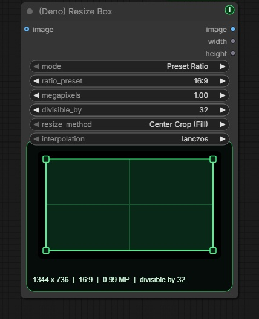

주요 기능: 비율 프리셋, 직접 입력, 메가픽셀 기반 계산, `divisible_by` 정렬, Center Crop·드래그 Crop Position·Fit 리사이즈, 노드 안 비율 미리보기, Crop Position에서 연결된 원본을 반투명하게 실제 출력 프레임 안에만 표시하고 이미지 드래그로 보일 위치 조정, `image`, `width`, `height` 출력.

### `(Deno) Multi Image Loader`

배치 가이드 워크플로우에 맞춘 다중 이미지 로더입니다.

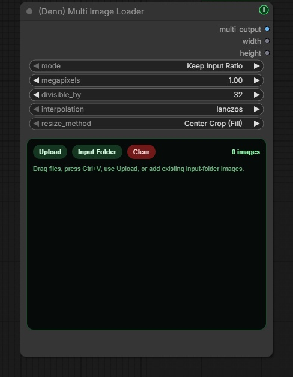

주요 기능: 고정 높이 갤러리, 드래그 정렬, 업로드, 드래그 앤 드롭, 이미지 붙여넣기, ComfyUI `input` 폴더 탐색, 중첩 폴더 이미지 추가, 최신순 정렬, 비율 유지/프리셋/직접 입력 리사이즈, `multi_output`, `width`, `height` 출력. 썸네일을 클릭하면 이미지를 켜거나 끌 수 있습니다. 꺼진 이미지는 출력에서 제외되고, 켜진 이미지에만 현재 카드 순서대로 1, 2, 3… 번호가 즉시 표시됩니다. 활성 이미지 수와 연결된 시퀀서의 이미지 수도 함께 갱신됩니다. 카드 순서와 꺼짐 상태는 워크플로우에 저장되며, 실행하려면 한 장 이상 켜야 합니다. 보안을 위해 `input` 폴더 밖으로 나가는 외부 심볼릭 링크·정션은 건너뛰며, 이런 소스는 `(Deno) Advanced Image Source Loader`의 External Folder를 사용합니다.

### `(Deno) MiniMax H3 Multi Reference Image Loader`

ComfyUI 순정 MiniMax H3 Reference to Video용 한 줄 연결 다중 참조 이미지 로더입니다.

이미지 갤러리 아래의 접이식 오디오 목록에서 최대 3개 파일을 함께 관리할 수 있습니다. `오디오 추가`, Input 폴더 또는 파일 드롭으로 넣고, 실제 파형·길이와 미리듣기로 확인합니다. 미리듣기와 생성에 포함하는 `사용` 버튼은 별개이며, 영상 파일은 이 로더에서 받지 않습니다.

오디오를 등록하면 기존 이미지 출력 두 개 뒤에 파일별 `AUDIO` 출력이 추가됩니다. 각 출력을 `(Deno) MiniMax H3 Reference to Video`의 단독 오디오 입력에 연결하고, 실제 소리를 참조하려면 `audio_vae`도 연결하세요. 켜진 카드에만 현재 순서대로 `<Audio 1>`, `<Audio 2>` 번호가 붙습니다. 예를 들어 3개 중 앞의 두 파일을 끄면 세 번째 파일이 화면과 실제 참조 모두 `<Audio 1>`이 됩니다. 꺼진 파일은 위치와 연결을 저장한 채 실행에서 제외됩니다. 순서를 바꿔도 선은 같은 파일을 가리키며, 삭제하면 해당 파일의 오디오 연결만 제거합니다. 오디오만 불러와 사용하는 것도 가능합니다.

오디오를 추가하면 노드 높이가 자동으로 늘어나 모든 오디오 행이 내부 스크롤 없이 보입니다. 파일을 삭제하거나 오디오 목록을 접으면 해당 공간이 줄어듭니다. 직접 늘린 높이 여백과 너비는 유지하며, 예전에 작게 저장한 워크플로우도 다시 열면 저장된 오디오 행이 보이도록 확장됩니다.

번호가 실제 H3 참조와 일치하려면 같은 DENO 로더의 켜진 오디오를 같은 DENO H3 노드에 모두 연결하세요. 연결하지 않을 파일은 끄면 됩니다. 이 로더의 오디오를 사용할 때는 해당 H3 노드의 다른 단독 오디오 소스와 참조 영상의 사운드트랙을 분리해야 합니다. 번호가 충돌하는 연결은 안내 후 실패하며, 다른 오디오 로더만 사용하는 기존 워크플로우는 순정 동작을 유지합니다.

오디오는 ComfyUI input 폴더에서 읽습니다. WAV, MP3, FLAC, OGG/OGA, Opus, M4A, AAC, AIF, AIFF를 지원하며 실제 디코딩 가능 여부는 설치된 PyAV가 결정합니다. 파일당 256 MiB, 디코딩한 PCM 128 MiB, CPU 디코딩 30초로 제한합니다. 미리듣기 정보를 읽지 못하면 해당 행의 재시도로 복구할 수 있고, 저장된 파일과 연결은 유지합니다.

기존 `(Deno) Multi Image Loader`와 동일한 업로드, 붙여넣기, 드래그 앤 드롭, Input Folder, 카드 정렬, 삭제 사용감을 유지합니다. 최대 9장을 전용 `ref_images` 소켓 하나로 전달하며, 각 이미지의 디코딩된 원본 크기와 비율을 리사이즈·크롭·패딩 없이 개별 보존합니다. 미리보기 카드도 각 원본 비율을 그대로 사용하므로 가로·세로 이미지가 섞여 있어도 잘림 없이 표시됩니다. 썸네일을 클릭하면 이미지를 켜거나 끌 수 있고, 켜진 카드에만 순서대로 번호가 즉시 붙어 `<Picture 1>`, `<Picture 2>`에 대응합니다. 꺼진 이미지는 두 출력 모두에서 제외되며, 카드 위치와 꺼짐 상태는 워크플로우에 저장됩니다. 꺼진 이미지 카드도 최대 9장의 갤러리 공간에 포함되며, 실행하려면 이미지 또는 오디오 참조를 하나 이상 켜야 합니다. 같은 이미지들은 별도의 `image_list` 출력으로도 제공되어 `(Deno) Local LLM Loader`의 `image` 입력에 바로 연결할 수 있습니다.

함께 제공되는 `(Deno) MiniMax H3 Reference to Video`는 이미지 입력만 한 단자로 바꾸고, 참조 비디오·비디오 오디오·단독 오디오의 순정 Autogrow 입력은 그대로 유지합니다. 일반 `IMAGE` 배치는 모든 이미지가 같은 가로·세로 크기여야 하므로 혼합 원본 크기 보존에는 사용할 수 없습니다. 추가된 `image_list`는 동일 크기 배치가 아니라 각 원본을 분리해 유지하는 리스트 출력입니다. H3 내부의 `ref_image_size` 처리는 실행 시 비율을 유지한 채 참조 이미지를 축소할 수 있습니다.

H3의 VAE 선택 입력을 지원하는 ComfyUI에서는 `(Deno) MiniMax H3 Reference to Video`의 `vae` 또는 `audio_vae`를 연결하지 않아도 실행할 수 있습니다. 둘 다 연결하면 기존 참조 인코딩 방식이 유지됩니다.

- `vae`를 생략하면 참조 이미지·영상은 텍스트/시각 인코더에 전달되지만, VAE로 인코딩한 참조 잠재값은 전달되지 않습니다.
- `audio_vae`를 생략하면 참조 음성의 실제 소리는 인코딩되지 않습니다. 텍스트 인코더에는 음성 파형 대신 `<Audio 1>` 같은 표시만 남으므로, 목소리나 소리를 참조하려면 `audio_vae`를 연결하세요. 이 입력을 생략하는 것은 생성 오디오를 끄는 기능이 아닙니다.

참조 영상에 딸린 오디오(`ref_video_audio`)는 `vae`와 `audio_vae`를 모두 연결해야 참조 영상과 실제 소리가 인코딩되며, 단독 참조 오디오(`ref_audio`)는 `audio_vae`만 연결해도 됩니다.

이 선택은 이 노드의 참조 인코딩에만 적용됩니다. 뒤쪽 영상·오디오 디코딩 노드에 필요한 VAE 연결은 유지하세요. 순정 H3가 두 VAE를 필수로 요구하는 이전 ComfyUI에서는 여전히 둘 다 연결해야 하며, 선택 입력을 사용하려면 ComfyUI를 업데이트해야 합니다.

이 두 MiniMax H3 노드는 ComfyUI 0.30.0 이상이 필요합니다. 순정 H3 전체 구성에서 여러 `Load Image` 노드만 Deno 한 줄 로더로 교체한 [MiniMax H3 다중 참조 예제 워크플로](workflows/minimax-h3-multi-reference.json)를 함께 제공합니다.

### `(Deno) MiniMax H3 Acc LoRA Loader`

Alibaba PAI가 공개한 공식 [MiniMax-H3-Acc-LoRAs](https://huggingface.co/alibaba-pai/MiniMax-H3-Acc-LoRAs)를 변환하거나 복사본을 만들지 않고 직접 불러옵니다.

1. 공식 FL2VA 또는 Ref2VA `Acc-8Step.safetensors`를 내려받아 기존 `ComfyUI/models/loras/` 또는 전용 `ComfyUI/models/minimax_h3_acc_loras/` 폴더 중 한 곳에 넣습니다.
2. 계열이 맞는 순정 MiniMax H3 diffusion model을 `model`에 연결합니다. 완전판과 Comfy-Org `*_pruned_*` 모델을 모두 연결할 수 있습니다.
3. FL2VA/T2VA 모델에는 FL2VA Acc-LoRA, Ref2VA 모델에는 Ref2VA Acc-LoRA를 선택합니다.
4. 노드의 단일 `model` 출력을 기존 guider 경로에 연결합니다.
5. ComfyUI 순정 샘플링 노드에서 `BasicScheduler: simple, steps: 8`, `KSamplerSelect: euler`로 시작해 `SamplerCustomAdvanced`에 연결하는 구성을 권장합니다.

노드가 일반 LoRA 가중치와 체크포인트의 32개 시간 구간별 PDD 출력 헤드를 함께 적용합니다. 샘플링할 때 실제 sigma 경계를 읽고 해당 구간에 필요한 PDD 헤드를 자동으로 다시 묶으므로 sampler, scheduler, step은 ComfyUI 순정 노드에서 조절할 수 있습니다. 공식 학습·권장 설정은 Simple/Euler 8-step입니다. 사용자는 로더를 바꾸지 않고 Simple Scheduler의 4~12 step을 선택할 수 있으며, 그 밖의 내림차순 스케줄과 레이턴트 업스케일용 분할 sigma 패스도 실험할 수 있습니다. 다만 공식값 밖의 설정이 화질 향상을 보장하지는 않습니다. LoRA strength는 `1.0`, 영상/오디오 sigma shift는 순정 값인 `12.0 / 3.0`을 유지하세요.

완전판 non-pruned 모델은 ComfyUI 순정 INT8 모델을 포함해 전체 어댑터를 일반 양자화 대응 LoRA 경로로 적용합니다. 곡선 압축된 pruned 모델을 연결하면 `models/diffusion_models/`에 이미 있는 같은 계열의 non-pruned MiniMax H3 체크포인트를 자동으로 찾습니다. 그 파일 전체를 올리지 않고 작은 FP32 time-embedder 부분만 읽어, AdaLN LoRA 50개를 pruned 8차원 곡선에 맞게 메모리에서 변환합니다. 맞는 full 체크포인트가 없더라도 실행을 막지 않습니다. 경고를 남기고 그 50개만 건너뛴 뒤 나머지 LoRA와 PDD 헤드는 모두 적용합니다.

v0.7.92~v0.7.94의 3출력 버전으로 저장한 표준 활성 UI 워크플로우는 ComfyUI 캔버스에서 열 때 자동 변환됩니다. 기존 model 연결은 그대로 두고, 예전 sampler와 sigmas 연결을 각각 사용자가 수정할 수 있는 순정 `KSamplerSelect: euler`와 `BasicScheduler: simple, steps: 8` 노드로 옮깁니다. 열린 뒤 UI 워크플로우를 한 번 저장하세요. 현재 단일 출력 워크플로우는 건드리지 않습니다. mute/bypass 상태, 정확히 판별할 수 없는 사용자 변경형, 손상된 그래프도 임의로 바꾸지 않습니다. raw API prompt JSON에는 이 frontend 변환이 실행되지 않으므로 변환된 UI 워크플로우에서 다시 API 형식으로 내보내야 합니다. 예전 sampler/sigmas 링크가 이미 사라진 채 저장된 파일은 순정 노드를 수동으로 다시 연결해야 합니다.

Deno Custom Nodes에는 LoRA 가중치와 워크플로우를 포함하지 않습니다. 가중치는 Alibaba 저장소에서 각자 내려받고, ComfyUI 순정 워크플로우를 직접 구성하거나 기존 그래프에 연결해 사용합니다.

### MiniMax H3 R2V 오디오 레퍼런스 워크플로

[초보자용 오디오 레퍼런스 워크플로](workflows/minimax-h3-r2v-audio-reference.json)는 ComfyUI 순정 MiniMax H3 오디오 레퍼런스 경로를 유지하면서 자동 프롬프트 연출 단계를 더합니다.

- `(Deno) Audio Transcript`: 로컬 OpenAI Whisper로 가사·대사, 구간 시간, 감지 언어, 신뢰도 요약을 만듭니다. 사용자가 직접 입력한 가사·대사가 있으면 그 문구를 최우선으로 사용합니다.
- `(Deno) Audio Analysis Finalizer`: ComfyUI `TextGenerate` 결과에서 문서화된 음향 분석 항목만 남기고, 선택에 따라 분석용 CLIP 모델을 실행 후 내립니다.
- `(Deno) Local LLM Loader`: 선택형 `audio_context` STRING 입력으로 받아쓰기와 음향 보고서를 받습니다. 원본 AUDIO를 로컬 LLM에 직접 보내지 않으며, 자동 분석 결과는 지시가 아니라 참고 데이터로 취급합니다.
- 선택한 원본 오디오 구간은 H3의 `<Audio 1>` 레퍼런스이면서 최종 MP4에 그대로 들어가는 소리입니다. 이 워크플로에서는 H3 내부 생성음을 디코딩하지 않습니다.

필수 준비:

- MiniMax H3와 오디오 입력 `TextGenerate`를 지원하는 최신 ComfyUI Stable
- `Load Audio (Upload)`용 [ComfyUI-VideoHelperSuite](https://github.com/Kosinkadink/ComfyUI-VideoHelperSuite)
- 음향 분석용 `gemma4_e4b_it_fp8_scaled.safetensors`를 `ComfyUI/models/text_encoders/`에 저장
- 최종 프롬프트 감독용 LM Studio의 `google/gemma-4-12b-qat` 모델과 실행 중인 Local Server

`openai-whisper`는 노드 의존성으로 설치됩니다. 선택한 Whisper 체크포인트는 `(Deno) Audio Transcript` 첫 실행 때 OpenAI 공식 주소에서 내려받고 공식 Whisper 로더가 체크섬을 검증하며, `ComfyUI/models/stt/whisper/`에 캐시됩니다.

### `(Deno) Text Encoder Unload`

일반적인 positive-only 또는 positive/negative 프롬프트 흐름에 직접 넣는 선택형 VRAM 장벽 노드입니다.

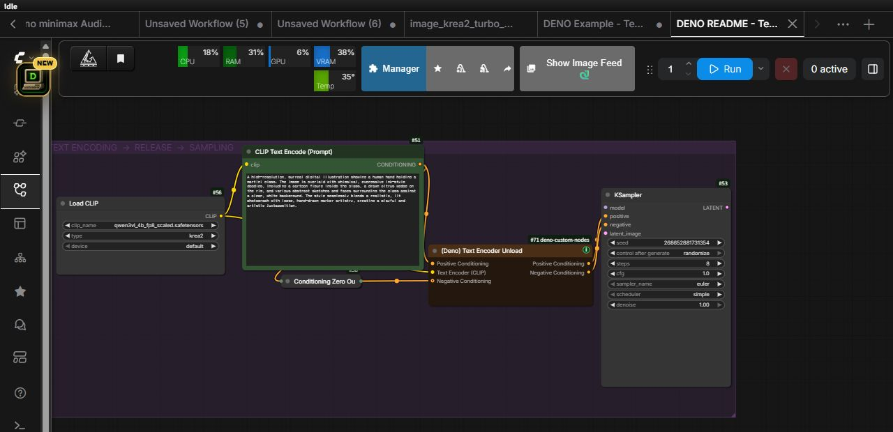

- positive conditioning을 필수 `Positive Conditioning`에 연결하면 같은 객체가 그대로 출력됩니다.
- 실제 negative prompt의 인코딩 결과나 `Conditioning Zero Out`은 선택 `Negative Conditioning`에 연결하면 그대로 출력됩니다.
- positive-only guider 흐름에서는 `Negative Conditioning`을 비워 둡니다.
- 위쪽 Text Encode가 실제 사용한 정확한 CLIP을 `Text Encoder (CLIP)`에 연결합니다.
- 연결한 CLIP/text encoder와 clone, 그 관리 구성요소만 ComfyUI 모델 관리 경로로 내리며 diffusion model, VAE, ControlNet을 전역으로 내리지 않습니다.
- ComfyUI의 일반 입력 캐시를 따르므로 conditioning이나 CLIP 경로가 바뀌면 unload를 다시 실행하고, 입력이 같은 프리뷰 샘플링은 캐시를 재사용할 수 있습니다.

Dynamic VRAM은 메모리 압력에 따라 weight를 옮기므로 text encoder 일부가 의도적으로 남을 수 있습니다. 이 노드는 그 인코더를 확실히 내릴 시점을 직접 만드는 기능이지만, ComfyUI 프로세스 전체를 `0 MiB`로 만들지는 않습니다. CUDA context, conditioning tensor, 다른 모델과 커스텀 노드 할당, 다른 앱의 VRAM은 별개입니다. 또한 샘플링 품질 자체를 높이는 기능이 아니라, model offload나 OOM을 줄일 VRAM 여유를 만드는 기능입니다. 다음 text encode에서는 모델을 다시 불러오므로 더 느릴 수 있고, `--gpu-only`에서는 인코더를 VRAM 밖으로 옮길 수 없습니다.

### `(Deno) Advanced Image Source Loader`

외부 폴더, 로컬 경로, 웹 이미지 URL, 혼합 크기 이미지 리스트가 필요한 워크플로우용 고급 이미지 소스 로더입니다.

웹 이미지 URL은 공개 주소로 직접 HTTP(S) 연결합니다. 내부 주소와 환경 프록시를 통한 연결은 지원하지 않습니다.

URL 썸네일은 실행과 같은 서버 조회 경로로 읽습니다. Windows 탐색기의 ‘경로로 복사’처럼 큰따옴표가 붙은 경로도 미리보기에서 인식합니다. 썸네일이 나오지 않으면 `Refresh previews`로 다시 읽을 수 있으며, 실패한 카드에 마우스를 올리면 안내가 나옵니다. 새로고침은 소스·켜짐 상태·순서를 바꾸지 않습니다. 외부 로컬 파일의 미리보기는 ComfyUI에 localhost로 접속했을 때 사용할 수 있습니다.

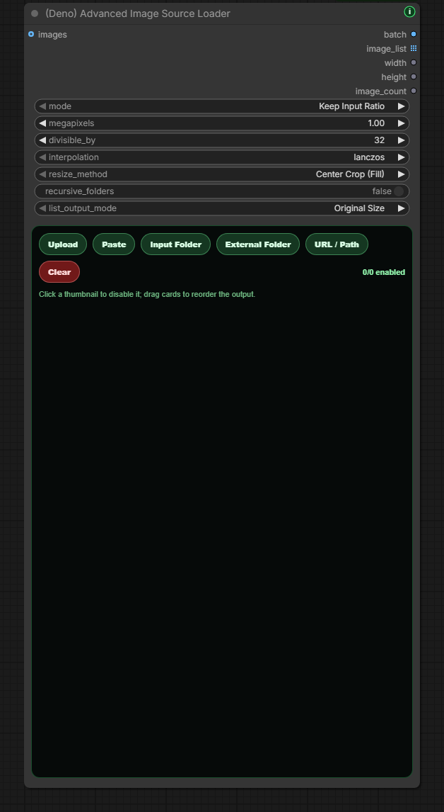

주요 기능: ComfyUI `input` 폴더와 외부 로컬 폴더 지원, URL/Path 입력, 업로드와 붙여넣기, 썸네일 enable/disable, 드래그 정렬, masonry 스타일 갤러리, 재귀 폴더 로드, 배치 텐서와 `image_list` 출력. 비활성 이미지는 삭제하지 않은 채 알아볼 수 있는 밝기로 유지되고, 켜진 카드에만 현재 순서대로 번호가 즉시 갱신됩니다. 갤러리는 기존 캔버스와 Nodes 2.0에서 노드 높이에 맞춰 유동적으로 배치됩니다.

### `(Deno) Film Grain`

사진 또는 영상의 `IMAGE` 프레임 배치에 CPU로 단색 필름 그레인을 더합니다. 모델이나 추가 패키지 설치 없이 사용할 수 있습니다. 기본값은 미세·굵은 입자 75:25 혼합, 강한 입자의 부드러운 제한, 밝은 끝·깊은 검정에서의 강도 감소입니다. 입자 무늬에만 퍼짐을 적용하므로 원본 사진의 디테일은 흐리지 않습니다.

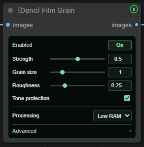

노드 표기는 ComfyUI의 언어 설정과 관계없이 **영어가 기본**이며, 다른 Deno 노드와 같은 작은 글자·얇은 녹색 조절부를 사용합니다. 기본 화면에는 **Strength·Grain size·Roughness·Tone protection**과 **Processing** 선택지만 표시합니다. **Strength는 0~1**이며, 선택한 기본값 **`0.50`은 기존 코드 강도 `6`**, 최대 **`1.00`은 강도 `12`**에 대응합니다. **Low RAM**은 한 프레임씩 처리하는 기본값, **Balanced**는 2프레임, **Faster**는 4프레임을 함께 처리합니다. 그레인 결과는 같으며, 더 빠른 처리는 임시 RAM을 더 사용할 수 있습니다. **Advanced → Frames at once**에서 정확한 1~4 값을 지정할 수 있고, 이전 3프레임 설정도 그대로 유지됩니다. 그레인은 CPU에서 처리하며 생성 단계의 VRAM이나 저장 영상의 길이·파일 수를 바꾸지 않습니다. 출력 영상 전체를 담는 RAM은 별도로 필요합니다. 자세한 내용은 Processing 툴팁에서 확인하세요. 입자 번호와 영상 구간 설정도 Advanced에 있습니다.

기존 워크플로의 값과 연결은 유지합니다. 저장된 강도가 새 슬라이더 범위보다 높아도 직접 조절하기 전에는 바꾸지 않습니다. 연결된 매개변수 입력은 기존 단위로 값을 전달하며, 해당 조절부는 비활성화되고 순정 입력 단자가 표시됩니다.

새 노드는 **Advanced → Grain scale → Match resolution**이 기본입니다. 선택한 **2752×1536 샘플의 짧은 변 1536px**를 기준으로, 입력과 같은 비율의 그레인 무늬를 만든 뒤 **단색 그레인만** 입력 크기에 맞춥니다. 강도와 미세·굵은 입자 혼합비는 그대로이며 기준 2752×1536에서는 원래 프리셋과 결과가 완전히 같습니다. 기존에 저장한 워크플로는 **Fixed pixels**로 이전 결과를 유지합니다. 자동 보정을 사용하려면 Match resolution으로 바꾸세요. 이전 API에서 `grain_scale_mode`를 생략한 경우도 기존 픽셀 기준으로 처리합니다.

작은 프레임에서는 미세 입자를 필터링해 담고, 줄어든 픽셀별 분산을 다시 증폭하지 않습니다. 다른 해상도를 같은 화면 크기로 볼 때 입자 크기와 보이는 세기를 더 일관되게 맞추기 위한 방식입니다. 아주 미세한 입자·영상 압축·플레이어 축소 방식에 따른 차이는 남을 수 있습니다. 기준 그리드가 16,777,216픽셀을 넘는 극단적으로 길쭉한 입력은 할당 전에 명확히 실패하며 Fixed pixels를 사용할 수 있습니다.

최종 이미지 처리 뒤에 연결하세요.

- 사진: 최종 이미지 / 크기 조절 → **Film Grain** → **Save Image**.
- 순정 영상: 디코딩된 프레임 / 최종 크기 조절 → **Film Grain** → **Create Video** → **Save Video**. 원래 오디오와 FPS는 Create Video에 유지하세요.
- Video Helper Suite: 디코딩된 프레임 → **Film Grain** → **Video Combine**. 기존 오디오·FPS 설정을 유지하세요.

| 설정 | 기본값 | 용도 |
| --- | --- | --- |
| `enabled` | 켜짐 | 끄면 입력을 복사하지 않고 그대로 전달합니다. |
| `amount` | `6` | 저장·API의 8비트 밝기 기준 강도입니다. 패널 `0.5`는 강도 `6`, `1`은 강도 `12`이며 `0`이면 그대로 전달합니다. 기존 워크플로 보존을 위해 backend의 이전 범위는 유지합니다. |
| `grain_size` | `1` | Match resolution에서는 화면에 대한 상대적 입자 크기입니다. 1536px 기준의 퍼짐은 `0.45 / 1.15 px`이며 Fixed pixels에서는 입력 해상도에 그대로 적용합니다. |
| `roughness` | `0.25` | 굵은 입자의 비중입니다. 기본 혼합비는 미세·굵은 입자 `75:25`입니다. |
| `tone_weighted` | 켜짐 | 약간 어두운 중간톤에 질감을 주고 밝은 끝·깊은 검정에서는 줄입니다. |
| `temporal_mode` | `changing` | 프레임마다 무늬를 바꿉니다. `fixed`는 같은 무늬로 비교할 때 사용합니다. |
| `seed` | `2026100701` | 같은 입자와 프레임 순서를 재현합니다. |
| `frame_offset` | `0` | 영상을 나누어 처리할 때 해당 구간의 첫 프레임 번호를 입력합니다. |
| `processing_batch_size` | `1` | CPU에서 한 번에 처리할 프레임 수입니다. 1~4를 지원하며 1이 임시 RAM을 가장 적게 사용합니다. |
| `grain_scale_mode` | 새 노드 `resolution` | Match resolution은 기준 입자를 프레임 크기에 맞춥니다. `pixels`는 기존 픽셀 기준이며 이전 API에서 생략한 경우도 `pixels`입니다. |

같은 입자로 설정을 비교하려면 `seed`를 유지하고, ComfyUI의 시드 **생성 후 제어**를 `fixed`로 두세요.

선택한 묶음(1~4프레임)씩 계산해 임시 메모리가 영상 길이에 따라 늘지 않으며, 출력은 CPU에 두므로 VRAM에 전체 배치를 하나 더 만들지 않습니다. Match resolution은 기준 그레인 그리드도 필요하므로 낮은 해상도에서도 Fixed pixels보다 임시 RAM을 더 사용할 수 있습니다. Low RAM은 이 작업을 한 프레임씩 처리합니다. **출력 IMAGE 배치 전체를 담는 RAM은 필요합니다.** float32 RGB 기준 출력만 `프레임 수 × 가로 × 세로 × 12`바이트로, **1080p 한 프레임 약 23.7 MiB, 120프레임 약 2.78 GiB**입니다. 여기에 원본 입력과 ComfyUI 캐시·선택한 묶음의 계산 공간이 추가됩니다. 영상 파일 전체를 스트리밍하거나 앞선 노드의 캐시를 비우는 기능은 아니므로 긴 영상·고해상도 영상은 짧은 배치로 나누세요. 꺼짐·강도 0에서는 입력 객체를 그대로 전달합니다.

크기·채널 수·dtype를 유지하고 RGBA 알파는 바꾸지 않습니다. 이 노드는 픽셀만 처리하며 파일 생성·워크플로 metadata·인코딩은 기존 Save Image/Save Video가 담당합니다. 순정 `VIDEO` 단자는 Create Video 뒤에 연결하며 이 노드에 직접 연결하지 않습니다. 영상 압축에서는 미세 입자가 약해지거나 저장 파일 크기가 커질 수 있습니다.

### `(Deno) Image Compare`

ComfyUI 캔버스 안에서 두 이미지를 빠르게 비교하는 A/B 비교 노드입니다.

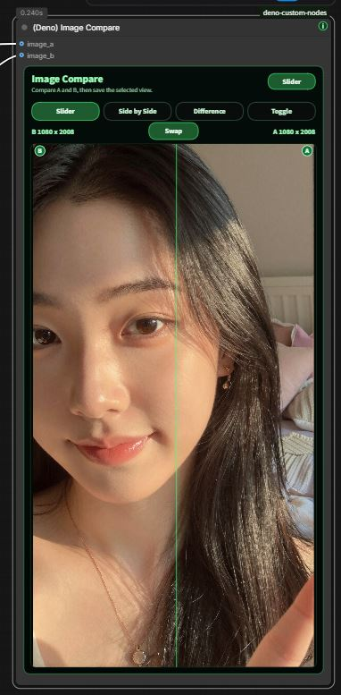

주요 기능: `image_a`와 `image_b` 비교, Slider/Side by Side/Difference/Toggle 모드, hover 슬라이더, A/B 라벨, Swap 버튼, 리사이즈 가능한 내부 미리보기.

### `(Deno) Video Compare`

업스케일과 FPS 보간 결과를 ComfyUI 캔버스 안에서 확인하기 위한 비디오 A/B 비교 노드입니다.

주요 기능: `video_a`, `video_b`, 선택적 `audio_a`, `audio_b`, Slider/Side by Side/Difference/Toggle 모드, 재생/일시정지, 스크럽바, 프레임 스텝, 속도, 루프, 출력 배지 토글, `comparison` 이미지 출력.

미리보기와 저장 출력의 길이는 원래 A의 프레임 수와 선택한 FPS를 기준으로 하며, A가 없으면 B를 기준으로 합니다. B는 A의 출력 프레임 수에 맞춰 전체 구간에서 샘플링됩니다. `Swap`은 시간 기준을 바꾸지 않으며, `Toggle` 출력은 선택한 A/B를 전체 구간에 유지합니다. 저장 노드에도 같은 FPS를 사용하세요.

설치가 부담스러우면 브라우저 도구를 사용할 수 있습니다: https://deno2026.github.io/comfyui-deno-custom-nodes/video-compare/

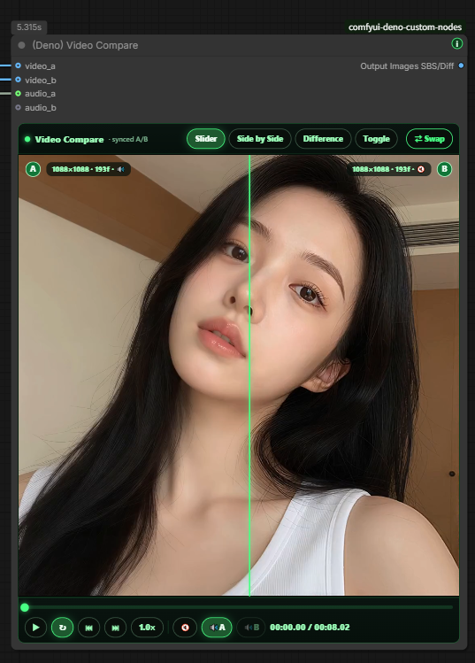

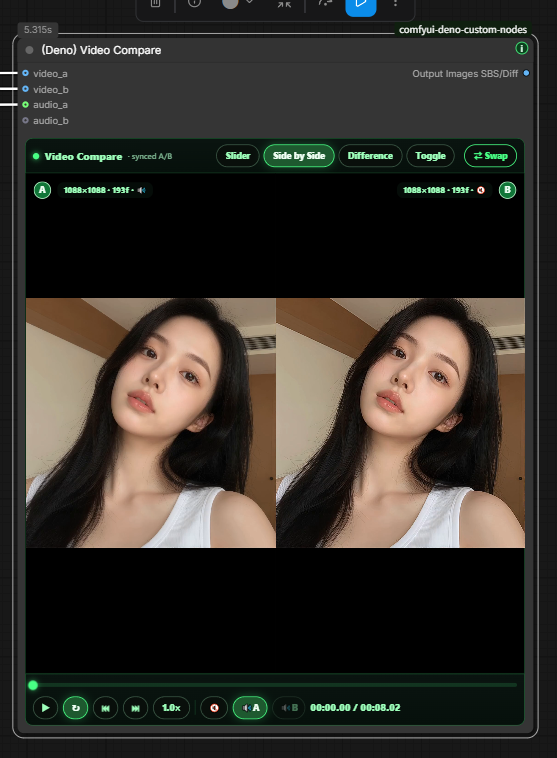

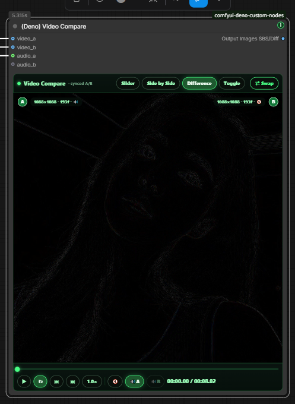

### `(Deno) Video Preview`

그래프 중간에서 실제 인코딩된 비디오 결과를 확인하는 풀 해상도 미리보기 노드입니다.

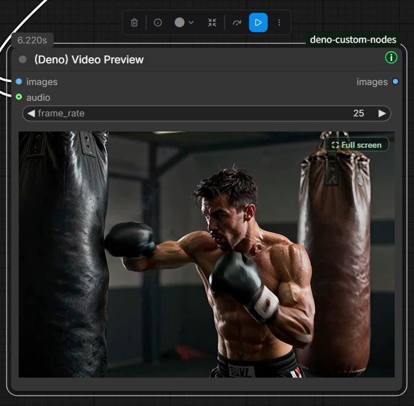

주요 기능: IMAGE batch 입력과 straight-through 출력, 선택적 오디오 mux, hover 오디오, 클릭 재생/일시정지, Full screen 버튼, 해상도/FPS/프레임/길이 배지, PyAV 누락 시 친절한 설치 힌트.

### `(Deno) RTX Video Super Resolution`

NVIDIA RTX Video Super Resolution을 ComfyUI 안에서 간단히 시도할 수 있는 선택형 Windows/NVIDIA RTX 도우미 노드입니다.

노드 안에는 조작부만 표시합니다. 처리한 이미지는 `images` 출력을 Preview Image 또는 Image Compare에 연결해 확인하세요.

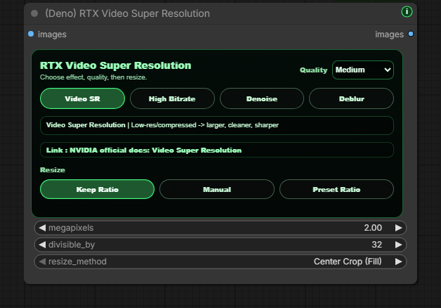

초보자 흐름: `deno-custom-nodes` 설치 또는 업데이트, ComfyUI 시작, 노드 추가 후 한 번 실행, NVIDIA VFX가 없다는 안내가 나오면 ComfyUI를 완전히 종료, `How to install` 버튼의 설치 가이드 순서대로 진행, BAT에서 경로를 확인하고 `Y`, 완료 후 ComfyUI 재시작.

NVIDIA 공식 참고 링크: [NVIDIA Maxine Windows Getting Started](https://docs.nvidia.com/deeplearning/maxine/vfx-sdk-programming-guide/index.html), [RTX Video FAQ](https://nvidia.custhelp.com/app/answers/detail/a_id/5448/~/rtx-video-faq).

### `(Deno) RTX Video Super Resolution (2 Pass)`

비디오 전체 마감용 2-pass RTX 처리 노드입니다. 먼저 같은 크기의 `Denoise` 또는 `Deblur`를 선택적으로 실행하고, 그 다음 `VSR` 또는 `High Bitrate` 업스케일을 선택적으로 실행할 수 있습니다.

예제 워크플로우: [RTX 2-pass upscale workflow](workflows/deno-rtx-lowram-metabatch.json)

주요 기능: Low System Memory와 High System Memory 흐름, VHS Meta Batch 기반 저메모리 처리, 원본 FPS 전달, 오디오 보존, 실제 인코딩 비디오 마감에 적합.

### `(Deno) LTX Sequencer`

멀티 이미지 LTX 워크플로우에 맞춘 가이드 시퀀서입니다.

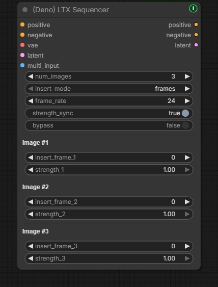

주요 기능: `(Deno) Multi Image Loader` 배치 출력과 함께 사용, 가능한 경우 `num_images` 자동 채움, 기존 sync 스타일 유지, 필요한 strength만 수동 제어, bypass로 빠른 A/B 테스트.

### `(Deno) LTX Model Loader`

LTX 2.3 모델 로딩 패턴을 한 노드로 정리한 로더입니다.

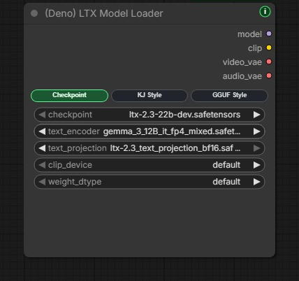

주요 기능: Checkpoint Style, KJ Style, GGUF Style, `model`, `clip`, `video_vae`, `audio_vae` 출력, ComfyUI 기본 로더와 KJNodes/ComfyUI-GGUF 흐름을 함께 지원.

### `(Deno) LTX Tiled Spatial Upscaler`

고해상도 LTX 비디오 latent 2차 패스를 위한 타일 업스케일러입니다. 비디오 latent를 겹치는 spatial tile로 나눠 처리한 뒤 다시 하나의 latent로 섞습니다.

비디오 전용 LTX latent에 사용하세요. 비디오/오디오가 결합된 latent는 먼저 오디오 경로를 분리하고, 타일 비디오 패스 뒤에 다시 합치는 흐름을 권장합니다.

### `(Deno) LTX High resolution Tiled Sampler`

LTX AV refinement 패스를 위한 샘플러입니다. 하나의 global sampler trajectory를 유지하면서 video prediction을 겹치는 spatial tile로 계산하고 합칩니다.

전체 audio latent를 모든 video tile에 문맥으로 전달하고, `freeze` mode에서는 반환되는 audio latent를 입력 상태 그대로 유지합니다.

### `(Deno) Easy Model Download Helper`

권장 모델 파일 세트를 안내하는 프리셋 기반 설치 도우미입니다. 내장 프리셋은 기존 LTX 2.3 8GB VRAM GGUF 세트와 공식 LTX 2.5 Distilled INT8 2단계 모델 세트를 함께 제공합니다.

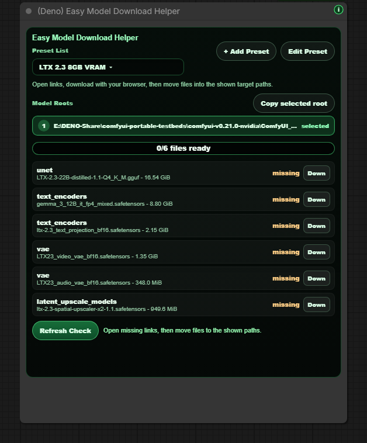

주요 기능: Python에서 직접 다운로드하지 않고 공식 모델 링크를 브라우저로 열기, ComfyUI 모델 루트 표시, workflow 안 creator preset 저장, Hugging Face와 Civitai 링크 지원, 파일이 올바른 모델 폴더에 있는지 확인. LTX 2.5 프리셋에는 diffusion model, projection이 포함된 Gemma 4 text encoder, video/audio VAE, 2단계 처리용 x2 spatial upscaler가 모두 포함됩니다.

LTX 2.5 파일은 Hugging Face 로그인 후 **Agree and Access** 승인이 필요합니다. 이 도우미는 접근 제한을 우회하거나 모델을 자동 다운로드하지 않습니다. 먼저 [LTX-2 Community License](https://github.com/Lightricks/LTX-2/blob/main/LICENSE.md)를 확인하고 [공식 LTX 2.5 저장소](https://huggingface.co/Lightricks/LTX-2.5)에서 접근 권한을 받은 뒤, 노드가 여는 브라우저 링크로 파일을 내려받아 화면에 표시된 ComfyUI 모델 폴더에 옮기세요.

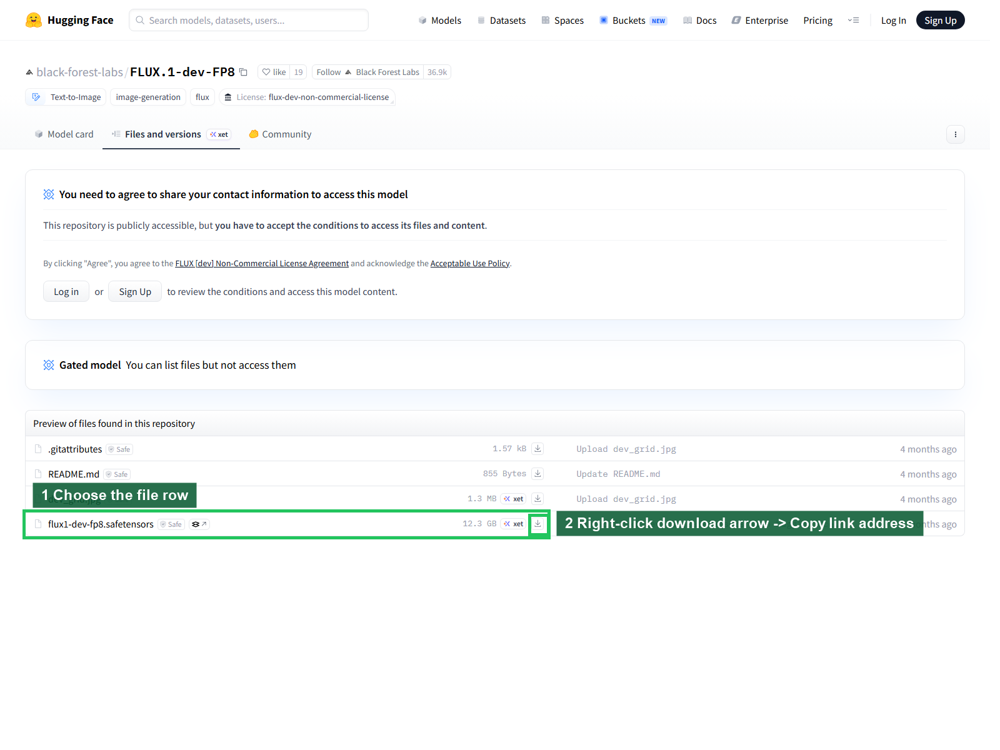

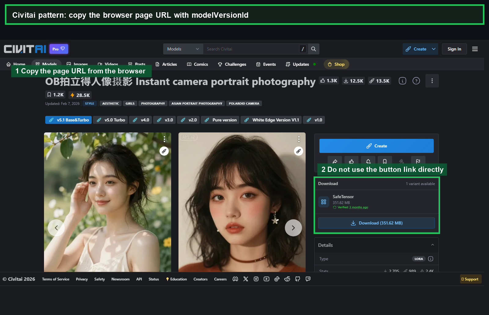

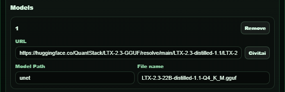

### `(Deno) Multi LoRA Loader`

일반 ComfyUI diffusion 워크플로용 다중 LoRA 로더입니다. 연결한 `MODEL`과 선택형 `CLIP`에 최대 8개 LoRA를 적용하고, 저장된 선택을 잃지 않은 채 슬롯별 enable/disable, model/CLIP strength, trigger word와 note, 슬롯 순서 변경을 관리한 뒤 패치된 `model`과 `clip`을 출력합니다.

### `(Deno) LTX Multi LoRA Loader`

LTX 워크플로우용 Power-LoRA 스타일 다중 LoRA 로더입니다.

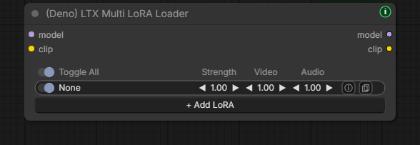

주요 기능: 여러 LoRA 추가, 슬롯별 enable, strength/video/audio strength, trigger word와 note 관리, trigger word 복사, 패치된 `model`과 `clip` 출력.

### `(Deno) LTX Prompt Guide`

LTX 프롬프트 인코딩, 선택적 negative prompt, LTX conditioning, 대사 길이 계획을 함께 다루는 프롬프트 도우미입니다.

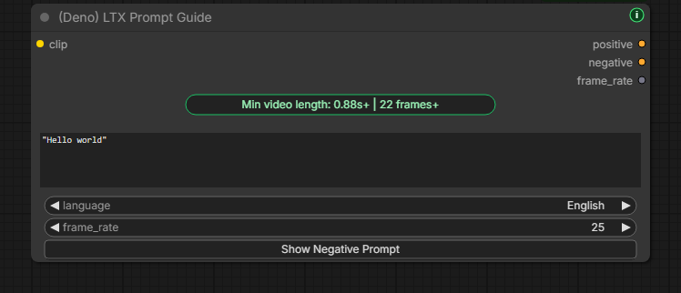

주요 기능: positive prompt 인코딩, 접을 수 있는 negative prompt, `frame_rate`가 포함된 LTX conditioning, 따옴표 안 대사 길이 추정, Auto/Korean/English/Japanese/Chinese 대사 추정.

### `(Deno) Bernini Prompt Guide`

KJ Bernini 방식의 프롬프트 prefix를 쉽게 쓰도록 만든 프롬프트 도우미입니다. positive/negative prompt를 한 노드에서 인코딩하고, 선택한 `System Prompt` 모드에 맞는 system prompt를 노드 맨 위에 보여줍니다.

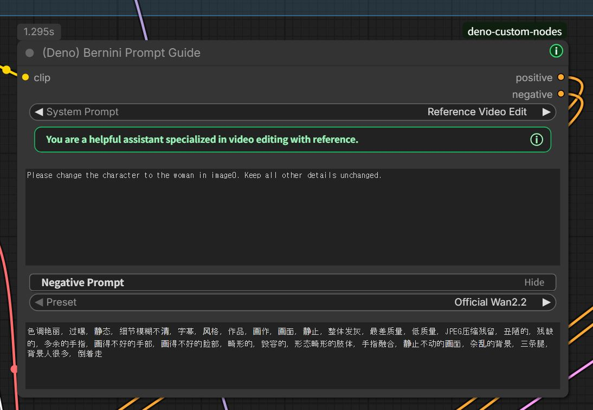

주요 기능: `Text to Video`, `Image to Video`, `Reference Video Edit` 같은 읽기 쉬운 System Prompt 선택, reference 모드의 `image0`/`image1` naming hint 자동 적용, 접을 수 있는 negative prompt, 공식 Wan2.2 negative preset 자동입력, `positive`/`negative` 출력.

Negative preset은 출력 모드가 아니라 아래 negative prompt 칸을 자동으로 채우는 용도입니다. 프리셋으로 채운 뒤 사용자가 그 칸에서 직접 추가하거나 수정한 문구가 최종 negative conditioning으로 인코딩됩니다.

프롬프트는 평소 태그를 나열하는 방식보다 챗봇에게 시키듯이 씁니다. 예: `Replace the jacket with the shirt from image0. Keep the camera motion, background, lighting, and shadows unchanged.`

이 노드는 텍스트 conditioning만 준비합니다. `positive`와 `negative` 출력을 현재 ComfyUI Stable의 순정 `(Bernini) Conditioning` 노드에 연결하면 Bernini visual/context-latent conditioning을 구성할 수 있습니다. 최신 ComfyUI에는 [Bernini backend가 정식 병합](https://github.com/Comfy-Org/ComfyUI/pull/14216)되어 있으므로 예전 preview backend updater가 필요하지 않습니다. 순정 conditioning 노드가 보이지 않으면 ComfyUI Stable을 먼저 업데이트하세요.

### `(Deno) Prompt Text`

system prompt, user prompt, template, JSON 같은 긴 문구를 별도 노드에서 읽기 쉽게 보관하고 STRING으로 연결하는 작은 multiline 입력 노드입니다. 문구를 바꾸지 않은 채 Ideogram Director, Local LLM Loader 또는 다른 STRING 입력으로 전달할 때 사용합니다.

### `(Deno) Local LLM Loader` / `(Deno) Local LLM Reviewer`

모델 목록을 반복 새로고침하거나 provider를 바꿔도 감지된 모델 선택창은 하나만 유지됩니다. 이전 frontend에서 생긴 알려진 중복 선택창은 정리하며, 선택한 모델은 유지합니다.

내 PC에서 실행 중인 로컬 LLM을 ComfyUI 안에서 호출하고, LLM이 만든 review text로 저장 전 결과를 통과하거나 막는 노드입니다.

주요 기능: Ollama, LM Studio, llama.cpp, vLLM, Custom OpenAI-compatible 서버, llama-swap 또는 Unsloth Studio 로컬 모델 호출, 기본 `127.0.0.1`/`localhost` 안전 제한과 `DENO_LOCAL_LLM_ALLOWED_HOSTS`를 이용한 단일 사설 LAN `IP:port` 명시 허용, provider별 모델 새로고침, 실행 중인 로컬 LLM 요청 중단, llama-swap과 Unsloth Studio의 관리 API를 이용한 수동/실행 후 unload, prompt batch를 한 번의 노드 실행으로 순차 처리, vision 모델용 IMAGE 첨부, Thinking/Result 프리뷰, Save 노드 앞 IMAGE/AUDIO gate, 현재 리뷰 결과 1회 승인, reviewer 앞 경로만 다시 실행. Local LLM 노드가 실행되어 반환한 최종 Result는 PNG/워크플로 메타데이터에 저장되어 파일을 다시 열면 노드 안에서 복원되며, Thinking/reasoning 내용은 저장하지 않습니다. llama-swap에 설정된 서버 timeout은 자동 unload 시점을 계속 관리합니다.

`Unsloth` provider는 Unsloth Studio 서버 전용이며 기본 주소는 `http://127.0.0.1:8888/v1`입니다. Unsloth에서 받은 GGUF를 LM Studio에 불러 실행하는 경우에는 `Unsloth`가 아니라 `LM Studio`를 선택하세요. 이 연동은 Unsloth Studio의 모델 조회와 OpenAI-compatible chat 요청을 사용하고 tool definition/tool choice 필드는 보내지 않으며, 수동 unload와 실행 후 unload에는 Unsloth Studio 관리 API를 사용합니다. `Keep for minutes`는 Unsloth timed unload를 예약하지 않으므로 실제 종료가 필요하면 `Unload after run` 또는 `Unload LLM`을 사용하세요.

`Unsloth` provider를 사용하려면 ComfyUI를 시작하기 전에 `DENO_LOCAL_LLM_UNSLOTH_API_KEY` 환경변수에 API key를 설정해야 합니다. 이 키는 workflow나 PNG 메타데이터에 저장되지 않습니다.

서브컴 LM Studio 참고: 현재 전용 `LM Studio` provider 주소는 `http://127.0.0.1:1234/v1`로 고정되어 있습니다. 같은 신뢰 가능한 LAN의 본인 서브컴을 호출하려면 서브컴 LM Studio에서 **Serve on Local Network**를 켜고, 메인컴에서 ComfyUI를 시작하기 전에 정확한 주소를 허용 목록에 넣으세요(예: `DENO_LOCAL_LLM_ALLOWED_HOSTS=192.168.1.50:1234`). ComfyUI를 완전히 다시 시작한 뒤 Provider를 `Custom`, Custom Server URL을 `http://192.168.1.50:1234/v1`로 설정하면 됩니다. 허용 목록은 정확한 사설 IP와 포트만 받으며 workflow나 PNG 메타데이터에는 저장되지 않습니다. 현재 Custom 연결은 인증 token이나 LM Studio 전용 unload 기능을 보내지 않으므로, 방화벽에서 해당 포트를 메인 ComfyUI PC로 제한하고 원격 모델 관리는 LM Studio에서 직접 하세요.

LM Studio 호환 참고: LM Studio가 생성 출력을 시작하기 전에 선택형 reasoning 제어 필드를 거부하면 노드는 그 필드만 뺀 요청으로 한 번 재시도합니다. 그 이후 reasoning 기본 동작은 선택한 서버와 모델이 결정하므로, Thinking toggle만으로 서버가 노출하지 않는 reasoning 모드를 강제할 수는 없습니다.

오디오 참고: Local LLM Loader는 원본 AUDIO를 로컬 모델에 직접 보내지 않습니다. 선택형 `audio_context` STRING 입력으로 상위 노드의 받아쓰기와 음향 보고서를 사용자 prompt를 바꾸지 않는 참고 데이터로 받을 수 있습니다. ComfyUI 기본 또는 다른 audio-capable text generation 노드가 review text를 만들면, Local LLM Reviewer가 그 review text 기준으로 AUDIO도 함께 통과하거나 차단할 수 있습니다.

## Why This Exists

이 노드들은 실제 ComfyUI 제작 과정에서 반복되는 세팅 피로를 줄이기 위해 만들어졌습니다. 목표는 거대한 기능 목록이 아니라, 매일 반복하는 워크플로우를 더 빠르고 깨끗하고 가르치기 쉽게 만드는 것입니다.

## Search Tips

- ComfyUI Manager와 Registry에서는 `Deno Custom Nodes`를 검색하세요.
- 캔버스에서는 `(Deno)` 또는 `Resize Box` 같은 노드 이름을 검색하세요.
- 필요한 도구와 요구사항은 [노드 목록](#included-nodes)에서 찾을 수 있습니다.

## Install

권장하는 Manager 설치 방법은 [빠른 시작](#quick-start)을 참고하세요.

<details>
<summary>수동 설치와 업데이트</summary>

수동 설치는 ComfyUI의 `custom_nodes` 폴더 안에서 clone하고, ComfyUI를 실행하는 동일한 Python으로 의존성을 설치합니다.

```bash
git clone https://github.com/Deno2026/comfyui-deno-custom-nodes.git
cd comfyui-deno-custom-nodes
python -m pip install -r requirements.txt
```

수동 업데이트는 저장소 폴더에서 `git pull --ff-only`를 실행하고, 같은 Python으로 `requirements.txt`를 다시 설치한 뒤 ComfyUI를 재시작하세요. ComfyUI Manager/Registry 설치는 패키지 의존성을 자동으로 처리합니다.

</details>

## License

Deno 소유 노드, 문서, 예시, 워크플로우, 프로젝트 내 에셋은 GNU GPL v3.0 (`GPL-3.0-only`)으로 배포됩니다. [GPL-3.0 조건](../LICENSE)에 따라 사용, 학습, 수정, 재배포할 수 있으며 상업적 이용도 가능합니다. 수정본을 배포할 때는 GPL-3.0을 따르고 필요한 라이선스와 저작권 고지를 유지해야 합니다.

외부 모델, 체크포인트, LoRA, 라이브러리, 도구, 서비스는 각각의 라이선스와 이용 조건을 따릅니다. 특정 모델이나 에셋을 사용하거나 그 결과물을 공유·판매하기 전에 해당 조건을 확인하세요.

## Release Notes

업데이트 내용은 [최신 릴리스](https://github.com/Deno2026/comfyui-deno-custom-nodes/releases/latest)와 [CHANGELOG.md](../CHANGELOG.md)에서 확인할 수 있습니다.

## Links

- YouTube: https://www.youtube.com/@Denoise-AI
- GitHub: https://github.com/Deno2026/comfyui-deno-custom-nodes
- Registry: https://registry.comfy.org/publishers/deno2026/nodes/deno-custom-nodes
