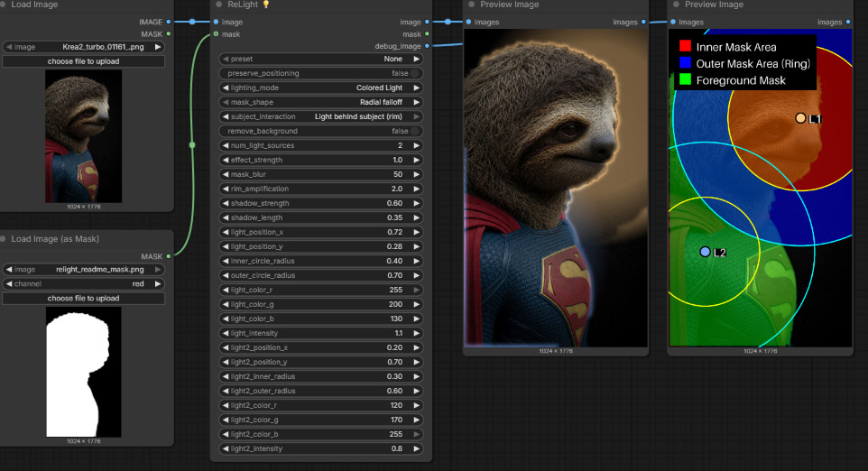
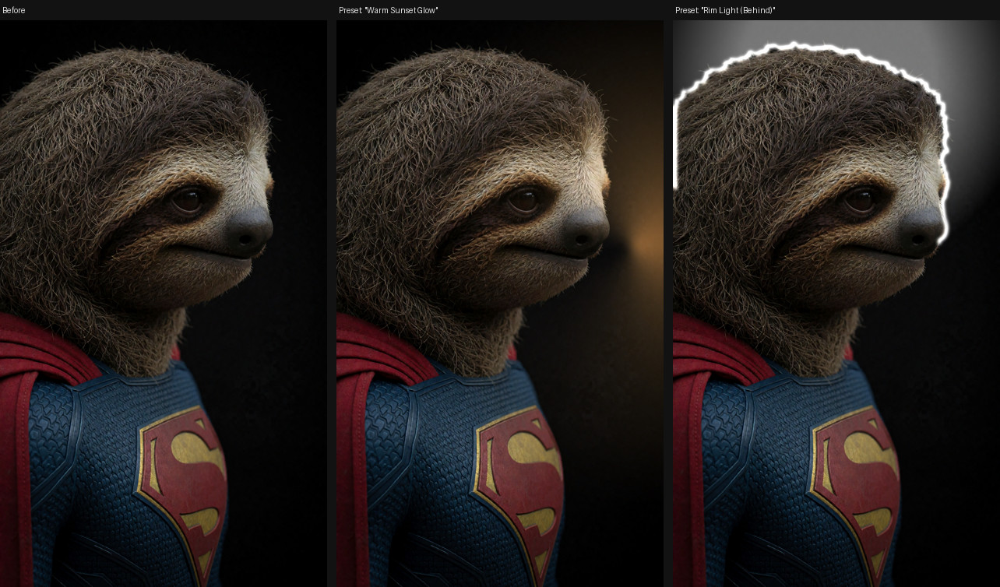
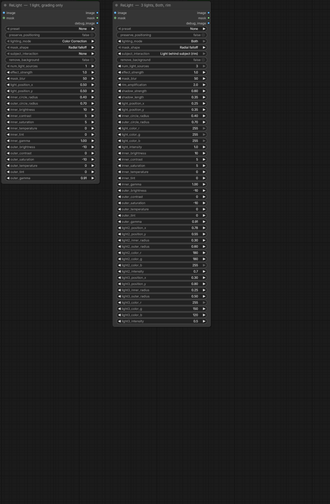
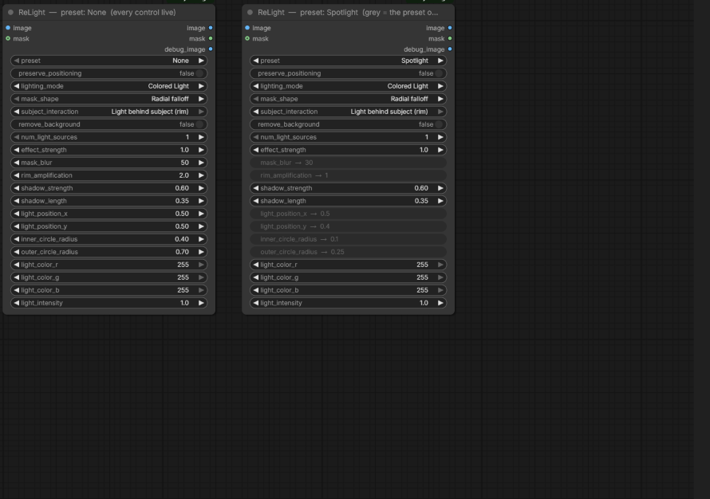
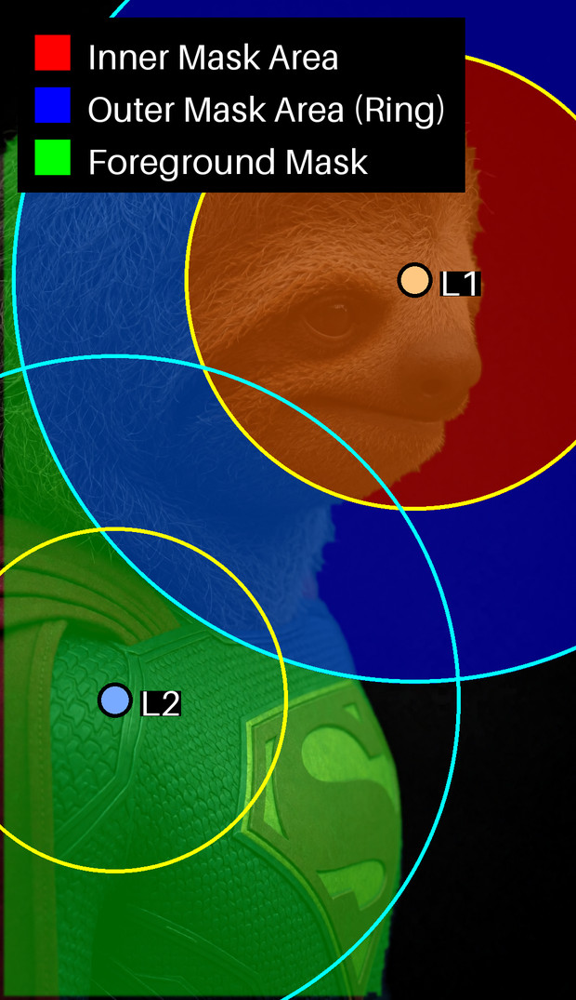

# ✨ ReLight Node for ComfyUI


> **Relight your images without re-generating them.**

ReLight is a single, self-contained ComfyUI node that adds up to 3 positionable light sources to any image — colored additive light, precise color correction, or both — with presets, directional gradients, rim lighting, and mask-aware 3D occlusion including a cast shadow. It's fast and deterministic: pure image processing, no diffusion pass, no models to download.



Two coloured lights, one behind the subject: a warm key from the upper right and a cool fill from the lower left. The third output, wired to the second preview, is the debug view — it shows where each light sits and which zones it covers, and it only draws when something is connected to it.



## 🔧 Install

**ComfyUI-Manager (recommended):** open the Manager, search for **ReLight**, click Install, restart ComfyUI.

**Manually:**

```bash
cd path/to/ComfyUI/custom_nodes
git clone https://github.com/EnragedAntelope/comfyui-relight
# Restart ComfyUI - there is nothing else to install
```

**Requirements: ComfyUI 0.3.48 or newer, and nothing else.** ReLight is built on the ComfyUI v3 node schema (`comfy_api`), which first shipped in that release; on older builds the node will not load. It declares no dependencies of its own — `numpy`, `Pillow`, `scipy` and `torch` all ship with ComfyUI core, so a working ComfyUI already satisfies them.

For good masks, [ComfyUI Essentials](https://github.com/cubiq/ComfyUI_essentials) is worth having alongside it — its RemBG nodes are what the bundled example workflow uses.

## 🚀 Quick start

1. **Add the ReLight 💡 node** (category: `image/lighting`)
2. **Connect your image** to `image`
3. **Connect a foreground mask** to `mask` — white = subject, black = background. Optional, but required for `subject_interaction` ("in front of" / "behind") and for `remove_background`. It is resized to the image automatically
4. **Pick a preset** — "Rim Light (Behind)" is the one that shows off what the node does — or leave `preset` on `None` and build the light yourself
5. **Turn `effect_strength` down or up.** It scales whatever the preset does: `1.0` is the preset as designed, `0.5` is half, `0.0` is untouched
6. **Wire `debug_image` to a Preview Image** if you want to see where the lights actually are. There is no toggle — connecting the output is the whole gesture

> **Presets override the widgets below them.** The values shown on the node are ignored for whatever the preset defines, so ReLight greys those controls out and writes the preset's own value into the label — `mask_blur → 30` — instead of leaving a number you can drag that changes nothing. Set `preset` back to `None` to tune by hand, or turn on `preserve_positioning` to keep your own light positions and radii while the preset supplies everything else. `effect_strength` is the one exception: a preset sets a baseline and this widget *scales* it, so it always stays live.

### Sample workflow

A ready-to-load workflow is included: [example_workflows/relight_basic.json](https://github.com/EnragedAntelope/comfyui-relight/blob/main/example_workflows/relight_basic.json). It loads an image, builds a mask with ComfyUI Essentials' RemBG nodes, runs ReLight in "Warm Sunset Glow" behind the subject, and previews both the result and the debug view.

## 🌟 Features

### Powerful Lighting Control

- **Multiple Light Sources** - Place up to 3 independent light sources anywhere in your image
- **Three lighting modes** (`lighting_mode`):
  - 🔄 **Color Correction** - Precise adjustments to brightness, contrast, saturation, temperature, tint and gamma
  - 🎨 **Colored Light** - Additive RGB light with controllable intensity
  - ✨ **Both** - The colour goes on first and the grade is applied to the result
- **Flexible Mask Shapes** (`mask_shape`):
  - 🔵 **Radial falloff** - Natural radial lighting with inner/outer radius control
  - ↗️ **Directional gradient** - Light arriving from one side, for sunset rays or window light

### Advanced 3D Lighting Simulation

- **Subject Interaction** (`subject_interaction`, needs a mask):
  - 🌐 **None** - Lights the whole frame evenly, no mask needed
  - 🔆 **Light in front of subject** - The subject catches more light than the background
  - ✨ **Light behind subject (rim)** - A rim highlight along the subject's edge, a background glow with real falloff, and a shadow the subject casts across the background (`shadow_strength`, `shadow_length`)

### A node that shows only what is live

Lights 2 and 3 appear when `num_light_sources` asks for them, colour controls appear in the modes that use them, grading controls in the modes that use *those*, and the rim and shadow controls only when the light is behind the subject. The node resizes to fit, so the same node is a short panel or a tall one depending on what you actually asked it to do.



Anything the selected preset has taken over is greyed out rather than hidden — so picking a preset never reshuffles the node under your pointer — and the greyed label carries the preset's own value, which is how you learn what "Spotlight" is actually doing.



### Visual debugging with nothing to switch on

Connect the `debug_image` output to a preview and you get a view of where every light sits and which zones it covers. Disconnect it and the node stops drawing it. There is no toggle to remember, and everything drawn scales with the frame, so it stays readable at full render resolution rather than becoming a dark rectangle in a preview thumbnail.



### Production-Ready Features

- **Ready-to-Use Presets** for instant professional results:
  - "Soft Window Light" - Natural diffused lighting
  - "Dramatic Side Light" - Cinematic chiaroscuro effect
  - "Warm Sunset Glow" - Golden hour atmosphere
  - "Cool Blue Moonlight" - Mysterious night-time look
  - "Studio Key Light" - Professional portrait lighting
  - "Rim Light (Behind)" - Striking edge highlights
  - "Spotlight" - Focused dramatic lighting
  - "Negative Light (Darken)" - Creative darkening effects

- **Fine-Tuning Controls** - Precision adjustments for blur, strength, rim amplification and shadow

## 📸 Examples

### Dramatic Three-Point RGB Lighting


This example uses three colored lights to create a purposely over the top striking RGB lighting setup:

- **Main Settings**: 
  - 3 light sources
  - `subject_interaction`: "Light behind subject (rim)"
  - 2.0 effect strength

- **Light 1 (Red)**: 
  - Position: far right (0.99, 0.15)
  - RGB Color: (255, 0, 0)
  - High intensity (2.0)

- **Light 2 (Green)**:
  - Position: left side (0.2, 0.3)
  - RGB Color: (0, 255, 0)
  - Medium intensity (0.7)

- **Light 3 (Blue)**:
  - Position: bottom center (0.3, 0.8)
  - RGB Color: (0, 0, 255)
  - Low intensity (0.2)

This setup creates vibrant color separation while the behind-subject mode emphasizes the edges of the figure with dramatic rim lighting.

### Other Lighting Ideas to Try

Here are some additional lighting scenarios that showcase ReLight's versatility:

#### Split Lighting Portrait


Create dramatic portrait lighting with a strong contrast between light and shadow:
- Single light source at position (0.05, 0.5)
- Large outer radius (0.8)
- High contrast (25)
- Reduced saturation (-15)
- `subject_interaction`: "Light in front of subject"

#### Sunset Silhouette


Create a beautiful sunset silhouette effect:
- Light positioned low and centered (0.5, 0.9)
- Warm colors (255, 180, 100), `lighting_mode`: "Colored Light"
- `subject_interaction`: "Light behind subject (rim)"
- High rim amplification (3.0)
- Moderate mask blur (60)
- A long, soft shadow: `shadow_length` 0.6, `shadow_strength` 0.5

#### Atmospheric Fog Light


Simulate light breaking through fog or mist:
- Light positioned high (0.5, 0.1)
- Cool blue-white color (200, 220, 255), `lighting_mode`: "Colored Light"
- `subject_interaction`: "Light in front of subject"
- High mask blur (100)
- `mask_shape`: "Directional gradient"
- Medium intensity (1.5)

#### Moonlight Through Window


Simulate soft moonlight streaming through a window:
- Light positioned at upper corner (0.8, 0.2)
- Cool blue color (120, 150, 255), `lighting_mode`: "Both" so the colour and the grade both land
- `mask_shape`: "Directional gradient"
- Low brightness (-10)
- High blue cast (Temperature -30)


## 💡 Pro Tips

- **Layer Multiple Lights** - Use several ReLight nodes in sequence for complex lighting setups
- **Debug View** - Wire the `debug_image` output to a Preview Image node to see light positions and mask zones; unwire it when you are done
- **Mask Quality Matters** - The better your foreground mask, the more realistic your lighting effects
- **Combine with ControlNet** - Use ReLight results as input for ControlNet for guided image generation
- **Perfect Rim Lighting** - For the best rim effects:
  1. Position the light behind the subject
  2. Set `subject_interaction` to "Light behind subject (rim)"
  3. Increase `rim_amplification` for stronger edges
  4. Keep `mask_blur` low (20-40) for crisp edges
  5. Raise `shadow_length` to throw the subject's shadow further across the background, and `shadow_strength` to deepen it

## 📝 Parameter Guide

### Core Parameters

| Parameter | Description |
|-----------|-------------|
| **image** | Input image to apply lighting effects. RGB or RGBA; alpha passes through untouched |
| **mask** | Foreground mask (white=subject, black=background). Resized to the image automatically |
| **preset** | Select from pre-configured lighting setups. Overrides the widgets it defines |
| **num_light_sources** | How many lights to use (1-3). Lights 2 and 3 have their own position, radius and color, but in color-correction mode they reuse Light 1's correction settings |
| **lighting_mode** | "Color Correction", "Colored Light", or "Both" (colour first, then grade the result) |
| **mask_shape** | "Radial falloff" (a lamp) or "Directional gradient" (light from one side) |
| **subject_interaction** | "None", "Light in front of subject", or "Light behind subject (rim)". The last two need a mask |
| **remove_background** | Composite the lit result back over the untouched original using the mask, so only the subject is relit. Despite the name it removes nothing. Off by default |
| **effect_strength** | Master intensity control for all lighting effects, gamma included. `0.0` leaves the image untouched. Scales a preset rather than being overridden by it. Does not scale `rim_amplification` or `mask_blur`, which have their own controls |
| **mask_blur** | Controls softness of light edges and transitions |
| **rim_amplification** | Strength of the rim highlight along the subject's edge (behind-subject mode only) |
| **shadow_strength** | How dark the shadow the subject casts across the background is; `0.0` casts none (behind-subject mode only) |
| **shadow_length** | How far that shadow reaches, as a fraction of the image's shorter side (behind-subject mode only) |

### A note on gamma

`inner_gamma` and `outer_gamma` follow the convention used by Photoshop's Levels midtone slider, ImageMagick's `-gamma` and ffmpeg's `eq` filter: **values above 1.0 brighten midtones, values below 1.0 darken them.**

### Light Positioning

| Parameter | Description |
|-----------|-------------|
| **light_position_x/y** | Normalized (0-1) coordinates of light center |
| **inner_circle_radius** | Core area of strongest light effect |
| **outer_circle_radius** | Maximum extent of light falloff |

*For full parameter list, please refer to the detailed section below.*

## 🔍 Troubleshooting

| Problem | Solution |
|---------|----------|
| No visible effect | Increase effect_strength or light_intensity |
| Light too strong | Decrease effect_strength or specific intensity/brightness values |
| Occlusion not working | Set `subject_interaction` away from "None" and connect a mask |
| Only the subject changes, background untouched | `remove_background` is on — turn it off to light the whole frame |
| Editing a slider does nothing | A preset is active and overrides it. Set preset to "None" (`effect_strength` still works — it scales the preset) |
| Preset ignores its own light position/radius | `preserve_positioning` is on — turn it off to let the preset place its light |
| Debug view is a bordered panel of text | Nothing is connected to `debug_image`. Wire it to a preview; it draws itself as soon as something consumes it |
| Node fails to load | ComfyUI must be 0.3.48 or newer. ReLight installs nothing of its own; numpy, Pillow, scipy and torch all come with ComfyUI |
| Poor mask quality | Use RemBG from ComfyUI Essentials for better masks |
| Preset not working as expected | Check `lighting_mode` — the preset sets it, and "Colored Light" ignores every `inner_*`/`outer_*` value |
| Subject looks unlit / effect appears reversed | Your mask may be inverted — ReLight expects white=subject, black=background (invert it upstream with an InvertMask node) |
| Half the controls are missing | They are hidden because they do nothing in the current mode. Raise `num_light_sources`, or change `lighting_mode` / `subject_interaction`, and they come back |
| A workflow saved before v4.0.0 looks wrong | Reload the page. The migration runs when the workflow loads and needs ReLight's frontend files, which arrive on a ComfyUI restart after updating |

## 📚 Detailed Parameters Reference

### Core Inputs
- **image**: Input image to apply lighting effects. RGB or RGBA; an alpha channel passes through untouched
- **mask** (optional): Foreground mask (white=subject, black=background). Needed for `subject_interaction` and for `remove_background`. Resized to the image automatically

### Preset
- **preset**: Pre-configured starting points. A preset overrides the widgets it names, and those widgets are greyed out on the node and relabelled with the preset's own value (`mask_blur → 30`), so you can read what it set without being able to fight it. The label goes back to the plain widget name the moment the preset is cleared
- **preserve_positioning**: Keep your own light positions and radii when a preset is selected, instead of letting the preset set them. Off by default, so presets apply as designed. Turning it on hands the geometry widgets back

### Mode
- **lighting_mode**:
  - **Color Correction** — grades an inner zone with the `inner_*` values and the ring around it with the `outer_*` values. The light's RGB and intensity are unused
  - **Colored Light** — adds coloured light on top of the image, using the light's RGB and `light_intensity`. The grading values are unused
  - **Both** — the coloured light goes on first, then the grade is applied to the lit result. Identical to chaining two ReLight nodes with the same settings, one in each single mode
- **mask_shape**: **Radial falloff** is a lamp — full strength inside `inner_circle_radius`, fading to nothing at `outer_circle_radius`. **Directional gradient** is light arriving from one side, for sunset rays and window light

### Subject interaction
- **subject_interaction**:
  - **None** — lights the whole frame evenly. No mask needed
  - **Light in front of subject** — the subject catches more light than the background
  - **Light behind subject (rim)** — three things at once: a rim highlight along the subject's edge, a background glow with radial falloff, and a shadow the subject casts across the background. Background light is masked off the subject *after* the blur, so it can never wash back over the silhouette
- **remove_background**: Composite the lit result back over the untouched original using the mask, so only the subject is relit. Despite the name it removes nothing. Ignored by the two subject-aware modes, which already light foreground and background separately

### Global modifiers
- **num_light_sources**: 1, 2 or 3. Lights 2 and 3 have their own position, radius and colour, but in a grading mode they reuse Light 1's correction values
- **effect_strength**: Overall intensity multiplier for lighting, gamma included. `0.0` is a true no-op, with or without a preset. A preset sets a baseline that this widget scales, so `1.0` gives the preset as designed. It does not scale `rim_amplification` or `mask_blur` — each has its own control
- **mask_blur**: Blur radius for light mask edges
- **rim_amplification**: Strength of the rim highlight. Only used behind the subject
- **shadow_strength**: How dark the cast shadow is, 0 to 1. `0.0` casts no shadow. Only used behind the subject
- **shadow_length**: How far the cast shadow reaches, as a fraction of the image's shorter side. Only used behind the subject

### Light-specific settings (per light)
- **Position**: `light_position_x` / `_y`, normalized 0-1
- **Shape**: `inner_circle_radius` (core) and `outer_circle_radius` (extent of the falloff)
- **Colour** (Colored Light / Both): `light_color_r` / `_g` / `_b`, `light_intensity` — each of the three lights has its own
- **Grading** (Color Correction / Both): brightness, contrast, saturation, temperature, tint and gamma, for the inner zone and the outer ring. These belong to Light 1; lights 2 and 3 reuse them at their own positions

With `subject_interaction` on "None", the `inner_*` settings apply inside `inner_circle_radius` and the `outer_*` settings apply in the ring out to `outer_circle_radius`. Outside that ring the image is untouched. The two subject-aware modes build a single subject-aware light mask instead and apply the `inner_*` settings through it — the `outer_*` settings are not used there.

### The debug view

There is no toggle. Connect the third output, `debug_image`, to a Preview Image node and the node draws the visualization; disconnect it and the node stops. While nothing is connected, that output carries a bordered panel of text saying so, rather than a black frame that would look like a crash.

The node carries one input you will not see: `debug_output_connected`, which ReLight's own frontend keeps in step with the wiring and hides from the node body. It exists because ComfyUI decides whether a node needs re-running from its *inputs*, so without it, connecting an *output* would replay the cached placeholder into your new preview. If you drive ReLight through the `/prompt` API rather than the UI, the node reads the submitted prompt instead and reaches the same answer.

## 📜 License

MIT License - Feel free to use in personal and commercial projects

---

### 💪 Contributing

Contributions are welcome! Please feel free to submit a Pull Request.

The node can be tested without a ComfyUI install — `tests/stubs` provides a stand-in for `comfy_api`:

```bash
pip install -r requirements-dev.txt
pytest -q
ruff check .
```

### 🔄 Updates

- **v4.0.0** - A breaking release: four controls merged or renamed, three presets retuned, and "behind subject" finally occludes

  **Old workflows still load correctly.** ReLight now ships frontend JavaScript that remaps a pre-v4 save's widget values by name when the workflow opens, so every value lands on the widget it belongs to. They are *not* guaranteed to render identically — see the drift note at the end.

  - **Fixed: "Behind Subject" did not occlude anything.** Three separate causes, all of them now addressed. The silhouette was subtracted from the background light *before* the blur, so a 50px blur smeared background light straight back across the edge onto the subject's face; the two halves are now blurred separately and the silhouette re-applied afterwards, so background light can never land on the subject. The subject cast no shadow at all, so the near side of a head was lit exactly as brightly as the far side; it now casts one, traced back toward the light with the new `shadow_strength` and `shadow_length` controls. And the background "glow" was a hard-edged disc with no falloff; it now uses the same radial falloff as every other light
  - **Fixed: colored light and color correction were mutually exclusive.** `use_colored_lights` became `lighting_mode`, with a third option, **Both**, that applies the coloured light and then grades the result. Three presets — "Warm Sunset Glow", "Cool Blue Moonlight" and "Rim Light (Behind)" — set a colour *and* a full grading block, so 12 values in each of them did nothing at all. They now run in **Both**, with their colour intensities pulled down to account for the grade no longer being discarded
  - **Fixed: "Rim Light (Behind)" lit everything green.** Its light colour had been `(200, 255, 200)` since v1.0 — a green-tinted white that put a +20/255 green cast on the rim and the background glow. It was easy to miss while the grading block was still being discarded; once `inner_saturation` started landing, the preset rendered a distinctly green edge. The light is now neutral white, with `light_intensity` 1.2 → 1.0 so that removing the tint does not also make the preset brighter — mean brightness lands within 2% of what v3.1.2 produced
  - **Fixed: the debug view was invisible at real resolutions.** v3.1.2 replaced the black `debug_image` frame with a placeholder, then drew it at 13px on a full-resolution canvas — 1.7% of the height of a 768px render, which inside a preview thumbnail is a dark rectangle. Everything drawn on the debug view now scales with the frame, with a visible border, so it reads as a panel rather than a dead output. The same applies to the real debug view's legend, labels and light markers
  - **The debug view has no toggle any more.** Connect `debug_image` to a preview and it draws; disconnect it and it stops. `show_debug_info` is gone
  - **Fixed: "Fix node (recreate)" duplicated the node.** That menu entry comes from ComfyUI-Manager, whose implementation passes a string node id to `connect()` and throws part-way through, leaving both the original and its replacement on the canvas. ReLight now ships its own correct version and takes the broken entry out of its own nodes' menus (upstream: Comfy-Org/ComfyUI-Manager#3126)
  - **The node now shows only the controls that are doing something.** Lights 2 and 3 appear when `num_light_sources` asks for them, colour controls appear in the modes that use them, grading controls in the modes that use *those*, and rim/shadow controls only when the light is behind the subject. Anything the selected preset has taken over is greyed out rather than hidden, and carries the preset's own value in its label — `mask_blur → 30` — because the ComfyUI frontend blanks the displayed value of any disabled widget, so greying alone would have left a row of empty bars. The node resizes to fit
  - **Fixed: a light near the right edge lost its debug label.** The `L1`/`L2` marker labels are drawn to the right of the marker, so a light at `light_position_x` 0.9 — which is where "Warm Sunset Glow" puts one — pushed the text off the frame and it was silently clipped. The label now flips to the left of the marker when there is no room on the right
  - **Renamed and merged controls.** `use_colored_lights` → `lighting_mode`; `use_gradient_mode` → `mask_shape`; `apply_3d_lighting` + `light_direction` → `subject_interaction` (the master switch existed only to force "No Occlusion", so it collapsed into the choice it was gating); `show_debug_info` → removed. New: `shadow_strength`, `shadow_length`
  - **Packaging: ReLight declares no dependencies.** `requirements.txt` is gone. numpy, Pillow, scipy and torch all ship with ComfyUI core at versions at or above anything this node needs, so declaring them again could only ever pull a different version into a working install. Manual installation is now a `git clone` and a restart

  **Output drift, measured rather than claimed.** Sweeping all 8 presets across all 3 subject interactions and both single lighting modes — 54 combinations — 24 come back bit-identical to v3.1.2. Every changed combination is one of exactly two things: it uses the behind-subject path, or it uses one of the three retuned presets. Nothing else moved by a single bit. Peak difference is 242/255 on "Rim Light (Behind)", which is the intended effect of that preset finally rendering both of its halves, dropping its green cast and casting a shadow

  **If you drive ReLight through the `/prompt` API** rather than the ComfyUI editor, note that the migration is a frontend feature: an API-format prompt that still names the old inputs will have them ignored and pick up the new defaults instead. Update those prompts to the new control names

- **v3.1.2** - The debug output explains itself instead of going black
  - **Fixed: `debug_image` was a solid black frame whenever `show_debug_info` was off**, which is indistinguishable from a crashed node if you have that output wired to a preview. It now renders a legible placeholder naming the toggle that fills it. The same placeholder explains the other two empty cases: no light masks were generated, or the debug view failed to draw (with a console pointer)
  - Documented that `use_colored_lights` and the `inner_*`/`outer_*` correction values are mutually exclusive, and which presets ship with colored light on

- **v3.1.1** - Fixes a crash that broke every run on v3.0.0 and v3.1.0
  - **Fixed: `AttributeError: Cannot modify class attribute '_coord_cache' on locked class 'ReLightClone'`.** ComfyUI runs a v3 node on a *locked clone* of its class, which forbids writing class attributes. The coordinate cache added in v3.0.0 wrote to the class on the first mask it built, so the node crashed on every execution regardless of settings. The cache now lives at module level; behaviour and output are unchanged
  - The test suite now executes the node through a locked clone built exactly the way ComfyUI builds it, so class-attribute writes fail in CI instead of in a user's workflow

- **v3.1.0** - Audit follow-ups (one preset shifts by under one 8-bit step; see below)
  - **Fixed: `effect_strength` was dead under three presets.** "Spotlight", "Rim Light (Behind)" and "Negative Light (Darken)" set it themselves, so the master intensity — including the documented `0.0` no-op — did nothing for exactly the strongest presets. A preset now sets a *baseline* that the widget scales: `1.0` is the preset as designed, `0.0` is a true no-op, `2.0` is double
  - **Fixed: high `effect_strength` crushed dimmed zones to solid black.** Gamma was faded toward identity by linear interpolation, which ran a dimming gamma (say `0.77`) through zero and negative above strength ~4; the safety clamp then turned that into an exponent of 100. Gamma now scales in exponent space and is bounded by the widget's own `0.1`–`5.0` range, so the zone dims smoothly all the way to strength `5.0`
  - **Fixed: single-channel images silently became 3-channel** in colored-light mode, and produced a black debug view. Colored light now adds the light's luminance to a 1-channel image, and the debug visualization renders grayscale input properly. The debug output is now always RGB, whatever the input
  - Coordinate grids are cached as broadcast rows/columns instead of two full-size arrays — bit-identical masks, but a 4096×4096 workflow no longer pins ~268 MB for the life of the process, and each mask allocates one full-size temporary instead of three
  - Rim-mask gradient magnitude is computed once per frame instead of twice; gamma widget bounds and the internal clamp now share one constant. Output unchanged either way
  - Clarified that the two-zone `inner_*`/`outer_*` split applies to "No Occlusion" only; the occlusion modes use `inner_*` through a single subject-aware mask, and that `effect_strength` does not scale `rim_amplification` or `mask_blur`
  - Packaging: declares `requires-python >= 3.10`; dependency floors synced between `pyproject.toml` and `requirements.txt`; the publish workflow now requests only `contents: read`
  - Tests cover every fix above, plus schema self-consistency: widget defaults within their declared ranges, combo defaults among the offered options, preset values reachable by hand
  - **Output drift:** at default settings, existing workflows are unaffected. Across every preset × occlusion-mode combination only "Spotlight" changes at all, by at most 0.7/255 on a single pixel — below one 8-bit step. It is the only preset that pairs a non-`1.0` `effect_strength` with a dimming gamma

- **v3.0.0** - Correctness overhaul (some outputs change; see below)
  - **Fixed: crash when the mask resolution did not match the image.** Masks are now resized (and clamped to 0-1) automatically, so a mask made before an upscale no longer takes the node down
  - **Fixed: crash on RGBA input.** 4-channel images are handled, with the alpha channel passed through untouched
  - **Fixed: batched runs applied the first image's mask to every frame.** Occlusion and compositing are now computed per frame, which matters for any video or multi-image workflow
  - **Fixed: the `mask` output returned black** when both `apply_3d_lighting` and `remove_background` were off, and echoed the input's shape instead of a normalised `(batch, height, width)` mask
  - **Colour correction no longer round-trips through 8-bit.** Every correction previously quantised the image, so even all-neutral settings shifted pixels by 1/255 and the error compounded across light sources and chained ReLight nodes. Corrections now run in float32 on-device, and identity settings are a true no-op
  - Mask blurring likewise moved off the 8-bit path to a float convolution, removing banding in smooth falloffs
  - **`effect_strength` now scales gamma too**, so `0.0` genuinely leaves the image untouched (gamma was previously exempt)
  - **Changed default: `remove_background` is now off.** With it on, connecting a mask silently confined all lighting to the subject and left the background untouched — surprising, and not what the quick start described. Turn it on to get the old behaviour
  - **Changed default: `preserve_positioning` is now off**, so presets apply their own light positions and radii. Presets like "Spotlight" are defined by their tight radii and previously never applied them. Turn it on to keep your own positioning while a preset supplies everything else
  - **Preset gamma values corrected.** Gamma follows the Photoshop/ImageMagick/ffmpeg convention where values above 1.0 brighten — but presets paired dimmed outer zones with gamma above 1.0, partially undoing their own shading. The presets now darken and brighten as designed
  - Node inputs are grouped: secondary controls (`outer_*`, lights 2 and 3, debug) are marked advanced where ComfyUI supports it, cutting the visible surface from 48 widgets. Input order is unchanged, so saved workflows still load
  - Declares `requires-comfyui = ">=0.3.48"`, and a missing `comfy_api` now raises a readable message instead of a bare traceback
  - Example workflow moved to `example_workflows/relight_basic.json` (the conventional location)
  - Added a test suite and CI covering all of the above

- **v2.1.0** - Correctness & polish
  - **Fixed: outer-area color correction now actually applies.** The `outer_*` (brightness/contrast/saturation/temperature/tint/gamma) parameters were previously never used — standard-mode lighting now applies inner settings inside the inner radius and outer settings in the surrounding ring, as documented (this is what presets like "Soft Window Light" and "Spotlight" were designed around)
  - Colored lights in standard mode now have true radial falloff (full strength inside the inner radius, fading to zero at the outer radius) — `inner_circle_radius` previously had no effect
  - `mask` input is now optional (matching actual behavior); without a mask the node applies plain lighting and disables occlusion/compositing
  - Removed silent mask auto-inversion heuristic that could corrupt masks of large subjects; a console warning is logged instead if a mask looks inverted
  - Fixed v3 schema output ids (schema now passes ComfyUI validation)
  - Console spam removed — verbose diagnostics moved to debug-level logging
  - Packaging: removed `torch` from requirements (ComfyUI provides it)

- **v2.0.0** - ComfyUI v3 Migration
  - Fully migrated to ComfyUI v3 schema
  - Updated to use new io.ComfyNode base class
  - Converted INPUT_TYPES to define_schema with proper type objects
  - All methods converted to classmethods for v3 compatibility
  - Updated outputs to use proper display_name labels
  - Modernized extension registration with ComfyExtension and comfy_entrypoint

- **v1.0** - Initial Release
  - Added support for multiple light sources
  - Implemented rim lighting and 3D lighting simulation
  - Included 8 professional lighting presets
  - Added debug visualization
  - Improved mask handling and compatibility with ComfyUI Essentials
