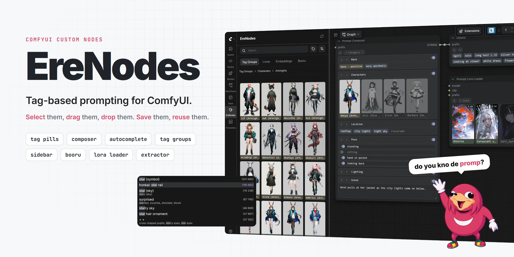
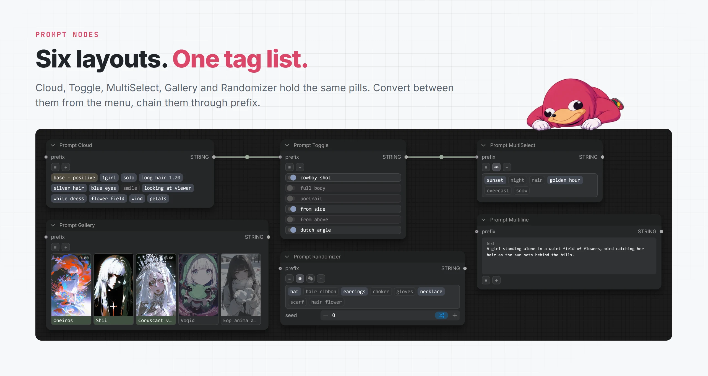
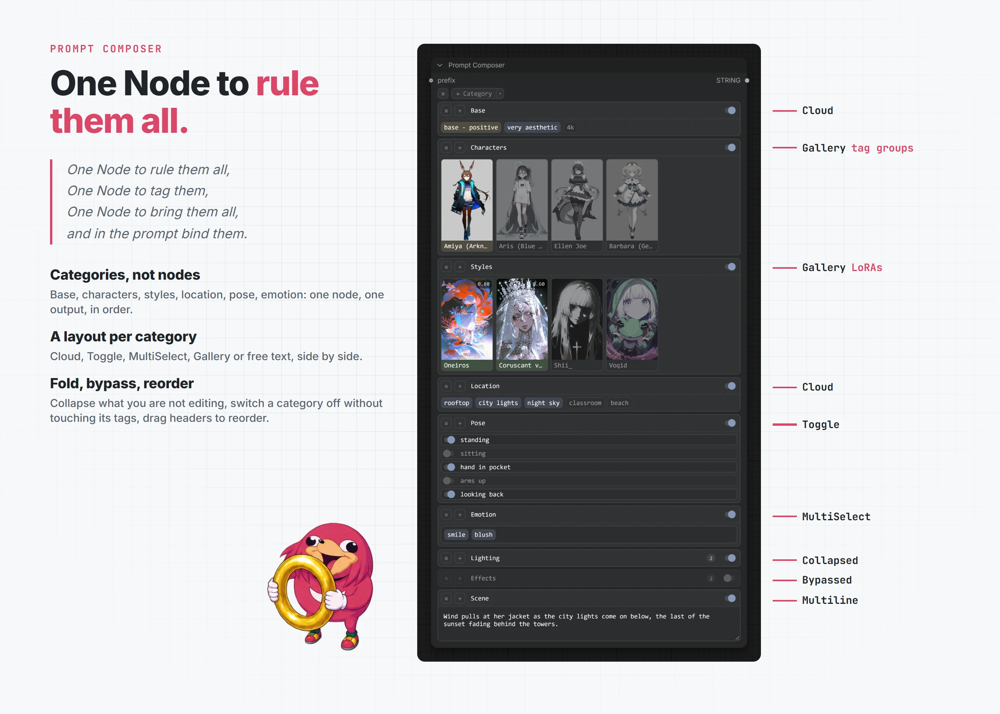
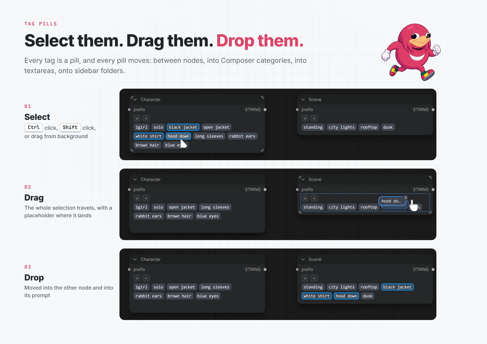
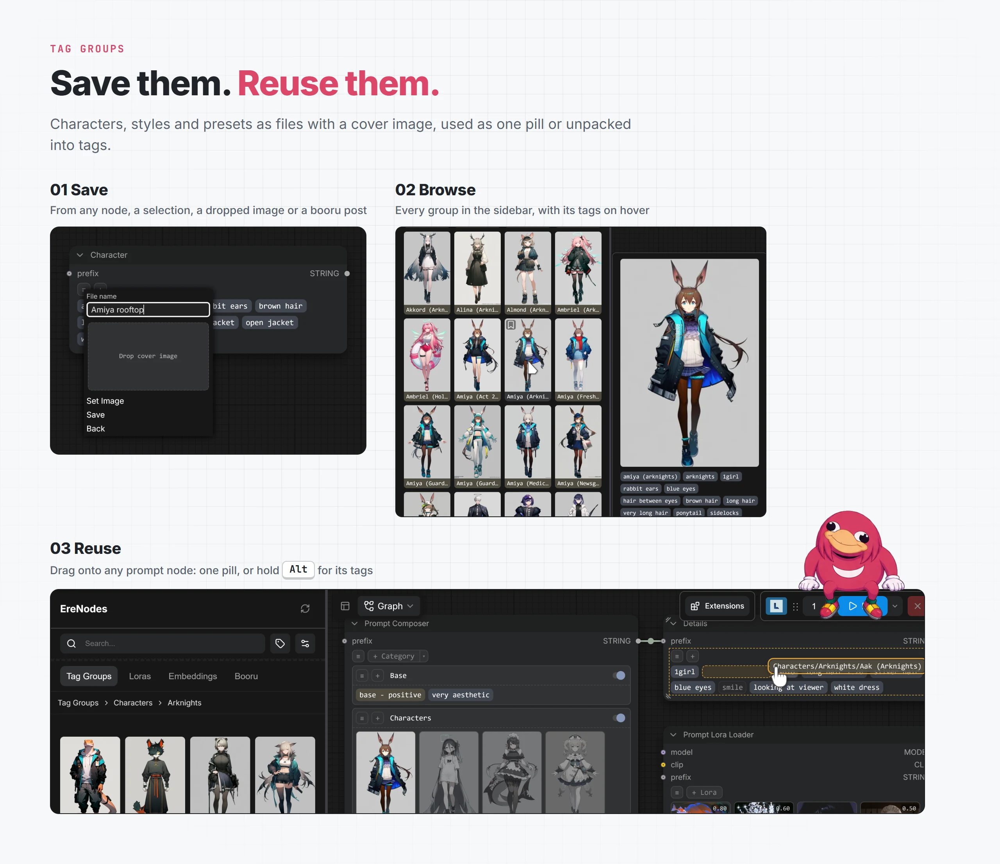
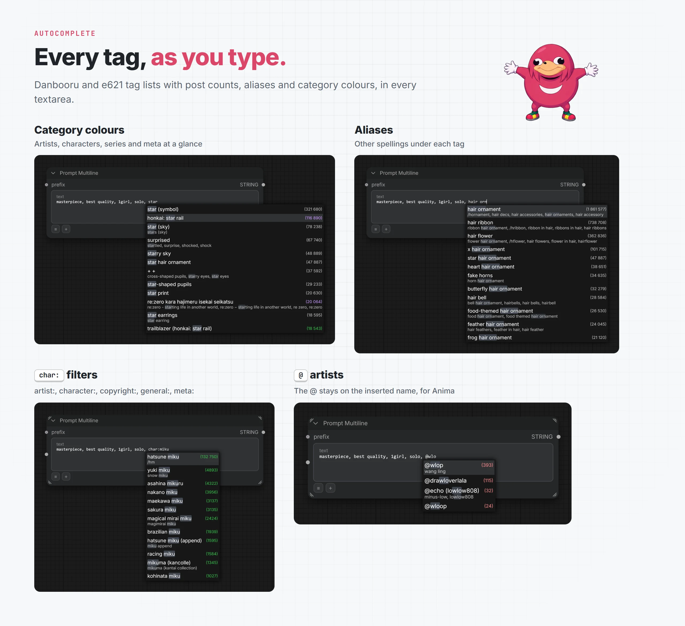
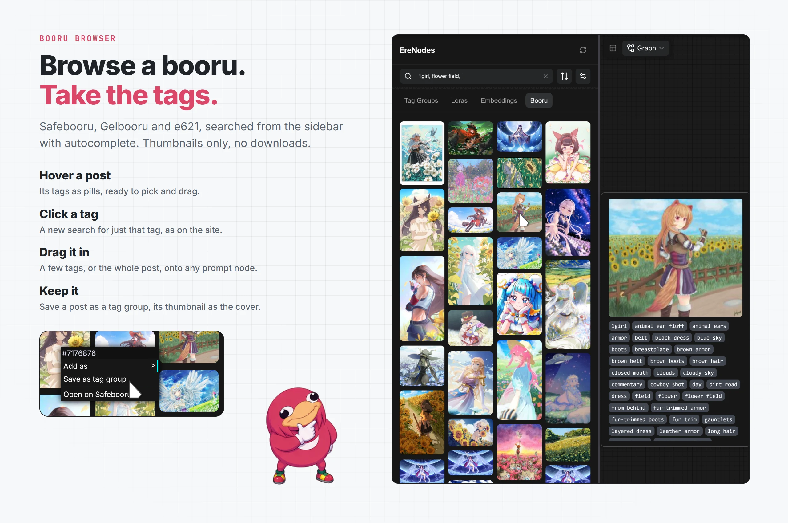
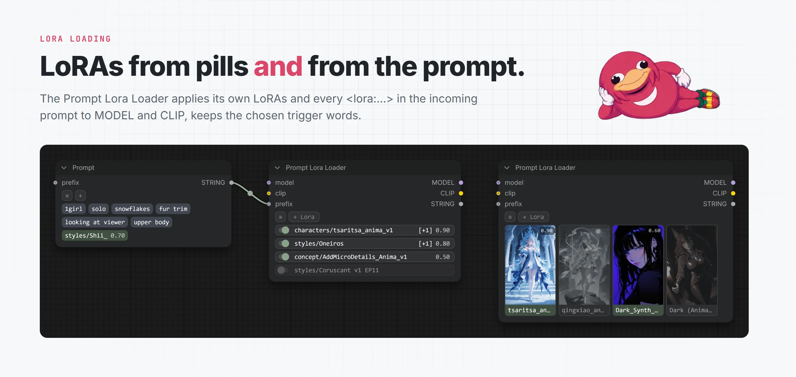
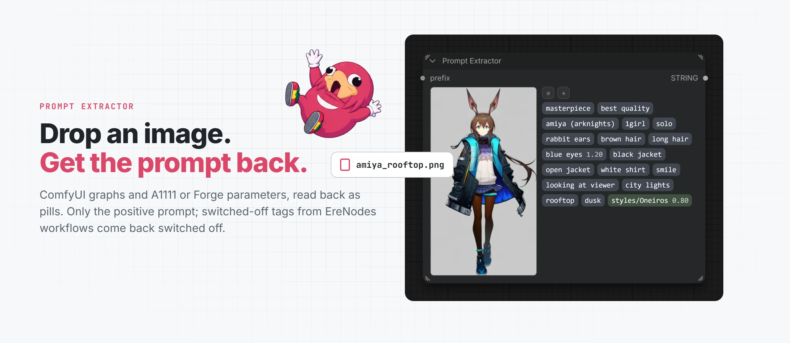

<div align="center">

<picture><source media="(prefers-color-scheme: dark)" srcset="docs/images/banner-dark.webp"></picture>

**Tag-based prompting for ComfyUI.** Build prompts from pills you can toggle, drag and reuse, with a built-in prompt library, tag autocomplete, a booru browser and a prompt-aware LoRA loader.

[](https://opensource.org/licenses/MIT) [](https://github.com/comfyanonymous/ComfyUI) [](https://ko-fi.com/erehr)

[Features](#features) • [Installation](#installation) • [Settings](docs/settings.md) • [Changelog](docs/changelog.md)

</div>

## Features

### [Prompt nodes](docs/prompt-nodes.md)
<picture><source media="(prefers-color-scheme: dark)" srcset="docs/images/prompt-nodes-dark.webp"></picture>

Cloud, Toggle, MultiSelect, Gallery, Randomizer and Multiline: one tag list, drawn the way you want it. Convert between them any time; chain them through `prefix`.

### [Prompt Composer](docs/prompt-composer.md)
<picture><source media="(prefers-color-scheme: dark)" srcset="docs/images/prompt-composer-dark.webp"></picture>

*One Node to rule them all.* Character, outfit, background and quality as collapsible, bypassable categories in a single node, each with its own layout.

### [Tag pills](docs/tag-pills.md)
<picture><source media="(prefers-color-scheme: dark)" srcset="docs/images/tag-pills-drag-dark.webp"></picture>

Select them, drag them, drop them. Reorder, move or copy between nodes, replace with Shift, multi-select with Ctrl. Tags, text, LoRAs, embeddings and tag groups all as the same pills.

### [Tag groups](docs/tag-groups.md)
<picture><source media="(prefers-color-scheme: dark)" srcset="docs/images/tag-groups-dark.webp"></picture>

Save them, reuse them. Characters, styles and presets as files with cover images, used as one pill or unpacked into tags.

### [Autocomplete](docs/autocomplete.md)
<picture><source media="(prefers-color-scheme: dark)" srcset="docs/images/autocomplete-dark.webp"></picture>

Danbooru and e621 tags in every textarea, with aliases, category filters (`artist:`, `char:`, `@`) and colours, plus `lora:`, `embedding:` and `group:` with previews.

### [Sidebar](docs/sidebar.md)
<picture><source media="(prefers-color-scheme: dark)" srcset="docs/images/sidebar-dark.webp"></picture>

Your tag groups, LoRAs and embeddings in a native sidebar tab. Hover for tags, drag onto nodes, search the tags inside every group, bookmark the ones you use daily.

### [Booru browser](docs/booru.md)
<picture><source media="(prefers-color-scheme: dark)" srcset="docs/images/booru-dark.webp"></picture>

Search Safebooru, Gelbooru or e621 from the sidebar. Hover a post for its tags, click one to search it, drag them into your prompt or save them as a tag group.

### [LoRA loading](docs/lora-loading.md)
<picture><source media="(prefers-color-scheme: dark)" srcset="docs/images/lora-loader-dark.webp"></picture>

The Prompt Lora Loader applies its own LoRAs and every `<lora:...>` in the incoming prompt, keeps the selected trigger words, and remaps older Anima LoRAs automatically.

### [Prompt Extractor](docs/prompt-nodes.md#prompt-extractor)
<picture><source media="(prefers-color-scheme: dark)" srcset="docs/images/prompt-extractor-dark.webp"></picture>

Drop a generated image, get its positive prompt back as pills, including tags that were switched off.

## Nodes

| Node | |
|------|---|
| Prompt Cloud, Toggle, MultiSelect, Gallery | [Tag lists in four layouts](docs/prompt-nodes.md) |
| Prompt Randomizer | [Seeded choice of which tags are on](docs/prompt-nodes.md#prompt-randomizer) |
| Prompt Multiline | [Textarea with autocomplete and tag drop](docs/prompt-nodes.md#prompt-multiline) |
| Prompt Composer | [Categories in one node](docs/prompt-composer.md) |
| Prompt Extractor | [Prompt from an image](docs/prompt-nodes.md#prompt-extractor) |
| Prompt Lora Loader | [LoRAs from pills and prompt](docs/lora-loading.md#prompt-lora-loader) |
| Prompt to LoRA Stack | [`LORA_STACK` for other loaders](docs/lora-loading.md) |
| Prompt Filter | [Keep only known tags](docs/prompt-nodes.md#prompt-filter) |

All nodes work in the classic canvas and in Nodes 2.0, and inside subgraphs.

## Installation

**ComfyUI Manager:** search for "EreNodes", install, restart ComfyUI.

**Manual:**

```bash
cd ComfyUI/custom_nodes
git clone https://github.com/erehr/ComfyUI-EreNodes.git
```

Then restart ComfyUI. The sidebar tab appears in the left bar, and all options are under Settings → EreNodes ([reference](docs/settings.md)).

## Contributing

Contributions are welcome. [Report a bug](https://github.com/erehr/ComfyUI-EreNodes/issues), [request a feature](https://github.com/erehr/ComfyUI-EreNodes/issues) or join the [discussions](https://github.com/erehr/ComfyUI-EreNodes/discussions).

## Acknowledgments

- **ComfyUI community**, for feedback and support
- **[ComfyUI-PromptPalette](https://github.com/kambara/ComfyUI-PromptPalette)**: initial inspiration and foundational code
- **[ComfyUI-EZ-AF-Nodes](https://github.com/ez-af/ComfyUI-EZ-AF-Nodes)**: Prompt Gallery inspiration
- **[DraconicDragon](https://github.com/DraconicDragon)**: tag lists and data
- **[ToxesFoxes](https://github.com/ToxesFoxes)**: scrollable tag area
- **[shin131002](https://github.com/shin131002/ComfyUI-Anima-Remap)**: Anima LoRA remapper

Licensed under the [MIT License](LICENSE).