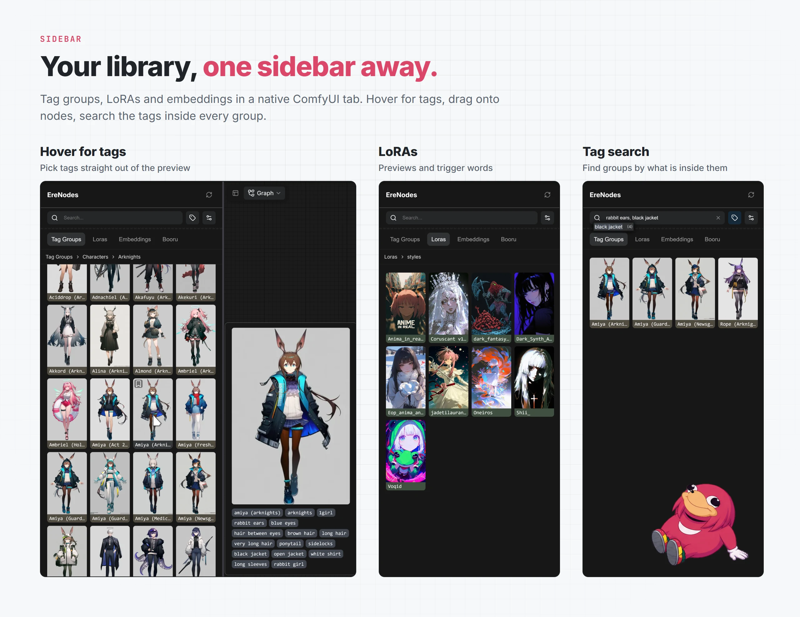

# Sidebar

[EreNodes](../README.md) › Sidebar

<picture><source media="(prefers-color-scheme: dark)" srcset="images/sidebar-dark.webp"></picture>

A native ComfyUI sidebar tab for your tag groups, LoRAs and embeddings, plus the [Booru browser](booru.md).

## Tabs and views

| Tab | Default view |
|-----|--------------|
| Tag Groups | List |
| Loras | Grid |
| Embeddings | Grid |
| Booru | Grid |

The view settings button switches between **list**, **folder** and **grid** views, and sets the tile size (small, large) and aspect (1:1, 3:4, 9:16) for grids.

## Hover previews

Hover an entry to see its image and tags, drawn with the same pills as the nodes. In a tag group's preview you can select tags (click, Ctrl+click, Shift+click, or drag a box) and drag just those into a node.

## Drag and drop

- **Entry to node**: drag a tag group, LoRA or embedding onto a prompt node to add it. A group lands as one pill; hold **Alt** to drop its tags instead. The drag ghost shows which.
- **Double-click** a tag group, LoRA or embedding (or press Enter on it) to create a new prompt node with it. The node type is set in Settings → EreNodes → Sidebar → **Node created on click**.
- **Pills to folder**: drag pills from a node onto a folder to open the tag group editor with them.
- **Image to tree**: drop a generated image anywhere on the tree to make a group from its prompt, with the image as the cover.

## Bookmarks

Pin the tag groups you use daily. Bookmarks sit in a folder at the top of the list and at the top of every search result.

## Search

Two modes, switched by the tag search button next to the search box (Tag Groups tab):

- **Name search**: files and folders by name.
- **Tag search**: the tags *inside* every group, from a background index. Comma-separated tags narrow the result; the search box autocompletes only tags your groups contain, with counts. **Rebuild index** re-reads every group from disk.

## Managing files

Right-click an entry for **Add as** (a new prompt node of the type you pick, with the entry's tags), **Bookmark**, **Set Image**, **Edit tag group**, **New tag group here**, **New folder here**, **Rename** and **Delete**. Ctrl+click and Shift+click select several entries, for **Add all as** and **Delete selected**. A single click opens a folder.

## Keyboard

| Key | Action |
|-----|--------|
| Ctrl+F | Focus the search box |
| Down (from the search box) | Move into the list |
| Arrow keys | Move through rows or the grid; the preview follows |
| Enter | Open a folder, or create a node with the entry |
| Backspace | Go up a folder |
| Home / End | First / last entry |
| Esc | Clear the selection and leave the list |
| Letters | Jump to the next name starting with them |

Moving the mouse hands control back from the keyboard.
