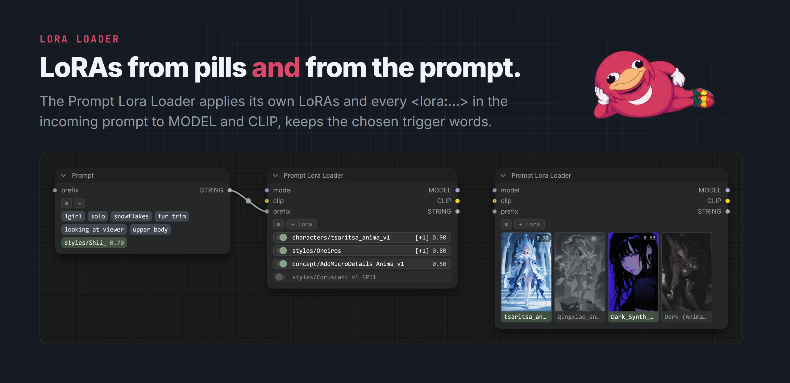

# LoRA loader

[EreNodes](../README.md) › LoRA loader

<picture><source media="(prefers-color-scheme: dark)" srcset="images/lora-loader-dark.webp"><source media="(prefers-color-scheme: light)" srcset="images/lora-loader-light.webp"></picture>

LoRAs picked in EreNodes are written into the prompt as `<lora:name:strength>`. Three ways to apply them:

| Method | How | Use when |
|--------|-----|----------|
| **Prompt Lora Loader** | Built in. Takes MODEL and CLIP and applies its own LoRAs plus every `<lora:...>` in the incoming prompt. | Most workflows. No other pack needed. |
| **Prompt to LoRA Stack** | Built in. Extracts the `<lora:...>` tags as a `LORA_STACK` for stack-compatible loaders: [Efficiency Nodes](https://github.com/jags111/efficiency-nodes-comfyui), [ComfyRoll](https://github.com/Suzie1/ComfyUI_Comfyroll_CustomNodes), [LoRA Manager](https://github.com/willmiao/ComfyUI-Lora-Manager). | Mixing LoRAs from several sources. |
| **Loaders that read the prompt** | Nodes that load LoRAs from prompt text: [LoRA Tag Loader](https://github.com/badjeff/comfyui_lora_tag_loader), [Impact Wildcard Encode](https://github.com/ltdrdata/ComfyUI-Impact-Pack), [PCLazyLoRALoader](https://github.com/asagi4/comfyui-prompt-control). | Wildcards, or an existing setup built on them. |

## Prompt Lora Loader

Inputs `model`, `clip` and `prefix` (all optional); outputs `MODEL`, `CLIP` and `STRING`.

- Applies the LoRAs from the prefix first, then its own. A LoRA named twice is applied once.
- The output `STRING` is the prompt with the applied `<lora:...>` tags removed. Trigger words selected on a LoRA pill stay in, once each.
- `<lora:name:model:clip>` sets separate model and clip strengths.
- **+ Lora** opens the LoRA picker directly. Only LoRAs can be dropped or pasted on it.
- ≡ → **Layout**: Toggle (default), Cloud, MultiSelect or Gallery.
- ≡ → **Toggle All Loras**, **Remove All Loras**, **Remove Inactive Loras**, **Load Tag Group**, **Save Tag Group**.

## Anima block remap

Each Anima generation inserts new transformer blocks between the previous generation's, so an older LoRA's blocks land on the wrong layers of a newer model. The loader detects a LoRA trained on an older, smaller generation (28 or 40 blocks) and remaps it to the model it is applied to (40 or 52 blocks), so it keeps working without conversion. Nothing to configure. Based on [ComfyUI-Anima-Remap](https://github.com/shin131002/ComfyUI-Anima-Remap).
