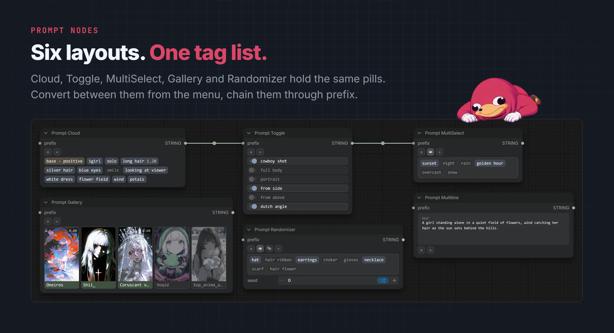
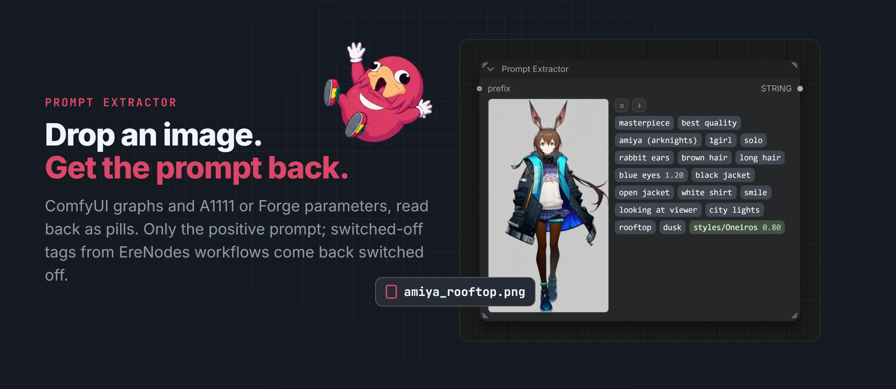

# Prompt nodes

[EreNodes](../README.md) › Prompt nodes

<picture><source media="(prefers-color-scheme: dark)" srcset="images/prompt-nodes-dark.webp"><source media="(prefers-color-scheme: light)" srcset="images/prompt-nodes-light.webp"></picture>

Every EreNodes prompt node outputs a `STRING` and shares the same [tag pills](tag-pills.md), menus and drag and drop. They differ only in how the tags are laid out.

| Node | Layout |
|------|--------|
| **Prompt Cloud** | Tags flow as a compact cloud of pills. The default node. |
| **Prompt Toggle** | One tag per row with an on/off switch. |
| **Prompt MultiSelect** | A checklist of tags. |
| **Prompt Gallery** | Tiles with preview images; made for LoRAs, embeddings and tag groups. |
| **Prompt Randomizer** | A cloud whose enabled tags are picked by a seed. |
| **Prompt Multiline** | A plain textarea with autocomplete and tag drop. |
| **Prompt Composer** | Several categories in one node. See [Prompt Composer](prompt-composer.md). |
| **Prompt Extractor** | Tags recovered from a dropped image. |
| **Prompt Lora Loader** | Applies LoRAs to MODEL and CLIP. See [LoRA loader](lora-loader.md). |

## The ≡ and + buttons

**+** adds a tag. It opens a search with [autocomplete](autocomplete.md), plus entries to add free text, a LoRA, an embedding or a tag group.

**≡** opens the node menu:

- **Convert to**: switch the node to another layout; tags and connections are kept.
- **Replace Tags from Clipboard** / **Add Tags from Clipboard**: paste a comma-separated prompt as pills.
- **Fit Height to Tags**: shrink the node to its tags (with a scrollable tag area).
- **Toggle All Tags**, **Remove All Tags**, **Remove Inactive Tags**.
- **Load Tag Group** (adds the group's tags) and **Save Tag Group**. See [Tag groups](tag-groups.md).
- **Export Tags (.json)** / **Import Tags (.json)**.
- **Options**: tag separator, node separator, and tile size and aspect for Gallery.

## Chaining and separators

Every prompt node has an optional `prefix` input. Connect another prompt node's output to it and the upstream prompt is placed before this node's tags, so nodes chain into one prompt.

- **Tag separator**: what goes between tags, `, ` by default.
- **Node separator**: what goes between the prefix and this node's tags, `,\n\n` by default. A prefix that already ends in punctuation does not get it twice.

Both are set per node in ≡ → Options. New nodes take the defaults from [Settings](settings.md).

## Prompt Gallery

Tags are drawn as image tiles, using the preview image of the LoRA, embedding or tag group. ≡ → Options sets the tile size (small, large) and aspect (1:1, 3:4, 9:16).

## Prompt Randomizer

The randomizer keeps the number of enabled tags and lets a seed pick which ones they are.

- **Dice button**: roll a new arrangement now.
- **seed** and **control after generate**: ComfyUI's standard seed widgets. Set to randomize or increment and every queued prompt gets a new arrangement; typing an earlier seed back in restores that arrangement.

## Prompt Multiline

A textarea for natural-language prompts that still takes part in everything else:

- [Autocomplete](autocomplete.md) as you type, including `lora:`, `embedding:` and `group:`.
- Pills and tag groups can be dragged into the text; a dropped group is written out as its tags. A drop inside a word adds no separator.

## Prompt Extractor

<picture><source media="(prefers-color-scheme: dark)" srcset="images/prompt-extractor-dark.webp"><source media="(prefers-color-scheme: light)" srcset="images/prompt-extractor-light.webp"></picture>

Drop a previously generated image on the node and its positive prompt comes back as editable pills.

- Reads ComfyUI's embedded graph and workflow, and A1111/Forge parameters in PNG text chunks or JPEG/WebP EXIF.
- Follows the graph back from the sampler's `positive` input, so negatives and unconnected nodes are never picked up.
- Images made with EreNodes return their disabled tags as inactive pills, with strength and type intact.
- **Extract Again** re-reads the same image. After that the tags are ordinary pills: toggle, reorder, drag out, save as a group.
- Once the tags are edited the image is greyed out: it no longer matches them. It clears on **Remove All Tags**, when another image replaces it, and when the workflow is reloaded.
- **Remove Inactive Tags** also removes LoRAs, embeddings and tag groups whose file is missing (the red ones). With **≡ → Options → Remove inactive by default** on, that happens to every extraction, and the manual entry is disabled.

## Prompt Filter

A utility node without a tag UI. It takes a prompt and keeps only the tags present in an autocomplete CSV, dropping LoRA syntax, weights and anything unknown.

- **csv_file**: the tag list to check against.
- **alias_handling**: keep the alias as written, replace it with the main tag, or output both.

## Nodes 2.0 and subgraphs

All nodes work in the classic LiteGraph canvas and in Nodes 2.0 (Vue renderer), with the same DOM implementation. They also work inside subgraphs.
