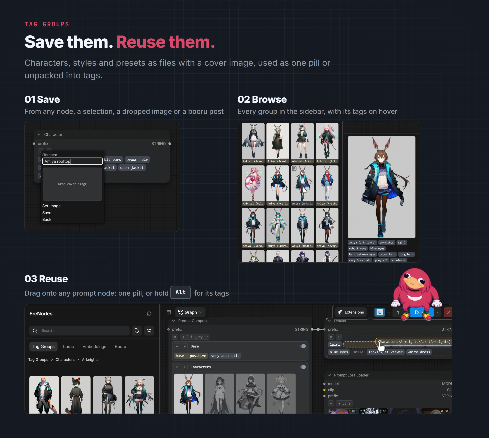

# Tag groups

[EreNodes](../README.md) › Tag groups

<picture><source media="(prefers-color-scheme: dark)" srcset="images/tag-groups-dark.webp"><source media="(prefers-color-scheme: light)" srcset="images/tag-groups-light.webp"></picture>

A tag group is a saved set of pills: tags, text, LoRAs with their strengths, and embeddings, with an optional cover image. Characters, styles, outfits, quality presets: anything you type more than once.

## Saving

- **≡ → Save Tag Group** on any prompt node: pick or create a folder, name it, optionally choose a cover image.
- **Right-click a multi-selection → Save Selected as Tag Group** saves just those pills.
- **Drag pills onto a sidebar folder** to open the tag group editor with them.
- **Drop a generated image on the sidebar** to build a group from its prompt, with the image as the cover.
- **Booru browser**: save a post's tags as a group, with the post's thumbnail as the cover. See [Booru browser](booru.md).

## Using

- **≡ → Load Tag Group** adds the group's tags to the node.
- **+ → Add Tag Group** adds the group as a single pill. Its tags are read from the file when the prompt is built, so editing the group updates every node using it. Unpack it from its right-click menu to turn it into separate pills.
- **Drag from the sidebar**: a group lands as one pill by default; hold **Alt** to drop its tags instead.
- Typing `group:` in a textarea or the + search picks a group through [autocomplete](autocomplete.md).

## Picking from a group

Right-click a group pill → **Mode** chooses what it adds to the prompt:

- **File** (default): the tags as the group file has them, preview only.
- **Single**: one tag. Click a tag in the preview - now selector like lora triggers - to pick it.
- **Multi**: any number of tags.

A group of hair styles, outfits or poses becomes a one-of-many choice without touching the file. The picks are stored in the node with their strengths and trigger words; the group file is not changed. Switching modes clears the picks. Unpacking keeps the whole group, with the picked tags on and the rest off.

## Editing

Open a group from the [sidebar](sidebar.md) to edit it in place: rename, reorder, toggle and remove tags, add new ones, set or remove the cover.

## Storage folder

Settings → EreNodes → Tag Groups → **Storage folder**:

- **ComfyUI user folder** (recommended): survives node updates and reinstalls.
- **ComfyUI models/tag_groups**: shared across installs; `tag_groups:` in `extra_model_paths.yaml` can redirect it.

When you switch, EreNodes offers to copy the existing groups over. Nothing is deleted from the old folder.

## Import and export

**Export Tags (.json)** and **Import Tags (.json)** in the ≡ menu move a node's tags to and from a file, for sharing and backup.

## Bulk import

`scripts/animadex_import.py` is a standalone interactive tool that builds tag groups, with covers, from the animadex.net character and artist catalogues. See [scripts/README.md](../scripts/README.md).
