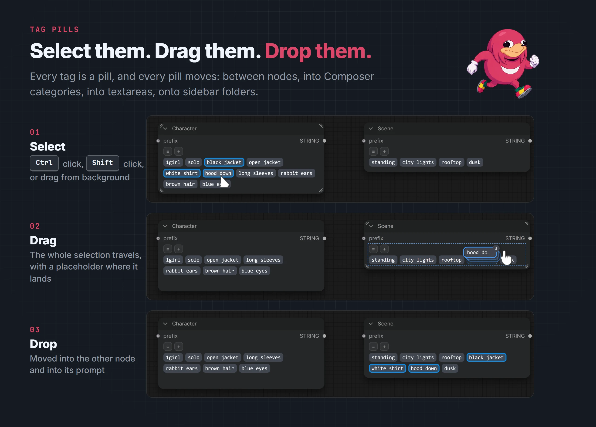
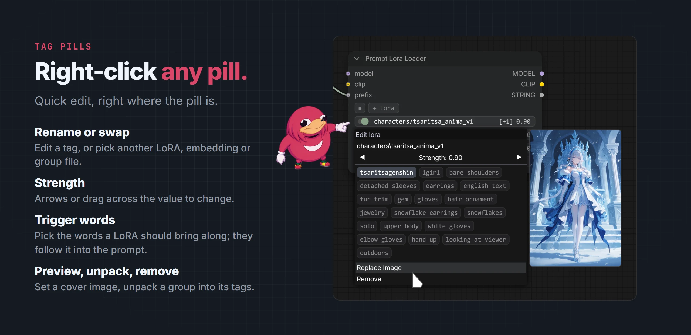
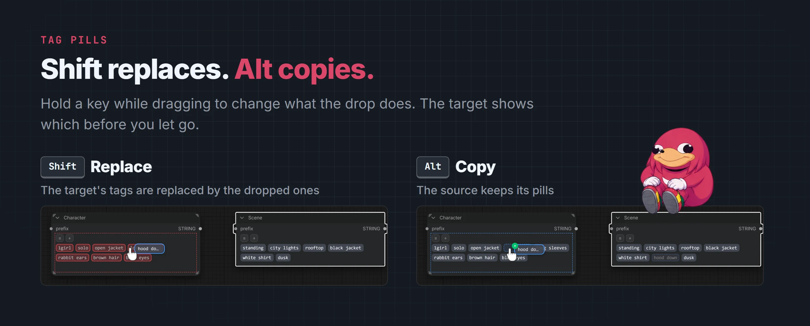

# Tag pills

[EreNodes](../README.md) › Tag pills

<picture><source media="(prefers-color-scheme: dark)" srcset="images/tag-pills-drag-dark.webp"><source media="(prefers-color-scheme: light)" srcset="images/tag-pills-drag-light.webp"></picture>

Every prompt node, the sidebar previews and the Booru browser draw tags as the same pills, and they all follow the same rules.

## Pill types

| Type | Written to the prompt as |
|------|--------------------------|
| Tag | `blue hair`, or `(blue hair:1.2)` with a strength |
| Text | A whole sentence, for mixing natural language with tags |
| LoRA | `<lora:name:1.0>` |
| Embedding | `embedding:name` |
| Tag group | The group's current tags, read from its file. The pill stays one pill until unpacked. |

LoRA, embedding and tag group pills get a red border when the file they name is not on disk.

## Click, strength, quick edit

- **Click** a pill to toggle it. Disabled pills stay in the node but are not written to the prompt.
- **Right-click** for quick edit: rename the tag or pick another file, set the strength (with the − / + buttons, by dragging across the value, or with Left/Right; middle-click resets it to 1), see a LoRA's trigger words or a group's contents, set a preview image, **Unpack** a group into its tags, or **Remove** it.

<picture><source media="(prefers-color-scheme: dark)" srcset="images/tag-pills-quick-edit-dark.webp"><source media="(prefers-color-scheme: light)" srcset="images/tag-pills-quick-edit-light.webp"></picture>

LoRA trigger words are listed in the LoRA's quick edit; the selected ones are written after the LoRA. The eye button on a node shows or hides its disabled tags.

## Drag and drop

- **Reorder**: hold a pill for a moment, or just start moving it. A placeholder shows where it lands.
- **Move between nodes**: drag pills into any other prompt node or Composer category.
- **Alt** while dropping: copy instead of move.
- **Shift** while dropping: replace the target's tags with the dropped ones. The target is highlighted red.
- Tags already present in the target are skipped.

<picture><source media="(prefers-color-scheme: dark)" srcset="images/tag-pills-modifiers-dark.webp"><source media="(prefers-color-scheme: light)" srcset="images/tag-pills-modifiers-light.webp"></picture>

- Pills can also be dropped into a Prompt Multiline textarea, or onto a sidebar folder to save them as a new tag group.

## Multi-select

- **Ctrl+click** picks individual pills.
- **Ctrl+drag** draws a selection box; sweeping over a selected pill again deselects it, as in Explorer.
- **Shift+click** selects a range.
- **Esc** or a click outside clears the selection.

A drag started on a selected pill carries the whole selection. Right-click a selected pill for **Strength**, which shifts every selected tag by the same amount and resets them all to 1 on a middle-click (tag groups have none), then **Enable**, **Disable**, **Toggle**, **Remove Selected**, **Save Selected as Tag Group** and **Export Selected (.json)**.
