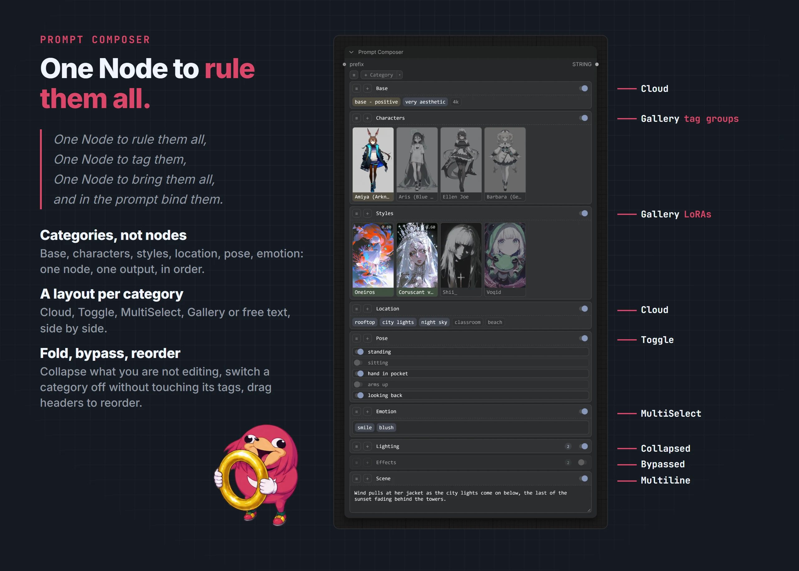

# Prompt Composer

[EreNodes](../README.md) › Prompt Composer

> *One Node to rule them all, One Node to tag them,*
> *One Node to bring them all, and in the prompt bind them.*

<picture><source media="(prefers-color-scheme: dark)" srcset="images/prompt-composer-dark.webp"><source media="(prefers-color-scheme: light)" srcset="images/prompt-composer-light.webp"></picture>

The Composer holds several categories in one node: character, outfit, background, quality, each with its own tags. It outputs the same prompt a chain of separate prompt nodes would.

## Categories

- **Add Category** from the node's ≡ menu, or **Add Category as** to pick its layout straight away. **Create Category from Clipboard** turns a copied prompt into a new category.
- **Rename** or remove a category by right-clicking its header. Each header has its own ≡ and + buttons.
- **Collapse** a category by clicking its header. The layout is saved with the workflow. ≡ → **Expand All** / **Collapse All** handles every category.
- **Bypass** a category with the switch on its header. Its tags stay exactly as they were and come back when it is switched on.
- **Reorder** categories by dragging the header, or drag a category into another Composer. Hold **Alt** over the other Composer to copy it instead.
- **Category to node**: drop a category on empty canvas and it becomes a prompt node of its layout (Cloud, Toggle, MultiSelect, Gallery or Multiline) with its title and tags. A switched-off category becomes a bypassed node. Hold **Alt** to copy it instead of moving it out.
- **Node to category**: drag a prompt node by its title over a Composer's categories. When the drop placeholder appears and the node fades, release and the node becomes a category there. Its prefix input is reconnected to whatever its output fed, as deleting a node does. A Randomizer arrives as a MultiSelect category and an Extractor as a Cloud; a whole Composer brings all of its categories. A bypassed or muted node arrives switched off. Several selected prompt nodes go in together, left to right; a selection with any other node in it only moves. Prompt Lora Loader stays a node.

## Layouts per category

Each category can be drawn as **Cloud**, **Toggle**, **MultiSelect**, **Gallery** or **Multiline** (category ≡ → Layout). A Multiline category is a free text area with autocomplete, next to tag categories in the same node.

## Selecting categories

Ctrl+click or Shift+click headers to select several. Right-click the selection for **Enable**, **Disable**, **Expand**, **Collapse** or **Remove Selected**.

## Output

Categories are joined in order with the node separator (≡ → Options). Empty and bypassed categories are left out. Tags drag between categories and in and out of every other prompt node, exactly as between nodes. See [Tag pills](tag-pills.md).
