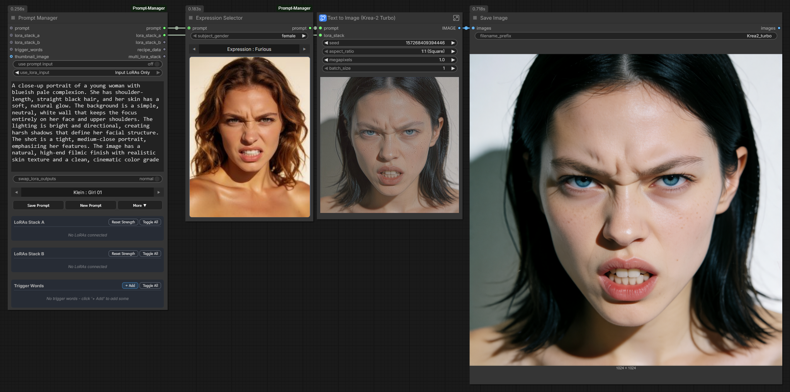
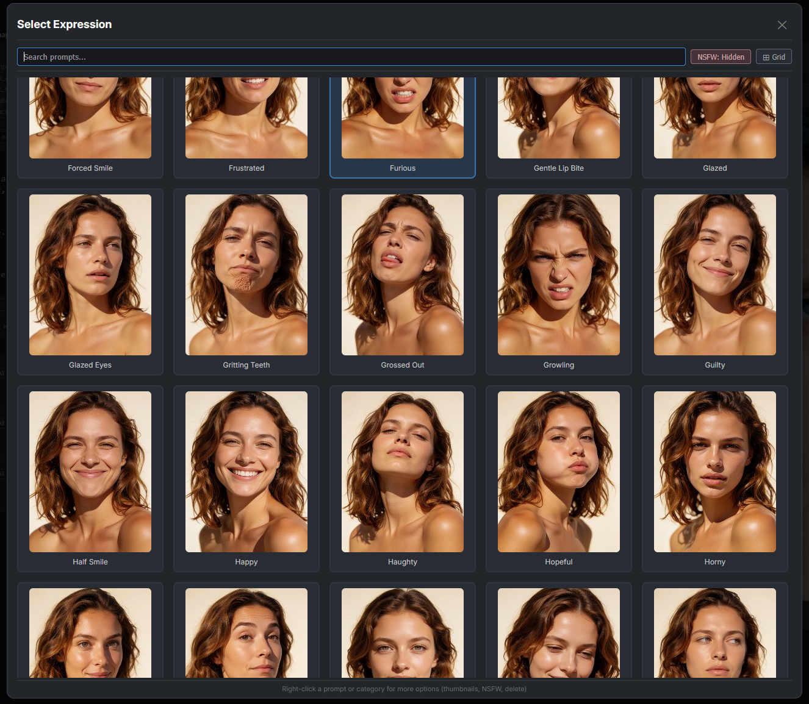
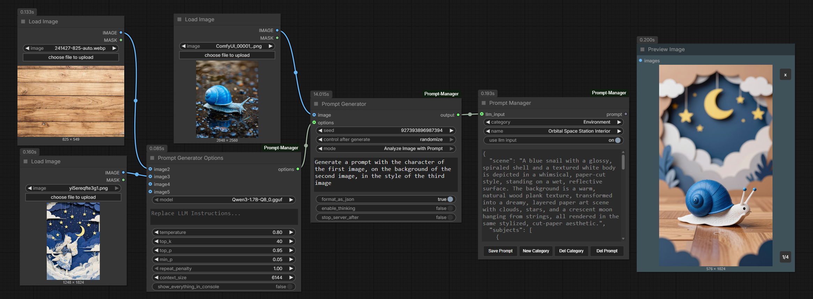
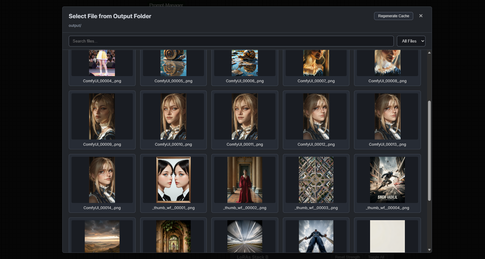

# ComfyUI Prompt Manager
## A comprehensive prompt and recipe toolkit for [ComfyUI](https://github.com/comfyanonymous/ComfyUI)

ComfyUI Prompt Manager is a prompt toolkit for ComfyUI focused on writing, generating, extracting, organizing, and reusing prompts with LoRA-aware workflows. It includes prompt generation powered by local LLM (llama.cpp or Ollama) or direct generation using ComfyUI's own CLIP/text encoders, automatic download of Qwen3.5 models, metadata extraction from images/videos/JSON, prompt browser tooling, and advanced prompt save/load flows. For users who want full pipeline reuse, it also includes an optional Recipe toolset to build, edit, render, load, relay, and save complete generation configs from extracted or hand-authored data. Metadata extraction supports media generated in ComfyUI, A1111, and Forge, including Wan workflows with dual model/stack support.

## Latest update
- Larger Prompt Manager Advanced browser with Grid/Icon/List views and persisted view mode.
- Krea2 support added to Recipe Renderer thumbnail generation.
- New Expression Selector node for appending saved expressions.

<div align="center">
  <figcaption>Expression Selector appends expression to prompts</figcaption>
  
</div>

<div align="center">
  <figcaption>Example of the Expression Browser</figcaption>
  
</div>

## What This Provides

- **Prompt authoring and management**: Prompt Manager (Advanced + Basic) for prompt save/load workflows, LoRA stacks or Multi Lora Stacks, trigger words, expressions, and reusable prompt libraries.
- **Prompt generation**: Prompt Generator + Prompt Generator Options can run through a local LLM (llama.cpp or Ollama), or directly through a connected ComfyUI CLIP/text encoder. Supports text enhancement and image-based analysis (Qwen3.5 vision models when using the LLM backend).
- **Prompt and metadata extraction**: Prompt Extractor reads metadata from images/videos/JSON and can output prompt, LoRA, and recipe context.
- **Prompt browsing utilities**: Browser tools to quickly find and load saved prompts or recipes, with Grid, Icon, and List views.
- **LoRA workflow support**: Multi-LoRA stack tooling and editable LoRA data when reusing saved entries.
- **Optional full Recipe toolkit**: Recipe Builder, Recipe Extractor, Recipe Relay, Recipe Renderer, Recipe Model Loader/Picker, and Recipe Manager for complete generation pipelines.
- **Model-aware recipe rendering**: Recipe Renderer supports Flux 1/2, Ernie, SDXL, Wan, Qwen, Z-Image, Krea2, Wan Image, and Wan Video (I2V/T2V).
- **Lora Preview integration**: When [Lora-Manager](https://github.com/willmiao/ComfyUI-Lora-Manager) is installed, LoRAs can be previewed on hover.
- **Advanced media loading**: Extractor nodes can also act as advanced image loaders from Input and Output folders.
---

<div align="center">
  <figcaption>Prompt Creation With Lora and Trigger Words</figcaption>
  
</div>

<div align="center">
  <figcaption>Generating Prompts based on Images</figcaption>
  
</div>

<div align="center">
  <figcaption>Advanced Prompt Generation using Multiple Images</figcaption>
  
</div>

<div align="center">
  <figcaption>Recipe extraction and modifcation (Adding a Style Lora)</figcaption>
  
</div>

<div align="center">
  <figcaption>Easily find saved Prompts & Recipe using the Built-in File Browser</figcaption>
  
</div>

<div align="center">
  <figcaption>Use Extractor Nodes as an Image Loader, allowing browsing from Input and Output folder.</figcaption>
  
</div>

## v2.0 Introduces an Experimental Recipe Toolset

Version 2.x introduces an optional Recipe toolset that can be used on its own, or in combination with the Prompt toolset.

- Use the Recipe toolset when you want repeatable generation pipelines from extracted or hand-edited recipe data.
  - Recipe Data includes prompts (pos & neg), LoRA stack, mode used, KSampler settings, resolution, seed, and more.
  - This data can be created using Recipe Builder or extracted from existing media with Recipe Extractor.
  - Recipe Renderer provides an easy way to render this recipe.
  - Recipe data can also be used traditionally with the Recipe Relay node, which can access all of it.
- Use the Prompt toolset when you want fast prompt library management and local LLM-assisted prompt creation.
  - Prompt Generator allows creation of new prompts using the LLM model of your choice, or directly via a connected CLIP/text encoder.
  - Prompt Manager can save these to be reusable later.
  - Prompt Extractor is similar to Recipe Extractor, but can individually output prompts or LoRAs.
- Use both together when you want to create Recipes, but use different prompts.


## Toolset Overview

### Prompt Toolset

- Prompt Manager: dual LoRA stacks, trigger words, thumbnail workflows, and advanced save flows.
- Prompt Manager (Basic): category-based prompt save/load. A no-frills basic version (The OG).
- Expression Selector: appends a saved Expression prompt to an input prompt with optional gender substitution; select `(none)` to pass the prompt through unchanged.
- Prompt Extractor: reads metadata from images/videos/JSON and outputs prompt + LoRA + recipe context.
- Prompt Generator + Options: prompt creation and enhancement using llama.cpp, Ollama, or a connected ComfyUI CLIP/text encoder.

### Recipe Toolset

- Recipe Extractor: normalizes extracted metadata into reusable recipe_data.
- Recipe Builder: edit and validate recipe_data in a cleaner authoring surface.
- Recipe Renderer: execute recipe_data through built-in generation templates.
- Recipe Hub: merge/append model blocks into one `recipe_data` and expose each model block as its own output.
- Recipe Relay: edit one model block (`model_data`) with seed and LoRA stack overrides.
- Recipe Model Loader: resolve and load models from recipe_data.
- Recipe Manager: save and reuse recipe entries.

## Common Pipelines

### Prompt-first Pipeline

1. Write or generate prompts and connect LoRA stacks into Prompt Manager.
2. Generate with your normal ComfyUI graph.
3. Save reusable prompt entries when satisfied.

### Recipe-first Pipeline

1. Create preset in Recipe Builder
  - By extracting recipe_data from media or JSON, using Recipe Extractor
   - Or by directly modifying Recipe Builder to the values you want.
2. Render in Recipe Renderer.
3. Save reusable recipe entries with Recipe Manager.
   - To include Thumbnail, add after the Renderer node.

### Hybrid Pipeline

1. Extract or build recipe_data.
2. Add Prompt Generator or Save prompts into Builder.
3. Add LoRAs, either using LoRA stackers or saved LoRA stacks in Prompt Manager.
4. Render through Recipe Renderer.
5. Save final reusable entries in Recipe Manager.

## Preferences And Settings

- Addon settings are available in ComfyUI Preferences (Settings) under Prompt Manager.
- This is where you set model/backend defaults, NSFW visibility defaults, view preferences, and related addon behavior.
- Prompt Generator backend choices (llama.cpp, Ollama, or direct CLIP/text encoder connection) and related options are configured there.

## Workflow Examples

Workflow examples are provided to help understand the basics.

## Documentation

- Detailed node and feature reference: [docs/feature-reference.md](docs/feature-reference.md)
- Full changelog history: [docs/changelog.md](docs/changelog.md)

## Installation

1. Navigate to your ComfyUI custom nodes directory:
   ```
   cd ComfyUI/custom_nodes/
   ```
2. Clone this repository:
   ```bash
   git clone https://github.com/FranckyB/ComfyUI-Prompt-Manager.git
   ```
3. Install dependencies:
   ```bash
   cd ComfyUI-Prompt-Manager
   pip install -r requirements.txt
   ```
4. Install [llama.cpp](https://github.com/ggml-org/llama.cpp/tree/master):
   - Windows:
     ```bash
     winget install llama.cpp
     ```
   - Linux:
     ```bash
     brew install llama.cpp
     ```
5. Place custom `.gguf` models in models/gguf.
   - Or use preferences to set a custom path.
6. Restart ComfyUI.

**Using the CLIP/text encoder backend**: No additional setup is needed. Connect any ComfyUI `CLIP` output to the Prompt Generator node's `clip` input. When `clip` is connected, the node bypasses llama.cpp/Ollama and generates prompts directly through the text encoder.

## Requirements

- ComfyUI
- Python 3.8+
- requests
- huggingface_hub
- psutil
- tqdm
- Pillow
- llama-server or Ollama (optional — text encoders can also be used).
