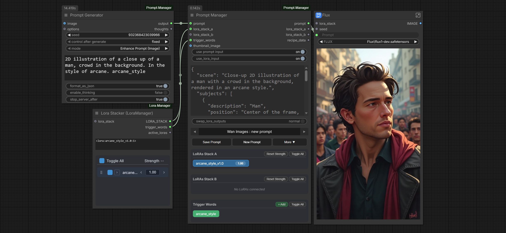
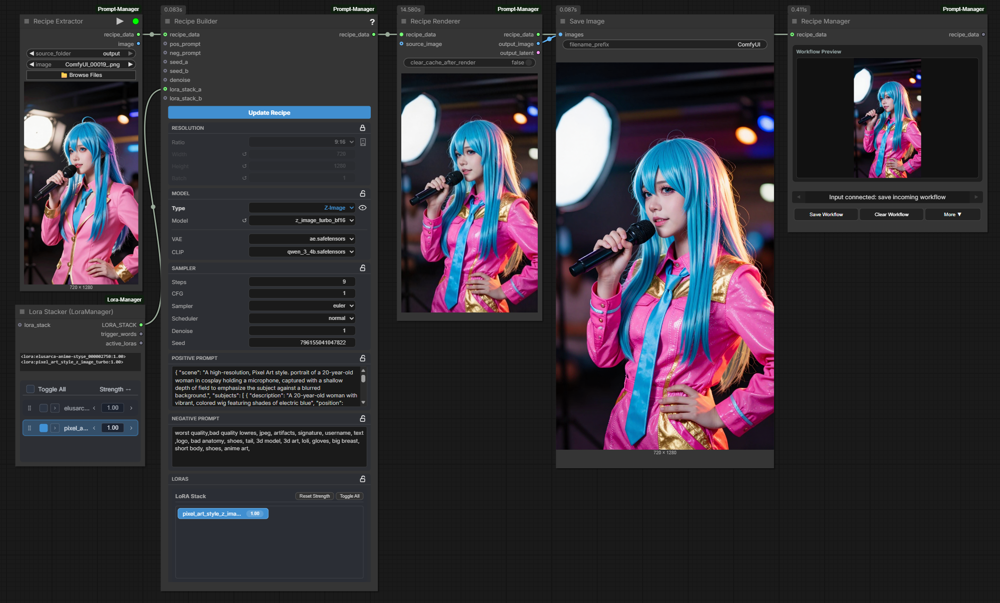
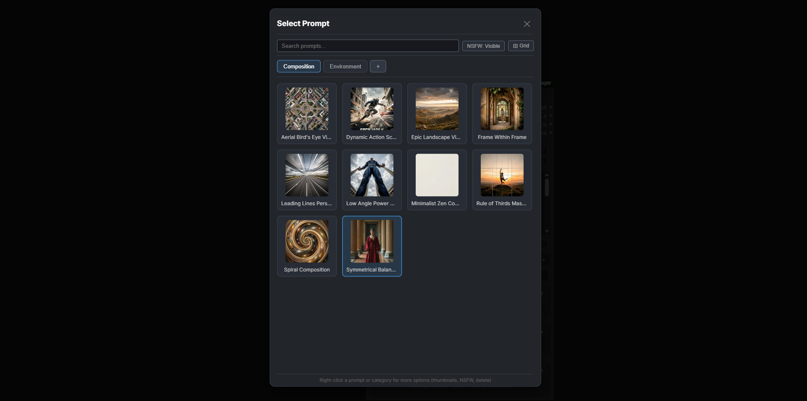
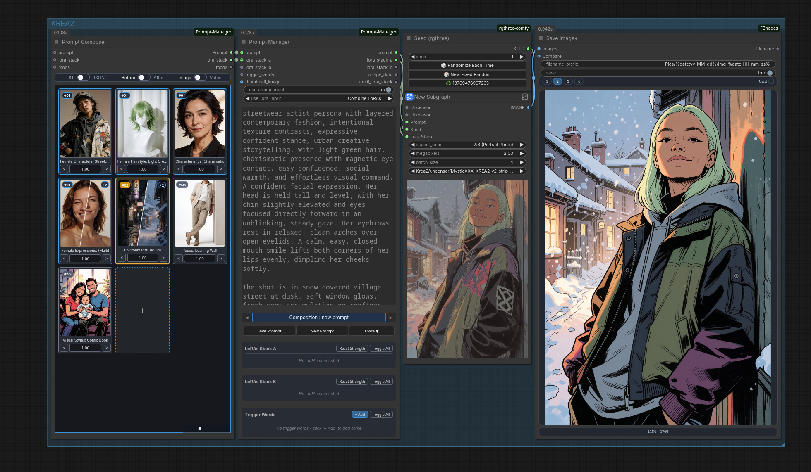
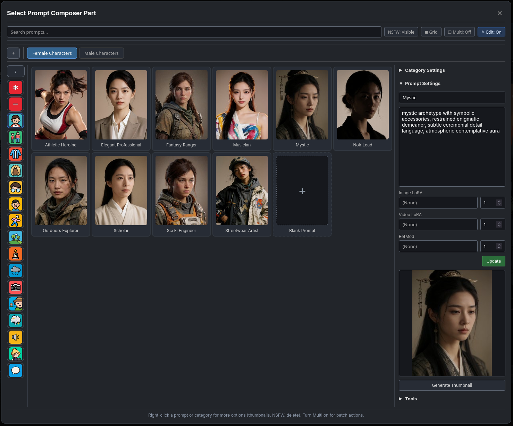

# ComfyUI Prompt Manager
## A comprehensive prompt and recipe toolkit for [ComfyUI](https://github.com/comfyanonymous/ComfyUI)

ComfyUI Prompt Manager is a prompt toolkit for ComfyUI. It helps you manage, save, and reuse prompts along with their LoRAs and trigger words. It can generate prompts using a local LLM through llama.cpp or Ollama, or generate them directly with ComfyUI’s own CLIP/text encoders. It also extracts metadata from images, videos, and JSON files, so you can turn them into reusable prompts — and it includes a prompt browser and save/load tools to keep everything organized.

[See Installation Guide](#installation)

[See Node Reference](docs/feature-reference.md)

[See Prompt Composer](#prompt-composer)

## What This Provides

- **Prompt Manager**:
  - For saving and loading Prompts.
  - These saved prompts can include LoRA stacks, trigger words, as well as thumbnails.
- **Prompt Generator**:
  - To run a local LLM (llama.cpp or Ollama), or directly use ComfyUI's CLIP/text encoders.
  - Also supports image analysis when using Vision Capable models.
- **Prompt Browser**:
  - For viewing or editing all data types used by the add-on.
  - This node is how one modifies System Prompts used by **Prompt Generator**.
- **Prompt Composer**:
  - For building prompts from reusable prompt fragments such as attire, expression, action, style, ambience, and more.
  - Supports prompt fragment libraries with thumbnails, types, LoRAs, RefMods, random multi-prompt selection, subject grouping, and video/image composition modes.
- **Prompt Extractor**:
  - Read metadata from images/videos/JSON and output the prompt and LoRAs they use.
- **Lora Preview integration**:
  - When [Lora-Manager](https://github.com/willmiao/ComfyUI-Lora-Manager) is installed, LoRAs can be previewed on hover.
- **Advanced media loading**:
  - Extractor nodes can also act as advanced image loaders, but I'd recommend [FBNodes](https://github.com/FranckyB/ComfyUI-FBnodes) for better solutions.
- **And more**:
  - See the [Reference guide](docs/feature-reference.md) for a complete list.
---

<div align="center">
  <figcaption>Prompt Creation With Lora and Trigger Words</figcaption>
  
</div>

<div align="center">
  <figcaption>Generating Prompts based on Images</figcaption>
  
</div>

<div align="center">
  <figcaption>Advanced Prompt Generation using Multiple Images</figcaption>
  
</div>

<div align="center">
  <figcaption>Recipe extraction and modification (Adding a Style LoRA)</figcaption>
  
</div>

<div align="center">
  <figcaption>Easily find saved Prompts & Recipes using the Built-in File Browser</figcaption>
  
</div>


## Toolset Overview

### Prompt Toolset

- Prompt Manager: Supports Prompts, LoRA stacks, trigger words and thumbnail for workflows.
- Prompt Manager (Basic): Simple no-frills basic version (The OG).
- Prompt Generator: prompt creation and enhancement using llama.cpp, Ollama, or a connected ComfyUI CLIP/text encoder.
- Prompt Extractor: Reads metadata from images/videos/JSON and outputs prompt + LoRA + recipe context.
- Prompt Composer: Build prompts from reusable fragments, with random prompt groups, subject-aware composition, LoRA/RefMod support, and image/video generation modes.
- Prompt Browser: A node meant to allow access and write prompts for:
  - System Prompts used by Prompt Generator.
  - Compose Data used by Prompt Composer.
  - Prompt Data used by our Prompt Manager.

### Recipe Toolset (Experimental)
These tools were an experiment, with some of the tech now used in other parts of the add-on.
- Recipe Extractor: normalizes extracted metadata into reusable recipe_data.
- Recipe Builder: edit and validate recipe_data in a cleaner authoring surface.
- Recipe Renderer: execute recipe_data through built-in generation templates.
- Recipe Hub: merge/append model blocks into one `recipe_data` and expose each model block as its own output.
- Recipe Relay: edit one model block (`model_data`) with seed and LoRA stack overrides.
- Recipe Model Loader: resolve and load models from recipe_data.
- Recipe Manager: save and reuse recipe entries.

## Workflow Examples

Workflow examples are provided to help understand the basics.

## Preferences And Settings

- Addon settings are available in ComfyUI Preferences (Settings) under Prompt Manager.
- This is where you set model/backend defaults, NSFW visibility defaults, view preferences, and more.
- If you want the Prompt Generator dropdowns to show only your local models, enable `Hide downloadable built-in models` in these settings.
- Prompt Generator backend choices (llama.cpp, Ollama) and related options are configured there.
- The Prompt Generator's system prompts are fully user-customizable. They're stored in `user/default/prompt_generator_data.json` and can be created and edited with the **Prompt Browser** — your custom prompts then show up directly in the Prompt Generator node. (Press r for refresh if not visible)

## Documentation

- Detailed node reference: [docs/feature-reference.md](docs/feature-reference.md)

## Prompt Composer

Prompt Composer is a visual prompt builder for assembling full prompts from reusable fragments such as characters, expressions, attire, action, lighting, ambience, style, environment, and camera.

- Compose output before or after an incoming prompt, or use it on its own.
- Return output as plain text or JSON.
- Works in both image and video modes. The Video mode being formatted for Minimax.
- Prompt fragments can include LoRAs, RefMods, and thumbnails can be generate easily.
- Categories support prompt types and prefixes for cleaner browsing and formatting.
- Multi-select can become one random pool or multiple separate prompt parts.
- Parts support subject-aware grouping, muting, reordering, merge/split actions, and per-part strength.
- Prompt Browser integration supports direct editing, category settings, thumbnail generation, and reopen behavior that preserves browser state.

Node-side Prompt Composer controls include:

- Click a fragment to edit or replace it.
- Middle click to mute or unmute a fragment.
- Ctrl-click to select multiple parts, then right-click to merge compatible selections.
- Right-click a merged part to split it back into separate prompts.
- Drag and drop parts to reorder them.
- Adjust fragment strength directly on the card.

<div align="center">
  <figcaption>Use Prompt Composer to build prompts from reusable fragments, including random multi-prompt groups.</figcaption>
  
</div>

<div align="center">
  <figcaption>Edit prompts in the browser, attach LoRAs or RefMods, and generate thumbnails for any prompt.</figcaption>
  
</div>


The **Prompt Browser Node** lets you create and edit all three prompt libraries from a single interface:
  - **System prompts**: the instructions that steer the Prompt Generator's LLM
  - **Compose prompts**: Prompt Composer fragment libraries, including category types, thumbnails, LoRAs, and RefMods
  - **Prompt Manager prompts**: your saved user prompts

System prompts now feed straight into the **Prompt Generator**, so you can author your own and pick them right in the node. Sample system prompts ship in the node's `/prompts` folder to get you started. If new prompts are added and you don't have them, you can use the Prompt Browser's Import JSON feature to add them.

## Installation

1. Navigate to your ComfyUI custom nodes directory:
   ```
   cd ComfyUI/custom_nodes/
   ```
2. Clone this repository:
   ```bash
   git clone https://github.com/FranckyB/ComfyUI-Prompt-Manager.git
   ```
3. Install dependencies:
   ```bash
   cd ComfyUI-Prompt-Manager
   pip install -r requirements.txt
   ```
4. Install [llama.cpp](https://github.com/ggml-org/llama.cpp/tree/master):
   - Windows:
     ```bash
     winget install llama.cpp
     ```
   - Linux:
     ```bash
     brew install llama.cpp
     ```
5. Place custom `.gguf` models in models/gguf.
   - Or use preferences to set a custom path.
6. Restart ComfyUI.

**Using the CLIP/text encoder backend**: No additional setup is needed. Connect any ComfyUI `CLIP` output to the Prompt Generator node's `clip` input. When `clip` is connected, the node bypasses llama.cpp/Ollama and generates prompts directly through the text encoder.


**Data Location**
All data generated by the nodes is saved under user/default folder. The data is saved in JSON format and the thumbnail data is also included, saved as base64 data URL. The node creates a backup folder that keeps 5 daily copies in the hope of preventing any mishap. As the node supports exporting the JSON, be safe and make backups from time to time.

## Requirements
- huggingface_hub
- llama-server, Ollama or Comfy's text encoders (Much Slower)
