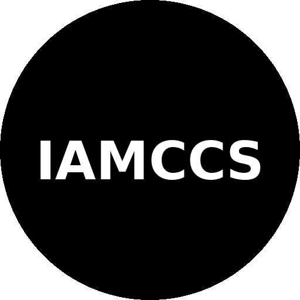
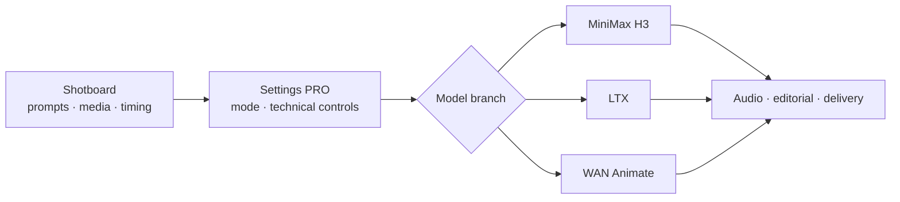
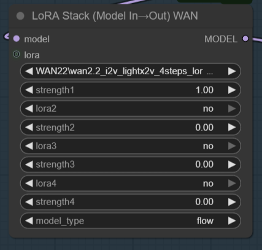
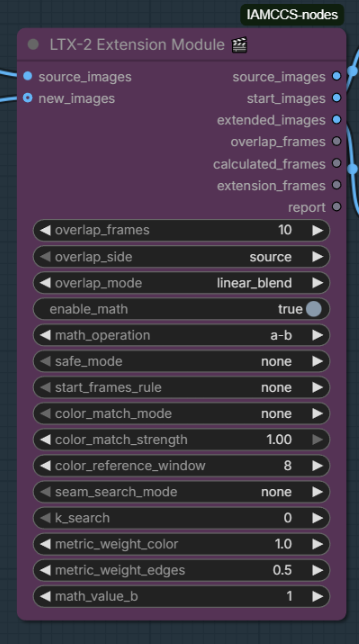
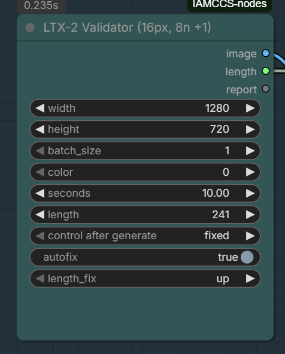
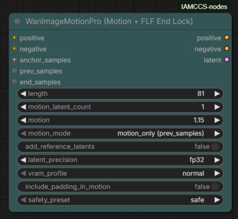
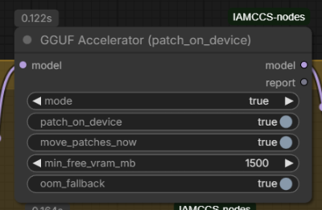
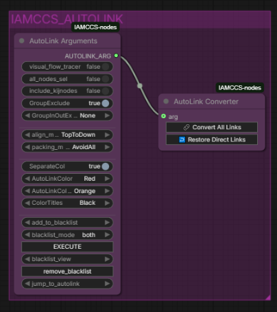
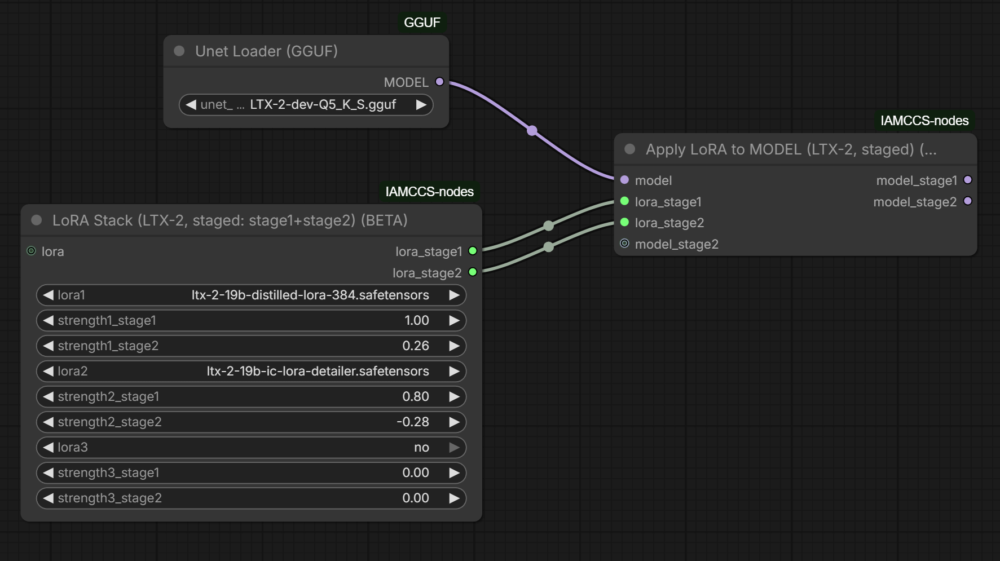

<p align="center">
  
</p>

# IAMCCS Nodes

**A production-oriented collection of ComfyUI nodes for image generation, AI video, audio, continuity and editorial workflows.**

IAMCCS Nodes turns complex model pipelines into readable production systems. Use it to plan a sequence in a Shotboard, define its technical behaviour in one settings surface, generate with the model branch you need, and carry media, prompts and timing through delivery without losing the context that makes a shot coherent.

[Patreon](https://www.patreon.com/IAMCCS) · [Website](https://carminecristalloscalzi.com/) · [Buy Me a Coffee](https://www.buymeacoffee.com/iamccs) · [goyAIcanvas perpetual licence](https://iamccs.gumroad.com/l/goyAIcanvas-advanced?layout=profile)

> **Start with the system that matches the model you are using.** The package contains many composable utility nodes, but the featured systems below are the clearest entry points for a new workflow.

## Production systems

### 1. MiniMax H3 Shotboard

The H3 Shotboard is the planning surface for MiniMax H3 workflows. It keeps the authored sequence together: global direction, local shot prompts, media slots, timing, audio handoff and continuity information. The Shotboard is the source of truth for the sequence; connected renderer branches consume that plan instead of maintaining a separate, hidden version of it.

Use it for:

- first/last-frame and reference-led video shots;
- multi-shot and long-form H3 sequences;
- local prompt direction per interval, with a global creative direction above it;
- native AV delivery, continuity-aware paths and editorial handoff;
- repeatable seed policies for a whole generation or for individual chunks.

**Key nodes:** `IAMCCS_ShotboardH3Settings`, `IAMCCS_ShotboardH3SettingsPro`, MiniMax H3 planner, audio timeline and delivery nodes.

### 2. IAMCCS H3 Settings PRO

`IAMCCS_ShotboardH3SettingsPro` is the technical control room for an H3 Shotboard. It centralises the choices that should travel with the project: task and delivery mode, dimensions, frame rate, duration, seed policy, supported acceleration profile, continuity options and editor-facing controls.

The purpose is practical: a preset is a visible starting configuration, while its values remain inspectable and editable. Settings PRO publishes its resolved configuration through CineLinX so connected H3 branches stay aligned with the active Shotboard.

### 3. LTX Shotboard and long-video toolkit

The LTX family brings the same production approach to LTX workflows. The LTX 2.5 Shotboard accepts a timed image plan, per-segment direction and an optional animated bounding-box project, then compiles the plan for the downstream animator and LTX video path.

The surrounding LTX nodes cover the operational work needed by real projects: frame-rate and frame-count validation, first/last-frame control, latent continuation, overlap conditioning, disk-backed extension and LoRA stacks.

**Key nodes:** `IAMCCS_CineShotboardPlannerV3B`, `IAMCCS_LTX2_Validator`, `IAMCCS_LTX2_FrameRateSync`, `IAMCCS_LTX2_ExtensionModule`, `IAMCCS_LTX2_JointRefreshLatent`.

> The LTX 2.5 BBox Shotboard expects compatible LTX Video and BBox Animator nodes to be installed in ComfyUI.

### 4. WAN Animate LoRA system

The original IAMCCS node family solves a frequent native WAN Animate problem: a LoRA may appear connected while most of its weights are not actually applied. The WAN LoRA system remaps and stacks compatible LoRAs, injects them directly into the model, and can vary them safely across a long generation loop.

Use the basic stack and apply pair for a compact graph, or add the Model In→Out, scheduled and runtime-bridge variants for phased animation work.

**Key nodes:** `IAMCCS_WanLoRAStack`, `IAMCCS_ModelWithLoRA`, `IAMCCS_WanLoRAStackModelIO`, `IAMCCS_WanLoRASchedule`, `IAMCCS_WanLoRAHookSchedule`, `IAMCCS_WanLoRARuntimeBridge`.

### 5. Motion, audio and finishing

IAMCCS Nodes also includes the practical building blocks around a generation:

- **WAN motion:** `IAMCCS_WanImageMotion` and `WanImageMotionPro` provide controllable motion, optional FLF end-lock and conservative safety presets.
- **Audio and editorial:** AudioBoard, dialogue tools, timeline mixing, master-audio export and Shotboard Video Editor nodes keep audio and picture on the same timeline.
- **Low-VRAM delivery:** frame-by-frame VAE decode to disk, tiled decode, progressive and post-upscale routes, and VRAM cleanup nodes reduce peak memory pressure.
- **Workflow clarity:** AutoLink turns dense direct wiring into organised Set/Get routes, while CineLinX carries structured project information between IAMCCS systems.
- **Model utilities:** GGUF acceleration, hardware recommendations, sampler controls and LoRA management make larger graphs easier to operate and diagnose.

## A clear way through the package



The planning layer carries the authored intent. The connected model branch performs the generation, while the shared editorial and delivery tools keep the result usable as a production asset.

| Your goal | Start here | Add when needed |
| --- | --- | --- |
| Plan and generate a MiniMax H3 sequence | H3 Shotboard + H3 Settings PRO | Audio timeline, continuity, delivery and editor tools |
| Create a timed LTX shot with image control | LTX 2.5 Shotboard | BBox direction, validators, extension and latent continuity |
| Animate a WAN workflow with reliable LoRAs | WAN LoRA Stack + Apply LoRA to MODEL | Schedules, hook schedules and runtime bridge |
| Increase controlled motion in a WAN shot | WanImageMotion / WanImageMotionPro | FLF end-lock, reference latents and safety preset |
| Finish a long video on limited memory | VAE Decode to Disk + Video Combine From Dir | Tiled decode, VRAM flush and upscaling |
| Keep a large graph readable | AutoLink | Bus groups and named Set/Get routes |

## Node previews

The screenshots below are real nodes from this package. They are included here so the README acts as a visual map rather than a long unstructured inventory.

<table>
  <tr>
    <td width="50%" valign="top">
      <a href="assets/lora%20stack.png"></a><br />
      <strong>LoRA Stack (WAN-style remap)</strong><br />
      Combines WAN, Flow and compatible LoRAs before native model injection.
    </td>
    <td width="50%" valign="top">
      <a href="assets/lora_stack_model_I_O.png"></a><br />
      <strong>LoRA Stack (Model In to Out) WAN</strong><br />
      A direct model-to-model variant for concise WAN Animate graphs.
    </td>
  </tr>
  <tr>
    <td width="50%" valign="top">
      <a href="assets/extension.png"></a><br />
      <strong>LTX-2 Extension Module</strong><br />
      Builds a controlled extension plan with overlap, source handling and seam-related options.
    </td>
    <td width="50%" valign="top">
      <a href="assets/validator.png"></a><br />
      <strong>LTX-2 Validator</strong><br />
      Keeps resolution, duration and frame-count requirements visible before sampling.
    </td>
  </tr>
  <tr>
    <td width="50%" valign="top">
      <a href="assets/wanimagemotionpro.png"></a><br />
      <strong>WanImageMotionPro</strong><br />
      Motion control with optional FLF end-lock, reference latents and safety controls.
    </td>
    <td width="50%" valign="top">
      <a href="assets/gguf.png"></a><br />
      <strong>GGUF Accelerator</strong><br />
      Helps manage patch placement and VRAM reserve in GGUF-based pipelines.
    </td>
  </tr>
  <tr>
    <td width="50%" valign="top">
      <a href="assets/autolink.png"></a><br />
      <strong>AutoLink</strong><br />
      Converts direct links into organised Set/Get routes and can restore them when needed.
    </td>
    <td width="50%" valign="top">
      <a href="assets/stage.png"></a><br />
      <strong>LTX-2 staged LoRA workflow</strong><br />
      Supports multi-stage LoRA application for more deliberate LTX setups.
    </td>
  </tr>
</table>

## goyAIcanvas

**goyAIcanvas** is the companion local-first image workspace for IAMCCS users. It is built around ComfyUI and focuses on direct image creation and editing: text-to-image, image-to-image, drawing, inpainting, outpainting, references, layers, LoRAs, gallery history and image correction.

- [goyAIcanvas EASY on GitHub](https://github.com/IAMCCS/IAMCCS_goyAIcanvas-easy) is the public standalone entry point.
- [goyAIcanvas Advanced on Gumroad](https://iamccs.gumroad.com/l/goyAIcanvas-advanced?layout=profile) is the perpetual-licence image generator and editor studio.
- [goyAIcanvas updates and editions on Patreon](https://www.patreon.com/iamccs/posts/goyaicanvas-next-168753166) describe the current production tiers and ongoing development.

The IAMCCS Nodes package also exposes the Goya canvas integration node used by compatible local workflows.

## Installation

### ComfyUI Manager

Install **IAMCCS Nodes** from ComfyUI Manager, then restart ComfyUI and refresh the browser once. The package should exist only once in `custom_nodes`; duplicate copies can cause old node definitions or frontend routes to load.

### Manual installation

```powershell
cd <your-ComfyUI-folder>\custom_nodes
git clone https://github.com/IAMCCS/IAMCCS-nodes.git
```

Restart ComfyUI after installing or updating. If the node UI looks stale, perform a hard browser refresh after the restart.

### Before loading a workflow

1. Install the model-specific dependencies required by that workflow.
2. Put model, VAE, text-encoder, LoRA and audio files in the normal ComfyUI model paths.
3. Start with the workflow's intended resolution, frame count and model family.
4. Test a short single segment before enabling long-video, upscale or continuation routes.

IAMCCS Nodes does not ship model weights. Every model, LoRA, VAE, audio model and external node remains subject to its own licence and requirements.

## Documentation and workflow guidance

- [SuperNodes requirements](SUPERNODES_REQUIREMENTS.md)
- [H3 continuation quickstart — Italian](docs/H3_CONTINUATION_QUICKSTART_IT.md)
- [H3 continuation guide for filmmakers — Italian](docs/H3_CONTINUATION_FILMMAKER_POST_IT.md)
- [H3 Pixel Safe continuation reference](docs/H3_PIXEL_SAFE_CONTINUATION_REFMOD.md)
- [Complete change history](CHANGELOG.md)

For workflow releases, detailed setup notes and tutorials, follow [IAMCCS on Patreon](https://www.patreon.com/IAMCCS) or visit [carminecristalloscalzi.com](https://carminecristalloscalzi.com/).

## Support and releases

IAMCCS Nodes is actively developed. Patreon is the main place for release posts, workflows, technical notes and the wider IAMCCS AI-cinema ecosystem. If the project helps your work, you can also support it through [Buy Me a Coffee](https://www.buymeacoffee.com/iamccs).

<details>
<summary><strong>Recent release history</strong></summary>

<br />

| Release | Date | Highlights |
| --- | --- | --- |
| **1.5.5** | 2026-09-19 | MiniMax H3 engine integration and project licensing documentation. |
| **1.5.2** | 2026-08-24 | H3 audio-drive, audio-timeline and Shotboard workflow polish. |
| **1.5.1** | 2026-07-21 | Multigen roll, master-audio EDL export and AudioBoard UX. |
| **1.5.0** | 2026-07-12 | Shotboard multigen pipeline, Video Editor and AudioBoard. |
| **1.4.x** | 2026 | LTX audio extensions, low-RAM utilities, SuperNodes and cinematic helpers. |
| **1.3.x** | 2026 | WAN motion controls, AutoLink, LTX extension modules and LoRA workflow tools. |

See [CHANGELOG.md](CHANGELOG.md) for the complete chronological record.
</details>

## Licence

This repository is released under the [GNU GPL v3.0](LICENSE). Preserve the included licence and attribution notices when redistributing or modifying the package.

---

Created by **IAMCCS / Carmine Cristallo Scalzi** · [Patreon](https://www.patreon.com/IAMCCS) · [Website](https://carminecristalloscalzi.com/) · [Gumroad](https://iamccs.gumroad.com/)
