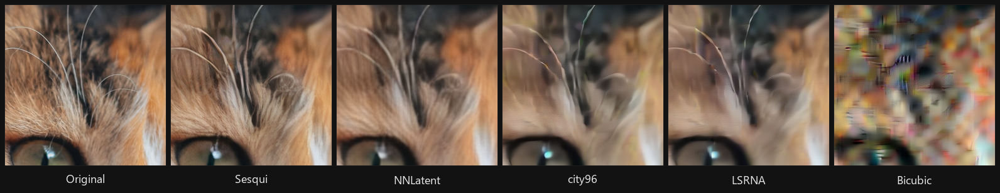
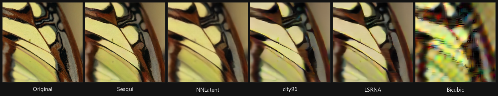
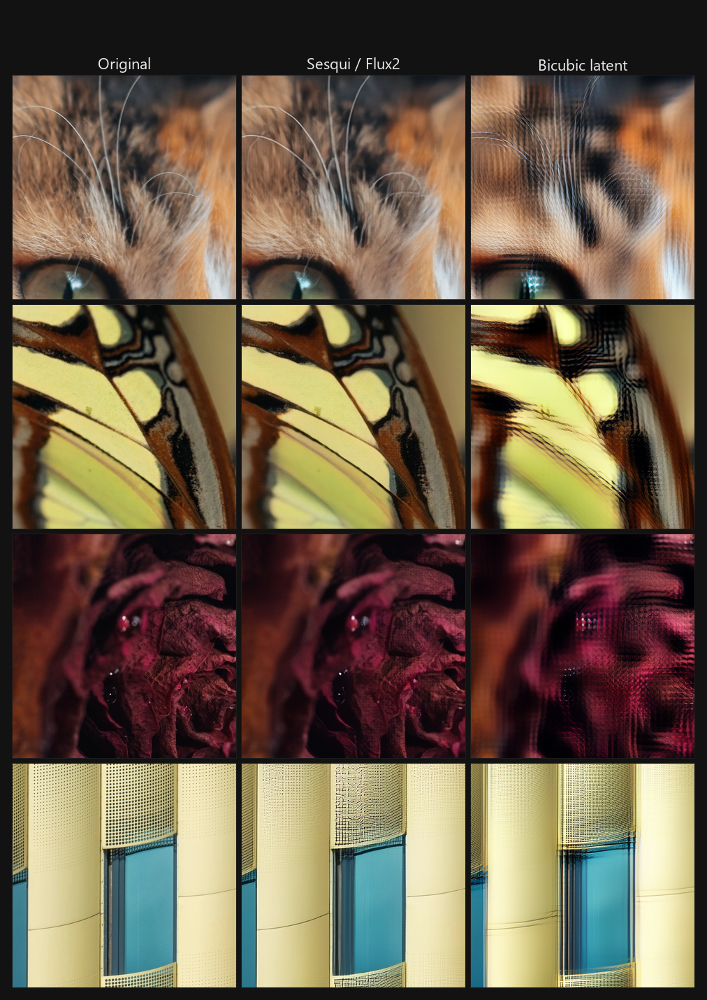

# SesquiLSR

Latent upscaler supporting arbitrary scales between 1.0-2.0x for various models/VAEs. The name comes from *sesqui*- (Latin for "one and a half"); the original model was a fixed 1.5x upscale using rational resampling. The current architecture uses the same principle: PixelShuffle to 2x then learned downsampling to the target size. I kept the name as it remained relevant (at least in spirit).

## Features

- **Multi-model support** - SDXL, Flux, Z-Image Turbo, Flux2 Klein, Krea 2, Wan 2.1, Qwen Image and Anima from a single architecture
- **Arbitrary scale** in [1.0x, 2.0x] - not limited to fixed 2x
- **~3M parameters, ~12MB weights** across all variants
- **Sub-6ms inference** in latent space, with no VAE round-trip
- **ComfyUI node included** - drop-in, no model or VAE connection required

## Use case

Sesqui is not meant to replace full-blown GAN-based upscaling pipelines. Instead, it should be used in place of "raw" latent upscaling via bilinear or bicubic in preparation for additional denoising. 

Naive interpolation damages the latent, so the output image requires high denoising strength (>= 0.5) to recover. A learned upscaler like Sesqui produces cleaner latents that need less refinement in the second pass.

## Supported models with pretrained weights

All weights can be found in the `models/` folder of this repository.

| VAE | Models | Weight file |
|---|---|---|
| SDXL | SDXL | `upscaler_SDXL.safetensors` |
| Flux | Flux, Z-Image Turbo, Lumina | `upscaler_Flux.safetensors` |
| Flux2 | Flux2, Flux2 Klein, Ideogram 4 | `upscaler_Flux2.safetensors` |
| Wan | Wan 2.x, Krea 2, Anima, Qwen Image | `upscaler_Wan21.safetensors` |

Each model is trained on VAE latents directly. The format adaptors handle any pipeline-level transforms (such as patchification/batch norm) so the upscaler always operates in clean VAE latent space. We do this so the upscalers don't need retraining when a new model is released that uses an existing VAE, it just needs a new adaptor (and sometimes not even that).

## Quick start

```python
import torch
from safetensors.torch import load_file
from sesqui_lsr import LatentUpscaler

model = LatentUpscaler(in_channels=4)
state_dict = load_file("models/upscaler_SDXL.safetensors")
model.load_state_dict(state_dict)
model.eval().requires_grad_(False)

latent = torch.randn(1, 4, 128, 128)          # SDXL 1024px (8x downsampled latent)
target_size = (192, 192)                      # upscale to 1536px
with torch.no_grad():
    upscaled = model(latent, target_size)     # -> (1, 4, 192, 192)
```

### ComfyUI installation
```
cd ComfyUI/custom_nodes
git clone https://github.com/LoganBooker/SesquiLSR.git
```

The node is accessible under `latent/upscaling/Upscale Latent (SesquiLSR)`. The node handles latent upscaling and format conversion internally.

## Format adaptors

Some pipelines transform the VAE output before passing it to the diffusion model. An adaptor converts between the pipeline's latent format and the raw VAE latent space that Sesqui operates on. They require no arguments - just pick the one matching your model:

```python
from sesqui_lsr import make_identity, make_flux2, make_wan21

adaptor = make_identity(4)  # SDXL, Flux, Lumina, Z-Image
adaptor = make_flux2()      # Flux2
adaptor = make_wan21()      # Wan 2.1, Qwen Image, Anima

# Use it
upscaled = adaptor.from_vae_latent(
    model(
        adaptor.to_vae_latent(latent),
        adaptor.vae_target_size(target_size),
    )
)
```

## Benchmarks

Each test image is Lanczos-downsampled to the low-resolution size, encoded to a latent via the VAE, upscaled by the method, decoded back to pixels, and compared against the **original high-resolution image**. This measures the full pipeline quality including VAE reconstruction loss. Metrics are computed using [pyiqa](https://github.com/chaofengc/IQA-PyTorch).

- Test images: 4 images at 1024x1024, centre-cropped to 768x768 (sourced from the [pseudo-camera-10k](https://huggingface.co/datasets/bghira/pseudo-camera-10k) dataset).
- Scales: 1.5x, 2.0x
- Precision: fp32, batch size 1
- GPU: NVIDIA GeForce RTX 5090 Laptop (24GB)

### At a glance: 1.5x latent upscaling

| Model | Sesqui LPIPS ↓ | Bicubic LPIPS ↓ | Improvement |
|---|---:|---:|---:|
| SDXL | 0.1249 | 0.4484 | 72% lower |
| Flux | 0.0974 | 0.2915 | 67% lower |
| Flux2 | 0.0587 | 0.1732 | 66% lower |
| Wan 2.1 | 0.0919 | 0.1909 | 52% lower |

### SDXL comparison with other latent upscalers

SDXL is useful for direct comparison because latent upscaler alternatives exist for it. `★` marks the best value among learned latent methods.

| Method | Params | 1.5x LPIPS ↓ | 1.5x PSNR ↑ | 2.0x LPIPS ↓ | 2.0x PSNR ↑ |
|---|---:|---:|---:|---:|---:|
| **Sesqui** | 3.07M | ★ 0.1485 | 26.06 | ★ 0.1988 | 25.09 |
| NNLatent | 6.27M | 0.2350 | ★ 26.56 | 0.3158 | ★ 25.60 |
| city96 v2.1 | 0.60M | 0.3265 | 23.72 | 0.3809 | 22.79 |
| LSRNA | 1.29M | 0.3439 | 23.00 | 0.3696 | 22.71 |

PSNR measures exact pixel reconstruction, while LPIPS better reflects perceptual similarity. Sesqui trades a small amount of PSNR for much, much lower LPIPS, which corresponds to cleaner perceptual detail in the visual comparisons.

## Visual comparison

### SDXL, 2.0x
Useful for direct comparison because other upscalers exist for it. These strips compare the same crop across Sesqui, NNLatent, city96, LSRNA, and Bicubic.





- Sesqui achieves 37% lower LPIPS than NNLatent at 1.5x (0.1485 vs 0.2350) while remaining in the same PSNR range.
- Sesqui is about 2.2x faster than NNLatent and about 3.5x faster than LSRNA.

### Flux2, 2.0x
Sesqui is capable of substantially cleaner output than the SDXL comparison table alone suggests. This Flux2 comparison shows four image types against the original HR target and a bicubic latent baseline.



At 2.0×, Sesqui scores LPIPS 0.1031 versus 0.2817 for bicubic latent upscaling (63% lower). Again, Sesqui favours perceptual detail (texture) over strict pixel accuracy (structure), hence the weaker reconstruction of the fine grid in the building image, but excellent results in the other three crops.

## Training

This section provides a general overview of the training methodology; training code will be released once I've cleaned it up.

### Multi-stage training

Each model is trained in 1-3 progressive stages, where later stages finetune from the previous stage's weights with different loss configurations and lower learning rates. This approach was inspired by the findings in "[One Small Step in Latent, One Giant Leap for Pixels: Fast Latent Upscale Adapter for Your Diffusion Models](https://arxiv.org/abs/2511.10629)".

All stages use batch size 1, random 512x512 HR crops with log-uniform scale sampling in [1.0, 2.0]. The first stage uses latent and FFT loss, the second latent and multi-band pixel loss, with the third depending on the type of model but usually some combination of pixel loss, 1-2 perceptual losses and DC shift loss (for SDXL to combat hue shift). Luminance-based sharpening is also used on HR targets during the last stage to promote sharper outputs from the upscaler.

A modified version of Meta's Schedule-Free AdamW is used as an optimizer.

Total training time and steps varies from model to model; the shortest being 50 minutes (one stage, 25k steps), and the longest 6 hours, 30 minutes (three stages, ~155k steps). All models were trained on a single 5090 laptop GPU.

## ComfyUI node parameters

- **model_format**: The VAE latent configuration. **Must match the incoming latent.**
  - `SDXL`: SDXL only; not compatible with SD 1.5.
  - `Flux`: Flux, Z-Image Turbo, Lumina.
  - `Flux2`: Flux2, Flux2 Klein; BN-packed latent.
  - `Ideogram 4`: Flux2 VAE; shift/scale-packed latent.
  - `Wan 2.1`: Wan 2.x, Krea 2, Anima, Qwen Image.
- **scale**: Target scale factor between [1.0, 2.0]. Default `1.5`, step `0.05`.
- **half_precision**: Default `on`. Loads the upscaler model in bf16 (fp16 if unsupported). Half-precision has no effect on quality and should be left on, however the setting is available for debugging purposes.
