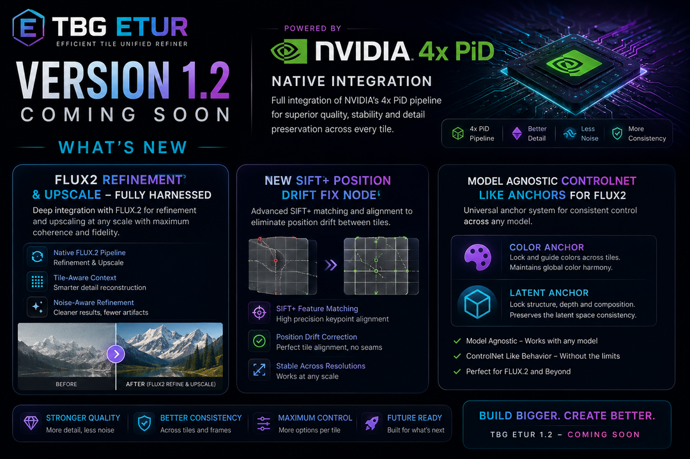

# TBG ETUR Version 1.2 dropped - What's New?
**TBG_Enhanced Tiled Upscaler & Refiner V1.2**
Ideogram4,Qwen,Z-Image,Flux1+2,Sdxl snd Sd3 and more model familys
  
**Keep in mind this is still a beta version, and we're updating and fine-tuning it daily. So do the same**

Tutorials of old version and highlights available at [Youtube@TBG_AI](https://www.youtube.com/@TBG_AI)). 

and at [patreon@TB_LAAR](https://www.patreon.com/TB_LAAR)). 


## TBG ETUR 1.2

Last version v1.2.11, released on **June 13, 2026 at 20:25 CEST (UTC+2)**.

This is a major feature update over the public 1.1.18 version. We're breaking free from ETUR and turning the best knowledge into lightweight, standalone nodes. Check out all the new takeaway nodes we've added!

### Highlights

- NVIDIA PiD can now be used as a dedicated tiled image or latent upscaler.
- Flux 2 and Flux 2 Klein now have a more complete harness for refinement and upscaling.
- Tile Overrides gained per-tile CFG, model overrides, ControlNet support, selective color matching, and an option to ignore the global prompt per tile.
- Batch image processing is now supported with better VRAM efficiency.
- Tile-aware color correction and geometry drift correction improve consistency across tiled generations.
- Segment processing, cache invalidation, and final PiD compositing were optimized for reliability and performance.
- Qwen VLM and reasoning outputs are handled more consistently.
- Worker lifecycle management is more robust, including startup, shutdown, and stale-worker cleanup.

### New Standalone Nodes

We also extracted a number of important ETUR features into standalone custom nodes so you can reuse the best parts without depending on the full ETUR graph:

- TBG ETUR Download PiD Model
- TBG ETUR tiled Nvidia PID Image Upscale
- PiD SDE sampler
- TBG Flux2 Differential Diffusion Inpainting
- TBG Color Correction
- TBG SIFT Drift Correction
- Open AI Source Pattern Cleanup
- TBG Model Agnostic Color Anchor
- TBG Model Agnostic Latent Anchor
- TBG ETUR ColorMatch Debug Gates
- TBG Flux2 Sampler

### Workflow Notes

- FLUX 2 Klein without PiD: a small upscale / refinement pass focused on clean tile fusion, the Hildegard LoRA path, and Flux 2 Klein reference handling.
- FLUX 1 + Nvidia PiD: a workflow for per-tile editing, segment-based fixes, and PiD-assisted reconstruction.

### Videos and News

- Release / news post: [TBG ETUR version 1.2.9 update](https://www.patreon.com/TB_LAAR/posts/tbg-etur-version-160118433)
- YouTube channel: [@TBG_AI](https://www.youtube.com/@TBG_AI)
- Demo video: [20 x Super Upscaler - Together TBG ETUR Comfyui](https://www.youtube.com/watch?v=J-BkPLFCB1Y)
- Demo short: [Alfa v1 LIVE: TBG ETUR COMFIUI NODE](https://www.youtube.com/shorts/4zEmUfs8BQM)
- Related workflow guide: [Best Flux Workflow for enhanced refinment up to 100MP](https://www.youtube.com/watch?v=ncoxrwZWJcU)

### Downloads and Workflows

- Source branch for this update: [TBG_ETUR-V1.2](https://github.com/Ltamann/ComfyUI-TBG-ETUR/tree/TBG_ETUR-V1.2)
- Flux 2 Klein workflow: [example_workflows/TBG ETUR PRO - FLUX_2_KLEIN enhanced Upscaler and Refiner Pro.json](example_workflows/TBG%20ETUR%20PRO%20-%20FLUX_2_KLEIN%20enhanced%20Upscaler%20and%20Refiner%20Pro.json)
- Flux 1 workflow: [example_workflows/TBG ETUR PRO - FLUX_1_DEV enhanced Upscaler and Refiner Pro.json](example_workflows/TBG%20ETUR%20PRO%20-%20FLUX_1_DEV%20enhanced%20Upscaler%20and%20Refiner%20Pro.json)
- Community upscaler workflow: [example_workflows/TBG ETUR CE UPSCALER SUPER RESOLUTION.json](example_workflows/TBG%20ETUR%20CE%20UPSCALER%20SUPER%20RESOLUTION.json)

### Bug Fixes v1.2.8

- Fixed the mixed CPU/CUDA tensor crash when using Refiner VAE decode Nvidia PiD with Flux1.


## V3 Migration Status

This branch is migrated to ComfyUI v3 node loading and pins the API import to:

```python
from comfy_api.v0_0_2 import ComfyExtension, io, ui
```

Notes:
- v3-only registration is provided via `comfy_entrypoint()`.
- Legacy `NODE_CLASS_MAPPINGS` loading is no longer the primary path.
- Input ids were normalized to snake_case in the v3 schema layer while keeping display labels.
## Table of Contents
- [Overview](#overview)
- [Early_Access](#Early_Access)
- [Features](#features)
- [Installation](#installation)
- [API_Access](#API_Access)
- [Usage](#usage)
- [TBG_Magnific_Magnifier_Node](#TBG_Magnific_Magnifier_Node)
- [TBG ETUR 1.2.9](#tbg-etur-129)
- [Legacy Changelog](#legacy-changelog)

## Overview

Welcome to **ComfyUI-TBG-ETUR** repository! **TBG Enhanced Tiled Upscaler and Refiner Pro!**
We at **TBG Think. Build. Generate. AI upscaling & image enrichment** are
excited to make our TBG Enhanced Tiled Upscaler and Refiner Pro available to you.

# Current Release

We’re excited to announce that TBG ETUR 1.2.9 is now available for member beta testing,
with the latest workflow and node updates focused on PiD, Flux 2, and tile stabilization.

Please help us to find all Bugs and open an issue here !!!

You can download the latest version of our software here:
[https://github.com/Ltamann/ComfyUI-TBG-ETUR](https://github.com/Ltamann/ComfyUI-TBG-ETUR)
!!! Note: This code is updated daily, so stay tuned for bug fixes !!!

## Early_Access
Get early access by joining us at:
https://www.patreon.com/TB_LAAR

The CE (Community Edition) nodes are free and standalone, suitable for any type of workflow. For access to some PRO features, a TB_LAAR Patreon membership is required. The free version is sufficient for testing and experimenting. Once you become a member, you can obtain your API key:
https://api.ylab.es/login.php 

## Features

**TBG Enhanced Tiled Upscaler and Refiner Pro** is an advanced, modular enhancement suite for **tiled image generation and refinement** in ComfyUI. It introduces neuro generative tile fusion, interactive tile-based editing, and multi-path processing pipelines designed for extreme resolution workflows up to but not limitet to 100MP, high fidelity, and adaptive post-generation control.

- **AI Image Enhancemen**t: Applies advanced algorithms to improve visual quality.
- **High-Resolution Generation**: Creates images with greater clarity and fine detail.
- **Image Polishing**: Enhances visuals for a smooth, finished appearance.
- **Neuro-Generative Tile Fusion**: Seamlessly fuses image tiles into a coherent whole.
- **User-Friendly Interface**: CE version built for straightforward and intuitive use, Pro version offers advanced customization.

## 1. New Fusion Techniques

TBG Enhanced Tiled Upscaler and Refiner Pro introduces tree next-generation tile fusion processes that go far beyond traditional blending:

### Soft Merge CE
Choose between adaptive blending strategies compatible with common upscalers like USDU,and others. It intelligently handles tile compositing recommended for low denoise workflows.
A quick and solid method for getting consistent, high-quality upscales but limited in x factor.

### PRO Neuro-Generative Tile Fusion (NGTF)  
An advanced generative system that remembers newly generated surroundings and adapts subsequent sampling steps accordingly. This makes high-denoise tile refinement possible while maintaining:
- Global consistency  / color / strukture/ now need vor blended borders / no seams
- Sharp, coherent details  
- Memory of contextual relationships across tiles  
- Adds the possibility to generate tiled ultra high res images
- Seamless result's while adding high amount of new details and creative freedom.
Ideal for transforming your image into something new and elevated, without simply recreating what was already there.

## 2. Design Suite

TBG_Enhanced isn’t just about quality — it’s about flexible, curated, and controlled image refinement, where the art director guides the outcome, not the algorithm.

### One-Tile Preview & Smart Presets  
Quickly generate single-tile previews to fine-tune the right settings before running the full job. Presets adapt intelligently to image dimensions and desired resolution.

### Post-Sampling Tile Correction  
You can resample only the tiles you don’t like — no need to regenerate the full image. This allows:
- Precision editing  
- Fixing small errors without full reprocessing  

### Resume Tile Refinement  
Modify or refine individual tiles days later while keeping the original input image and final result. The system supports:
- Saved all single tiles for postproduction 
- Re-injection of noise and conditioning over single tiles


## 3. Pipeline Structure

TBG_Enhanced is powered by a flexible pipeline architecture built around tile-aware processing paths:

### TBG Tile Prompter Pipe  
Access prompt and denoise settings per tile. Enables:
- Per-tile Promt editing    
- Denoising strength by tile  

### TBG Tile Enrichment Pipe  
Control multiple sampling and model-level features:
- Model-side: Use DemonTools for additional detail creation 
- Sampler-side: Inject custom noise at specific steps, or apply a noise injection curves to enhance you image in a more creative way.
- Sampler-internal: Enable per-step sampler-side noise injection eta - gives rhe sampler on each step new addition noise to keep reinventing and defining detail
- Built-in noise reduction: A preprocessing step that softly blurs the image before refinement begins, allowing the model more freedom to generate improved results—especially on broken, noisy, overly sharp, or imperfect inputs.
- Optional tile up/downscaling during sampling to scale higher detailed content and extra sharp final image results

### ControlNet Pipe  
Tiled generation now supports unlimited ControlNet inputs per tile, unlocking:
- High-resolution conditioning  
- Fine-grained control for large images  
- Targeted structure, depth, edge, pose, or segmentation maps for each region  


## Installation
To install the TBG Enhanced Tiled Upscaler and Refiner Pro, follow these steps:

**Install from Comfyui Manager**:

 - Open Manager (In the "config.ini" file located in the ComfyUI\custom_nodes\ComfyUI-Manager\ folder, make sure the **security_level** is set to **weak** if it's not already done.)
 - select Install missing custom nodes
 - search for TGB and install TGB enhancend Upscaler node set or  - copy and paste this url:   [https://github.com/Ltamann/ComfyUI-TBG-ETUR](https://github.com/Ltamann/ComfyUI-TBG-ETUR)
 - Install and Restart ComfyUI

**Manual Install**:

 - Download the Software:  [https://github.com/Ltamann/ComfyUI-TBG-ETUR](https://github.com/Ltamann/ComfyUI-TBG-ETUR)
 - Unpack and Copy to folder: ..\ComfyUI\custom_nodes\
 - Install requirements: ..\ComfyUI\custom_nodes\ComfyUI-TBG-ETUR\pip install -r requirements.txt

**Used models**

Hugging Face model download URLs ( for Flux and Redux you need to accept the license before )

https://huggingface.co/black-forest-labs/FLUX.1-Redux-dev/resolve/main/flux1-redux-dev.safetensors?download=true

https://huggingface.co/Comfy-Org/sigclip_vision_384/resolve/main/sigclip_vision_patch14_384.safetensors?download=true

https://huggingface.co/lllyasviel/flux1_dev/resolve/main/flux1-dev-fp8.safetensors?download=true

https://huggingface.co/Shakker-Labs/FLUX.1-dev-ControlNet-Union-Pro-2.0/resolve/main/diffusion_pytorch_model.safetensors?download=true

https://huggingface.co/jasperai/Flux.1-dev-Controlnet-Upscaler/resolve/main/diffusion_pytorch_model.safetensors?download=true

https://huggingface.co/openai/clip-vit-large-patch14/resolve/main/model.safetensors?download=true

https://huggingface.co/comfyanonymous/flux_text_encoders/resolve/main/t5xxl_fp8_e4m3fn.safetensors?download=true

https://huggingface.co/alimama-creative/FLUX.1-Turbo-Alpha/resolve/main/diffusion_pytorch_model.safetensors?download=true

https://huggingface.co/black-forest-labs/FLUX.1-dev/resolve/main/vae/diffusion_pytorch_model.safetensors?download=true
   

## API_Access
If you like to test the PRO feachers get early access by joining us at:
 - joining us at: https://www.patreon.com/TB_LAAR
 - get your API key from here:  https://api.tbgetur.es/login.php
 - add environment variables using TBG_ETUR_API_KEY = your api key
    
   
You can paste the API key directly into the TBG Tiler node, but keep in mind that doing so will embed it into your images and workflow metadata, making it easy to share unintentionally.
For better security, consider adding the key to your environment variables using TBG_ETUR_API_KEY instead.

   
--------------------------------------------------------------
## Usage
check https://youtu.be/fyQRj5nv1IE

Recommended Workflow:
Do your setup and testing with PRO features turned OFF,
and only enable them for the final steps of your workflow.

Thank you for your support and happy tiling!

## Topics
- ai-image-processing
- ai-upscaler
- comfyui
- comfyui-node
- comfyui-nodes
- high-resolution
- image-refinement
- image-upscaling
- neuro-generative-tile-fusion
- stable-diffusion
- tbg-enhanced-tiled-upscaler-and-refiner-pro
- tiled-upscaling

  
## Legacy PRO Members Nodes

The old TBG_Magnific_Magnifier_Node PRO members nodes were removed after v1.1.0 and are kept here only as historical reference.

## Key Features

- **AI Image Enhancement**  
  Applies advanced algorithms to significantly improve image visual quality.

- **High-Resolution Generation**  
  Produces images with exceptional clarity and fine detail, even at ultra-high resolutions.

- **Image Polishing**  
  Smooths and refines visuals for a clean, professional finish.

- **Neuro-Generative Tile Fusion**  
  Seamlessly fuses tiled images into a coherent, artifact-free whole.

- **User-Friendly Interface**  
  The CE (Community Edition) offers straightforward and intuitive controls, while the PRO version provides extensive customization options for advanced users.

---

## Legacy Changelog
Historical notes from v1.1.0 and earlier:

## 🔹 Historical Notes 1.1.0

- **Up to ~90% Faster Upscaler and Refiner Nodes** – caches results from upscales, tiling, prompts, and tile refinements. Subsequent runs reuse this cached data, drastically reducing processing time while adjusting and fine-tuning settings.

- **VRAM Usage** – ComfyUI + TBG_APP achieves lower memory consumption through conditioning compression, process separation, model unloading, and automatic memory cleanup.

- **Upscalers**

- **Tiled Superresolution Upscales** – memory-efficient superresolution on large images. Includes Tiler SeedVRR, Tiled FlashVSR, and Tiled Waifu.

- **Tiler**

- **Unified Tiler Setting** – provides one setting for compositing and one for fusion, while all other calculations are handled automatically behind the scenes.

- **Intelligent Background Caching** – avoids retiling if upscaled images haven’t changed, saving time and VRAM by reusing cached data for unchanged areas.

- **Simpler On-Click Neuro Generative Fusion** – tile content seamlessly flows between tiles, ensuring invisible seams and consistent surface textures across tiled borders for flawless high-creative refinements.

- **Prompt Generator**

- **More VLMs** – cutting-edge Qwen 3 and the fast Florence 2 models.

- **Way Faster Conditioning** – detects identical conditioning across tiles and calculates each only once, combining steps to reduce VRAM and speed up processing.

- **Selective Tile Prompt Refinement** – refine only specific tiles or redo single tiles one by one, instead of recalculating all tiles.

- **Refiner**

- **Low Memory Mode** – saves 4–10 GB of VRAM during refinement.

- **Fine-Tuned Per-Pixel Denoise Mask** – control refinement intensity and creativity per area of your image using a custom grayscale map.

- **Fine-Tuned Fusion Complexity Mask** – automatically generated mask that stabilizes uniform areas (skies, flat surfaces, backgrounds) to prevent color shifts and noise during tiled refinement. ControlNet-like behavior with zero VRAM cost.

- **Point Grid Image Stabilizer** – automatically generates a point grid that stabilizes colors and image composition. ControlNet-like behavior with zero VRAM cost.

- **GPU-Accelerated Laplacian Pyramid** – achieves faster image compositing with higher quality.

- **LanPaint Integration** – sharpens edges and clarifies textures, producing cleaner, more defined images.

- **Integrated Detail Enhancer** – similar to Res2M part-step noise injection for enhancing details on every sampler.

- **Smoother Shapener** – dual-stage adaptive shaper to smooth images and improve visual consistency.

- **New Color Correction** Methods – Lab, Wavelet, HSV, and AdaIN color adjustments in one unified workflow.

- **Unified TBG-Pipe** – faster and more efficient connection for streamlined processing.

- **Labs Refiner Node** – experimental lab features, cutting-edge tools in testing.

changlog 1.08v3 alfa:

Adaptive Denoise with Complexity Mask (limits freedom on even and uniform regions)

Apple Fast VLM

Per-Pixel Denoise Mask (allows input of a mask to control denoising per pixel, multiplied with the denoise value)

Bug fixes for Generative Tile Fusion (handles cases with only one row or column)

changlog 1.08 alfa V1

Adaptive Denoise with Complexity Mask (limits freedom on even and uniform regions)

Apple Fast VLM

Per-Pixel Denoise Mask (allows input of a mask to control denoising per pixel, multiplied with the denoise value)

changlog 1.07 alfa V1

changlog  1.00
- **New UI** – cleaner and easier to use  
- **Per-tile settings** – each tile can now store its own:  
  - `prompt`  
  - `denoise`  
  - `seed`  
  - `cnet-strength`  
- **Preview mode for tiles** – test one tile, and if you like the result, apply its values (`seed`, `denoise`, `cnet-strength`, `prompt`) to the actual tile  
- **Seed for segments** – finally added! Now it feels like a perfect mix of tiled upscaling + inpainting  
- **Workflow persistence** – inputs (`prompt`, `denoise`, `seed`, `cnet-strength`) are saved to the workflow JSON → you won’t lose them when reloading the browser  
- **Smaller tile previews** – more compact and efficient  

## 🔹 New Features & Integrations  
- **Qwen 2.5 VL + Skycaptioner V1 support**  
- **Refiner seed handling** – copy last used seed; note that the random seed shown is always for the *next* gen, not the one just used  
- **Helper nodes** added  
- **Qwen Image Edit support**  
- **Nunchaku support**  
- **Flux Krea support**  


changlog 1.06 alfa V2.1
add Python 3.13 support for ComfyUI 0.3.50 

changlog 1.06 alfa V2

-Added TBG Detail Enhancer node

-Modified TBG Magnific Magnifier and Enrichment Pipeline to include the Detail Enhancer
-split inventivity in adddetail and resharpen

changlog 1.06 alfa V1

Cleaned up vendor code to reduce namespace conflicts with the ComfyUI manager and custom nodes. Please note that the conflicts shown in the manager are pulled from a static list on the ComfyUI manager’s website and don’t necessarily reflect the actual code installed. I’m also unsure why this node is already listed in the manager’s custom node list, as I never registered it there.

Finetuned Inventivity of TBG Magnific Magnifier
In 1.0.5 versions, external custom nodes were required to inject noise into the sampling process. With the latest **Rebuild Inventivity** update, this is now integrated directly via the `Inventivity` slider. The `Inventivity` slider introduces dynamic noise behavior based on both the **Inventivity** and **Denoise** settings. It combines:
- Per-step latent noise injection  
- Log-sigma manipulation at the model level  
- A poly-exponential curve applied to the sigma tail for controlled creative deviation
  
The effect is **non-linear**, meaning low and high values produce very different results:
- **Low Inventivity values (0.1–0.5):**  
  Softens the output while enhancing subtle details. Useful for maintaining realism with light creative variation.
- **High Inventivity values (0.6–1.0+):**  
  Sharpens the image and enhances crisp, bold features. Great for stylized results.
Results change a lot depending on denoise and cnets ...
You can also plug in a `Float` node to push the `Inventivity` value above `1.0` if needed for more experimental outcomes.

TBG Magnific Magnifier's color correction is now responsive to the denoise setting: at high denoise levels, color correction is minimal or disabled; at low denoise levels, full color correction is applied.

TBG Magnific Magnifier now lets you switch between tiled and full-image refinement (full-image mode depends on your GPU memory and works fine for images up to around 3K resolution).

TBG Magnific Magnifier increments the seed for the next pass to prevent pattern overlays caused by using the same noise in all samples (only affects images that are refined without upscaling).

We’ve rebuilt the enrichment pipeline for TBG ETUR, which serves as the foundation for the inventiveness of the TBG Magnific Magnifier. This update introduces the Resharpener to improve image sharpness, a Creative Sigma Tail to boost creativity in later steps, and a remodified ETA value to inject noise into each sampling process. Activating this node will automatically switch the sampler to Euler Ancestral, or to RES2M if the RES4LYF node is installed. The upcoming Tile Upscale Plus will be available in two variations, one featuring a noise-reduction option that blurs input images before upscaling. Both versions upscale tiles in pixel space before sampling—by the specified factor—and then downsample after sampling to the chosen upscale resolution, resulting in finer detail and increased sampling time.

We removed the split-sigma noise injection and latent-space noise injection methods, as both can be used only fot soft-merge sampling. However, they are incompatible with Tile Fusion and Neuro-Generative Tile Fusion so we removed it from the UI.

changlog 1.05 alfa V3

Resolved issues with membership recognition and ComputeUnit calculation
Fixed guest user access issues
Fixed CE node access for regular users
Fixed an error in the TilerNode that occurred when the input image was smaller than the tile size
Fixed EnhancementPipe — reduced dependency on external custom nodes by trimming features from DeamonTool and FinerDetails
Fixed TBG Magnific Magnifier error related to missing installation of RES4LYF; temporarily replaced RES4LYF's ETA noise injection with DeamonTool

changlog 1.05 alfa V2

SDXL and negative conditioning support have been added to the TBG Magnific Magnifier.

changlog 1.05 alfa

Added the TBG Magnific Magnifier feature exclusively for Pro users.

Fixed bug causing shadow lines on the last tile rows.

Addressed and resolved all Groq-related bug reports.

We removed the cropped tile approach on the last column and last row — these smaller tiles produced less accurate results due to missing fusion information. Now, all tiles maintain the full tile size for better consistency.

changlog 1.04 alfa

New Feature: FLUX KONTEXT Integration in CNETpipe
The biggest highlight is the introduction of FLUX KONTEXT, offering a fully adaptive context pipeline that chains and stiches with ControlNetPipe Depth and Canny.

Mask Attention Completely Overhauled
Mask Attention has been rewritten from the ground up. It now works across both Pro and Community editions. A new border margin setting lets you fine-tune the mask's outer influence zone, and the segment sampling is now fully neuro-generative fusion capable, providing smoother, more organic blending between segments.

Fusion Fixes & Tile Improvements
We've patched several bugs in the Neuro Generative Fusion and Tile Fusion systems. Some users experienced glitches when tile sizes and border areas overlapped teh fusion area - that’s now resolved. Expect cleaner results and better alignment.

Color Glitch Compensation
Color artifacts caused by latent encode/decode are now handled much better. A new feature compensates for these VAE latent color glitches. It was generating faint lines along the tile joints when using high denoise settings.

VLM Switching
You can choose supported VLM backends directly from the node interface, including Qwen, Florence, GGUF, and OpenAI-compatible server options.

Other Fixes and Tweaks
Many small bugs and glitches reported by the community have been addressed — thank you for your feedback! This includes improvements to node stability, UI tweaks, and general robustness across the board.

Give it a spin and let me know how it works for you. Your feedback always helps shape the next version so don’t hesitate to reach out!

New Tile Cache
We've updated the cache function for Soft Merge and Tile Fusion. You can now toggle the cache on or off at any time and choose between two modes:

Full Cache Mode: Uses cached images for everything — including input tiles — allowing you to refine over previous refinements.

Fusion-Only Cache Mode: Uses the original input tile but applies cached tiles only for surrounding areas during fusion.

Due to the complex structure of Neuro Generative Tile Fusion (NGTF), the cache feature isn't yet fully effective for repairing individual tiles in NGTF. This is because overlapping areas from one tile don't directly affect the surrounding tiles without recalculating them too, especially when using higher denoise settings, resulting in imperfect blending.

We're actively working to improve this behavior and aim to address it in the next release.

# Model Download List

## Upscale Models
- [RealESRGAN_x4plus.pth](https://github.com/xinntao/Real-ESRGAN/releases/download/v0.1.0/RealESRGAN_x4plus.pth) (upscale_models)
- [4x_NMKD-Superscale-SP_178000_G.pth](https://huggingface.co/gemasai/4x_NMKD-Superscale-SP_178000_G/resolve/main/4x_NMKD-Superscale-SP_178000_G.pth?download=true) (upscale_models)
- [4x-UltraSharp.pth](https://huggingface.co/madriss/chkpts/resolve/d9ae35349b0cb67e06aebbeb94316827bcd6be4a/ComfyUI/models/upscale_models/4x-UltraSharp.pth?download=true) (upscale_models)
- [4xNomos8kDAT.pth](https://huggingface.co/Maxivi/SDXLModels/resolve/main/4xNomos8kDAT.pth?download=true) (upscale_models)
- [4x_NMKD-Siax_200k.pth](https://huggingface.co/uwg/upscaler/resolve/main/ESRGAN/4x_NMKD-Siax_200k.pth?download=true) (upscale_models)
- [4x_RealisticRescaler_100000_G.pth](https://huggingface.co/Afizi/4x_RealisticRescaler_100000_G.pth/resolve/main/4x_RealisticRescaler_100000_G.pth?download=true) (upscale_models)
- [4x_foolhardy_Remacri.pth](https://huggingface.co/fofr/comfyui/resolve/25913cf4ac3650cceba6ec5a1df1c88da67ed17b/upscale_models/4x_foolhardy_Remacri.pth?download=true) (upscale_models)
- [RealESRGAN_x4plus_anime_6B.pth](https://huggingface.co/ac-pill/upscale_models/resolve/main/RealESRGAN_x4plus_anime_6B.pth?download=true) (upscale_models)

## Diffusion Models
- [svdq-fp4_r32-flux.1-krea-dev.safetensors](https://huggingface.co/nunchaku-tech/nunchaku-flux.1-krea-dev/resolve/main/svdq-fp4_r32-flux.1-krea-dev.safetensors?download=true) (diffusion_models)
- [flux.1-dev-SRPO-BFL-bf16.safetensors](https://huggingface.co/rockerBOO/flux.1-dev-SRPO/resolve/main/flux.1-dev-SRPO-BFL-bf16.safetensors?download=true) (diffusion_models)
- [flux1-dev-Q8_0.gguf](https://huggingface.co/city96/FLUX.1-dev-gguf/resolve/main/flux1-dev-Q8_0.gguf?download=true) (diffusion_models)
- [flux1-kontext-dev.safetensors](https://huggingface.co/Comfy-Org/flux1-kontext-dev_ComfyUI/resolve/main/split_files/diffusion_models/flux1-dev-kontext_fp8_scaled.safetensors?download=true) (diffusion_models)
- [qwen_image_fp8_e4m3fn.safetensors](https://huggingface.co/Comfy-Org/Qwen-Image_ComfyUI/resolve/main/split_files/diffusion_models/qwen_image_fp8_e4m3fn.safetensors?download=true) (diffusion_models)
- [qwen_image_edit_2509_fp8_e4m3fn.safetensors](https://huggingface.co/Comfy-Org/Qwen-Image-Edit_ComfyUI/resolve/main/split_files/diffusion_models/qwen_image_edit_2509_fp8_e4m3fn.safetensors?download=true) (diffusion_models)
- [svdq-fp4_r32-qwen-image-edit-2509.safetensors](https://huggingface.co/nunchaku-tech/nunchaku-qwen-image-edit-2509/resolve/main/svdq-fp4_r32-qwen-image-edit-2509.safetensors?download=true) (diffusion_models)
- [svdq-fp4_r32-flux.1-kontext-dev.safetensors](https://huggingface.co/mit-han-lab/nunchaku-flux.1-kontext-dev/resolve/main/svdq-fp4_r32-flux.1-kontext-dev.safetensors?download=true) (diffusion_models)
- [Qwen_Image_Edit-Q8_0.gguf](https://huggingface.co/QuantStack/Qwen-Image-Edit-GGUF/resolve/main/Qwen_Image_Edit-Q8_0.gguf?download=true) (diffusion_models)

## CLIP Models
- [t5xxl_fp8_e4m3fn_scaled.safetensors](https://huggingface.co/comfyanonymous/flux_text_encoders/resolve/main/t5xxl_fp8_e4m3fn_scaled.safetensors?download=true) (clip)
- [Long-ViT-L-14-BEST-GmP-smooth-ft.safetensors](https://huggingface.co/zer0int/LongCLIP-GmP-ViT-L-14/resolve/main/Long-ViT-L-14-BEST-GmP-smooth-ft.safetensors?download=true) (clip)
- [qwen_2.5_vl_7b_fp8_scaled.safetensors](https://huggingface.co/Comfy-Org/Qwen-Image_ComfyUI/resolve/main/split_files/text_encoders/qwen_2.5_vl_7b_fp8_scaled.safetensors?download=true) (clip)
- [CLIP-ViT-H-14-laion2B-s32B-b79K.safetensors](https://huggingface.co/laion/CLIP-ViT-H-14-laion2B-s32B-b79K/resolve/main/open_clip_model.safetensors?download=true) (clip)

## CLIP Vision
- [sigclip_vision_patch14_384.safetensors](https://huggingface.co/Comfy-Org/sigclip_vision_384/resolve/main/sigclip_vision_patch14_384.safetensors?download=true) (clip_vision)

## VAE
- [ae.safetensors](https://huggingface.co/black-forest-labs/FLUX.1-dev/resolve/main/ae.safetensors) (vae)
- [qwen_image_vae.safetensors](https://huggingface.co/Qwen/Qwen-Image/resolve/main/vae/diffusion_pytorch_model.safetensors?download=true) (vae)

## Loras
- [FLUX/FLUX.1-Turbo-Alpha-8Step.safetensors](https://huggingface.co/alimama-creative/FLUX.1-Turbo-Alpha/resolve/main/diffusion_pytorch_model.safetensors) (loras)
- [QWEN/Qwen-Image-Lightning-8steps-V2.0.safetensors](https://huggingface.co/lightx2v/Qwen-Image-Lightning/resolve/main/Qwen-Image-Lightning-8steps-V2.0.safetensors?download=true) (loras)

## Style Models
- [flux1-redux-dev.safetensors](https://huggingface.co/black-forest-labs/FLUX.1-Redux-dev/resolve/main/flux1-redux-dev.safetensors?download=true) (style_models)

## ControlNet
- [Flux.1-dev-Controlnet-Upscaler.safetensors](https://huggingface.co/jasperai/Flux.1-dev-Controlnet-Upscaler/resolve/main/diffusion_pytorch_model.safetensors?download=true) (controlnet)
- [Shakker-LabsFLUX.1-dev-ControlNet-Union-Pro-2.safetensors](https://huggingface.co/Shakker-Labs/FLUX.1-dev-ControlNet-Union-Pro-2.0/resolve/main/diffusion_pytorch_model.safetensors?download=true) (controlnet)

## Checkpoints
- [SDXL-Juggernaut-XI-byRunDiffusion.safetensors](https://huggingface.co/RunDiffusion/Juggernaut-XI-v11/resolve/main/Juggernaut-XI-byRunDiffusion.safetensors) (checkpoints)


