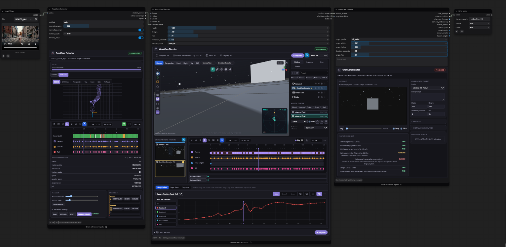
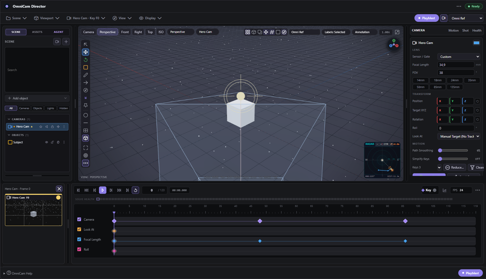
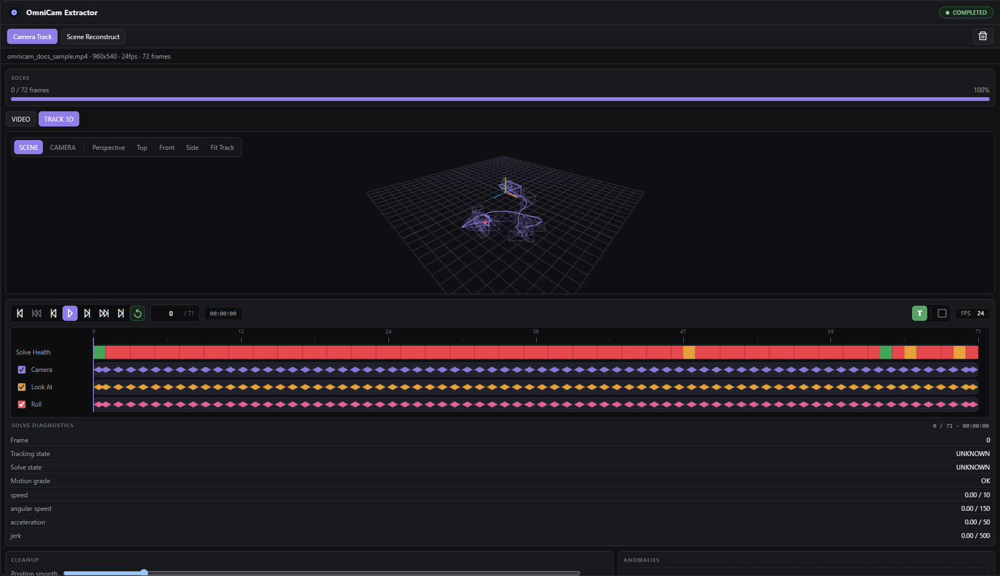
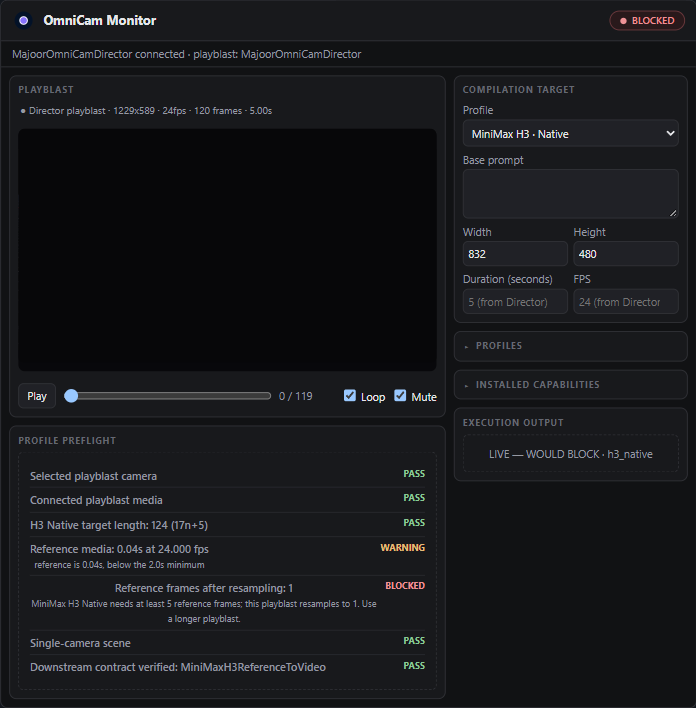

<p align="center">
  
</p>

# OmniCam — node guide

This document describes only the nodes OmniCam actually registers
(`omnicam/node_registry.py`): **three product nodes**. The unpublished
compatibility nodes, Sequencer and DCC exporters are not part of the public
registry; their history remains in git.

| Node id | Display name | Category | State |
|---|---|---|---|
| `MajoorOmniCamDirector` | OmniCam Director | `Majoor/OmniCam` | product, `is_experimental=True` |
| `MajoorOmniCamExtractor` | OmniCam Extractor | `Majoor/OmniCam` | product, `is_experimental=True` |
| `MajoorOmniCamMonitor` | OmniCam Monitor | `Majoor/OmniCam` | product, `is_experimental=True` |

All three product nodes ship with `is_experimental=True`: the node contract
(sockets, MotionScene schema, profile outputs) is not frozen yet. Inside
Director, the **Motion Tracks** authoring surface (screen paths, anchors,
projected points, motion layers) is the least settled part and is labelled
`EXPERIMENTAL` in the panel.

## Canonical flow

```text
OmniCam Extractor → OmniCam Director → OMNICAM_MOTION_SCENE → OmniCam Monitor → native model artifact
   recover              author                                  preflight / compile
```

The motion scene is the source of truth. It contains model-independent cameras,
objects, screen tracks, projected anchors and cuts. Model-specific frame grids,
prompt dialects and transport formats belong to Monitor profiles and never leak
into the Director scene.



A short authoring clip is in [`assets/omnicam-demo.gif`](assets/omnicam-demo.gif);
a longer walkthrough is [`assets/omnicam-preview.mp4`](assets/omnicam-preview.mp4).

## Media sockets: VIDEO or IMAGE

Every OmniCam input socket that carries footage — the Director's `image` and `video`,
the Extractor's `video`, the Monitor's `proxy_video` — is a multi-type
`VIDEO,IMAGE` socket, so a generator's `IMAGE` batch connects without an
`ImageToVideo` node in between. The conversion happens at the node boundary
(`omnicam/nodes/media.py`):

| Connected | Wanted | What OmniCam does |
|---|---|---|
| `IMAGE` | video | wraps the batch in memory, read at the node's fps (24 if it has none) |
| `VIDEO` | images | bounded sampling, never a full decode |
| `IMAGE` | a solvable source | encodes it below `temp/omnicam/extractor_runtime/` first, because a solve seeks inside its source |

### Video outputs and bounded IMAGE conversion

The Director keeps its playblast as `VIDEO`; it does not decode or duplicate
frames during authoring execution. Monitor performs bounded conversion only for
profiles that require `IMAGE` frames. Monitor exposes `reference_frames` only
for profiles such as H3 Native that consume an IMAGE batch.

---

## OmniCam Director — `MajoorOmniCamDirector`

Interactive camera-layout, motion-track, animation, timeline and playblast
environment. Execution compiles the complete editor state to a strict,
model-independent MotionScene.

The node itself shows a compact status card (scene name, fps/duration/
resolution, camera/object counts) with an **OPEN DIRECTOR** button; the full
editor below opens in its own window on demand and closes back to that card.
Only one Director workbench is open at a time (the Extractor's panel is
mounted directly on its node and has no open/close step of its own — see
below). State, the semantic Director API and the external Agent bridge all
work the same whether or not the editor is open — closing it does not lose
anything, and an upstream Extractor can adopt a solve into a Director that
has never been opened.



*Regenerate the screenshots against a running ComfyUI (real Director/Extractor/Monitor wiring, a real live preflight):*
```text
OMNICAM_LIVE_URL=http://127.0.0.1:8188 OMNICAM_LIVE_MATCH=live-docs-screens.spec.js \
  OMNICAM_LIVE_VIDEO=<a clip in ComfyUI/input> npm run test:live
```
*then copy `test-results/live-*.png` into `docs/assets/`. `npx playwright test tests/frontend/docs-screens.spec.js` regenerates the Director outliner/inspector close-ups from an isolated module mount instead, with no server required.*

**Inputs.** `width`, `height`, `fps`, `duration_seconds`, `render_mode`
(`omni_ref`, `graybox`, `textured`, `grid`, `point_field`, `wireframe`,
`wireframe_texture`, `card_grid`, `beauty`), optional `image` / `video` (either media type) and `audio`, an
optional `scene_3d`, and an optional upstream `solved_scene` (an OmniCam
Extractor connects here). `state_json`, `recording_path` and `card_asset` are
advanced fields the interface manages.

`scene_3d` is a **UI interoperability bridge**, not a serialized MotionScene 3D
data contract. The backend `execute()` does not consume it; the frontend
inspects the connected upstream node and reads a mesh path from a set of
common widget names (`model_file`, `model`, `file`, `filename`, `filepath`,
`mesh`, `scene`, `3d_file`). A 3D node that names its path field differently
will not be detected. Treat this as a best-effort convenience for loading a
proxy mesh into the viewport, not a stable structured input.

**Outputs**, in schema order:

| Output | Type | Meaning |
|---|---|---|
| `motion_scene` | `OMNICAM_MOTION_SCENE` | cameras, objects, motion layers, cuts and authoring timeline |
| `playblast_video` | `VIDEO` | the recorded model-control playblast, or the connected clip |
| `audio` | `AUDIO` | associated audio |

The Director does not emit camera-only, shot-collection or decoded-frame
compatibility outputs. Cuts and all authored cameras remain inside MotionScene;
the playblast stays a single first-class conditioning artifact.

### Playblast contract

Both WebCodecs and MediaRecorder capture exactly `duration_frames` at the
authored fps and current playblast resolution. Capture mode suppresses
selection outlines, gizmos, Motion Track overlays and other editor chrome while
retaining intentional scene content such as cards, graybox objects and grids.

After a successful managed upload, `MotionScene.metadata.playblast` records the
encoder, MIME type, fps, frame count, exact duration, dimensions, aspect ratio,
timing drift, clean-capture flag and resolved edit cuts. Monitor also inspects
the connected ComfyUI `VIDEO` through `get_dimensions`, `get_frame_rate`,
`get_frame_count` and `get_duration`; file-backed videos provide these facts
without decoding their image tensors.

**Interface density.** The `View → Interface` selector (Basic / Animation /
Advanced) is progressive disclosure of one layout, not three layouts. New
Director panels open in the Animation density, Perspective view, Simple
navigation profile, with the radar mini-map enabled. The full authoring overview
is in [USER_GUIDE.md](USER_GUIDE.md); keyboard and viewport controls are in
[SHORTCUTS.md](SHORTCUTS.md).

### Draw Camera Path

Use **Draw Camera Path** in the viewport tool rail to sketch a camera move. The
stroke is laid on a plane chosen from the current editor view at pointer-down:

| View | Draw plane | Stroke controls |
| --- | --- | --- |
| Top / Bottom | horizontal, at the source height | X and Z (ground track) |
| Front / Back | Z fixed | X and **height (Y)** |
| Left / Right | X fixed | height (Y) and Z |
| Perspective / Iso | the view-facing plane through the source position | free 2D on screen |

A fresh draw from the shot-camera view (or perspective/iso) drops to Top; an
axis view you already picked is kept. OmniCam distributes the resulting keys
across the active Playback Range and creates a new animated camera.

- LMB drag: draw and commit the path.
- RMB or Escape: cancel without changing the scene.
- MMB / Maya Alt navigation remains available while the tool is armed.
- The generated camera follows the path by default (3D tangent aim; top/bottom
  keep the source camera's pitch).
- Use the existing **Look At** control to track a scene object. Clearing Look At
  restores the original tangent-based Follow Path orientation.

The freehand stroke itself is editor-only and is never serialized or recorded
into a playblast; only committed camera keyframes become Director state.

#### Continuing a path

**Continue Camera Path** (the arrow button beside the pencil) starts a new
stroke from the active camera's **last keyframe** and appends the sampled keys
to that same track — no new camera. The join is continuous, and the timeline's
`duration_frames` / Playback Range end are pushed out if the new segment needs
the room.

#### Selecting and multi-selecting keys

Click a keyframe's control dot to select only it. `Shift`+click a second key
to add it to the selection (click it again with `Shift` held to remove it); a
plain click on any key replaces the whole selection with just that one. The
gizmo attaches wherever the selection currently is:

- **One key** – the gizmo sits on that key and offers **Move** only (a lone
  point has no extent to rotate or scale).
- **Two or more keys** – the gizmo sits at the selection's centroid and
  offers **Move / Scale / Rotate**, exactly like the whole-path gizmo below
  but scoped to the selected keys; every other key on the path stays put.

#### Transforming the whole path

Select a camera's entire path as one transform target — from its right-click
menu (**Select whole path**), the Outliner row action, or by clicking the path
**line** (not a key) in an editor view. The transform gizmo then sits at the
path centroid:

- **Move** – offsets every keyframe position and target by the drag (spatial
  snapping applies).
- **Scale** – per-axis or uniform about the centroid: resize a move without
  redrawing it.
- **Rotate** – euler about the centroid; targets rotate with the positions so
  the move stays rigid.

With a path selected, `T` / `R` / `S` pick the gizmo mode and the arrow keys
(`PageUp` / `PageDown` for height) nudge the whole path by one grid step. A
drag is one undo step (one point, several points, or the whole path).

The single-point, multi-point, whole-path and target-editing gizmos above are
all the same real Three.js `TransformControls` handle that moves/rotates/
scales objects and cameras elsewhere in the viewport — dragging one axis, the
World/Local space toggle, and holding `Ctrl`/`Cmd` to snap all behave exactly
the same way regardless of what is currently attached.

#### Inserting and deleting keys

Double-click anywhere on a camera's path **line** to insert a new keyframe
there, sampled from the curve at that point — the path's on-screen shape does
not visibly jump when a Bézier segment gains a point this way. To remove
keys, select one or more (see above) and press `Delete` / `Backspace`, or use
**Delete key** / **Delete N keys** from the keyframe's right-click menu. Both
insert and delete are a single undo step; a camera track is never left with
zero keyframes.

#### Reshaping the curve after drawing

Every keyframe of the active camera is an editable spatial control point, drawn
as an enlarged light dot (distinct from its camera's coloured path line). Select
one and two cyan tangent handles appear:

- Drag a control dot to move the waypoint in 3D (view-facing plane), or use the
  translate gizmo for axis-locked moves.
- Drag a cyan handle knob to bend the path through that key. The move updates
  live and is stored on the keyframe's Bézier tangents — no redraw needed.
- Right-click a keyframe dot → **Handle Type**:
  - **Auto Smooth** – tangents follow the neighbouring keys automatically.
  - **Aligned** – the two handles stay opposite; lengths are independent.
  - **Free** – the incoming and outgoing handles move independently (broken).
  - **Corner** – short handles pointed straight at the neighbours: a sharp turn.

Handle edits round-trip through save and undo like any other keyframe change.

#### Position and Target editing

A single selected key can edit either its own position or the look-at point
it aims at. Right-click the key → **Path Component** → **Position** (default)
or **Target** to switch what the gizmo moves; the same submenu shows which
one is currently active. Target editing moves that key's `camera.target` only
— every other key, and that key's own position, are untouched.

If the active camera has **Look At** pointed at a scene object, its targets
are computed from that constraint on every frame and are not stored per key,
so **Target** is disabled in the submenu (with an explanation) and no gizmo
attaches to a look-at-driven target: there is nothing safe to drag, since the
constraint would recompute over it on the very next frame. Clear Look At
first to hand-key targets again.

#### Timing Weight and Redistribute Timing

Selecting a camera path key shows its usual FOV/Roll/Position/Target fields in
the **Shot** Inspector tab, plus a **Timing Weight** field (`0.1`–`10`,
default `1.0`). Timing Weight is an authoring preference, not a playback
speed — actual timing always comes from each key's `frame`.

**Redistribute Timing** reflows the active camera's own keys across their
current first/last frame: each segment's share of the range is its spatial
distance times the average of its two keys' Timing Weights, so a heavier
weight around a key slows the segments on either side of it. First and last
frame never move; the action refuses cleanly (with a status message) if the
range has fewer integer frame slots than keys. One redistribute is one undo
step, and an untouched key keeps no `timing` data in the saved workflow.

#### Camera Path Diagnostics

The Shot Inspector tab shows a compact, read-only diagnostics list under the
Timing controls whenever the active camera has 2+ keys: `⚠ Speed spike
F48–F52`, `Camera barely moves from F0 to F48`, `Sharp direction change at
F60 (142°)`, keys placed only one frame apart, an orbit that almost but does
not close, and a key passing near an object's proxy radius. Diagnostics are
purely derived from the current path (`analyzeCameraPath()` in
`web-src/director/camera-path-diagnostics.js`) and are recomputed on every
Inspector refresh — nothing here ever mutates a keyframe automatically. The
existing per-camera **Speed Heatmap** viewport overlay (color-codes each path
segment by the same derived speed) is a separate, pre-existing toggle and is
unaffected by this list.

#### Camera Path Presets

The compass button in the viewport tool rail (beside Draw/Continue Camera
Path) opens a compact **Camera Path Preset** picker — one dialog listing
every preset, not a button per preset: `Static`, `Dolly In/Out`, `Truck
Left/Right`, `Pedestal Up/Down`, `Crane Up/Down`, `Arc Left/Right`, `Orbit`,
and `Spiral`. Picking one generates an ordinary camera path across the active
camera's current Playback Range, replacing its existing keys in one undo
step. The result is plain camera keyframes — reshape it afterward with the
same point/curve/Timing Weight tools as a hand-drawn path. Presets are
model-independent: they never encode MiniMax H3, Wan, or LTX-specific
motion — that compilation stays in Monitor profiles.

### 3D Scene Primitives

The Director provides instant staging primitives via the Outliner quick-bar, toolbar, and viewport context menus:

- **Card (`card`)**: Flat billboard polygon oriented upright to host reference images, cards, or video textures.
- **Cube (`cube`)**: 1m³ reference bounding box for volumetric blocking.
- **Sphere (`sphere`)**: 1m diameter sphere for curved volume framing.
- **Cylinder (`cylinder`)**: 1m diameter, 2m high cylinder for vertical pillars and rotational staging.
- **Torus (`torus`)**: Toroidal ring primitive (1m radius, 0.25m tube) for circular trajectories and orientation markers.
- **Human (`human`)**: Authentic procedural **low-poly 3D human mannequin** (faceted head, neck, torso, pelvis, relaxed A-pose arms, and legs), grounded at $y = 0$ on the floor plane to provide accurate human scale cues.
- **Null (`null`)**: Empty 3D transform pivot for grouping, camera target rigging, or hierarchy anchors.
- *(Legacy `ground` objects remain fully supported and backward-compatible with older saved workflows).*

All primitives support full transform controls (Translate, Rotate, Scale), parenting hierarchies, visibility toggling, locking, wireframe overlay, and neutral/textured playblast rendering.

### Graph Editor and Keyframe Curves

The lower deck houses an animation curve editor and dope sheet for fine-grained trajectory control:

- **12 Interpolation Modes**: `Ease`, `Smooth`, `Bezier`, `Linear`, `Ease In`, `Ease Out`, `Hold`, `Sine`, `Cubic`, `Quintic`, `Expo`, and `Back`.
- **6 Bézier Tangent Modes**: `Auto`, `Clamped`, `Vector`, `Free`, `Aligned`, and `Flat`.
- **Dynamic Coordinate Scaling**: The canvas dynamically measures its container height (`clientHeight`), preserving exact curve aspect ratios and preventing vertical stretching across any panel dimension.
- **Visual Tangent Handles**: Direct manipulation of curve velocity and acceleration with draggable tangent handles in both graph editor and 3D spatial viewport curves.

### Layout Splitters and Panel Ergonomics

- **Side Panel Width (`side-resize`)**: Drag the vertical divider between viewport and inspector (200px–640px).
- **Graph Editor Height (`graph-resize`)**: Drag the horizontal divider between timeline and graph editor (140px–720px).
- **Outliner Height (`outliner-resize`)** & **Preview Width (`preview-resize`)**: Fully adjustable panels with keyboard support (`role="separator"`, arrow keys, `Home` / double-click reset) and workflow state persistence.
- **Quick-Reset (`⟲`) & Scrubbing**: Drag axis labels to scrub coordinates; click `⟲` to reset any transform channel back to default.

### Viewport HUD & Tool Rail Controls

- **Camera HUD & OSD**: Live lens focal length (`35mm`), FOV (`54.4°`), distance to subject, and a **Camera Lock toggle (`🔒`)** that prevents accidental navigation moves when framing in Camera View.
- **Coordinate Space & Snapping**: Direct 1-click **World / Local (`W`/`L`)** toggle and **Snapping (`OFF`/`GRID`)** toggle on the vertical tool rail.
- **Transform gizmo**: `T` (Select/Translate) / `R` (Rotate) / `S` (Scale) drive a real Three.js `TransformControls` handle for whatever is currently selected — an object, the active camera, its look-at target, or a camera-path key/selection/whole path (see Draw Camera Path above). Each target type only offers the modes that make sense for it: a camera cannot be scaled, and a bare look-at point or lone path key cannot rotate or scale either.
- **Quick Overlays Cluster & Shading Select**: Instant toggles for Grid, Gizmos, Guides, Safe Areas, Radar, and Shading Mode (`Omni Ref`, `Graybox`, `Wireframe`, `Grid`, `Beauty`) in the viewport header corner.
- **Fullscreen Floating Transport**: Minimalist playback, timecode, and keyframe controls during fullscreen presentation mode.
- **Outliner Isolate**: Alt-click an object's eye icon to isolate it in the viewport.
- **Sensor / Gate Presets**: Film & digital camera sensor presets in the Inspector (Full Frame 35mm, Super 35, Micro 4/3, 16:9 Digital Cinema, Mobile 9:16).

### Motion Tracks

> **Experimental.** This authoring surface is labelled `EXPERIMENTAL` in the
> panel. The layer model, source kinds and the compiled `motion_layers`
> representation may still change before a stable release; camera authoring and
> the playblast are not affected.

The Camera View toolbar provides `Select`, `Track`, `Anchor`, `Project` and
`Erase`. Track draws a sparse normalized screen path over the current playback
range; Anchor creates a held screen point; Project binds a point to the selected
object or a world point. Camera Field presets add Balanced, Foreground, Subject,
Ground Parallax or Depth Layers sources.

Motion layers appear in the Outliner and as aligned timeline rows. Their keys
support linear, smooth and hold interpolation, explicit visibility and retiming
to the playback range. The authored layers serialize in `state_json` and compile
into `OMNICAM_MOTION_SCENE`. Their editor overlay is excluded from playblast
capture.

### Unified asset library and characters

The left panel carries **SCENE** and **ASSETS** tabs. The ASSETS tab is a
filtered thumbnail grid over one semantic catalog — characters, props,
environments, vehicles — merged from a writable user catalog, the read-only
blockout library and shipped defaults (`user > legacy > default`). Assets live
under `<ComfyUI input>/omnicam/library/`; the catalog is metadata only.

* **Instantiate** (double-click / *Add to scene*) runs through the Semantic
  Director API (`asset.instantiate`), so it is deterministic and one undo step.
* **Characters** stay `type: "glb"` with additive `asset_kind` / `asset_id` /
  `character`. A rig maps any Mixamo / generic-GLTF rig to
  `OMNICAM_HUMANOID_V1` (22 canonical joints); the mapping is owned by the
  catalog row, never the scene object. An incomplete map = a normal model, no
  `RIGGED` badge.
* **FK Pose editor** — canonical-joint overlay, per-joint X/Y/Z rotation,
  source-independent presets, custom-pose save. **Motion clips** —
  timeline-driven mixer time, `speed [0.05, 8.0]`, loop, frame window, *Bake
  current frame to pose*. Pose editing and an active clip are mutually
  exclusive.
* **Tags** (machine semantics) and **Labels** (visible viewport annotations,
  `Off / Selected / All`) are separate from `name`. Labels are editor-only and
  stay out of the playblast unless **Burn labels / annotations into the
  playblast** (Display menu) is on.

New scene-object fields (`asset_id`, `asset_kind`, `tags`, `annotation`,
`character`) are additive: old workflows load unchanged and no MotionScene
version bump is required. Routes, limits and the Semantic API are in
[docs/ASSET_LIBRARY.md](ASSET_LIBRARY.md) and [docs/CHARACTERS.md](CHARACTERS.md).

### Upstream `solved_scene` import

The Director's optional `solved_scene` input selects the scene's playblast
camera and imports it by fingerprint
(`extractor_fingerprint`):

- no cable → the Director's local state;
- fingerprint already imported → the local state, **including your edits**;
- unknown fingerprint → the upstream camera motion, re-hosted in the Director's
  scene and render context.

Resolution, render mode, objects, constraints and scene metadata always stay
with the Director. Disconnect the cable to freeze the imported trajectory.

The input is called `solved_scene` rather than `motion_scene` because only
that one camera is imported: motion layers, objects, cuts and other cameras
on the upstream scene are not merged.

---

## OmniCam Extractor — `MajoorOmniCamExtractor`



Estimates a **relative** 6DoF camera trajectory from one continuous video shot
and wraps that internal camera solve in a canonical one-camera MotionScene.

The source viewer, timeline and 3D track viewer are mounted directly on the
node itself, on the ComfyUI canvas — no open button, no separate window.
Running TRACK / Reconstruct keeps progressing whether or not the node is
scrolled into view; the solved result is cached when it finishes. Deleting
the node does cancel a running solve.

**Inputs.**

| Input | Default | Role |
|---|---|---|
| `video` | — | one continuous shot, `VIDEO` or `IMAGE` batch; a hard cut is reported, never stitched |
| `method` | `auto` | `auto` prefers DPVO, then pycolmap, then OpenCV/SIFT, taking the first installed; `dpvo`, `pycolmap` or `opencv_sift` force those directly |
| `lens_mode` | `auto` | `auto`, `fov` or `focal_mm` |
| `fov_degrees` | `53.0` | vertical FOV, used when `lens_mode=fov` |
| `focal_length_mm` | `24.0` | focal length, used when `lens_mode=focal_mm` |
| `sensor_width_mm` | `36.0` | sensor width, used when `lens_mode=focal_mm` |
| `max_dimension` | `840` | solver long edge; never upscales |
| `frame_step` | `1` | sampling stride; keys keep the **source** frame numbers |
| `normalize_origin` | `True` | places frame 0 at the origin with identity orientation |
| `motion_scale` | `1.0` | sizes the relative translation for your scene; never touches rotation |
| `position_smoothing` | `0.15` | centred, so it adds no temporal lag; `0` = raw solve |
| `rotation_smoothing` | `0.10` | weighted quaternion mean after sign-continuity |
| `horizon_stabilization` | `0.0` | per-pose residual roll damping after global alignment; `0` preserves solved roll, `1` fully levels canonical roll |
| `simplify_keys` | `True` | key reduction that accounts for position **and** orientation |
| `position_tolerance` | `0.01` | allowed position error; `0` = lossless |
| `rotation_tolerance_deg` | `0.25` | allowed angular error; `0` = lossless |

**Outputs.** `motion_scene` (canonical `OMNICAM_MOTION_SCENE` with one extracted
camera), `solver_coverage` (the share of sampled frames that produced a pose — not a
physical accuracy), and `report` (human-readable: backend, keys, lens, warnings).

The solver and refinement stages still operate on the internal schema-v1
`OmniCamTrack`; only the node boundary exposes MotionScene.

**V1 limits.** No metric scale, no animated zoom, no lens distortion, no
rolling shutter, no multi-shot solve, no object or body capture.

### Matchmove panel

The node carries a matchmove panel. `▶ TRACK` **queues a partial ComfyUI
execution** ending at `MajoorOmniCamExtractor`: required upstream nodes (a
Load Video, say) run, the Extractor solves, and downstream
Director / Monitor / video generation are **not** executed. ComfyUI owns
queue admission, ordering, cancellation and high-level progress.

```text
▶ TRACK     queue a partial solve now
■ STOP      cancel the ComfyUI job (pending → dequeued, running → interrupted)
```

Display states:

```text
IDLE → QUEUED → PREPARING → TRACKING → SOLVING → FINALIZING → COMPLETED
any active state → CANCELLING → CANCELLED
any active state → FAILED
```

STOP cancels the actual ComfyUI job. A running solve is interrupted
cooperatively — the solver is asked between safe frames, the spawned DPVO
child is reaped, and no CUDA context is force-destroyed. A `CANCELLED` or
`FAILED` solve never produces a final track and `APPLY REFINED` stays disabled.
A busy GPU simply means the solve sits in the queue as `QUEUED`.

While it runs the panel shows two tabs:

| Tab | Shows |
|---|---|
| `VIDEO` | the managed footage the solver reads, with live solver points overlaid as it tracks |
| `TRACK 3D` | the solved trajectory, read-only: orbit / pan / zoom, Fit, Top/Front/Side |

OpenCV streams a bounded transient 3D path while it tracks. DPVO reports honest
source-frame progress but publishes its trajectory only after global
optimisation completes; it does not fabricate intermediate poses. Once frame
ingest completes, the panel changes from `TRACKING` to `SOLVING` while DPVO
finalizes. That finalization has a separate 120-second watchdog: a stalled
global optimization fails with guidance to shorten the clip, lower
`max_dimension`, or select `opencv_sift`.

### Sources accepted without Run

| Source | Interactive |
|---|---|
| a connected native `Load Video` | yes |
| a file chosen through `Choose Video` | yes |
| an in-memory `VIDEO` / `IMAGE` batch, before its first execution | no — the reason is shown |
| a runtime `VIDEO` after a normal Extractor execution | yes — via a managed `[temp]` copy |
| an unknown third-party `VIDEO` node, after the Extractor materialises it | yes — via a `[temp]` reference |

Third-party widget names are never guessed. The panel never silently queues the
graph. During a normal execution, a source that is not already a managed file
is encoded below `temp/omnicam/extractor_runtime/` with a UUID name; the UI
envelope carries only the annotated reference, never an absolute path.

### No-run routes

```text
POST   /majoor/omnicam/extractor/source
POST   /majoor/omnicam/extractor/frame
POST   /majoor/omnicam/extractor/refine
POST   /majoor/omnicam/upload_extractor_source
```

None of these queue a prompt, start a job, or touch the GPU. TRACK and Scene
Reconstruction Start run through ComfyUI's native partial queue instead (they
enqueue a partial execution ending at `MajoorOmniCamExtractor`).

`/extractor/refine` takes the immutable raw solve the queued Extractor emitted
plus the current cleanup settings and returns a freshly refined track --
`build_refined_track` only, so dragging a slider updates the track without
re-running TRACK. Bounded to 4 MiB; a solve too large to fit is refined by
pressing TRACK again with the settings you want.

`/extractor/source` measures a source without starting anything: the panel
needs the frame rate and count before the first solve, or its scrubber has no
range. WebSocket events
`majoor.omnicam.extractor.{job,progress,pose,quality,features,completed,failed}`
are rate-limited to ~10 Hz **per channel**. The WebSocket is transport, not
state: `GET /jobs/{id}` stays the source of truth after a disconnect.

`/extractor/frame` is a read-only, managed-source JPEG preview route. The
panel uses native browser video first; only an unsupported or undecodable
container switches to this per-frame fallback, so the source scrubber remains
usable without changing what the solver reads.

### Track timeline and inspection

The read-only timeline has four visible rows: **Solve Health**, **Camera**,
**Look At**, and **Roll**. Camera, Look At, and Roll show a diamond only when
that channel changes; FOV remains in the canonical camera data and Current
Frame details, but is not a timeline lane. Solve Health combines tracker
quality (coverage and inliers) with the motion grade: each rendered pixel uses
the worse state, shown as green, orange, red, or grey when unknown. Clicking an
anomaly jumps the shared source/video/3D frame clock to that frame.

The Current Frame diagnostics distinguish **Solve state** from **Motion grade**
and show only measured values: coverage, inliers, speed, angular speed,
acceleration, jerk, and framing loss where available. Anomalies use structured
severity (`WARN` or `ERROR`), the observed metric, a recommended compatible
refinement action, and inclusive `start_frame`/`end_frame` ranges. Adjacent
failures of one kind are shown as one review range; choosing an action applies
it across that range without mutating the raw solve.

The 3D tab has two read-only inspection modes. **SCENE** uses orbit controls to
inspect the recovered path and current frustum. **CAMERA** renders the solved
pose and FOV at the selected source frame; scene-orbit preset controls are
disabled there. When a DPVO build exposes compatible map geometry, the finished
job may include a bounded optional landmark cloud (at most 8,000 finite points).
Its absence never affects a completed solve.

The timeline edits nothing: the Extractor corrects through Refine, and a second
editable timeline would silently disagree with the first.

### Non-destructive refinement

The raw solve is **immutable**. Every control re-derives a track from it, with
no video decode and no solver:

```text
raw → spike actions → trim → origin → global alignment
    → scale → quaternion continuity → smoothing → key reduction → track
```

Alignment is **global**: one pitch/yaw/roll offset for the whole solve, never
per key. Spike detection uses median and MAD, so a camera that is simply moving
fast is not flagged. `RESET` returns to the raw solve exactly. The re-derive
runs through `POST /majoor/omnicam/extractor/refine` in the same session as the
solve; after a workflow reload the refined track is restored from the node's
serialized cache and a fresh TRACK re-enables live refinement.

`APPLY REFINED` writes the result into the node's serialized state and notifies
the connected Director. Changing a control afterwards marks the result
`OUTDATED` until the next apply; the Director is never overwritten while you
experiment.

### Backends

DPVO ([princeton-vl/DPVO](https://github.com/princeton-vl/DPVO), MIT), pycolmap
([colmap/pycolmap](https://github.com/colmap/pycolmap), BSD-3-Clause) and
OpenCV/SIFT are all **optional** and lazily imported: OmniCam loads normally
with none of them. `auto` tries them in that order and takes the first one
installed. The DPVO checkpoint is read from one fixed, non-configurable
managed path:

```text
ComfyUI/models/omnicam/dpvo/dpvo.pth
```

OmniCam never runs `pip install` at runtime. No third-party solver code or
configuration is redistributed in this package. Each DPVO solve runs in a
fresh spawned process; sampled frames cross through a private NumPy memmap
below ComfyUI's temp directory, removed on success, stop and failure. When the
child exits its CUDA context exits with it, so DPVO VRAM returns to the driver
instead of staying in ComfyUI's allocator. Frame memmap views are copied into
writable contiguous arrays before Torch consumes them. See
[Installing DPVO](TECHNICAL_REFERENCE.md#installing-dpvo) for the Windows
build procedure, and [TECHNICAL_REFERENCE.md](TECHNICAL_REFERENCE.md) for the
runtime notes.

pycolmap runs incremental Structure-from-Motion rather than DPVO/OpenCV's
frame-to-frame visual odometry: it extracts and matches features globally,
then registers frames one at a time against a shared point cloud with bundle
adjustment. That is more expensive per frame, but it does not zero out
translation on a low-parallax or rotation-only segment the way essential-matrix
VO does -- see OpenCV/SIFT's own module docstring for that limitation. A hard
cut in the footage can come back as more than one disconnected reconstruction;
only the largest is used, and it is reported as a warning rather than silently
bridged. Unlike DPVO, `pip install pycolmap` is the entire installation: it
ships prebuilt Windows wheels with no CUDA extension to compile.

### Scene Reconstruction Mode

Extractor features two operating modes:
- **Camera Track** (`extract_mode: "camera_track"`, default): recovers relative 6DoF camera motion from continuous video footage.
- **Scene Reconstruct** (`extract_mode: "scene_reconstruct"`): recovers a 3D proxy scene (mesh, hold camera, and ground/wall planes) from a single still reference image.

In Scene Reconstruct mode the panel's `Start` queues the same partial
execution as TRACK (`extract_mode: "scene_reconstruct"`), ending at the
Extractor; downstream Director / Monitor / video generation are not executed.
The reconstructed scene returns through the Extractor's result envelope and is
routed back into the panel for preview and Director adoption.

#### Result modes

Scene Reconstruct produces one of four result shapes (`recon_mode`):

- **Depth Mesh**: the historical visible-surface MoGe depth mesh, kept as a reference proxy.
- **Blockout**: MoGe (geometry evidence) + native ComfyUI SAM3.1 (semantic instance masks) → deterministically fitted **closed** MotionScene primitives plus a correctly oriented room shell. A 90° Director orbit no longer opens holes in the blocking objects because they are closed volumes, not a 2.5D surface.
- **Hybrid**: the Blockout primitives *and* an independently toggleable dense reference mesh.
- **Scan**: VGGT multi-view / video scene blocking with cross-view-fused closed primitives. `recon_source_mode` chooses the camera treatment: `video_scan` compiles the sampled VGGT poses into one read-only **Scan Camera** trajectory track (keyframes at the source-frame indices); `multi_view` (an unordered image set) inserts only the anchor source camera and keeps the other poses in `scan_evidence.json`. Scan view counts follow the quality preset — Fast 12 geometry / 3 segmentation views, Balanced 24 / 6, High 48 / 10 (`custom` uses the explicit `recon_vggt_max_views` / `recon_vggt_segmentation_views` fields).

#### Providers & Capabilities

- **`comfy_moge`** (geometry, single view): ComfyUI's native geometry estimation (`comfy_extras.nodes_moge`). MoGe checkpoint in `ComfyUI/models/geometry_estimation/`.
- **`comfy_sam3`** (segmentation): native ComfyUI SAM3 / SAM3.1 via the official `CheckpointLoaderSimple → CLIPTextEncode → SAM3_Detect` chain. Needs a `sam3*` checkpoint (e.g. `sam3.1_multiplex_fp16.safetensors`) in `ComfyUI/models/checkpoints`. No second segmentation dependency is added.
- **`vggt`** (geometry, multi-view / Scan): optional. Needs the `vggt` Python package and a checkpoint under `ComfyUI/models/geometry_estimation/vggt/` (recommended: `VGGT-1B-Commercial/model.pt`) and a CUDA GPU. `VGGT-1B-Commercial` is the documented production checkpoint.
- **`vggt_omega_research`**: explicitly **non-commercial / research only** (FAIR Noncommercial Research License) and is **never auto-selected**; OmniCam does not fall back to it from the commercial checkpoint.
- **`sam3d_objects`** (optional completion): improves weak hidden dimensions of individual blockout objects. Official baseline is **Linux 64-bit + an NVIDIA CUDA GPU with ≥ 32 GB VRAM**, the `sam3d_objects` package, and a pipeline config under `ComfyUI/models/sam3d_objects/`. It is capability-gated and its absence does not affect Depth Mesh, Blockout or Scan.
- **Asset library** (`recon_blockout_assets`: `off` / `proxy` / `replace`): swap each fitted box for a real GLB prop from a local CC0 kit library (23 Kenney props by default; `--download` fetches them). `proxy` adds the prop beside the box; `replace` hides the box. Populate it once with `scripts/fetch_blockout_library.py` — see [BLOCKOUT_ASSET_LIBRARY.md](BLOCKOUT_ASSET_LIBRARY.md). Requesting it without the library installed fails with `RECON_ASSET_LIBRARY_UNAVAILABLE` / `RECON_ASSET_LIBRARY_INVALID` rather than silently producing boxes only. `recon_asset_library_path` points at your own library folder instead of the managed default.
- **No auto-download policy**: OmniCam never triggers silent package installs or weight downloads. If a checkpoint is missing, the panel surfaces a clear status message with placement instructions; the run button explains a missing SAM3 checkpoint and offers Depth Mesh rather than silently changing the requested mode.
- **Discarding results & VRAM**: **✕ DISCARD** (reconstruction actions row) throws away just the current result — it deletes that reconstruction's `<fingerprint>/` cache folder so the next identical run recomputes, and leaves the camera track and every other cached reconstruction alone. The **Clear Cache** trash icon (in the mode bar, next to the Camera Track / Scene Reconstruct tabs) is the wider reset: it wipes the whole reconstruction disk cache *and* this node's cached camera track. Both release the resident MoGe / SAM3 weights back to ComfyUI (`unload_all_models` + `soft_empty_cache`) — a completed reconstruction no longer leaves ~14 GiB pinned against your next workflow. The next reconstruction reloads the models (~2–4 s).
- **Semantic labels & phantom detections**: SAM3 is open-vocabulary and will force a match for *every* requested label — asking it for `counter` or `cabinet` on a night street scene hands back a shopfront at score ~0.7. The default label set (`recon_semantic_labels` empty) is therefore a small, scene-agnostic list of layout anchors and large occluders that read reliably indoors *and* outdoors (`person`, `car`, `truck`, `bicycle`, `motorcycle`, `chair`, `sofa`, `table`, `bed`, `door`, `window`, `television`, `plant`, `building`, `tree`). For a specific scene, set `recon_semantic_labels` explicitly (e.g. `car, person, building, window, door` for an exterior) — this is the precise lever for eliminating hallucinated props. `recon_sam3_threshold` (default `0.60`) is the coarse lever: raise it to drop low-score phantoms, lower it if real objects are being missed. In `recon_blockout_assets: proxy` / `replace`, a detection must additionally clear a higher confidence bar (`0.55`) before it is promoted from a plain grey box to a fully modelled GLB prop.

#### Reconstruction Controls & Quality Presets

| Quality Preset | Resolution | Triangle Budget | Use Case |
|---|---|---|---|
| `fast` | 360 px | 32,000 | Fast preview and coarse blocking |
| `balanced` | 512 px | 64,000 | Default setting; good surface detail |
| `high` | 720 px | 120,000 | Detailed proxy geometry and contours |

Options:
- **Ground Plane** (default on): Runs seeded deterministic RANSAC on the estimated point cloud to identify the dominant ground surface and generate a ground proxy plane.
- **Wall Planes** (default off): Identifies vertical surface planes and emits bounded proxy boxes.
- **Source Texture** (default on): Projects and bakes the input image UV texture onto the exported proxy GLB mesh.

#### Reconstruction execution & routes

Scene Reconstruct itself is queue-only: the panel writes the reconstruction
widgets and queues the same partial Extractor execution used by Camera Track.
There is no `/reconstruction/jobs` execution API.

The remaining reconstruction HTTP surface is read-only or cache-only:

```text
GET    /majoor/omnicam/reconstruction/capabilities
DELETE /majoor/omnicam/reconstruction/cache
DELETE /majoor/omnicam/reconstruction/cache/{fingerprint}
```

Provider progress and cancellation for an active reconstruction belong to the
queued Extractor execution. The result returns through the Extractor result
envelope and is then adopted by the reconstruction panel / Director.

#### Output & MotionScene Additive Contract

Scene reconstruction compiles into a canonical `OMNICAM_MOTION_SCENE` v1 document:
- **`MotionScene.version` is unchanged (1)**: Full backward and forward compatibility.
- Environment mesh is saved as a managed GLB asset below `ComfyUI/input/majoor_omnicam/reconstruction/<fingerprint>/environment.glb`.
- Reconstructed objects carry additive metadata under `object.reconstruction`:
  - `provider`: provider identifier (e.g. `"comfy_moge"`).
  - `provider_version`: provider version string.
  - `role`: `"environment"`, `"ground"`, or `"wall"`.
  - `source_kind`: `"image"`.
  - `confidence`: float in `[0.0, 1.0]` (computed from inlier ratio, orientation, coverage).
  - `quality_preset`: `"fast"`, `"balanced"`, or `"high"`.
  - `fingerprint`: 16-character content-addressed digest.
  - `scale_mode`: `"relative"` or `"metric"`.
  - `normals_valid`: boolean indicating geometry normal validity.
- Objects start with `locked: true` to prevent accidental editing, with confidence badges rendered in Director.
- The scene includes a source hold camera at frame 0 matching the recovered FOV.

---

## OmniCam Monitor — `MajoorOmniCamMonitor`



> **Experimental** (`is_experimental=True`). The profile set, their output
> sockets and the capability-gate wording are still moving; no profile is
> real-model certified yet (see [CONFORMANCE.md](CONFORMANCE.md)).

The model compiler, and the single exit point from OmniCam into the rest of the
graph. Monitor takes a MotionScene and its playblast, resolves the timeline the
selected profile requires, compiles the scene into that model's representation,
and reports what survived.

Unlike Director, the full panel (reference viewer, target capabilities matrix,
preflight checklist, and prompt blocks) is mounted directly on the node
itself, on the ComfyUI canvas — no open button, no separate window. A
**Compiled Prompt** card at the top of the panel always shows the exact text
`final_prompt` will carry, with a Copy button — filled in the moment a Director
is connected and kept live as it's edited (via the same `compile_prompt()`
call the real execution uses, so the preview can never diverge from the
actual output), and updated again after every execution or blocked preflight.
Removing the node disposes it. On small screens, the node content scrolls so
the target settings remain accessible.

Monitor execution UI fields follow ComfyUI V3's list transport:
`target_profile`, `capabilities` and `final_prompt` are each a one-item list.
The live HTTP preflight and blocked-preflight event retain their
document-shaped fields; clients normalize both forms. Truncated video decodes
are rejected before profile compilation can use an incomplete frame batch.

Every profile is a **conditioning compiler, not a path-execution engine**: it
turns the authored (or extracted, or preset-generated) camera path into the
signal a specific downstream model actually accepts — a reference video, a
frame batch, a camera embedding, or a prompt. No profile, including either H3
profile, guarantees the generative model will reproduce the authored 3D
trajectory exactly; how closely the result tracks the path is a property of
the downstream model itself, not of OmniCam. This holds regardless of how the
path was authored — hand-drawn, edited point-by-point, generated from a
preset, or recovered by Extractor.

The watcher follows the **sockets**, not the upstream node class: any source of
`OMNICAM_MOTION_SCENE` is accepted — Director, Extractor or a third-party node.

**Inputs.**

| Input | Default | Role |
|---|---|---|
| `motion_scene` | — | the canonical scene to compile |
| `playblast_video` | optional | the shot the scene describes, `VIDEO` or `IMAGE` batch |
| `base_prompt` | empty | user intent, kept at the head of `final_prompt` |
| `target_profile` | `external_reference_video` | one of the ten profiles below |
| `target_width`, `target_height` | `832`, `480` | target frame size |
| `duration_seconds`, `target_fps` | `0` (auto), `0` (auto) | length and frame rate of the shot being compiled; `0` inherits `timeline.duration_seconds` / `timeline.authoring_fps` from the connected MotionScene (the Director's authored shot) |
| `guide_reference_index` | `1` | which `<Video N>` / `Video N` slot the OmniCam guide occupies on the target model; H3 accepts 1-3, Seedance 2.5 accepts 1-10, out of range is reported at preflight |
| `guide_style` | `auto` | forces the compiled prompt's guide semantics (`auto`, `motion_proxy`, `clay`, `depth_rich`, `beauty_reference`, `passthrough`, `diagnostic`); `auto` resolves it from the Guide Capture Style the Director actually recorded with (`metadata.playblast.guide_style`), reported as a non-blocking `guide_style_mismatch` check when it disagrees |
| `reference_plan_json` | empty | advanced: a JSON array declaring references OmniCam does not own the media for (an identity image, an action video...), authored through the Monitor panel's Reference Role Matrix editor. Each entry compiles into its own role-first prompt block; overlapping, unresolved roles across declared references (including the OmniCam guide itself) surface as a non-blocking `role_conflict` check |

**Outputs**, in schema order: `final_prompt`, `reference_video`,
`reference_frames`, `camera_embedding`, `native_tracks`, `tracks_json`,
`target_width`, `target_height`, `target_length`, `h3edit_options`, `target_fps`.

`h3edit_options` carries the `H3EDIT_OPTIONS` payload for `h3_scene_coverage`
and is `None` for every other profile. `target_fps` is the resolved profile
frame rate (`24.0` for both H3 profiles).

Only the selected profile's outputs are computed; the rest are `None`. Which one
carries the payload is decided by the profile's **semantic**, not by its model.

### The ten profiles, by semantic

`external_reference_video` is the only permissive one: no upstream node
requirement, no frame grid, no fps conversion, and it never blocks on a missing
or unrecognized downstream. Every other profile is strict -- it encodes one
real model's contract, and a payload that contract cannot satisfy stops the
queue rather than reaching the model broken.

Every profile emits `final_prompt` (it is always the compiler's first output);
the table below only calls it out separately where a profile's *primary*
control signal is prompt text (`reference_video`/`prompt_options`
semantics). For the `camera_embedding`/`screen_tracks` profiles, the literal
motion is already fully carried by the embedding or `tracks_json` -- their
`final_prompt` stays a short, semantic addition to `base_prompt` (what the
move accomplishes, or the artist's authored action text), never a
restatement of the coordinates the control signal already encodes.

| Profile | Semantic | Output | Downstream |
|---|---|---|---|
| `external_reference_video` | `reference_video` | `reference_video` + `final_prompt` | any destination model's own reference-video input; no contract enforced |
| `wan_camera_native` | `camera_embedding` | `camera_embedding` | `WanCameraImageToVideo.camera_conditions`; real extrinsics and intrinsics, the highest-fidelity path; length 4n+1 |
| `wan_move_native` | `screen_tracks` | `native_tracks` | `WanMoveTrackToVideo.tracks`; `comfy_api.latest.io.Tracks`, i.e. `track_path` `[frames, tracks, 2]` and `track_visibility` `[frames, tracks]` |
| `wan_track_native` | `screen_tracks` | `tracks_json` | `WanTrackToVideo.tracks`; a 121-sample source grid resampled upstream to the generation length |
| `wanvideo_ati` | `screen_tracks` | `tracks_json` | `WanVideoATITracks.tracks` (WanVideoWrapper); fixed 121 samples |
| `ltx25_motion_track` | `screen_tracks` | `tracks_json` | `LTXVDrawTracks.tracks`, then IC-LoRA Motion Track; length 8n+1 |
| `h3_native` | `reference_video` | `reference_frames` + `final_prompt` | `MiniMaxH3ReferenceToVideo.ref_videos`; resampled to 24 fps, length 17n+5 |
| `h3_scene_coverage` | `prompt_options` | `final_prompt` + `h3edit_options` | `TextEncodeH3Edit.compiled_prompt` / `.options`; no playblast required; 24 fps, length 124/243/362 |
| `h3_api` | `reference_video` | `reference_video` + `final_prompt` | `MinimaxHailuo03ReferenceNode.reference_video` |
| `seedance25_reference` | `reference_video` | `reference_video` + `final_prompt` | `ByteDance2ReferenceNodeV2.reference_videos.video_N`; role-first prompt, `task_type=reference`; guide duration >= 1.8s, output 4-30s |

`h3_native`/`h3_api`/`h3_scene_coverage` render MiniMax's documented Ref2VA
six-section prompt (`subject_definitions`/`summary`/`retention_analysis`/
`detailed_description`/`overall_soundscape`/`non_diegetic_music`, in that
order); `overall_soundscape` defers to whatever audio direction is in
`base_prompt` rather than asserting one of its own. `seedance25_reference`
additionally appends a `Motion timeline` section segmented by the shot's own
camera phases, folding in the artist's authored action text where one
exists.

`h3_scene_coverage` compiles the selected MotionScene camera directly into a
complete H3 prompt (direction, completion, parallax and mapped timing
contracts) plus `H3EDIT_OPTIONS`, without sampling a playblast. It represents
one continuous, target-centric camera orbit/arc around a fixed subject:

```text
Use h3_scene_coverage when:
- one continuous target-centric orbit/arc;
- direct camera-plan compilation is preferred.

Use h3_native when:
- general 6DoF camera;
- moving target;
- significant roll/lens animation;
- cuts;
- scene-coverage preflight blocks the path.
```

A camera that drifts off-target, cuts, or moves through more than one full
turn is `BLOCKED` at preflight with a recommendation to use `h3_native`
instead -- the profile never silently simplifies an unrepresentable move.

### Timeline resolution

Trajectories are sampled on the shot's real frame times, `[0, (n-1)/fps]`, not
across its playing duration `[0, n/fps]`. A 5-frame shot at 5 fps runs
0, 0.2, 0.4, 0.6, 0.8 s — the last frame is at 0.8 s, not 1.0 s. Sampling across
the duration instead stretches every track by one frame, and a key authored
exactly at the end of the timeline lands one frame past the final image and is
never displayed, the same as in any NLE.

Profiles that pad to a fixed grid (ATI's 121 samples) or round the length up
(LTX, H3) still sample the *source shot's* span, so every generated frame lands
exactly on a grid sample.

### Preflight

Preflight is binding. Anything `BLOCKED` stops compilation rather than colouring
a panel. Four kinds of check, deliberately separate:

1. **Scene requirements** — a playblast camera that exists and is enabled, at
   least one enabled motion layer, a connected playblast where one is needed.
2. **The multi-shot gate** — a MotionScene can describe an edit. Profiles with
   `camera_embedding` or `screen_tracks` semantics carry one camera basis and
   are `BLOCKED` on an edit that cuts to a second camera, because the output
   would be wrong from the first cut and wrong *silently*. `reference_video`
   profiles accept it: the playblast already contains the cuts frame for frame.
   Their camera prompt is replaced by a neutral one, since no single trajectory
   describes the edit and a prompt claiming otherwise contradicts the video.
3. **Track encodability** — the JSON track formats mark every supplied point
   visible and zero-pad the tail, so they cannot express "appears later" or
   "disappears and returns". A layer hidden on the first sample is dropped; one
   with a visibility gap is cut there. Monitor names the affected layers instead
   of encoding less than you authored. Nothing encodable at all is `BLOCKED`.
4. **The downstream contract** — the capability registry checks the node the
   selected profile targets. `missing` and `incompatible` are `BLOCKED`,
   `detected_unverified` is a `WARNING`, `verified` passes. Only the selected
   profile is binding: a missing LTX install never blocks a Wan Camera compile.
   Outside a running ComfyUI there are no node mappings to read, and no check is
   emitted rather than a false failure.

Capability contracts are keyed by profile id — the same nine names used by the
backend, the routes, the frontend and the tests. Each is pinned to an upstream
ref and commit in `omnicam/adapters/registry.py`, and
`tests/fixtures/upstream_contracts/` records the exact source literals the
contract depends on, verified against the installed ComfyUI by
`tests/test_upstream_contract_fixtures.py`.

## Agent control

There is no Agent node and none is planned. Agent control belongs to
Director: an external Agent process reaches the same `ui.directorApi`
transaction/query surface an interactive edit uses, through a loopback-only
broker described in `docs/AGENT_INTEGRATION.md`. Generic workflow discovery
and execution -- including of these three nodes -- remains the official Comfy
MCP's responsibility.

## Camera interchange

Export to `.glb` / `.gltf`, `.usda` and `.chan`; import from `.gltf`, `.glb`,
`.fbx`, `.chan` and OmniCam / Blender JSON. Written files land under
`output/omnicam/exports/`. Everything is baked one sample per frame:
OmniCam's ease / smooth / bezier / hold interpolation has no equivalent in
these formats, so writing only the keys would change the received curve. glTF
also carries the canonical track in `extras.omnicam`, which makes the round trip
back into OmniCam lossless. OBJ is not offered (no camera, no time, no FOV).
FBX is read but not written — export goes through glTF or USD, which reach the
same applications.

## Capabilities and compatibility

`ADAPTER_INFO` is the single registry. Runtime states: `missing`,
`detected_unverified`, `verified`, `incompatible`. Verification inspects the
sockets the installed classes expose; class presence alone never announces a
pinned version or a verified integration.

`omnicam/comfy_compat/api.py` is the single boundary for the ComfyUI V3 API. It
resolves each symbol (`IO`, `UI`, `ComfyAPI`, `ComfyExtension`, `InputImpl`,
`VideoComponents`) from the stable numbered API (`comfy_api.v0_0_2`) first and
falls back to `comfy_api.latest` per symbol, because `latest` is an
in-development target that can rename or drop a symbol between releases and the
stable module does not expose every symbol the same way (`VideoComponents` is
reached through `Types` there). The required V3 contract is `IO.Schema`,
`IO.Video`, `IO.WanCameraEmbedding`, and Node Replacement. The declared and
tested minimum is ComfyUI `0.31.0`, whose tagged `requirements.txt` pins
`comfyui-frontend-package==1.48.7` (intermediate `1.47.x` bumps appear in that
release's changelog but not in the shipped pin); both bounds in `pyproject.toml`
agree. CI blocks on `v0.31.0` and `v0.34.0`; `master` is a non-blocking canary. A separate weekly, non-blocking contract canary checks the
current LTX-Video and WanVideoWrapper sources against the pinned adapter socket
contracts. It reports drift for review and never expands declared support.

### Compatibility deprecations

Monitor outputs are not reordered or removed in 0.1.x. A future major may
deprecate `camera_prompt`, `cinematic_prompt`, `camera_data_json`, and
`adapter_profile_json`; saved links remain stable until a versioned slot
migration exists. Scene-aware trajectory anchors (depth, mesh, tracked points)
are explicitly deferred until after 1.0; the stable core continues to project
model-agnostic synthetic anchors.

## Non-public components

- Scene motion analysis: geometry-derived projected-centre data, not real pixel
  passes.
- `omnicam/core/camera_tools.py`: an internal library the adapters call,
  exposed by no node.

### OmniCam → LTX 2.5 Motion Track

Projected 2D trajectories consumed by LTXVDrawTracks and the IC-LoRA Motion Track.
The length must satisfy the 8n+1 frame rule.
