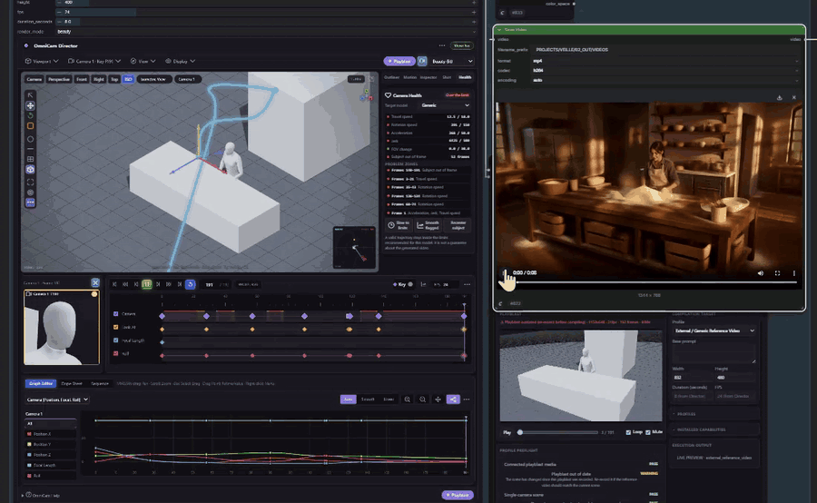

<p align="center">
  
</p>

# OmniCam User Guide

All three nodes are marked **experimental** in ComfyUI. Camera authoring and the
playblast are stable in practice; the **Monitor** profile set and the Director
**Motion Tracks** surface may still change before a stable release.



The full graph — Extractor, Director and Monitor wired end to end — is in
[`assets/omnicam-overview.png`](assets/omnicam-overview.png); a longer
walkthrough is [`assets/omnicam-preview.mp4`](assets/omnicam-preview.mp4).

## Author a Camera Move

1. Add **OmniCam Director**.
2. Compose the opening frame in the 3D viewport.
3. Press `I` to insert a camera keyframe.
4. Move the playhead, reposition the camera, then press `I` again.
5. Press `Space` to preview the shot.
6. Record a playblast when a reference-video workflow needs one.

Director keeps the authored **MotionScene** as the canonical scene state; each
camera carries its own versioned camera track. The playblast is a motion
reference, not a final render.

### Draw a Camera Path

1. Set the **Playback Range** to the frames the move should cover.
2. Click **Draw Camera Path** in the viewport tool rail. Director switches to
   Top View and keeps the current camera height.
3. Hold the left mouse button and sketch the trajectory; release to commit.
4. OmniCam creates a new animated camera, spreads its keys across the playback
   range, and makes it active. Press `Space` to preview.
5. The camera follows the path by default. Use the **Look At** control to track
   a scene object; clearing Look At restores the drawn orientation exactly.

Right-click or `Escape` cancels an uncommitted stroke. Middle-mouse and Maya
`Alt` navigation stay available while the tool is armed. The freehand stroke is
editor-only -- it is never saved into the workflow or burned into a playblast.

### Edit a Camera Path in 3D

Once a path exists (drawn, presetted, or Extractor-recovered), every keyframe
is a directly editable spatial control point:

- Click a key to select it; `Shift`+click adds or removes another. One key
  moves alone; two or more move, scale or rotate together about their
  centroid; the whole path (via its right-click menu or by clicking its line)
  does the same about the path centroid. The same `T`/`R`/`S` gizmo -- a real
  Three.js `TransformControls` handle, the same one that moves objects and
  cameras -- drives all four scopes.
- Double-click the path line to insert a new key there without changing the
  curve's visible shape; select key(s) and press `Delete`/`Backspace` to
  remove them.
- A selected key's right-click menu can switch the gizmo between its
  **Position** and its look-at **Target** -- disabled while an active **Look
  At** constraint drives that camera, so a drag can never fight the
  constraint.
- Pick one of thirteen editable **Camera Path Presets** (Dolly, Truck,
  Pedestal, Crane, Arc, Orbit, Spiral, …) from the compass button beside
  Draw/Continue, or give a key a **Timing Weight** and use **Redistribute
  Timing** to reflow the path's speed without moving its first/last frame or
  changing its shape.

Every one of these stays an ordinary, model-independent MotionScene camera
keyframe -- no MiniMax H3, Wan or LTX-specific behavior is ever encoded into
the path itself; that compilation only happens downstream, in Monitor. See
the [Node Guide](NODES.md) → Draw Camera Path for the full reference.

## Recover Motion from Video

1. Add **OmniCam Extractor**.
2. Connect one continuous video shot.
3. Use `auto` to prefer DPVO, then `pycolmap`, then `opencv_sift` -- or select one of the three directly.
4. Review Solver Coverage and the report.
5. Connect `motion_scene` to the Director's `solved_scene` input to keep editing the recovered move, or straight to Monitor to deliver it.

Extractor returns relative camera motion. It does not reconstruct metric scene scale or stitch across hard cuts.

## Reconstruct 3D Scene from an Image

1. Add **OmniCam Extractor**.
2. Connect an image (via `Load Image` or any `IMAGE` socket).
3. Switch the Extractor panel mode to **Scene Reconstruct**.
4. Choose a quality preset:
   - **Fast**: 360px resolution, 32k triangle budget — quick turnaround.
   - **Balanced** (default): 512px resolution, 64k triangle budget — balanced detail.
   - **High**: 720px resolution, 120k triangle budget — fine geometry contours.
5. Choose detection options:
   - **Ground Plane**: detects the dominant floor plane with RANSAC and adds a calibrated ground proxy.
   - **Wall Planes**: fits vertical surface planes (disabled by default).
   - **Source Texture**: embeds the image UV texture into the proxy GLB.
6. Click **Reconstruct Scene** to run geometry estimation interactively (runs outside the Comfy prompt queue).
7. Click **Open in Director** to adopt the reconstructed environment mesh and camera hold into the Director viewport.

In Director, reconstructed objects appear locked by default to prevent accidental moves, with confidence badges (`High`, `Medium`, `Low`) reflecting estimation inlier ratios. Toggle **Reconstruction Appearance** between `Neutral` (ideal for `omni_ref` conditioning playblasts) and `Source Texture` (for interactive shot staging).


## Deliver to a Video Workflow

1. Connect `motion_scene` from Director or Extractor to **OmniCam Monitor**.
2. Connect `playblast_video` as well. Reference-video profiles require it, and
   every profile uses it for the preview.
3. Choose the `target_profile` your downstream model needs.
4. Queue, then read the preflight. Anything `BLOCKED` stops the compile and says
   why; resolve it before wiring the output.
5. Wire the one output that profile populates:
   - `reference_video`, plus `final_prompt`, for `external_reference_video` or `h3_api`
   - `reference_frames`, plus `final_prompt`, for `h3_native`
   - `camera_embedding` for `wan_camera_native`
   - `native_tracks` for `wan_move_native`
   - `tracks_json` for `wan_track_native`, `wanvideo_ati`, `ltx25_motion_track`

`external_reference_video` applies no model-specific contract: no frame grid, no
fps conversion, no required downstream node, and it never blocks. Use it for a
model OmniCam has no named profile for -- Seedance, Kling, Veo, a private API.
Choose a named profile only when you want OmniCam to enforce that model's exact
contract and block the compile when the scene or the connected media cannot
satisfy it.

Switching profile never changes the MotionScene. It does change which Monitor output carries the result, so connect the one listed above for the profile you selected.

The player above the preflight shows the Director's actual recorded playblast,
not its live edit viewport. If the scene has changed since that file was
recorded, it reads `PLAYBLAST OUTDATED` — the compile still sends the old
footage until you re-record.

Use the [Node Guide](NODES.md) for exact sockets and profile requirements, and
[`examples/workflows/`](../examples/workflows) for a ready-made graph per family.

## Interface Modes

Director offers Basic, Animation, and Advanced interface modes. They reveal progressively more of the same shot editor; camera data and workflow serialization remain unchanged.

### Staging Primitives & Graph Editor

- **3D Scene Primitives**: Quickly populate your scene with one click using the Outliner quick-bar: **Card** (media billboard), **Cube**, **Sphere**, **Cylinder**, **Torus**, **Human** (authentic procedural low-poly mannequin grounded at $y = 0$), and **Null** pivots.
- **Viewport HUD & Controls**: Live camera OSD (Focal mm, FOV, target distance, Camera Lock `🔒`, roll reset `⮑`), 1-click World/Local coordinate toggle (`W`/`L`) & Snapping (🧲) on the tool rail, quick-toggle overlay cluster, and fullscreen floating transport.
- **Graph Editor**: Fine-tune camera motion and object animation using 12 easing curves (`Ease`, `Smooth`, `Bezier`, `Linear`, `Hold`, `Sine`, `Cubic`, `Quintic`, `Expo`, `Back`, etc.) and 6 Bézier tangent modes (`Auto`, `Clamped`, `Vector`, `Free`, `Aligned`, `Flat`) with dynamic vertical coordinate scaling.

### Asset Library, Characters & Labels

The left panel has **SCENE** and **ASSETS** tabs.

- **Browse & place**: the ASSETS tab is a searchable thumbnail grid of
  characters, props, environments and vehicles. Double-click (or **Add to
  scene**) to instantiate; **Import…** adds your own `.glb` / `.fbx`. A `RIGGED`
  badge means the character's rig is fully mapped.
- **Rig a character**: select it, open **Rig Mapper**, press **Auto Map**
  (recognises Mixamo and generic GLTF rigs), fix any red rows, **Save Mapping**.
- **Pose (FK)**: **Edit Pose** shows clickable joint dots in the viewport; pick
  a joint and scrub its X / Y / Z. Pick a **preset**, or **Save Pose…** your
  own. One drag = one undo.
- **Motion**: pick a clip in **Motion**, set its start / end frame, speed and
  loop. **Bake current frame to pose** freezes the animated pose so you can
  hand-edit it. A clip and hand-posing are mutually exclusive.
- **Tags & Labels**: give objects machine **tags** (`hero`, `subject`) in the
  Inspector; toggle visible viewport **Labels** (`Off / Selected / All`,
  showing the annotation, name or primary tag) from the viewport corner. Labels
  are hidden from a playblast by default — tick **Burn labels / annotations
  into the playblast** (Display menu) to record them.

Full reference: [Asset Library](ASSET_LIBRARY.md) · [Characters](CHARACTERS.md).

### Resizable Panels & Ergonomics

The interface layout adapts to your workflow with drag-resizable splitters:
- **Outliner Height**: Pull the handle under the scene tree to view complex hierarchies without inner scrollbars.
- **Side Panel Width**: Drag the vertical splitter between viewport and inspector to widen property editors.
- **Camera-Preview Column**: Adjust the splitter between camera previews and timeline transport.
- **Graph Editor Height**: Drag the divider above the curve editor to expand the graph editing area.

All splitters are accessible via keyboard (arrow keys, `Shift`+arrow for large steps, `Home` or double-click to reset) and persist within the saved workflow.

Use [Shortcuts](SHORTCUTS.md) for the complete viewport and timeline control reference.

## Install

For normal use, install Majoor OmniCam through **ComfyUI Manager -> Custom Nodes
Manager** (search for *Majoor OmniCam*). Manager / Registry installs ship with
the generated frontend bundle, so they do not require Node.js or a local build.

A raw Git source checkout works as-is; the generated runtime bundle
(`web/omnicam.js`, `web-chunks/`) is committed alongside `web-src/`:

```bash
cd ComfyUI/custom_nodes
git clone https://github.com/MajoorWaldi/ComfyUI-Majoor-OmniCam.git
```

Restart ComfyUI after installing. There are no required Python packages beyond
OmniCam's declared ComfyUI frontend compatibility dependency.

Contributors editing `web-src/` need Node.js 22 and should rerun
`npm ci && npm run build` to regenerate the committed bundle -- CI fails the
`frontend` job if a fresh Linux build doesn't match what's committed.

All three Extractor backends are optional. DPVO requires a compatible local
installation and its checkpoint at:

```text
ComfyUI/models/omnicam/dpvo/dpvo.pth
```

pycolmap needs nothing beyond `python_embeded\python.exe -m pip install pycolmap`
-- no compiler, no CUDA toolkit, prebuilt Windows wheels. OpenCV/SIFT needs
`opencv-python`. `auto` tries DPVO, then pycolmap, then OpenCV/SIFT, and uses
the first one actually installed. See
[Installing DPVO](TECHNICAL_REFERENCE.md#installing-dpvo) for the DPVO build
procedure, and the rest of the [Technical Reference](TECHNICAL_REFERENCE.md)
for runtime details.

### Geometry Estimation (Scene Reconstruction)

Scene Reconstruction uses ComfyUI's native geometry estimation backend (`comfy_extras.nodes_moge`). It requires a MoGe checkpoint placed in:

```text
ComfyUI/models/geometry_estimation/
```

OmniCam adheres to a strict **no auto-download policy**: models and packages are never downloaded automatically in the background. If the checkpoint is absent, Extractor surfaces clear setup instructions while camera-tracking continues to operate normally.

## Help and Troubleshooting

Use the `?` button for concise help about the selected OmniCam node. For detailed contracts, profile compatibility, and managed-file behavior, see the [Node Guide](NODES.md), [Compatibility Guide](COMPATIBILITY.md), and [Security Guide](SECURITY.md).
