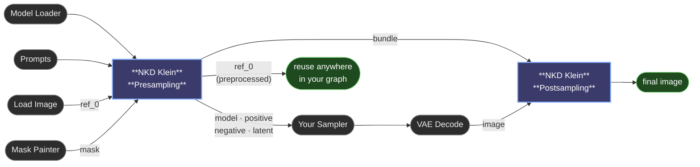

# NKD Klein Tools

ComfyUI nodes that turn a Flux Klein workflow into something simple. Plug in your model, drop an image, write a prompt, and go — no manual wiring of internal pieces. Whether you want to generate from scratch, transform an existing photo, paint over a specific area, or zoom in for a high-detail touch-up, a couple of nodes handle it all. Optional extras let you build the prompt from curated presets, and control how much each reference image shows up — or which part of the canvas it lands on.

https://github.com/user-attachments/assets/f84cc919-325d-465b-8d3d-e178de5f7872


>   [**Full introduction tutorial**](https://youtu.be/8wBXI-QCy0w)

---

## What's new in 1.11.x

- **New *Transparent Background*** *(Postsampling)* — outputs the result with an alpha channel: the regenerated area stays opaque and everything else becomes transparent, ready to save as a PNG cutout or composite elsewhere. It uses the mask (or the auto-detected region) to know what to keep, so a run without either comes out as a normal image. Saves wiring an invert + join-alpha pair by hand.
- **New *Remove Specks*** *(Postsampling)* — cleans up the little floating scraps auto-detection leaves scattered around the image when grain or noise changed just enough to be flagged. Any detected patch smaller than the given percentage of the image area is dropped. Raise it if specks still get through, lower it if a genuinely small edit (an earring, a button) is being erased; `0` turns it off.

## What's new in 1.10.x

- **New node: 😺NKD Klein Prompt Builder** — build a prompt visually by combining your own text with curated presets (style, lighting, camera angle, composition, mood, and more) from dropdowns, with a **live preview** of the result. Switch between flowing prose (best for Klein) and a structured JSON template for automation. Wire its `prompt` output into Presampling's positive input. **The dropdown options are defined in `klein_presets.json`** — edit that file to add, remove or reword presets to your taste, then restart ComfyUI.
- **New *(experimental)*: regional reference control** — send a specific reference image to a specific **area** of the canvas. Paint a mask for the zone and the reference's influence is confined there (and can be reinforced inside it), instead of the model spreading it across the whole image. A small family of nodes on the model line, between Presampling and your sampler:
  - **😺NKD Klein Reference Region** — confines one reference to a masked zone, with controls for how strong it is inside, how firmly it's held back outside, and how crisp the edge is.
  - **😺NKD Klein Reference Fit** — scales a reference to sit inside the masked area, so the *whole* reference lands in the zone instead of only the part that happens to overlap it.
  - **😺NKD Klein Reference Control** — one node that does it all: overall strength + optional per-step curve + regional confinement (the mask is optional — without it, it's just a strength control). Chain one per reference.

  Experimental: it works well in testing, but on strong settings expect a little bleed into neighbouring areas. Feedback welcome.
- **Fixes** — *Match Original Colors* was measuring the untouched background, which made it do nothing on masked edits; it now measures the regenerated area, so the dial actually bites. Faster mask processing, a crop-box edge fix, and correct node width on the classic canvas renderer.

https://github.com/user-attachments/assets/a62cd1a4-6c2c-4ee4-89c8-e515857a4835

## What's new in 1.9.x

- **New node: 😺NKD Klein Reference Weight** — when you use more than one reference image, this lets you decide **how much each one shows up** in the result, one at a time. Turn a reference up so it asserts itself, or down so it stops dominating. `1.0` leaves it as usual, lower fades it out (`0` = ignored), higher makes it stronger. You can also connect a curve so a reference is strong at the start and eases off later (handy when you want it to set the mood without taking over the whole image). Optional — only add it when you want that extra control.
- **Better multi-reference handling** — extra reference images of a different size no longer drift or overlap; they line up cleanly with your main image now.
- **New *Resize* toggle** *(Presampling)* — on by default, the node picks the output size for you from Aspect Ratio and Megapixels (as before). Turn it **off** to let the node leave every image at its own size and work at your input image's native size — handy when you'd rather control sizing yourself with other nodes. Turning it off tidies the node by hiding Aspect Ratio and Megapixels.


## What's new in 1.8.x

- **New *Match Original Colors*** *(Postsampling)* — pulls the regenerated area's colors and lighting back toward the original image. The model often shifts the overall white balance or saturation slightly; this dial corrects that drift so the edit blends into the same scene. `0` leaves things as the model produced them; `1` matches them fully to the original.
- **New *Seamless Edges*** *(Postsampling)* — erases any remaining color or lighting seam at the boundary of the regenerated zone. Best for dramatic relighting or strong style changes where the edge is still visible after color matching. Off by default — it's heavier and can smear textured edges.
- **New *Auto-Detect Edit Region*** *(Postsampling)* — when you run an img2img edit **without a mask**, the node figures out which pixels actually changed and composites only those back. Keeps the rest of the image pixel-perfect across iterative edits instead of letting the model rewrite the whole canvas every time. Comes with its own fine-tuning controls:
  - **Edge Softness** — how gently the detected region fades into the original.
  - **Region Padding** — grow or shrink the detected region before blending.
  - **Fill Inner Gaps** — seal small holes inside the detected region.
  - **Extend To Borders** — extrapolate to the image edge so no frame of the original peeks through.
- **Example workflow included** — a ready-to-use workflow lives in `example_workflows/` (with a preview image). Drag it into ComfyUI to get a working setup immediately.

## What's new in 1.7.x

- **Megapixels is now a slider** with decimal precision (0.1 – 4.0) instead of a dropdown with fixed steps. You can pick any size that suits your needs.
- **New *Image Fit* control** — decide how the input image should be handled when the canvas you chose has a different shape than the image:
  - **Native** *(default)*: the model rebuilds the canvas around your subject without distorting it. Best for changing aspect ratio or tile-based workflows.
  - **Center Crop**: cuts the image to fit the canvas (centered, no distortion, loses the edges).
  - **Outpaint**: fits the whole image inside the canvas and lets the model fill in the surrounding space.
- **New *Outpaint Fill*** — when using Outpaint, choose what goes in the empty space: **Gray** (neutral, default), **Black**, **White**, or **Smart** (a soft continuation of your image so the model has a natural starting point).
- **New *Slide* control** — shift the image off-centre instead of always centering it. With **Outpaint** it moves the image within the empty space; with **Center Crop** it chooses which part of the image is kept. `0.5` stays centered; the direction follows the canvas shape (a taller canvas slides it up/down, a wider canvas slides it left/right).
- **New `ref_0` output** — your input image after the Image Fit / Outpaint preprocessing, at the final canvas size. Reuse it anywhere else in your workflow.

> ⚠️ **Heads up if you're upgrading from an older version:** the *Megapixels* widget changed from a dropdown to a numeric slider. Workflows saved with the old version will load fine — the value is migrated automatically and a notification will let you know — but it's a good idea to open the node and double-check the value is what you want.

---

## What you can do with it

- **Generate images from a prompt** — just connect the model and write what you want.
- **Transform an existing image** — drop your image into the reference slot and add a prompt describing the change.
- **Inpaint a specific area** — paint a mask and the masked zone is the only part that gets regenerated. Everything else stays untouched.
- **Detail a small area at high quality** — turn on detailing to zoom into the masked zone (a face, a hand, an eye) and regenerate it with way more detail than you'd get from a full-image pass.
- **Combine multiple reference images** — extra slots appear as you connect them, so you can give the model several visual hints to work with.
- **Dial each reference separately** — turn one reference up or down on its own, or *(experimental)* send it to a specific area of the canvas.

The node figures out which mode you're using based on what you connect — no setting to flip.

---

## The nodes

### 😺NKD Klein Presampling

The starting point. You connect your model, prompts, and reference image here. It hands off everything the sampler needs.

### 😺NKD Klein Postsampling

The end point. It takes the sampler's output and delivers the final image, putting everything back in its place when you've used inpainting or detailing.

### 😺NKD Klein Reference Control *(optional, experimental)*

The all-in-one reference dial, and the one to reach for if you're starting today. Sits between Presampling and your sampler and controls **one** reference image: how strongly it shows up, optionally over a per-step curve, and — if you connect a mask — **where** on the canvas it applies. Without a mask it's purely a strength control. Chain one node per reference. See [Controlling a single reference](#controlling-a-single-reference) below.

### 😺NKD Klein Reference Weight *(optional)*

The original strength-only node: same model-line position, same `reference_index` + weight + optional curve, no regional part. Still here and still works — Reference Control does everything it does, so use that one for new graphs. See [Controlling a single reference](#controlling-a-single-reference) below.

### 😺NKD Klein Reference Region *(optional, experimental)*

The regional half on its own: confines one reference to a masked zone, without touching its overall strength. Use it when you already have a Reference Weight node in the chain and only want to add a zone. Reference Control merges the two.

### 😺NKD Klein Reference Fit *(optional, experimental)*

Goes **before** Presampling, not on the model line: scales a reference image so it sits inside the masked zone on a canvas-sized image. Klein stretches every reference across the whole canvas, so without this only the slice that happens to overlap your zone lands in it. Feed its `image` output into a reference slot of Presampling, and use the same mask in Reference Control / Reference Region.

### 😺NKD Klein Prompt Builder *(optional)*

Assembles a prompt from your own text plus curated preset dropdowns, with a live preview, and outputs a string you connect to Presampling's positive input. Choose flowing prose (best for Klein) or a structured JSON template. The dropdown presets live in `klein_presets.json` — edit that file (then restart ComfyUI) to customise them.

**The chain looks like this:**

```
NKD Klein Presampling → (NKD Klein Reference Control ×N) → [your sampler chain] → NKD Klein Postsampling
```

---

## Inputs that matter

### Image and prompt

- **ref_0** — your input image. The most important slot.
- **ref_1, ref_2, …** — extra reference images. Slots appear automatically when you connect one, up to 8.

### Output size

- **Resize** — on by default: the node chooses the output size from Aspect Ratio and Megapixels. Turn it off to keep every image at its own size and work at your input's native size (the node won't resize anything — handle sizing yourself elsewhere). With Resize off, Aspect Ratio and Megapixels are hidden since they no longer apply.
- **Aspect Ratio** — the shape of the final image. *As Reference* matches your input image; *Custom* lets you set any size; or pick one of the named ratios.
- **Megapixels** — how big the final image should be. Bigger = more detail, but slower.
- **Custom Width / Custom Height** — only used when *Aspect Ratio* is set to *Custom*.

### Inpainting (when you connect a mask)

- **mask** — paint white over the area you want regenerated; black stays as-is.
- **Mask Expand** — makes the painted area a bit bigger so the new content blends naturally with its surroundings.
- **Mask Blur** — softens the mask edges for a smoother transition.
- **Inpaint Blend** — `0` = clean cut along the mask edge, higher values fade the new and old together.

### Detailing — for high-quality touch-ups

- **Use Detailing** — turn this on to zoom into the masked area before regenerating it. Perfect for fixing faces, hands, eyes, small props. The result is composed back into the full image automatically.
- **Detail Padding** — how much of the surrounding area to include in the zoom. More padding = the model sees more context; less padding = tighter focus on the masked zone.

### Reference Strength — the creative dial

This is the dial that controls how much creative freedom the model has versus how strictly it sticks to your reference image's layout.

| Value | Behaviour | When to use |
|---|---|---|
| **`-3` to `-1`** | ⚠️ Mostly experimental. More freedom, looser interpretation | When you want bigger, more imaginative changes — the model reinterprets things more |
| **`0`** *(default)* | Klein's official default behaviour — balanced | Good for most edits |
| **`1` to `4`** | Mild anchor | When you want changes but the layout to stay close to the original |
| **`5` to `7`** | Strong anchor | Tight alignment with the reference — useful for upscales or precise edits |
| **`8` to `10`** | Almost locked to reference | When things absolutely have to line up pixel-for-pixel with the input |

If you're getting unwanted drift between the original and the result (faces shifting, edges not quite aligning), bumping this up usually fixes it. If your generations feel too restrained or "stuck" close to the input, try negative values for more creative leeway.

> **Reference Strength vs Strength on the Reference Control node — what's the difference?**
> *Reference Strength* (above, on Presampling) decides how closely the result follows the **layout** of your references — all of them at once. *Strength* on the **Reference Control** node (below) decides **how much one particular reference shows up** in the image. Two different dials — you can keep a loose layout but a strong look, or the other way round.

### Controlling a single reference

The **😺NKD Klein Reference Control** node lets you turn **one** reference image up or down — and optionally pin it to one area — without touching the others. Add it on the model line between Presampling and your sampler. Want to control two references separately? Chain two of these nodes (pass `latent` from one to the next).

- **reference_index** — which reference this node affects. `0` is your main image (ref_0), `1` is ref_1, and so on, in the order you connected them.
- **Strength** — `1.0` leaves the reference as usual. Below `1` fades it out (`0` = ignored completely); above `1` makes it show up more (up to `2`).
- **schedule** *(optional)* — connect the **FLOAT** output of **NKD Sigmas Curve** to change the strength over the course of the generation. For example, a curve that starts high and drops to zero lets a reference set the overall look at the start, then step aside so it doesn't take over the fine details. Leave it unconnected to keep the same strength throughout. It behaves the same whichever scheduler you use.

The rest only matter once you connect a **mask** — that's what turns on regional control:

- **mask** — the zone this reference should fill. Leave it unconnected and the node is a plain strength control.
- **latent** — connect Presampling's `latent` output (needed only with a mask, to line the mask up with the model's internal grid). Chain the node's own `latent` output into the next Reference Control.
- **region_weight** — how strongly the reference shows up *inside* the zone. `1.0` = normal, up to `4` reinforces. Pushing it high makes the reference bleed into neighbouring areas — prefer raising *region_hardness* instead.
- **outside_suppression** — how firmly the reference is held *outside* the zone. `1.0` = it only appears inside; `0.0` = no restriction at all.
- **region_hardness** — how crisp the zone edge is. `0.0` follows your mask's blur (natural, but the reference can halo just outside); `1.0` is a hard edge (tightest containment, may look slightly stepped). Raise it if the reference leaks into areas you didn't mask.

> The older **😺NKD Klein Reference Weight** node has the same `reference_index` / weight / `schedule` inputs and no regional part; **😺NKD Klein Reference Region** has the regional inputs and no strength. Reference Control is the two of them merged, so a new graph only needs that one.

> **Experimental:** regional control works well in testing, but because the canvas has to keep talking to itself, a reference can bleed a little into neighbouring areas at strong settings. Raising *region_hardness* and running the reference through **Reference Fit** both help.

### Postsampling clean-up

These live on the Postsampling node and fine-tune how the regenerated area is composited back over the original.

- **Uncrop Feather** — softens the edge where a detailed zoom blends back into the rest of the image.
- **Match Original Colors** — pulls the new area's colors and lighting back toward the original to undo any white-balance or saturation drift from the model. `0` = no correction, `1` = full match. It measures the regenerated area itself, so if you *wanted* a big colour change there (relighting, a recolour), keep this low.
- **Seamless Edges** — turns on Poisson blending to erase any remaining color/lighting seam at the edge of the regenerated zone. Turn on for dramatic relighting or strong style changes; leave off by default (it's heavier and can smear textured edges).
- **Auto-Detect Edit Region** *(img2img without a mask)* — detects what actually changed between the input and the generated image and composites only that region back. Keeps the unchanged parts of the original pixel-perfect across iterative edits. Ignored when there's no input image, or when a mask is connected.
- **Edge Softness** — how softly the auto-detected region fades into the original (% of image diagonal, so it looks the same at any resolution). Higher = wider, gentler transition; lower = tight, geometric edits.
- **Region Padding** — grow (positive) or shrink (negative) the auto-detected region before blending. Useful when detection falls just short of the true edges, or bleeds into background that should stay untouched.
- **Fill Inner Gaps** — seals small holes inside the auto-detected region, for when the edit changed an object's color but not its interior contrast.
- **Remove Specks** — drops the tiny floating scraps auto-detection picks up from grain and noise. Anything smaller than this percentage of the image area is discarded. Lower it if a genuinely small edit is disappearing; `0` turns it off.
- **Extend To Borders** — extrapolates the detected region into any thin border void left by alignment, so no frame of the original peeks through. Leave on.

### Other

- **Pin Model** — keeps the model loaded in your graphics card so it doesn't reload between runs. Faster, but only turn it on if you have plenty of VRAM.
- **Bypass Reference** — turns off the model's ability to look at your reference image, so it behaves like a traditional image-to-image model instead. Leave it off in most cases.
- **Transparent Background** *(Postsampling)* — hands you the result with the background knocked out as alpha, using the mask or the auto-detected region as the cutout. Without either, the image comes out normal.

---

## Modes (auto-detected)

| What you connect | Mode |
|---|---|
| No reference image | Text-to-image |
| Reference image only | Image-to-image |
| Reference image + mask | Inpainting |
| Reference image + mask + Use Detailing on | Inpainting with detail zoom |

---

## Quick recipes

**Generate an image from scratch**
1. Write a positive prompt.
2. Pick an Aspect Ratio and Megapixels.
3. Run.

**Transform an image**
1. Drop your image into `ref_0`.
2. Write a prompt describing what you want changed.
3. Run.

**Edit a specific area of an image**
1. Drop your image into `ref_0`.
2. Paint a mask over the area you want to change and conect it to the mask socket.
3. Write a prompt describing the change.
4. Run.

**Fix a face, hand or small detail at high quality**
1. Drop your image into `ref_0`.
2. Paint a mask over the small area and conect it to the mask socket.
3. Turn on **Use Detailing**.
4. Write a prompt describing what you want the detail to look like.
5. Run.

**Use multiple reference images for inspiration**
1. Drop your main image into `ref_0`.
2. As you connect, more slots will appear — add up to 8 reference images.
3. Write a prompt and run.

**Make one reference show up more (or less) than the others**
1. Set up your references as above.
2. Add a **NKD Klein Reference Control** node on the model line, between Presampling and your sampler.
3. Set **reference_index** to the reference you want to adjust (`0` = ref_0, `1` = ref_1, …).
4. Turn **Strength** up (toward `2`) to make it show up more, or down (toward `0`) to fade it out.
5. *(Optional)* connect an **NKD Sigmas Curve** to its `schedule` input to make it strong early and fade later.
6. Run. Add another Reference Control node if you want to adjust a second reference too.

**Send a reference to one area of the image** *(experimental)*
1. Drop your main image into `ref_0` and the second one into `ref_1`.
2. Paint a mask over the area where `ref_1` should land.
3. Run `ref_1` through **NKD Klein Reference Fit** with that mask, and plug its output into Presampling's `ref_1` slot instead of the raw image.
4. Add a **NKD Klein Reference Control** on the model line: `reference_index` `1`, the same mask into `mask`, and Presampling's `latent` output into `latent`.
5. Run. If the reference leaks outside the zone, raise **region_hardness**; if it's too faint inside it, raise **region_weight**.
6. Chain another Reference Control (feeding it the previous one's `latent`) for a second reference in a second zone.

**Iteratively edit an image without a mask (keep the rest pixel-perfect)**
1. Drop your image into `ref_0`.
2. Write a prompt describing the change ("make the sky stormy", "swap the shirt for a denim jacket", …).
3. On the Postsampling node, turn on **Auto-Detect Edit Region**.
4. Run. Only the changed region is composited back; the rest of the image stays identical, so you can chain several edits without drift.

---

## Example workflow

A ready-to-use workflow is bundled in [`example_workflows/`](example_workflows/). Drag `NKD Klein Tools.json` straight into ComfyUI to load it, or check the preview image first.

---

## Typical workflow



The `bundle` output carries everything Postsampling needs to put the image back where it belongs (crop boxes, masks, the original reference, mode…). You don't need to look inside it — just connect it straight through.

---

## Requirements

- ComfyUI with Flux Klein model support
- PyTorch ≥ 2.0

---

## Installation

Clone into your `ComfyUI/custom_nodes` folder:

```bash
git clone https://github.com/Nekodificador/ComfyUI-NKD-Klein-Tools
```

Or install via the ComfyUI Manager by searching for **NKD Klein Tools**.

---

*Made by [Nekodificador](https://github.com/Nekodificador)*
