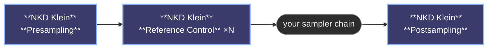

# NKD Klein Tools

ComfyUI nodes that turn a Flux Klein workflow into something simple. Plug in your model, drop an image, write a prompt, and go — no manual wiring of internal pieces. Whether you want to generate from scratch, transform an existing photo, paint over a specific area, or zoom in for a high-detail touch-up, a couple of nodes handle it all. Optional extras let you build the prompt from curated presets, and control how much each reference image shows up — or which part of the canvas it lands on.

https://github.com/user-attachments/assets/f84cc919-325d-465b-8d3d-e178de5f7872


>   [**Full introduction tutorial**](https://youtu.be/8wBXI-QCy0w)

---

## What you can do with it

- **Generate images from a prompt** — just connect the model and write what you want.
- **Transform an existing image** — drop your image into the reference slot and add a prompt describing the change.
- **Inpaint a specific area** — paint a mask and the masked zone is the only part that gets regenerated. Everything else stays untouched.
- **Detail a small area at high quality** — turn on detailing to zoom into the masked zone (a face, a hand, an eye) and regenerate it with way more detail than you'd get from a full-image pass.
- **Combine multiple reference images** — extra slots appear as you connect them, so you can give the model several visual hints to work with.
- **Dial each reference separately** — turn one reference up or down on its own, or *(experimental)* send it to a specific area of the canvas.

The node figures out which mode you're using based on what you connect — no setting to flip.

---

## The nodes

| Node | What it does |
|---|---|
| [😺NKD Klein Presampling](docs/nodes.md#nkd-klein-presampling) | The starting point. Model, prompts and reference image go in here. |
| [😺NKD Klein Postsampling](docs/nodes.md#nkd-klein-postsampling) | The end point. Delivers the final image and puts everything back after inpainting or detailing. |
| [😺NKD Klein Reference Control](docs/nodes.md#nkd-klein-reference-control) | The all-in-one reference dial, and the one to reach for today: strength, an optional per-step curve, and a zone if you give it a mask. *optional, experimental* |
| [😺NKD Klein Reference Weight](docs/nodes.md#nkd-klein-reference-weight) | The original strength-only node. Still works; Reference Control does everything it does. *optional* |
| [😺NKD Klein Reference Region](docs/nodes.md#nkd-klein-reference-region) | The regional half on its own, for when a Reference Weight node is already in the chain. *optional, experimental* |
| [😺NKD Klein Reference Fit](docs/nodes.md#nkd-klein-reference-fit) | Scales a reference so it sits inside the masked zone instead of stretching across the whole canvas. *optional, experimental* |
| [😺NKD Klein Prompt Builder](docs/nodes.md#nkd-klein-prompt-builder) | Builds a prompt from your own text plus curated preset dropdowns, with a live preview. *optional* |

**The chain looks like this:**



---

## Going further

| | |
|---|---|
| [The nodes in detail](docs/nodes.md) | What each of the seven does, at length. |
| [Inputs and modes](docs/inputs.md) | Every input that changes the result, and the mode the node puts itself in when you connect one. |
| [Recipes and workflows](docs/recipes.md) | Settings that work, an example graph, and the order things go in. |
| [Changelog](docs/changelog.md) | What changed in each version. |

---

## Requirements

- ComfyUI with Flux Klein model support
- PyTorch ≥ 2.0

---

## Installation

Clone into your `ComfyUI/custom_nodes` folder:

```bash
git clone https://github.com/Nekodificador/ComfyUI-NKD-Klein-Tools
```

Or install via the ComfyUI Manager by searching for **NKD Klein Tools**.

---

*Made by [Nekodificador](https://github.com/Nekodificador)*
