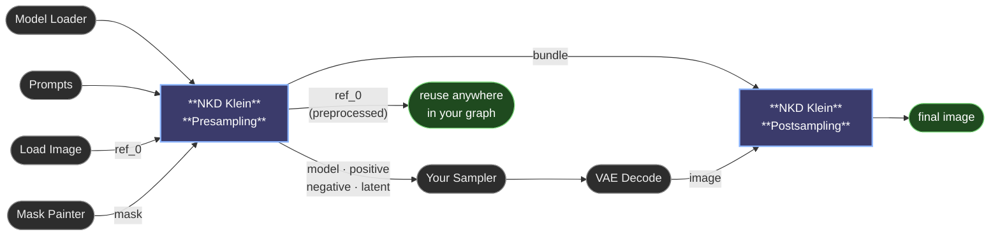

# Recipes and workflows

Settings that work, and how the graph goes together.

## Quick recipes

**Generate an image from scratch**
1. Write a positive prompt.
2. Pick an Aspect Ratio and Megapixels.
3. Run.

**Transform an image**
1. Drop your image into `ref_0`.
2. Write a prompt describing what you want changed.
3. Run.

**Edit a specific area of an image**
1. Drop your image into `ref_0`.
2. Paint a mask over the area you want to change and conect it to the mask socket.
3. Write a prompt describing the change.
4. Run.

**Fix a face, hand or small detail at high quality**
1. Drop your image into `ref_0`.
2. Paint a mask over the small area and conect it to the mask socket.
3. Turn on **Use Detailing**.
4. Write a prompt describing what you want the detail to look like.
5. Run.

**Use multiple reference images for inspiration**
1. Drop your main image into `ref_0`.
2. As you connect, more slots will appear — add up to 8 reference images.
3. Write a prompt and run.

**Make one reference show up more (or less) than the others**
1. Set up your references as above.
2. Add a **NKD Klein Reference Control** node on the model line, between Presampling and your sampler.
3. Set **reference_index** to the reference you want to adjust (`0` = ref_0, `1` = ref_1, …).
4. Turn **Strength** up (toward `2`) to make it show up more, or down (toward `0`) to fade it out.
5. *(Optional)* connect an **NKD Sigmas Curve** to its `schedule` input to make it strong early and fade later.
6. Run. Add another Reference Control node if you want to adjust a second reference too.

**Send a reference to one area of the image** *(experimental)*
1. Drop your main image into `ref_0` and the second one into `ref_1`.
2. Paint a mask over the area where `ref_1` should land.
3. Run `ref_1` through **NKD Klein Reference Fit** with that mask, and plug its output into Presampling's `ref_1` slot instead of the raw image.
4. Add a **NKD Klein Reference Control** on the model line: `reference_index` `1`, the same mask into `mask`, and Presampling's `latent` output into `latent`.
5. Run. If the reference leaks outside the zone, raise **region_hardness**; if it's too faint inside it, raise **region_weight**.
6. Chain another Reference Control (feeding it the previous one's `latent`) for a second reference in a second zone.

**Iteratively edit an image without a mask (keep the rest pixel-perfect)**
1. Drop your image into `ref_0`.
2. Write a prompt describing the change ("make the sky stormy", "swap the shirt for a denim jacket", …).
3. On the Postsampling node, turn on **Auto-Detect Edit Region**.
4. Run. Only the changed region is composited back; the rest of the image stays identical, so you can chain several edits without drift.

---

## Example workflow

A ready-to-use workflow is bundled in [`example_workflows/`](../example_workflows/). Drag `NKD Klein Tools.json` straight into ComfyUI to load it, or check the preview image first.

---

## Typical workflow

The `bundle` output carries everything Postsampling needs to put the image back where it belongs (crop boxes, masks, the original reference, mode…). You don't need to look inside it — just connect it straight through.

---

[← NKD Klein Tools](../README.md)
