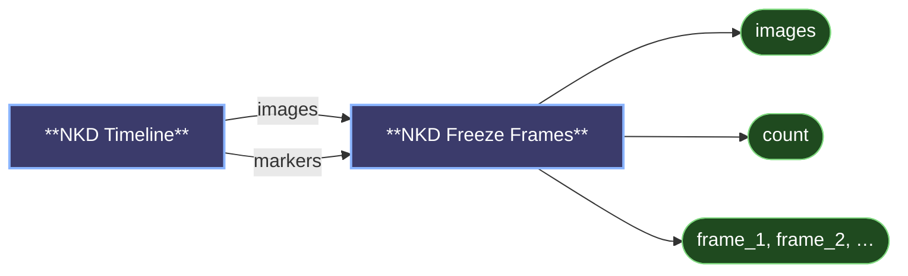

# 😺NKD Freeze Frames

Holds individual frames of a batch as still images, one per socket.

- Wire Timeline's `markers` output into `frames` and every frame you marked with **M**
  comes out of its own `frame_N` socket, previewed on the node so you can see which is
  which.
- The `frames` field can just be typed instead: `0, 12, 47`. Any separator works,
  negatives count from the end, and repeats are kept.
- `images` carries the same frames as one batch, and `count` how many there are.

---

[← All 😺NKD Preview Tools nodes](../README.md)
