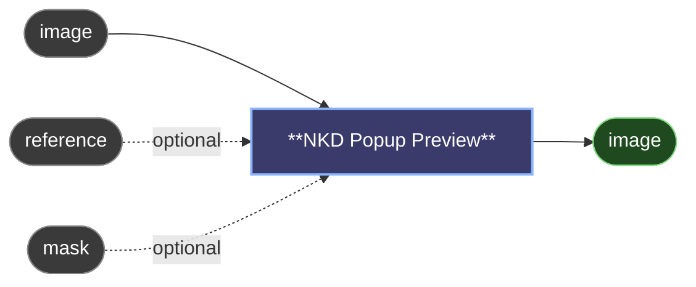

# 😺NKD Popup Preview

A floating viewer for an image, on top of your browser: pan and zoom, compare against a reference, step through a batch and file the result in your project without leaving it.

The node passes `image` through untouched, so it can sit inline in a chain (say between *VAE Decode* and a *Save Image*) instead of dangling off a branch.

## Opening it

- Double-click the node, press **Q**, or use the button in the node.
- Turn on `open_on_run` to have it open by itself when the node produces an image. It is off by default.
- It opens as a Picture-in-Picture window where the browser supports it, and as a floating panel otherwise. Drag it to any monitor, or pop it out into its own window. Its size and position are remembered.
- With several Popup Preview nodes, **Q** and **Shift+Q** follow the one you have selected or ran last. Star a node to pin it.

## Comparing

- `reference` and `mask` are optional. Wire them to compare against them or to see the mask as a tinted overlay.
- With nothing wired, **Hold** compares against your previous render.
- **Space** shows the reference while held. A quick click on the button pins it until you click again.
- **V** switches between flash, wipe (drag the divider) and difference.
- **M** shows the mask overlay while held.

## Batches

- The thumbnail strip and the counter appear when a run produces more than one image.
- **←** and **→** step through them, and Save and Copy act on the one you are looking at.

## While it runs

- The sampler's intermediate frames show up live, with the step count in a **LIVE** badge.
- A run you cancel is marked **CANCELLED**, so a blurry frame is not mistaken for a result.
- Your zoom and pan survive new frames and new renders.

## Saving

- **Save** files the image in the active project's folder and switches to **Saved** with the path. `filename_prefix` and `filename` on the node override the project's folder and name.
- **Copy** puts the image on the clipboard.
- The **⋯** menu has Download, Fit Window, To Load (sends the image to a Load Image node) and Show in folder.

## Shortcuts

Shortcuts only act while the pointer is over the viewer.

- Drag, wheel or pinch: pan and zoom.
- Double-click: 1:1 or fit.
- **0** or **F**: fit to window. **1**: 100%.
- **Shift** with the arrow keys: pan.
- **S**: save. **C**: copy.
- **Shift+Q**: run this node.
- **Esc**: close.

---

[← All 😺NKD Preview Tools nodes](../README.md)
