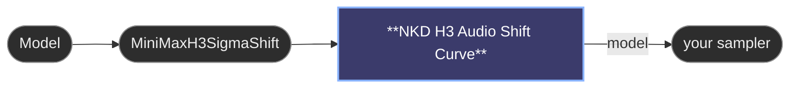

# 😺NKD H3 Audio Shift Curve

MiniMax H3 only. The stock **MiniMaxH3SigmaShift** node sets `shift_audio` once and
it stays there for the whole run. This one lets you draw how it moves instead: X is
the sampling progress, Y is a multiplier on whatever level that node set.

Low shift makes the audio resolve early and the video lock onto it. High shift keeps
both streams moving together. Being able to change that across the run means you can
have one at the start and the other by the end.

- `mult_min` (default 0.5) is what the bottom of the curve multiplies the incoming
  `shift_audio` by, and `mult_max` (default 2.0) is what the top multiplies it by.
- `debug` logs the shift applied at each step to the console.
- The curve is the same editor as the sigma node: click to add a point, drag to move,
  Shift+click to remove.

It multiplies rather than replaces, so it works *with* MiniMaxH3SigmaShift instead of
fighting it: that node still owns the level, this one only shapes it over time. The
default curve is flat at 1.0x and does nothing at all, so dropping it into a graph
changes no output until you actually move a point. Whatever the multiplier lands on,
the value handed to the model is kept inside a safe range.

Keep the range modest. The far ends of the dial trade coherence for effect, so treat
it as a nudge around a level you already like rather than a way to travel an order of
magnitude from it.

---

[← All 😺NKD Sigmas Curve nodes](../README.md)
