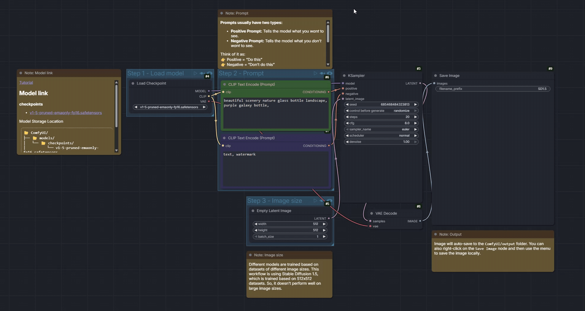
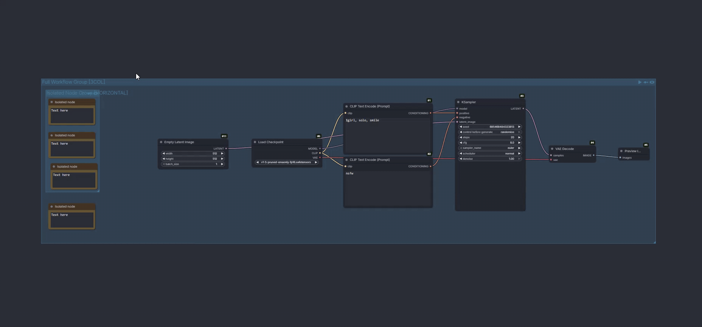

# ComfyUI Node Organizer

Automatically organizes ComfyUI workflows with a compact group-aware layout. Created with [comfyui-custom-node-template](https://github.com/PBandDev/comfyui-custom-node-template).

### Preview of organizing a workflow



### Preview of organizing groups with tokens



## Installation

1. Open **ComfyUI**
2. Go to **Manager > Custom Node Manager**
3. Search for `Node Organizer`
4. Click **Install**

## Usage

Use any of these entry points:

- Right-click the canvas and choose **Organize Workflow**
- Select groups and choose **Organize Group**
- Click the **Organize** action-bar button
- Use `Extensions > Node Organizer`
- Press `Shift+O`

## Group Layout Tokens

Add tokens to group titles to control how nodes are arranged:

| Token | Effect |
|-------|--------|
| `[HORIZONTAL]` | Single horizontal row |
| `[VERTICAL]` | Single vertical column |
| `[2ROW]`...`[9ROW]` | Distribute into N rows |
| `[2COL]`...`[9COL]` | Distribute into N columns |

**Examples:**
- `"My Loaders [HORIZONTAL]"` - arranges all nodes in a single row
- `"Processing [3COL]"` - distributes nodes into 3 columns

- Tokens are case-insensitive (`[horizontal]` works)
- `[1ROW]` = `[HORIZONTAL]`, `[1COL]` = `[VERTICAL]`
- Nested groups each respect their own tokens
- Groups without tokens use default DAG-based layout

## Testing

- `pnpm typecheck`
- `pnpm test`
- `pnpm build`
- `pnpm build:lib` emits the pure library entrypoint to `lib/`
- `pnpm test:lib` smoke-tests the built `comfyui-node-organizer` npm export
- `pnpm setup:e2e` provisions a dedicated ComfyUI instance for browser tests and installs the exact workflow-template package required by the pinned ComfyUI checkout
- `pnpm test:e2e` runs the full Playwright suite against that instance
- Broad installed-template coverage is discovered live at E2E runtime from the pinned test ComfyUI environment, with one correctness-invariant test per installed workflow template

Checked-in repo fixtures live in `tests/fixtures/`. Visual regression is graph-canvas scoped and runs as part of the normal E2E suite.
Visual regression baselines are platform-specific: committed snapshots use `-win32` and `-linux` suffixes.

## Library API

Most users can ignore this section. The extension works entirely inside ComfyUI.

The package is published to npm as `comfyui-node-organizer` for developers who want to reuse the layout engine outside ComfyUI, for example in a script, service, test harness, or workflow conversion tool.

```bash
npm install comfyui-node-organizer
```

```ts
import { normalizeWorkflowGeometry, inferGroupMembership } from "comfyui-node-organizer";
```

It exposes a small pure API:
- `normalizeWorkflowGeometry(...)` lays out plain workflow data and returns absolute node and group rectangles
- `inferGroupMembership(...)` infers direct group membership from node and group rectangles

In practice: if you want "organize this workflow JSON the same way the extension would" without loading ComfyUI, this is the entrypoint.

Build it locally with `pnpm build:lib`. `pnpm test:lib` verifies that the built package can be imported by Node.

### Local CI

Install [act](https://github.com/nektos/act) and Docker, then run:

- `pnpm ci:local` runs the full local CI workflow with `act`

## Release

Maintainer flow:

- Merge the release branch into `main`
- Trigger `.github/workflows/publish_action.yaml` manually from `main`

That workflow runs the full test suite, bumps versioned files with `uv run bump-my-version`, creates the tag and GitHub release, then publishes the custom node from the bumped tag ref.

### Manual browser testing

Build the extension first so ComfyUI loads the current `dist/` output:

- `pnpm build`

Launch the test ComfyUI instance on a free port:

- `.test-comfy/venv/Scripts/comfy.exe --skip-prompt --workspace .test-comfy/comfyui/ launch -- --cpu --port 65192`

If the port is already taken, either choose a different port or stop leftover test-instance processes first:

- `Get-Process | Where-Object { $_.Path -like '*comfy-node-organizer\\.test-comfy*' } | Stop-Process -Force`

## Known Limitations

Very large or unusual workflows may still expose edge cases. If you hit one, please [open a GitHub issue](https://github.com/PBandDev/comfyui-node-organizer/issues) with a minimal reproducible workflow attached.
