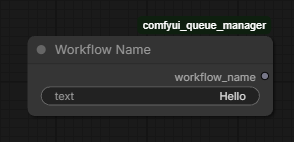
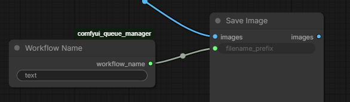
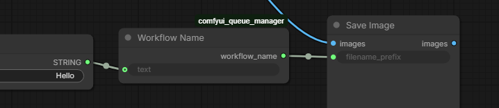

Emits the currently running workflow's name, with an optional typed or connected text override.

### Usage:

Add a Workflow Name node to set the name shown in Queue Manager. Its output can remain disconnected if you only want to name the queue entry. Connect `workflow_name` to a string input, such as **Save Image**'s `filename_prefix`, to also use the name elsewhere in the workflow.

### Inputs:

| Name | Type | Description |
|------|------|-------------|
| `text` | `STRING` text field or socket | Optional custom name. Type a value or connect a string to this input. |

The node sanitizes the typed or connected `text` value. A connection replaces the manually entered value. If the value is empty, it returns the workflow filename; if no workflow name is available either, it returns an empty string.

Trailing whitespace is ignored only when checking whether an input is empty. The full chosen string is sanitized: invalid filename characters and control characters become underscores, trailing spaces and periods become underscores, and Windows reserved device names are prefixed with an underscore. Leading spaces, internal spaces, Unicode, and existing underscores are preserved. For example, `my:name  ` becomes `my_name__`.

Queue Manager applies the same rules when queuing. It uses the first active Workflow Name node in the submitted prompt, even if its output is disconnected; muted and bypassed nodes are ignored. Without one, it uses the active workflow filename. Socket values available in the browser and built-in Text/Text (Multiline) values are read at queue time. An unavailable value is treated as empty. During execution, the node uses the actual incoming string, which may differ from the queued name.

### Use cases:

Non-exhaustive list of typical use cases:

#### Name a queue entry

Type a custom name in `text`. In this example, `Hello` becomes the name shown in Queue Manager. The output is disconnected: queue-time injection still reads the node, but ComfyUI does not execute it during rendering when nothing uses its output.

#### Save images using the workflow filename

Leave `text` empty and connect `workflow_name` to **Save Image**'s `filename_prefix`. The node returns the workflow filename, which Save Image uses as the output filename prefix.

#### Supply a custom name from another node

Connect a string-producing node to the `text` input, then connect `workflow_name` to **Save Image**'s `filename_prefix`. Here, the connected value `Hello` supplies the custom name for the queue entry and saved images. The connected string replaces the manually entered text; an empty value falls back to the workflow filename, then an empty string.

### Outputs:

| Name            | Type     | Description                       |
|-----------------|----------|-----------------------------------|
| `workflow_name` | `STRING` | Sanitized text override, workflow filename, or an empty string |
