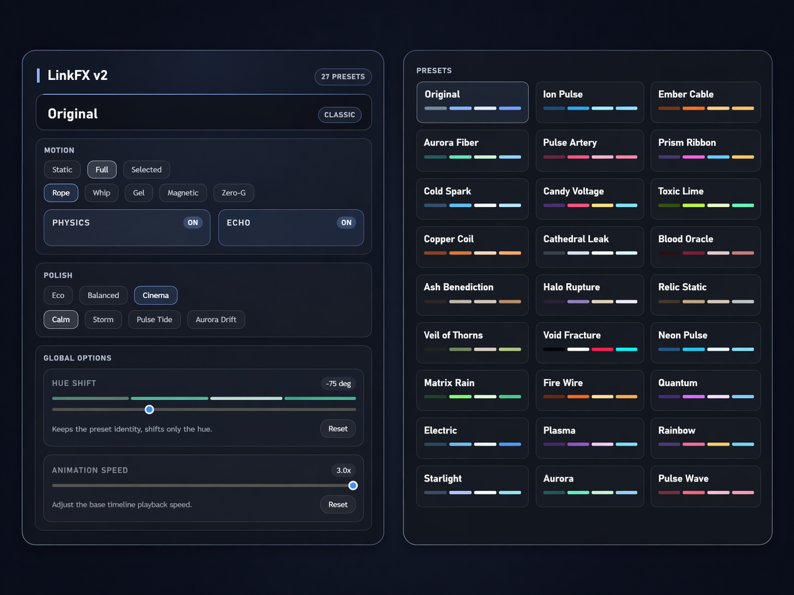

# ComfyUI LinkFX

Visual effects for ComfyUI links (wires), completely rebuilt in v2 for performance and better customization.



## v2 Features

- **Smooth Animations**: The rendering system has been overhauled to handle large graphs without lag.
- **27 Cinematic Presets**: A wide variety of visual styles ranging from subtle paths to complex animated effects.
- **5 Physics Profiles**: Customize how wires move with Rope, Whip, Gel, Magnetic, and Zero-G profiles.
- **Advanced Motion**: Includes environmental modifiers like Graph Weather (ambient ripples) and Temporal Echo (motion trails).
- **Persistent Sidebar**: A new settings panel to quickly change presets, colors, and animation speeds. Your configuration is saved automatically between sessions.
- **Legacy Support**: All original v1 effects (Neon, Matrix, Fire, etc.) are included and optimized for v2.

## Installation

1. Navigate to your ComfyUI `custom_nodes` directory.
2. Clone this repository:
   ```bash
   git clone https://github.com/SKBv0/ComfyUI_LinkFX.git
   ```
3. Restart ComfyUI.

---

## LinkFX v1 (Classic)
*The original v1 description.*

Visual effects for ComfyUI links (wires).

**Features:**
* Various animation styles (Neon, Matrix, Fire, etc.)
* Gravity physics (Rope simulation)

https://github.com/user-attachments/assets/1b24c6c3-1cf4-47e6-a476-ff65965df203
