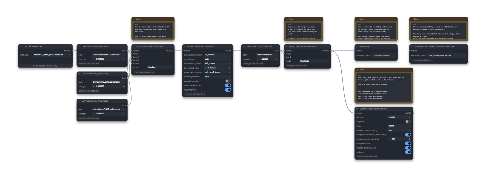

# ComfyUI Quantization Toolkit

Quantize ComfyUI diffusion models to native W4A4, W4A8, or W8A8, load pre-quantized checkpoints, apply quantization-aware LoRAs, and tune low-VRAM inference.

Formerly published as **ComfyUI-INT8-Toolkit**. The public repository is now **ComfyUI-QuantizationToolkit**; the immutable Comfy Registry ID and established internal node IDs retain their original names for compatibility and discoverability.



## Highlights

- Native ComfyUI/comfy-kitchen ConvRot W4A4, asymmetric W4A8, and tensorwise W8A8 support.
- On-the-fly W4A4/W4A8/W8A8 conversion from floating-point or FP8 checkpoints.
- Quantize an existing stock `MODEL`, including workflows with loaded LoRAs.
- Standard, stochastic-requantized, and dynamic-runtime LoRA modes.
- Native-format model export, Dynamic VRAM controls, and lazy Torch Compile.
- Architecture-aware mixed W4A4/W8A8 policies for current diffusion models.

## Installation

Install **ComfyUI Quantization Toolkit** from ComfyUI Manager, or clone the repository into `ComfyUI/custom_nodes`:

```bash
git clone https://github.com/SparknightLLC/ComfyUI-QuantizationToolkit
```

Restart ComfyUI after installation or updates.

### Requirements

- ComfyUI 0.32.0 or newer.
- A compatible `comfy-kitchen`; W4A4 uses `TensorCoreConvRotW4A4Layout` and W4A8 uses `AsymW4A8Int8Layout`.
- An NVIDIA GPU with useful INT8 throughput.
- A PyTorch/CUDA environment supported by your ComfyUI installation.
- Optional: a compatible Triton installation for the alternative INT8 backend.

Native INT4 CUDA support is substantially faster than its compatibility fallback. See [Advanced Usage](docs/advanced-usage.md) for runtime and platform guidance.

## Quick Start

### Quantize A Stock MODEL

Use this route when an existing workflow already loads its model and LoRAs:

```text
Load Diffusion Model
-> optional stock Load LoRA nodes
-> Enable Quantization on MODEL
-> optional Quantized Lazy Torch Compile
-> sampler
```

Leave `enable_quantization=as_needed` and `bake_loaded_loras=True` for the normal case. Loaded LoRA weight patches are applied before quantization and are not applied twice.

### Load Or Create A Quantized Model

```text
Load Diffusion Model Quantized
-> optional Apply LoRA Stack (Quantized)
-> optional Quantized Lazy Torch Compile
-> sampler
```

Leave `on_the_fly_quantization=False` for a native pre-quantized checkpoint. Enable it to convert eligible float or FP8 source weights using `quantization_mode`.

## Quantization Modes

| Mode | Behavior |
| --- | --- |
| `int8` | Direct tensorwise INT8; the simplest and default W8A8 path. |
| `int8_convrot` | Native-compatible ConvRot W8A8. |
| `int8_quarot` | Legacy Toolkit QuaRot W8A8. |
| `int8_hadanorm` | Experimental Toolkit HadaNorm W8A8. |
| `int4_mixed` | Mixed W4A4/W8A8 using an architecture-aware INT8 budget. |
| `int4_full` | W4A4 wherever supported, with safety exclusions and INT8 shape fallback. |
| `w4a8` | Experimental asymmetric 4-bit weights with ConvRot INT8 activations; incompatible shapes fall back to W8A8. |

Start with `int8` for broad compatibility. Use `int4_mixed` when memory pressure justifies a more aggressive format, then tune `int4_mixed_ratio` if needed. Treat `w4a8` as experimental: it is a distinct kernel format, not an `int4_mixed_ratio` preset. Quantized Lazy Torch Compile supports it through a temporary compiler-safe custom-op boundary. See [Quantization Policies](docs/quantization-policies.md) for native export compatibility, architecture tiers, and method details.

In a preliminary RTX 3090/Krea2 comparison, W4A8 reduced ComfyUI's reported loaded model-weight footprint by 39.4% versus INT8 ConvRot, while warm sampling throughput was approximately 12.5–15% lower. Visual comparisons also showed model-dependent composition changes and a subjective loss of fine texture. See [Preliminary Benchmarks](docs/benchmarks.md) for the conditions, limitations, and raw observations.

## Quantized LoRAs

For LoRAs applied after quantization, connect one entry node per LoRA:

```text
LoRA Stack Entry (Quantized) --\
                                Apply LoRA Stack (Quantized) <- quantized MODEL
LoRA Stack Entry (Quantized) --/
```

The apply node grows another input whenever an entry is connected and supports up to 100 entries. Set an entry strength to `0`, bypass it, or disconnect it to disable that LoRA.

Available modes:

- `Stochastic`: combines ordinary LoRA deltas in FP32 and requantizes once, including native W4A8 weights. This is the usual speed-oriented choice.
- `Dynamic`: keeps compatible INT8/W4A4 deltas as runtime matrix multiplications. W4A8 targets produce a console warning and use the Standard patch path instead.
- `Standard`: uses ComfyUI's regular MODEL patch path for comparison or compatibility.

The single and fixed-stack nodes remain available as `Load LoRA (Quantized)` and `Load LoRA Stack (Quantized)`.

## Nodes

| Node | Purpose |
| --- | --- |
| `Load Diffusion Model Quantized` | Load native quantized checkpoints or quantize during loading. |
| `Enable Quantization on MODEL` | Convert an existing floating-point or FP8 `MODEL`. |
| `Save Quantized Model (DynamicVRAM Safe)` | Export supported W4A4/W4A8/W8A8 layers with native metadata. |
| `Quantized Lazy Torch Compile` | Compile after quantized object patches are active. |
| `LoRA Stack Entry (Quantized)` | Define one independently bypassable LoRA path and strength. |
| `Apply LoRA Stack (Quantized)` | Apply an autogrowing LoRA stack in a selected mode. |
| `Load LoRA (Quantized)` | Load and apply one LoRA. |
| `Load LoRA Stack (Quantized)` | Load and apply a fixed-size LoRA stack. |
| `INT8 Kernel Config` | Configure or benchmark the optional Triton INT8 backend. |

Node tooltips document individual controls. Advanced runtime, LoRA ordering, compile, and save behavior is collected in [Advanced Usage](docs/advanced-usage.md).

## FP8 Roadmap

The Toolkit already accepts FP8 source weights and can convert them to W4A4, W4A8, or W8A8. Native FP8 output, serialization, and quantization-aware LoRA handling would require a separate integration with ComfyUI's FP8 layouts and hardware dispatch. It remains a possible roadmap item pending user interest and upstream runtime maturity.

## Documentation

- [Advanced Usage](docs/advanced-usage.md): runtime controls, LoRA ordering, Torch Compile, Dynamic VRAM, and saving.
- [Preliminary Benchmarks](docs/benchmarks.md): early W4A8 speed, memory-footprint, and visual-quality observations.
- [Quantization Policies](docs/quantization-policies.md): method semantics, mixed profiles, architecture presets, and native formats.
- [Checkpoint Sources](docs/checkpoints.md): known pre-quantized model links.
- [Changelog](CHANGELOG.md): release history.

## Credits

- [ComfyUI](https://github.com/Comfy-Org/ComfyUI) and [comfy-kitchen](https://github.com/Comfy-Org/comfy-kitchen) for native quantized layouts and runtimes.
- [ComfyUI-INT8-Fast](https://github.com/BobJohnson24/ComfyUI-INT8-Fast) for the original implementation and preset groundwork.
- [OneTrainer INT8 work](https://github.com/Nerogar/OneTrainer/pull/1034), [ComfyUI-QuantOps](https://github.com/silveroxides/ComfyUI-QuantOps), and [ComfyUI-ZImage-Triton](https://github.com/newgrit1004/ComfyUI-ZImage-Triton) for reference implementations and ecosystem work.
- The [ConvRot](https://arxiv.org/abs/2512.03673) and [QuaRot](https://arxiv.org/abs/2404.00456) authors for the underlying rotation-based quantization research.
