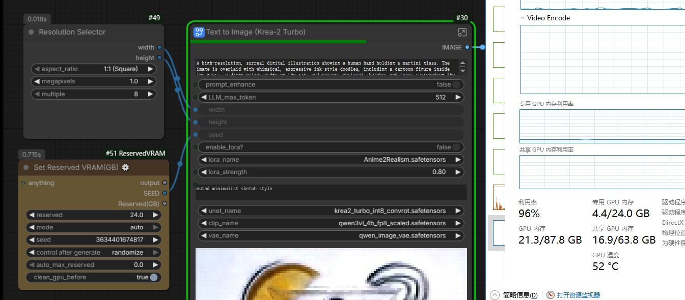

A simple node that can dynamically adjust the reserved memory of a workflow in real-time.

## 2026-09-08 DynamicVRAM 兼容修复

- 调整预留显存不再重新调用 aimdo 的 `init()`，避免重置原有 NVML 压力检测开关。
- 使用 aimdo 0.4.10 和 0.5.2 均提供的专用 headroom setter；未启用 DynamicVRAM、aimdo 不可用或旧版本缺少该接口时，仍保留普通显存预留功能。
- 使用 ComfyUI 运行时接口后，同步实际生效的预留值，不覆盖 ComfyUI 的默认下限。
- 节点参数、输入输出和现有工作流保持兼容，不强制安装或升级 aimdo。
- 旧版 SimpAI Studio 的运行时预留接口也有同类调用，需要同步更新 Studio；仅更新节点不能修复旧接口内部的行为。
- 此修复针对设置被意外重置的问题，不保证解决所有 OOM；运行中的后端需要重启后加载修改。

本地兼容测试：`python -m unittest discover -s tests -v`。测试使用模拟后端，不启动 GPU 或生成任务。

更新
##新版ComfyUI具有Pin Memory特性，会直接显示部分卸载到内存的模型为共享显存的使用。只要调节到采样速度和显卡功耗正常就可以。

2025-10-21增强节点功能

1，可以作为随机种子节点，每次运行均检测和和修改显存策略。可选开关。

2，前置输入可以不接。增加后置输出随机种子和预留数值。后置输出也可以不接。

3，增加前置清理显存的开关，可以作为显存清理节点使用。可以选择在输出前用手动模式恢复环境变量为默认（0.6GB）。

4，增加最大预留值，在Auto档生效，某些情况防止预留过大，但也会削弱Auto的能力。

new
2025-10-21 Enhanced Node Features
1. Can function as a random seed node, detecting and modifying VRAM strategy with each run. Optional toggle.
2. Front-end input can be left unconnected. Added back-end output for random seed and reserved value. Back-end output can also be left unconnected.
3. Added a front-end VRAM cleanup toggle, allowing use as a VRAM cleanup node. Option to restore environment variables to default (0.6GB) manually before output.
4. Added maximum reserved value, effective in Auto mode, preventing excessive reservation in certain cases while slightly reducing Auto mode's capability.

2025-10-10新增自动模式，自动模式会检测系统“已使用”的显存数量，再叠加用户设置值进行预留。避免多进程用户因为显存问题卡住运行。

预留数值可以为负值，配合自动模式计算用。
—————————————————————————————————————————

一个可以实时调节工作流预留显存的简单节点，跑满显卡最大功率，解除显存焦虑。

接在排行较前的节点处即可，观察windows任务管理器共享显存溢出多少，就需要设置保留多少（可以略微多一点），填入该数值。运行工作流实时生效，输入单位是GB。

2026-06-27 DynamicVRAM compatibility update

- The node now updates ComfyUI DynamicVRAM / comfy-aimdo simple vram headroom when DynamicVRAM is enabled.
- On ComfyUI builds that provide `model_management.set_extra_reserved_vram()`, the node uses that runtime API. On official builds without that API, it still updates `EXTRA_RESERVED_VRAM` and then syncs DynamicVRAM headroom from the node itself.
- Auto mode can use torch CUDA memory info when NVML is unavailable or fails to initialize.
