<h4 align="center">
  <a href="./README.md">English</a> | <a href="./README.de.md">Deutsch</a> | <a href="./README.es.md">Español</a> | <a href="./README.fr.md">Français</a> | हिन्दी | <a href="./README.pt.md">Português</a> | <a href="./README.ru.md">Русский</a> | <a href="./README.ja.md">日本語</a> | <a href="./README.ko.md">한국어</a> | <a href="./README.zh.md">中文</a> | <a href="./README.zh-TW.md">繁體中文</a>
</h4>

<p align="center">
  
  
  
</p>
<br />

# ComfyUI के लिए OpenPose Studio 🤸

OpenPose Studio एक उन्नत ComfyUI एक्सटेंशन है, जिसकी सुव्यवस्थित इंटरफ़ेस से OpenPose पोज़ बनाई, संपादित, प्रीव्यू और व्यवस्थित की जा सकती हैं। इससे keypoints को विज़ुअल रूप से समायोजित करना, पोज़ फ़ाइलें सेव और लोड करना, पोज़ प्रीसेट तथा गैलरी ब्राउज़ करना, पोज़ कलेक्शन संभालना, कई पोज़ मिलाना और ControlNet एवं अन्य पोज़-आधारित workflows में उपयोग के लिए साफ़ JSON डेटा एक्सपोर्ट करना आसान हो जाता है।

---

## <a id="table-of-contents"></a>विषय-सूची

- ✨ [फ़ीचर](#features)
- 📦 [इंस्टॉलेशन](#installation)
- 🎯 [उपयोग](#usage)
- 🖐️ [हाथों का संपादन](#hand-editing)
- 🔧 [नोड्स](#nodes)
- ⌨️ [एडिटर कंट्रोल और शॉर्टकट](#editor-controls--shortcuts)
- 📋 [फ़ॉर्मेट विनिर्देश](#format-specifications)
- 🖼️ [गैलरी और पोज़ प्रबंधन](#gallery--pose-management)
- 🔀 [पोज़ मर्जर](#pose-merger)
- 🎨 [रेंडर](#render)
- 🖼️ [बैकग्राउंड रेफ़रेंस](#background-reference)
- 🗺️ [Areas इनपुट](#areas-input)
- 🔗 [Pose Keypoint इनपुट](#pose-keypoint-input)
- ⚠️ [ज्ञात सीमाएँ](#known-limitations)
- 🔍 [समस्या निवारण](#troubleshooting)
- 🤝 [योगदान](#contributing)
- 💙 [वित्तीय सहयोग और समर्थन](#funding--support)
- 📄 [लाइसेंस](#license)

---

## <a id="features"></a>फ़ीचर

✨ **मुख्य क्षमताएँ**
- तुरंत विज़ुअल फ़ीडबैक के साथ OpenPose keypoint संपादन
- ज़ूम किए गए केंद्रित हैंड एडिटर में हाथ के प्रत्येक keypoint का संपादन
- आधुनिक नेटिव Canvas रेंडरिंग इंजन (अधिक तेज़, अधिक सहज और कम गतिशील हिस्से)
- इंटरैक्टिव संपादन UX: सक्रिय चयन स्पष्ट दिखता है और पोज़ पर hover करने से preselection दिखाई देता है
- सीमित transforms, ताकि keypoints कैनवास की सीमाओं से बाहर न जाएँ
- एकल पोज़ और पोज़ कलेक्शन के लिए JSON इम्पोर्ट/एक्सपोर्ट
- मानक OpenPose JSON एक्सपोर्ट (अन्य टूल्स में उपयोग योग्य)
- Legacy JSON अनुकूलता (पुराने गैर-मानक JSON को लोड और सही ढंग से संपादित कर सकता है)

✨ **उन्नत फ़ीचर**
- **रेंडर टॉगल**: वैकल्पिक रूप से शरीर / हाथ / चेहरा रेंडर करें
- **पोज़ गैलरी**: `poses/` से पोज़ ब्राउज़ करें और उनका प्रीव्यू देखें
- **पोज़ कलेक्शन**: कई पोज़ वाली JSON फ़ाइलों की प्रत्येक पोज़ अलग से चुनी जा सकती है
- **पोज़ मर्जर**: कई JSON फ़ाइलों को व्यवस्थित कलेक्शन में मिलाएँ
- **त्वरित सफ़ाई कार्रवाइयाँ**: उपलब्ध होने पर चेहरे और/या बाएँ/दाएँ हाथ के keypoints हटाएँ
- **एक्सपोर्ट पर वैकल्पिक सफ़ाई**: पोज़ पैक एक्सपोर्ट करते समय चेहरा और/या हाथ हटाएँ
- **बैकग्राउंड ओवरले सिस्टम**: opacity नियंत्रण के साथ चुने जा सकने वाले contain/cover मोड
- **Undo**: सत्र के दौरान संपादन का पूरा इतिहास

✨ **डेटा प्रबंधन**
- `poses/` और उसकी subdirectories से पोज़ फ़ाइलों की स्वचालित खोज
- खराब JSON फ़ाइलों के लिए सत्यापन और त्रुटि से पुनर्प्राप्ति
- आंशिक पोज़ का समर्थन (शरीर के keypoints का subset)
- पोज़ फ़ाइलों से मेल खाने वाले pixel-space coordinates, ताकि अनुकूलता सहज बनी रहे

✨ **UI और एकीकरण**
- पूरी तरह responsive layout: किसी भी विंडो आकार के अनुसार तुरंत ढलता है और केंद्र में रहता है
- कैनवास के स्क्रीन पर फ़िट न होने पर auto-fit scaling
- बेहतर कैनवास विज़ुअल: Blender जैसी शैली वाला बैकग्राउंड ग्रिड और केंद्रीय axes
- restart के बाद भी सेटिंग्स बनी रहती हैं: गैलरी view mode और बैकग्राउंड overlay सेटिंग्स launch पर पुनः स्थापित होती हैं
- नेटिव ComfyUI एकीकरण: toasts और dialogs, सुरक्षित fallback के साथ

---

यदि आपके पास किसी नए फ़ीचर का विचार है, तो हमें अवश्य बताएँ—संभव है कि हम उसे जल्दी लागू कर सकें। फ़ीडबैक, विचार या सुझाव प्रोजेक्ट के Issues पेज पर भेजें: https://github.com/andreszs/comfyui-openpose-studio/issues

## <a id="installation"></a>इंस्टॉलेशन

### आवश्यकताएँ
- ComfyUI का हाल का build
- Python 3.10+

### चरण

1. इस repository को `ComfyUI/custom_nodes/` में clone करें।
2. ComfyUI restart करें।
3. पुष्टि करें कि नोड्स `image > OpenPose Studio` में दिखाई देते हैं।

---

## <a id="usage"></a>उपयोग

### बुनियादी Workflow

1. अपने workflow में **OpenPose Studio** नोड जोड़ें
2. एडिटर UI खोलने के लिए नोड के preview canvas पर क्लिक करें
3. कैनवास में डालने के लिए presets या gallery से कोई पोज़ चुनें
4. कैनवास पर keypoints को खींचकर समायोजित करें
5. पोज़ रेंडर करने के लिए **लागू करें** पर क्लिक करें। इससे नोड में serialized JSON बन जाएगा।
6. `image` आउटपुट को आगे के image nodes से कनेक्ट करें
7. `kps` आउटपुट को ControlNet/OpenPose संगत नोड्स से कनेक्ट करें

### एडिटर प्रीव्यू

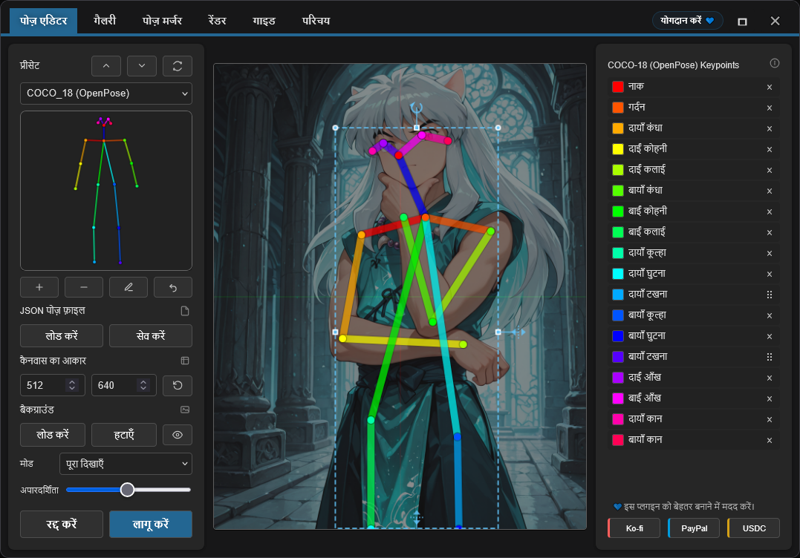

### <a id="hand-editing"></a>हाथों का संपादन

इम्पोर्ट किए गए OpenPose हाथों को एक समूह के रूप में transform किया जा सकता है या एक समय में एक keypoint को बारीकी से सुधारा जा सकता है। उसका transform box दिखाने के लिए कैनवास पर कोई हाथ चुनें और आकार बदलने, घुमाने, mirror करने या केंद्रित हैंड एडिटर खोलने के लिए आसपास के handles का उपयोग करें।

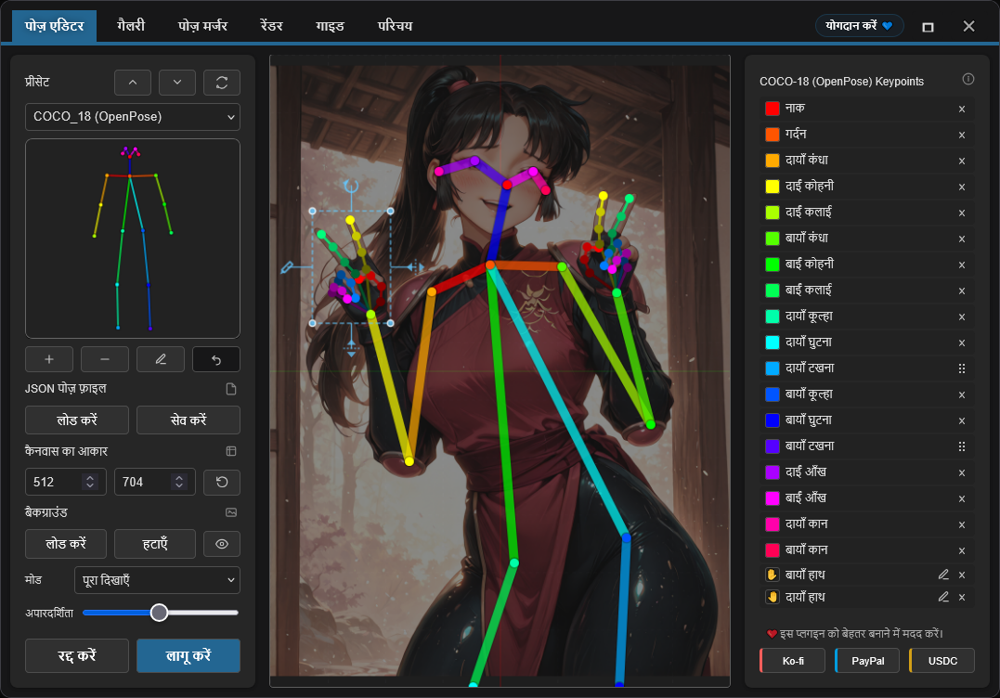

आप sidebar में **बायाँ हाथ** या **दायाँ हाथ** के पास pencil icon से भी केंद्रित एडिटर सीधे खोल सकते हैं। इस view में उँगलियों को समायोजित करने के लिए keypoints 1–20 खींचें; keypoint 0 लॉक किया हुआ hand anchor रहता है। Sidebar entry पर hover करने से उससे संबंधित बिंदु highlight होता है। पूरे hand-editing session को undo किए जा सकने वाले एक बदलाव के रूप में लागू करने के लिए check button का उपयोग करें, या बदलाव छोड़ने के लिए close button अथवा **Escape** दबाएँ।

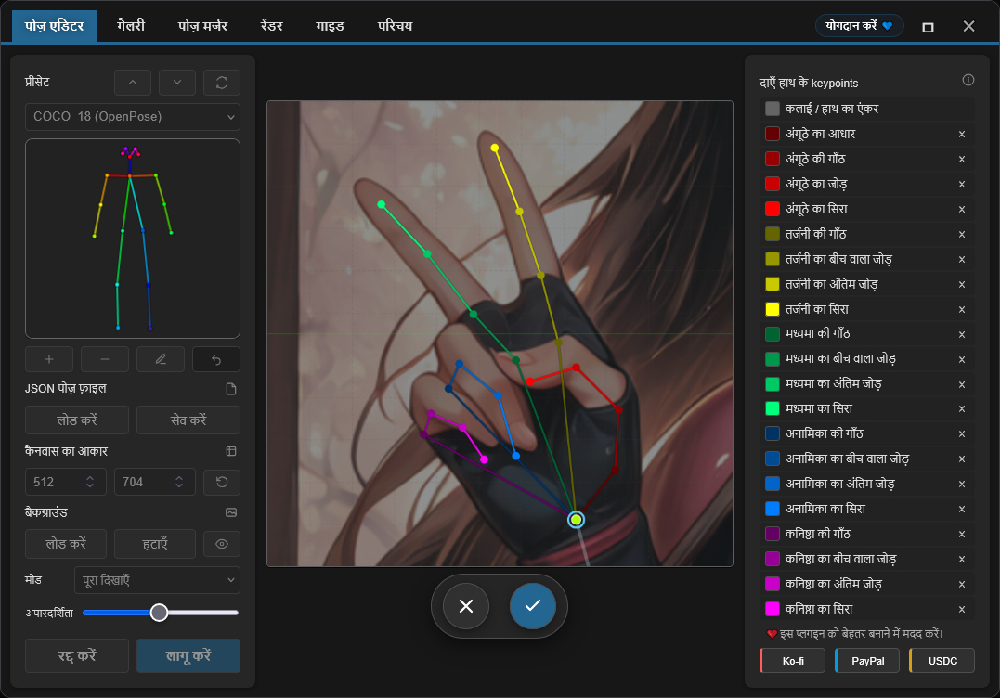

---

## <a id="nodes"></a>नोड्स

### OpenPose Studio

**कैटेगरी:** `image`

- **इनपुट:** `Pose JSON` (STRING) — मानक OpenPose-शैली JSON।
- **वैकल्पिक इनपुट:**
  - `areas` (`CONDITIONING_AREAS`) — area overlay डेटा; कैनवास पर conditioning regions देखने के लिए [Conditioning Pipeline (Combine)](https://github.com/andreszs/comfyui-lora-pipeline) नोड के `areas_out` आउटपुट को इससे कनेक्ट करें
  - `pose_keypoint` (`POSE_KEYPOINT`) — खोजा गया पोज़ डेटा; workflow में पहले से खोजी गई पोज़ सीधे एडिटर में लोड करने के लिए **DWPose Estimator** नोड का आउटपुट इससे कनेक्ट करें
- **विकल्प:**
  - `render body` — रेंडर किए गए preview/output image में शरीर शामिल करें
  - `render hands` — JSON में मौजूद होने पर रेंडर किए गए preview/output image में हाथ शामिल करें
  - `render face` — JSON में मौजूद होने पर रेंडर किए गए preview/output image में चेहरा शामिल करें
- **आउटपुट:**
  - `IMAGE` — RGB image के रूप में रेंडर किया गया पोज़ visualization (float32, 0-1 range)
  - `JSON` — canvas dimensions और keypoint डेटा वाली people array के साथ OpenPose-शैली पोज़ JSON
  - `KPS` — POSE_KEYPOINT फ़ॉर्मेट में keypoint डेटा, ControlNet के साथ संगत
- **UI:** इंटरैक्टिव एडिटर खोलने के लिए नोड preview पर क्लिक करें। पोज़ को सीधे संपादित करने के लिए **open editor** button (pencil icon) का उपयोग करें।

#### नोड का स्क्रीनशॉट

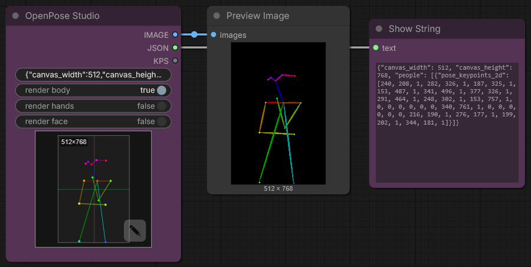

---

## <a id="editor-controls--shortcuts"></a>एडिटर कंट्रोल और शॉर्टकट

### कीबोर्ड शॉर्टकट

| कंट्रोल | कार्रवाई |
|---------|--------|
| **Enter** | पोज़ लागू करके एडिटर बंद करें |
| **Escape** | रद्द करें और बदलाव छोड़ दें |
| **Ctrl+Z** | पिछली कार्रवाई वापस लें |
| **Ctrl+Y** | पिछली वापस ली गई कार्रवाई फिर करें |
| **Delete** | चुना हुआ keypoint हटाएँ |

### कैनवास इंटरैक्शन

- **Click**: keypoint चुनें
- **Drag**: keypoint को नई जगह ले जाएँ
- **Scroll**: कैनवास पर zoom in/out करें (TO-DO)

### <a id="background-reference"></a>बैकग्राउंड रेफ़रेंस

पोज़ संपादित करते समय reference images, जैसे anatomy guides या photo references, को बिना मूल डेटा बदले overlays के रूप में लोड करें। Image को कैनवास के अंदर फ़िट करने के लिए **Contain** मोड या कैनवास भरने के लिए **Cover** मोड इस्तेमाल करें। आवश्यकता के अनुसार opacity समायोजित करें।

- **Load Image**: डिस्क से reference image इम्पोर्ट करें
- **Contain/Cover**: scaling mode चुनें
- **Opacity**: पारदर्शिता समायोजित करें (0-100%)

> [!NOTE]
> बैकग्राउंड images ComfyUI session के दौरान बनी रहती हैं, लेकिन workflows में सेव **नहीं** होतीं।

### <a id="areas-input"></a>Areas इनपुट

**areas** इनपुट एक **वैकल्पिक** कनेक्शन है, जो पोज़ संपादित करते समय कैनवास पर conditioning area boundaries दिखाता है।

अपनी पोज़ की स्थिति तय करते समय हर area द्वारा लक्षित region देखने के लिए [ComfyUI-LoRA-Pipeline](https://github.com/andreszs/comfyui-lora-pipeline) repository के [**Conditioning Pipeline (Combine)**](https://github.com/andreszs/comfyui-lora-pipeline) नोड का `areas_out` आउटपुट कनेक्ट करें।

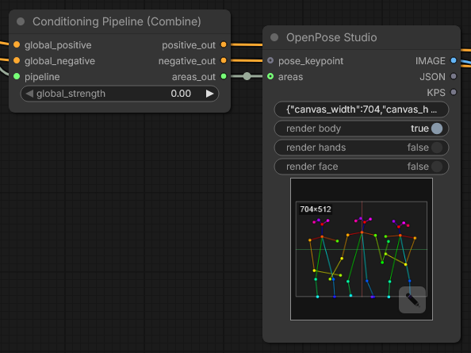

हर area कैनवास पर नाम वाले badge के रूप में दिखाई देता है। किसी area को अलग-अलग **सक्षम या अक्षम** करने के लिए उसके badge पर क्लिक करें, जिससे आप वर्तमान पोज़ के लिए प्रासंगिक regions पर ध्यान दे सकते हैं।

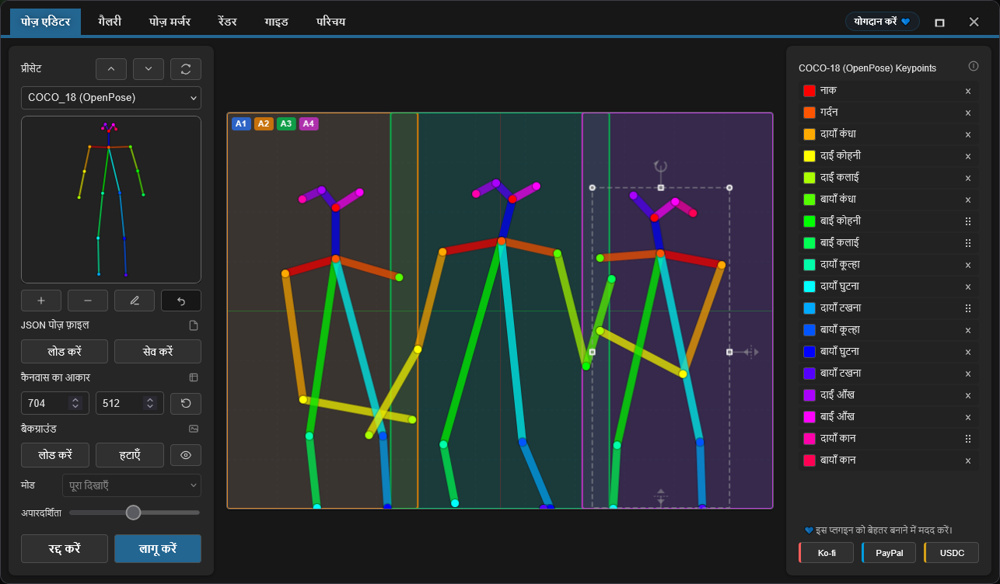

यह संयोजन multi-character workflows बनाते समय विशेष रूप से उपयोगी है: [ComfyUI-LoRA-Pipeline](https://github.com/andreszs/comfyui-lora-pipeline) प्रत्येक area की conditioning और LoRA assignment संभालता है, जबकि OpenPose Studio हर region के अंदर पोज़ की स्थिति सटीक रखता है। इससे एक सरल, non-destructive setup मिलता है, जिसमें per-area और per-pose LoRAs बिना हस्तक्षेप के एक साथ लागू किए जा सकते हैं। यदि आप area-based conditioning से अभी परिचित नहीं हैं, तो [ComfyUI-LoRA-Pipeline](https://github.com/andreszs/comfyui-lora-pipeline) एक्सटेंशन इसी तरह के workflow के लिए बनाया गया है और इस नोड के साथ अच्छी तरह काम करता है।

इन तीनों repositories को साथ काम करते देखने के वास्तविक उदाहरण—area conditioning, OpenPose control और style layering—के लिए यह [चरण-दर-चरण workflow गाइड](https://www.andreszsogon.com/building-a-multi-character-comfyui-workflow-with-area-conditioning-openpose-control-and-style-layering/) देखें।

### <a id="pose-keypoint-input"></a>Pose Keypoint इनपुट

**pose_keypoint** इनपुट एक **वैकल्पिक** कनेक्शन है, जिससे OpenPose Studio आपके workflow में पहले खोजे गए पोज़ डेटा का उपयोग कर सकता है।

**DWPose Estimator** नोड का आउटपुट इस इनपुट से कनेक्ट करें। खोजे गए keypoints सीधे एडिटर में लोड हो जाते हैं, जहाँ आप रेंडर करने से पहले उन्हें देख, सुधार या विस्तारित कर सकते हैं।

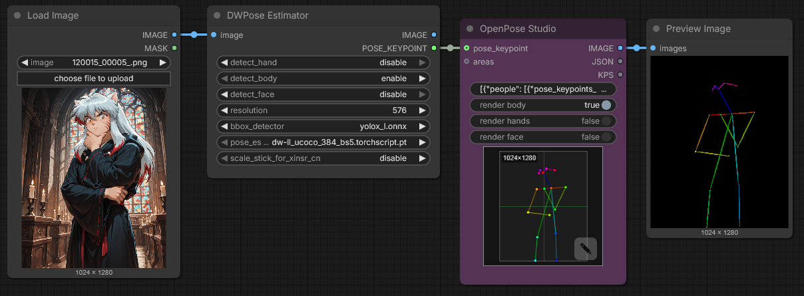

---

## <a id="format-specifications"></a>फ़ॉर्मेट विनिर्देश

यह एडिटर **OpenPose COCO-18 (body)** संपादन और प्रत्येक **OpenPose hand keypoint** के संपादन का पूरा समर्थन करता है। चेहरे के keypoints सुरक्षित रखे और रेंडर किए जाते हैं, लेकिन वे pass-through डेटा रहते हैं और वर्तमान में अलग-अलग संपादित नहीं किए जा सकते।

### OpenPose COCO-18 keypoints (शरीर)

COCO-18 में शरीर के **18 keypoints** होते हैं। पोज़ को `pose_keypoints_2d` नाम वाली flat array के रूप में इस pattern में रखा जाता है:

`[x0, y0, c0, x1, y1, c1, ...]`

हर keypoint में:
- `x`, `y`: कैनवास के pixel coordinates
- `c`: confidence (आमतौर पर `0..1`; “गायब” बिंदु के लिए `0` इस्तेमाल किया जा सकता है)

Keypoints का क्रम (index → नाम):

| Index | नाम |
|------:|------|
| 0 | नाक |
| 1 | गर्दन |
| 2 | दायाँ कंधा |
| 3 | दाईं कोहनी |
| 4 | दाईं कलाई |
| 5 | बायाँ कंधा |
| 6 | बाईं कोहनी |
| 7 | बाईं कलाई |
| 8 | दायाँ कूल्हा |
| 9 | दायाँ घुटना |
| 10 | दायाँ टखना |
| 11 | बायाँ कूल्हा |
| 12 | बायाँ घुटना |
| 13 | बायाँ टखना |
| 14 | दाईं आँख |
| 15 | बाईं आँख |
| 16 | दायाँ कान |
| 17 | बायाँ कान |

> [!NOTE]
> **COCO**, pose estimation में व्यापक रूप से उपयोग किए जाने वाले *Common Objects in Context* keypoint convention/dataset का नाम है। यहाँ “COCO-18” का अर्थ 18 keypoints वाला OpenPose body layout है।

### न्यूनतम JSON संरचना

एक सामान्य single-pose OpenPose-शैली JSON में canvas dimensions और `pose_keypoints_2d` वाली एक `people` entry होती है:

```json
{
  "canvas_width": 512,
  "canvas_height": 512,
  "people": [
    {
      "pose_keypoints_2d": [0, 0, 0, 0, 0, 0 /* ... 18 * 3 values total ... */]
    }
  ]
}
```

> [!NOTE]
> एडिटर आंशिक पोज़ संभाल सकता है, जिनमें कुछ keypoints गायब हों। गायब बिंदु आमतौर पर 0,0,0 से दिखाए जाते हैं। आप पोज़ एडिटर से distal keypoints भी हटा सकते हैं।

### आगे पढ़ें

- इतिहास और संदर्भ: "What is OpenPose — Exploring a milestone in pose estimation" — OpenPose की शुरुआत और pose estimation पर उसके प्रभाव की सरल व्याख्या वाला लेख: https://www.ultralytics.com/blog/what-is-openpose-exploring-a-milestone-in-pose-estimation

### JSON फ़ॉर्मेट: Standard और Legacy

- **OpenPose Studio:** **मानक OpenPose-शैली JSON** पढ़ता और लिखता है तथा पुराने गैर-मानक (legacy) JSON भी स्वीकार करता है।

व्यावहारिक जानकारी:
- OpenPose Studio नोड में मानक JSON पेस्ट करने पर preview तुरंत रेंडर होगा।

---

## <a id="gallery--pose-management"></a>गैलरी और पोज़ प्रबंधन

### अवलोकन

**Gallery** tab live preview thumbnails के साथ सभी उपलब्ध पोज़ को विज़ुअल रूप से ब्राउज़ करने देता है। यह बिना manual configuration के पोज़ को अपने आप खोजता और व्यवस्थित करता है।

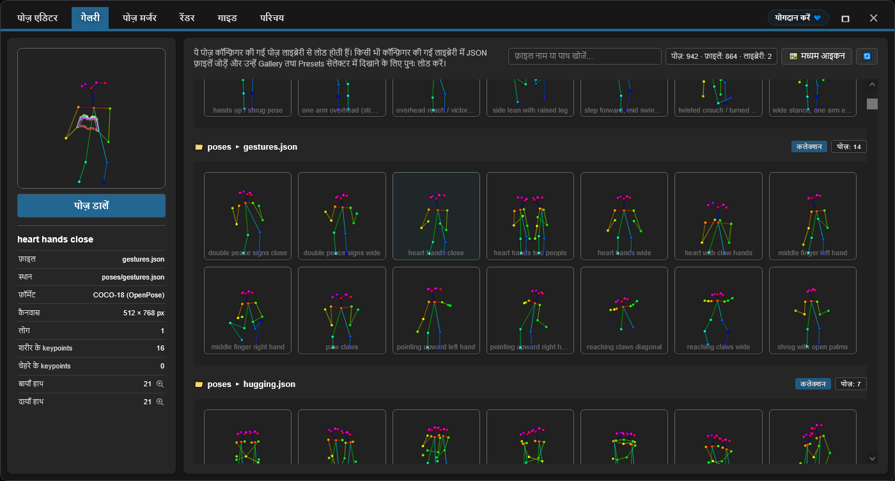

### View modes

Gallery तीन display modes का समर्थन करती है:
- **Large** — तुरंत विज़ुअल चयन के लिए बड़े previews
- **Medium** — preview आकार और density का संतुलन
- **Tiles** — अतिरिक्त metadata, जैसे **canvas size**, **keypoint counts** और अन्य पोज़ विवरण वाला compact grid

### फ़ीचर

- **Auto-discovery**: startup पर `poses/` directory scan करता है
- **Nested organization**: subdirectories के नाम group labels बनते हैं
- **Live preview**: हर पोज़ का thumbnail rendering
- **Search/filter**: नाम या group से पोज़ खोजें
- **One-click load**: एडिटर में लोड करने के लिए कोई पोज़ चुनें

### समर्थित फ़ाइल प्रकार

- **Single-pose JSON**: अलग-अलग OpenPose JSON फ़ाइलें
- **Pose Collections**: कई पोज़ वाली JSON फ़ाइलें, जिनकी हर पोज़ अलग दिखाई जाती है
- **Nested directories**: subdirectories की पोज़ अपने आप groups में व्यवस्थित होती हैं

### निश्चित व्यवहार

Gallery का क्रम और खोज पूरी तरह निश्चित है:
- कोई random shuffling नहीं
- हमेशा समान alphabetical sorting
- पहले root की पोज़, फिर grouped poses
- एडिटर विंडो खुलते ही सभी JSON पोज़ तुरंत पुनः लोड होती हैं।

---

## <a id="pose-merger"></a>पोज़ मर्जर

### उद्देश्य

**Pose Merger** tab कई अलग-अलग pose JSON फ़ाइलों को व्यवस्थित pose collection फ़ाइलों में एकत्र करता है। यह इन कामों के लिए उपयोगी है:

- बड़ी pose libraries को एकल फ़ाइलों में बदलना
- pose data साफ़ करना, जैसे चेहरे/हाथ के keypoints हटाना
- पोज़ को पुनः व्यवस्थित करना और नया नाम देना
- pose packs को कुशलता से वितरित करना

### Workflow

1. **फ़ाइलें जोड़ें**: अलग-अलग या collection JSON फ़ाइलें लोड करें
2. **प्रीव्यू**: हर पोज़ thumbnail के साथ दिखाई जाती है
3. **कॉन्फ़िगर करें**: वैकल्पिक रूप से चेहरे/हाथ के components हटाएँ
4. **एक्सपोर्ट करें**: संयुक्त collection या अलग-अलग फ़ाइलों के रूप में सेव करें

### प्रमुख क्षमताएँ

| फ़ीचर | उपयोग |
|---------|----------|
| **कई फ़ाइलें लोड करें** | फ़ाइल सिस्टम से bulk import |
| **Component Filtering** | अनावश्यक चेहरे/हाथ का डेटा हटाएँ |
| **Collection Expansion** | मौजूदा collections से पोज़ निकालें |
| **Batch Renaming** | एक्सपोर्ट के दौरान अर्थपूर्ण नाम दें |
| **Selective Export** | शामिल की जाने वाली पोज़ चुनें |

### आउटपुट विकल्प

- **Combined Collection**: सभी पोज़ वाला एक JSON
- **Individual Files**: अनुकूलता के लिए हर पोज़ की अलग फ़ाइल

दोनों आउटपुट फ़ॉर्मेट Gallery और Pose Selector द्वारा अपने आप खोज लिए जाते हैं।

---

## <a id="render"></a>रेंडर

**Render** मॉड्यूल आपको यह निर्धारित करने देता है कि workflow चलने पर OpenPose stickman कैसे रेंडर होगा। इसमें शरीर, हाथ और चेहरे के लिए styling controls होते हैं, जैसे line width, keypoint radius तथा हाथों/चेहरे का keypoint color।

Render सेटिंग्स workflow में नहीं, बल्कि इस ब्राउज़र के local storage में स्थानीय रूप से सेव होती हैं। इन्हें बदलने से workflow के बाद के executions प्रभावित होते हैं।

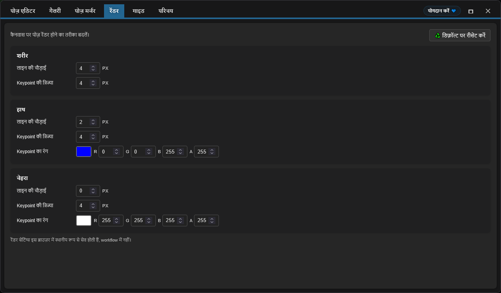

---

## <a id="known-limitations"></a>ज्ञात सीमाएँ

> [!NOTE]
> Nodes 2.0 समर्थित है। यदि preview canvas या editor button गायब है, तो browser cache, frontend loading और installation logs देखें।

### वर्तमान सीमाएँ और समाधान

1. **चेहरे का संपादन**
  - चेहरे के keypoints सुरक्षित रखे और रेंडर किए जाते हैं, लेकिन वर्तमान में कैनवास पर अलग-अलग संपादित नहीं किए जा सकते।

2. **Resolution Consistency**
  - समस्या: Pose Merger collection exports में resolution अपने आप समान नहीं करता
  - स्थिति: clipping से बचने के लिए इसे सावधानी से लागू करना होगा
  - समाधान: इम्पोर्ट करने से पहले पोज़ को target resolution पर pre-scale करें

3. **Nodes 2.0 अनुकूलता**
  - स्थिति: वर्तमान versions में समर्थित।
  - नोट: यदि editor UI दिखाई नहीं देता, तो सबसे संभावित कारण पुराना browser cache, frontend module loading विफल होना या अधूरा installation है।
  - समस्या निवारण: ComfyUI को पूरी तरह restart करें, browser को hard-refresh करें और browser console के साथ ComfyUI startup log देखें।

### त्रुटि से पुनर्प्राप्ति

प्लगइन में रक्षात्मक error handling शामिल है:
- अमान्य JSON फ़ाइलें Gallery में चुपचाप छोड़ दी जाती हैं
- rendering errors crash करने के बजाय खाली images लौटाते हैं
- metadata गायब होने पर सुरक्षित defaults इस्तेमाल होते हैं
- खराब keypoints रेंडरिंग के दौरान filter कर दिए जाते हैं

---

## <a id="troubleshooting"></a>समस्या निवारण

### सामान्य समस्याएँ और समाधान

**Gallery में पोज़ दिखाई नहीं दे रहीं**
```
✓ Confirm files exist in poses/ directory
✓ Verify JSON is valid (use online JSON validator)
✓ Check file extension is .json (case-sensitive on Linux)
✓ Restart ComfyUI to trigger discovery
✓ Check browser console (F12) for error messages
```

**JSON import विफल होता है**
```
✓ Validate JSON structure (must have "pose_keypoints_2d" or equivalent)
✓ Ensure coordinates are valid numbers, not strings
✓ Confirm minimum 18 keypoints for body poses
✓ Check for malformed escape sequences in JSON
```

**खाली output image**
```
✓ Verify pose is selected and contains valid keypoints
✓ Check canvas dimensions (width/height) are reasonable (100-2048px)
✓ Click Apply to render after making changes
✓ Check for NaN or infinite values in coordinates
```

**बैकग्राउंड रेफ़रेंस बना नहीं रहता**
```
✓ Enable third-party cookies/storage in browser
✓ Check browser localStorage settings
✓ Try incognito mode to isolate issue
✓ Clear browser cache and try again
```

**नोड ComfyUI में दिखाई नहीं देता**
```
✓ Verify clone location: ComfyUI/custom_nodes/comfyui-openpose-studio
✓ Check __init__.py exists and imports correctly
✓ Restart ComfyUI fully (not just reload page)
✓ Check ComfyUI console for import errors
```
---

## <a id="contributing"></a>योगदान

योगदान करने के निर्देश, pull requests के नियम, architecture details और development जानकारी के लिए [CONTRIBUTING.md](./CONTRIBUTING.md) देखें। Development में सहायता के लिए AI agent का उपयोग कर रहे हों, तो कोई code change करने से पहले सुनिश्चित करें कि वह [AGENTS.md](../AGENTS.md) पढ़े।

---

## <a id="funding--support"></a>वित्तीय सहयोग और समर्थन

### आपका सहयोग क्यों महत्वपूर्ण है

यह प्लगइन स्वतंत्र रूप से विकसित और maintain किया जाता है। Debugging, testing और quality-of-life improvements तेज़ करने के लिए नियमित रूप से **सशुल्क AI agents** उपयोग किए जाते हैं। यदि यह आपके लिए उपयोगी है, तो आर्थिक सहयोग development को लगातार आगे बढ़ाने में मदद करता है।

आपका योगदान इन कामों में सहायता करता है:

* तेज़ fixes और नए फ़ीचर के लिए AI tooling का खर्च
* ComfyUI updates के साथ ongoing maintenance और compatibility का काम
* Usage limits पूरी होने पर development की गति धीमी होने से रोकना

> [!TIP]
> दान नहीं कर रहे हैं? GitHub star ⭐ भी visibility बढ़ाकर और अधिक users तक पहुँचने में बहुत मदद करता है

### 💙 इस प्रोजेक्ट का समर्थन करें

<table style="width: 100%; table-layout: fixed;">
  <tr>
    <td align="center" style="width: 33.33%; padding: 20px;">
      <div>
        <h4 style="margin: 8px 0;">Ko-fi</h4>
        <a href="https://ko-fi.com/D1D716OLPM" target="_blank" rel="noopener noreferrer">
          
        </a>
        <p style="margin: 8px 0; font-size: 12px;"><a href="https://ko-fi.com/D1D716OLPM" target="_blank" rel="noopener noreferrer">कॉफ़ी खरीदें</a></p>
      </div>
    </td>
    <td align="center" style="width: 33.33%; padding: 20px;">
      <div>
        <h4 style="margin: 8px 0;">PayPal</h4>
        <a href="https://www.paypal.com/ncp/payment/GEEM324PDD9NC" target="_blank" rel="noopener noreferrer">
          
        </a>
        <p style="margin: 8px 0; font-size: 12px;"><a href="https://www.paypal.com/ncp/payment/GEEM324PDD9NC" target="_blank" rel="noopener noreferrer">PayPal खोलें</a></p>
      </div>
    </td>
    <td align="center" style="width: 33.33%; padding: 20px;">
      <div>
        <h4 style="margin: 8px 0;">USDC (केवल Arbitrum ⚠️)</h4>
        <a href="https://arbiscan.io/address/0xe36a336fC6cc9Daae657b4A380dA492AB9601e73" target="_blank" rel="noopener noreferrer">
          
        </a>
        <p style="margin: 8px 0; font-size: 12px;"><a href="#usdc-address">पता दिखाएँ</a></p>
      </div>
    </td>
  </tr>
</table>

<details>
  <summary>Scan करना पसंद करेंगे? QR codes दिखाएँ</summary>
  <br />
  <table style="width: 100%; table-layout: fixed;">
    <tr>
      <td align="center" style="width: 33.33%; padding: 12px;">
        <strong>Ko-fi</strong><br />
        <a href="https://ko-fi.com/D1D716OLPM" target="_blank" rel="noopener noreferrer">
          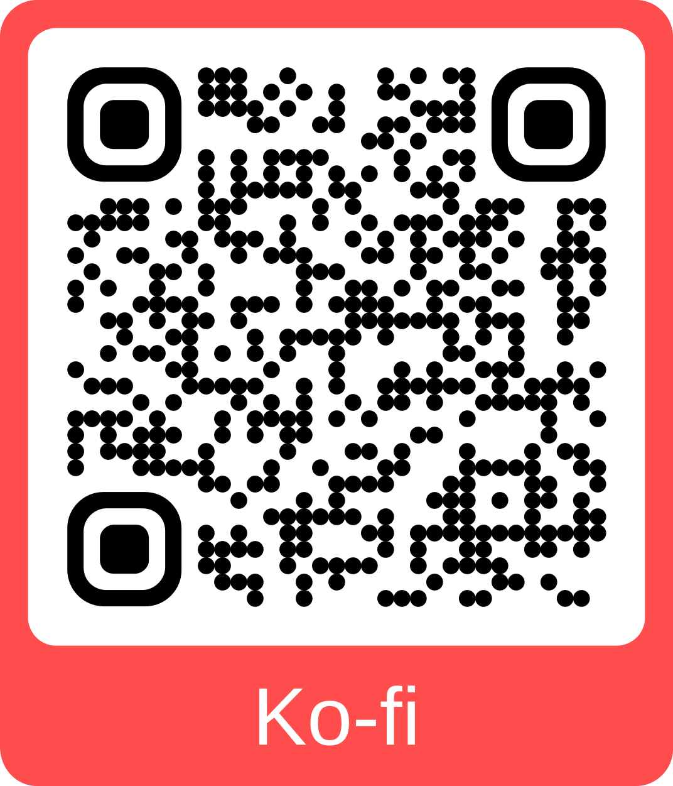
        </a>
      </td>
      <td align="center" style="width: 33.33%; padding: 12px;">
        <strong>PayPal</strong><br />
        <a href="https://www.paypal.com/ncp/payment/GEEM324PDD9NC" target="_blank" rel="noopener noreferrer">
          
        </a>
      </td>
      <td align="center" style="width: 33.33%; padding: 12px;">
        <strong>USDC (Arbitrum) ⚠️</strong><br />
        <a href="https://arbiscan.io/address/0xe36a336fC6cc9Daae657b4A380dA492AB9601e73" target="_blank" rel="noopener noreferrer">
          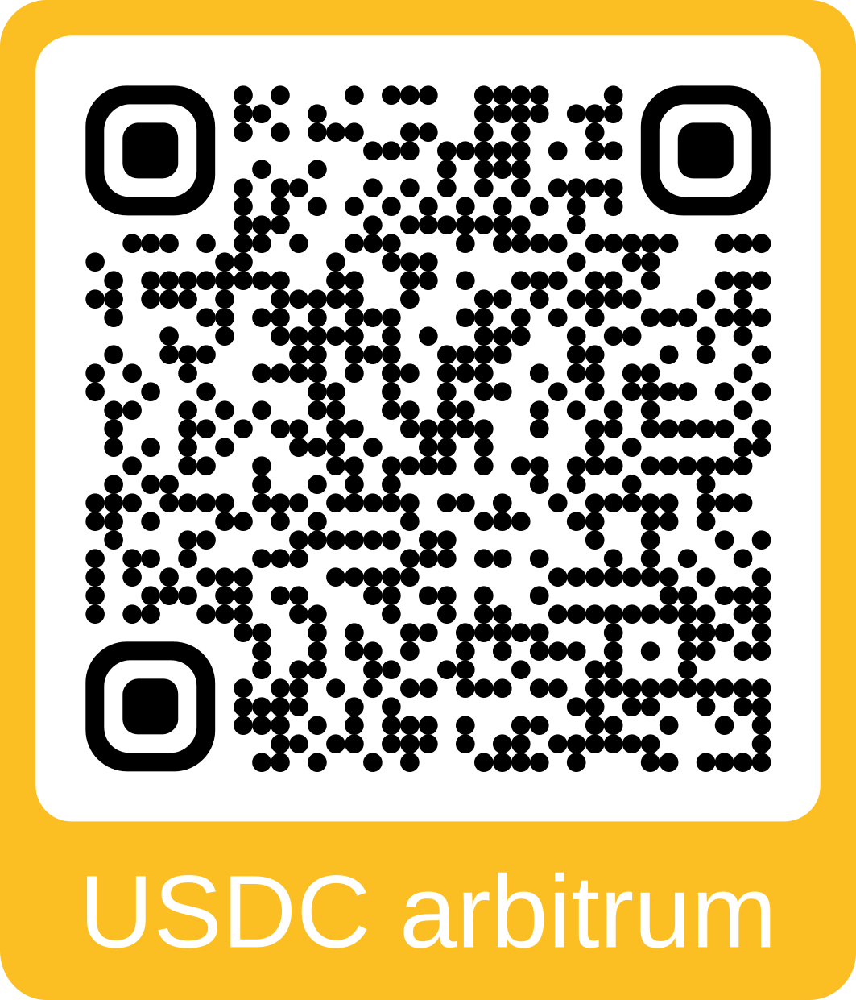
        </a>
      </td>
    </tr>
  </table>
</details>

<a id="usdc-address"></a>
<details>
  <summary>USDC पता दिखाएँ</summary>

```text
0xe36a336fC6cc9Daae657b4A380dA492AB9601e73
```

> [!WARNING]
> USDC केवल Arbitrum One पर भेजें। किसी अन्य network पर भेजे गए funds नहीं पहुँचेंगे और हमेशा के लिए खो सकते हैं।
</details>

---

## <a id="license"></a>लाइसेंस

MIT License का पूरा पाठ [LICENSE](../LICENSE) फ़ाइल में देखें।

**सारांश:**
- ✓ व्यावसायिक उपयोग के लिए निःशुल्क
- ✓ निजी उपयोग के लिए निःशुल्क
- ✓ संशोधन और वितरण की अनुमति
- ✓ License और copyright notice शामिल करना आवश्यक

---

## अतिरिक्त संसाधन

### संबंधित प्रोजेक्ट

- [ComfyUI](https://github.com/comfyanonymous/ComfyUI) - मुख्य framework
- [comfyui_controlnet_aux](https://github.com/Kosinkadink/ComfyUI-Advanced-ControlNet) - ControlNet समर्थन
- [OpenPose](https://github.com/CMU-Perceptual-Computing-Lab/openpose) - मूल pose detection

### दस्तावेज़

- [ComfyUI Custom Nodes Guide](https://github.com/comfyanonymous/ComfyUI/blob/main/docs/)
- [OpenPose Models & Keypoints](https://github.com/CMU-Perceptual-Computing-Lab/openpose/blob/master/doc/02_Output.md)
- [Canvas 2D API](https://developer.mozilla.org/en-US/docs/Web/API/Canvas_API) - rendering engine

### समस्या निवारण गाइड

- [ComfyUI Installation Issues](https://github.com/comfyanonymous/ComfyUI/wiki/Installation)
- [Node Registration & Loading](https://github.com/comfyanonymous/ComfyUI/blob/main/docs/CONTRIBUTING.md)
- [Browser Developer Tools](https://developer.chrome.com/docs/devtools/)

---

**Maintained by:** andreszs<br />
**स्थिति:** सक्रिय विकास
