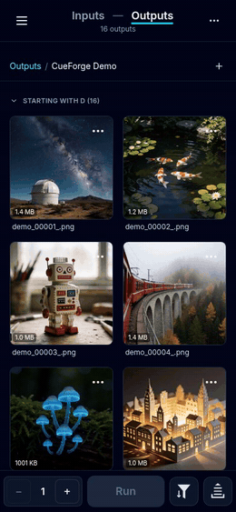
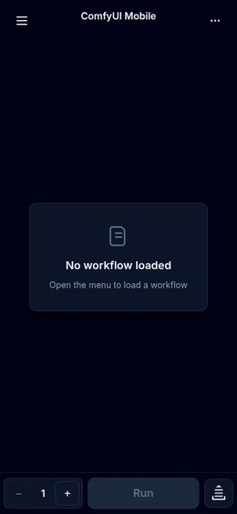
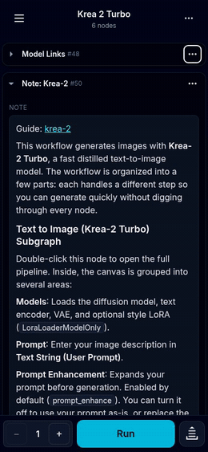
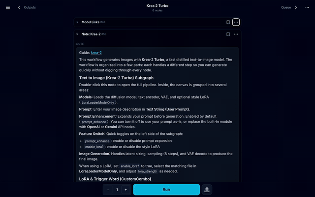

<p align="center">
  
</p>

<h1 align="center">CueForge for ComfyUI <br/><span style="font-size:22px">(a.k.a. <code>comfyui-mobile-frontend</code>)</span></h1>

<p align="center">
  A mobile-first, touch-optimized frontend for <a href="https://github.com/comfyanonymous/ComfyUI">ComfyUI</a>.
</p>

<p align="center">
  <a href="https://github.com/cosmicbuffalo/comfyui-mobile-frontend/actions/workflows/test.yml?query=branch%3Amain"></a>
  <a href="https://github.com/cosmicbuffalo/comfyui-mobile-frontend/actions/workflows/test_backend.yml?query=branch%3Amain"></a>
  <a href="https://github.com/cosmicbuffalo/comfyui-mobile-frontend/releases"></a>
  <a href="./LICENSE"></a>
</p>

## Overview

This project is a ComfyUI custom node that serves a complete, modern user interface for ComfyUI, designed from the ground up for phones and tablets. Instead of the node graph, it offers a list-based workflow editor, a live queue and generation dashboard, a full-screen media viewer, and a file manager for your inputs and outputs, all in a single responsive application.

Two things set this apart from other mobile options for ComfyUI:

- **Any workflow, unmodified.** If a workflow runs on the desktop frontend, it runs here too — node-for-node, with no exporting to API format and no re-writing for a mobile-specific workflow model. Your existing workflows are the workflows you work with, exactly as you built them.
- **No second process.** It is not a standalone app that talks to ComfyUI over the network — it is a custom node. The same server that runs the desktop interface serves this one too: the UI, its assets, and all of its API routes live behind ComfyUI's existing port, so there is nothing extra to install, launch, reverse-proxy, or keep in sync.

<b>Table of contents</b>

- [Overview](#overview)
- [How It Works](#how-it-works)
- [Demos](#demos)
- [Installation](#installation)
- [Development](#development)
- [Getting Help](#getting-help)
- [Documentation](#documentation)
- [License](#license)


## How It Works

##### It installs as a standard custom node.
The Python backend registers a sub-application inside your running ComfyUI server, and the compiled React (TypeScript) frontend is served from it at `/mobile`. No separate service to run, no extra ports to open, one restart of ComfyUI is all it takes to stand it up.

##### It speaks the same protocol as ComfyUI.
The app communicates with your server over the standard ComfyUI HTTP and WebSocket APIs, so it has full access to your node definitions, workflow queue, generation progress, and history. Live status updates, progress bars, and finished-generation previews all flow through the same websocket the server already uses.

##### The interface is organized around three panels, each tailored to a stage of the generation loop:

- **Workflow panel**: The main editor view
  - Navigate your workflows by scrolling or tapping to follow connections, and make any edits you'd be able to make on the stock desktop UI. Handy undo/redo, bookmarks and pinned widget features help you iterate faster, and up to ten workflows can be open at a time.
- **Queue panel**: Monitor your generations
  - See what's generating, pending or completed, review metadata, discard or favorite outputs for later, or pull an output right back into the workflow panel.
- **Outputs/Inputs panel**: Manage your files
  - Powerful filtering/sorting, visibility and bulk processing tools help you find and keep track of your work while keeping your digital workspace tidy. 

## Demos

Recorded against a live ComfyUI server, the demos below show off some of the features of the mobile interface. Previews here run at up to 4x, click any of them for the clip at real speed.

<table>
  <thead>
    <tr>
      <th>Outputs panel</th>
      <th>Workflow panel</th>
      <th>Queue panel</th>
    </tr>
  </thead>
  <tbody>
    <tr>
      <td><a href="images/videos/mobile-outputs-manage.mp4" title="Play the full clip"></a></td>
      <td><a href="images/videos/mobile-workflow-panel.mp4" title="Play the full clip"></a></td>
      <td><a href="images/videos/mobile-queue-panel.mp4" title="Play the full clip"></a></td>
    </tr>
  </tbody>
</table>

<details>
<summary><b>On a desktop</b></summary>
<br/>

The same app at a desktop width lays itself out differently: the node
column in the middle, bookmarks as named bars beside it, and a pinned
widget docked next to the picture rather than over it.

<table>
  <thead>
    <tr>
      <th>Bookmarks, a run, and editing beside the result</th>
    </tr>
  </thead>
  <tbody>
    <tr>
      <td><a href="images/videos/desktop-workflow.mp4" title="Play the full clip"></a></td>
    </tr>
  </tbody>
</table>

</details>

## Installation

This project installs as a standard ComfyUI custom node. You can install it directly from [ComfyUI-Manager](https://github.com/ltdrdata/ComfyUI-Manager) by searching for the node name `comfyui-mobile-frontend` (making sure the author is `cosmicbuffalo`), or install it manually:

1.  Navigate to your ComfyUI `custom_nodes` directory:
    ```bash
    cd /path/to/ComfyUI/custom_nodes/
    ```
2.  Clone this repository:
    ```bash
    git clone https://github.com/cosmicbuffalo/comfyui-mobile-frontend.git
    ```
3.  Restart ComfyUI.

Once installed and ComfyUI is running, the app is available at:

```
http://<your-comfyui-ip>:8188/mobile
```

> [!WARNING]
> ComfyUI binds to `localhost` by default. To reach the app from another device, start ComfyUI with the `--listen` flag so it is [accessible over your LAN](https://github.com/Comfy-Org/ComfyUI/blob/master/comfy/cli_args.py#L38) — which exposes **this interface, including file browsing, downloads, and the custom nodes manager**, to every device on that network. That may be exactly what you want, but if you plan to reach ComfyUI beyond a network you trust, prefer a VPN or an authenticated tunnel over plain `--listen`. See the [privacy notes](./CUEFORGE_PRIVACY.md) for what the server stores and how it is served.

> [!TIP]
> For noticeably faster loads — especially over weak Wi-Fi, cellular, or a VPN/tunnel — also pass `--enable-compress-response-body` to ComfyUI. The node definitions endpoint (`/object_info`) can grow to several megabytes once you have a number of custom node packs installed; this flag serves it (and other large JSON responses, such as queue history) gzipped, typically around 10x smaller. The mobile frontend takes advantage of this automatically, with no in-app configuration required.

A full walkthrough of the app — gestures, panels, workflow editing, LoRA Manager integration, and everything else — is in [USER_GUIDE.md](./USER_GUIDE.md).

## Development

Contributions are welcome — see [CONTRIBUTING.md](./CONTRIBUTING.md) for the pull-request checklist and the required localizations for new user-facing text. Or if you'd just like to drop a note for a feature request or bug report, feel free to create an issue any time.

### Setup

```bash
cd custom_nodes/comfyui-mobile-frontend
npm install
```

### Building

```bash
npm run build
```

This compiles the React application into `dist/`, which the Python backend serves at `/mobile`. The build also emits precompressed `.br` and `.gz` siblings for each asset; the backend negotiates and serves them automatically, and content-hashed assets are served with long-lived `immutable` cache headers.

> **Upgrading from an earlier version?** The asset-serving routes and cache headers changed in 3.x — **restart ComfyUI after upgrading** so the new serving logic takes effect, and hard-refresh your browser if a stale `index.html` is cached.

### Testing

```bash
npm test          # Frontend unit tests (vitest)
npm run lint      # Lint (eslint)
npx tsc -b        # Type-check (note: `tsc --noEmit` checks nothing in this setup)
python -m pytest tests/ -q   # Backend tests (needs a venv with ComfyUI's dependencies)
```

End-to-end smoke tests drive a real browser against a running ComfyUI — loading a workflow, running generations, and exercising the queue cards, file state, downloads, and video playback. Because they have grown quite large and require a live server to run against, they no longer live in this repository. Some, like the mask editor's browser test are exceptions — they run against an in-page mock service of ComfyUI so they need no server:

```bash
npm i -D playwright && npx playwright install chromium   # once; deliberately not a project dependency
npm run test:mask-e2e
```

## Getting Help

- **[Open an issue](https://github.com/cosmicbuffalo/comfyui-mobile-frontend/issues)** — include your ComfyUI version and, where relevant, the workflow that reproduces the problem
- **In-app feedback** — Main Menu → **Feedback** opens a pre-filled form for exactly this
- **[User guide & FAQ](./USER_GUIDE.md)** — most "how can I do X?" questions are answered there

## Documentation

- [USER_GUIDE.md](./USER_GUIDE.md) — full user guide and FAQ
- [CHANGELOG.md](./CHANGELOG.md) — release history
- [CONTRIBUTING.md](./CONTRIBUTING.md) — contribution guidelines
- [CUEFORGE_PRIVACY.md](./CUEFORGE_PRIVACY.md) — privacy & data-handling notes

## License

[MIT](./LICENSE)
