# DaSiWa Custom Nodes Collection

A high-performance collection of custom nodes for ComfyUI, optimized for video workflows, resolution management, and logic control.

## Included Nodes

### 🎬 MiniMax H3 Director

Timeline-based authoring for MiniMax H3 text/image/video generation and reference-to-video workflows, integrated with ComfyUI's native H3 implementation. Two lanes (Image/Video + Audio), slot-based layout, drag-and-drop / paste / upload, per-clip trims, and structured prompt builders per mode.

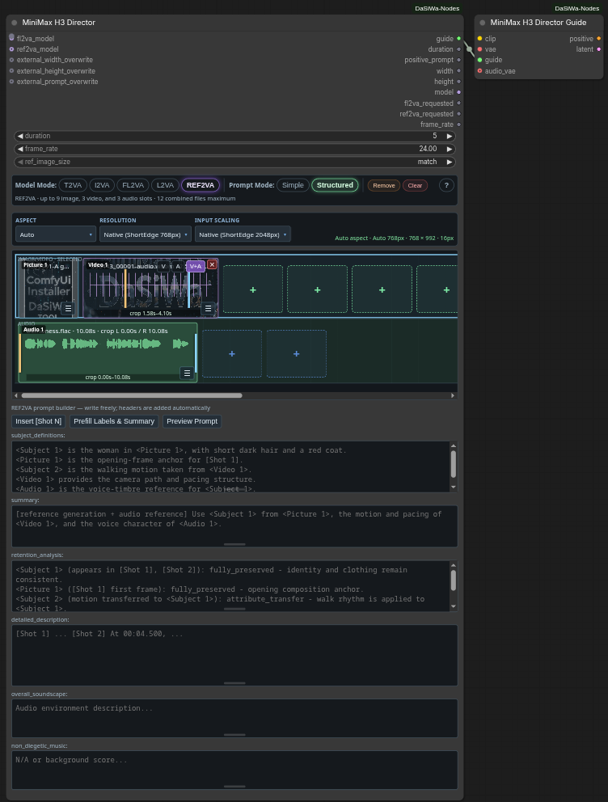

- **FL2VA mode:** text-to-video (T2VA), first-frame (I2VA), or first+last frame interpolation; up to 2 image slots; automatic alignment-line insertion in the prompt.
- **REF2VA mode:** up to 9 images, 3 videos, 3 audio clips, 12 files total; each video has a compact V / A / V+A switch (Video only / Audio only / Video+embedded-audio) using the same trim range for both streams; standalone audio also supports left/right trim handles.
- **REFERENCE VIDEO THUMBNAILS:** uploaded videos show their actual first frame as a background preview behind each clip tile, making it easy to identify references at a glance.
- **REFERENCE HANDLING:** reorder clips by dragging between slots, attach external soundtracks to videos, crop references visually via draggable markers, preserve incompatible media when toggling FL2VA ↔ REF2VA instead of losing assets.
- **LANE SELECTION & PASTE:** click an Image/Video or Audio lane to select it; Ctrl+V pastes clipboard images/videos/audio into the chosen lane; drag-and-drop from your file manager works too.
- **PROMPT BUILDERS:**
  - FL2VA/I2VA/L2VA/T2VA: guided fields for integrated_multimodal_description, overall_soundscape, and non_diegetic_music with automatic alignment headers.
  - REF2VA: simplified six-section free-text builder (subject_definitions, summary, retention_analysis, detailed_description, overall_soundscape, non_diegetic_music) with helper buttons: **Insert [Shot N]** places shot markers at cursor, **Prefill Labels & Summary** auto-generates Picture/Video/Audio labels from your inserted media, and **Preview Prompt** shows the exact assembled prompt in a popup with copy-to-clipboard.
- **VALIDATED LIMITS:** 2–15 second reference windows; max 15s combined visual and audio duration each; strict path-safety under ComfyUI's input directory.
- **NATIVE ROUTING & LAZY LOADING:** hands validated data to ComfyUI's built-in MiniMaxH3ImageToVideo / MiniMaxH3ReferenceToVideo nodes; only the selected FL2VA or REF2VA model is requested.
- **RESOLUTION PANEL:** Aspect / Resolution / Input scaling selectors (all default to **Auto**) drive the output canvas on MiniMax's 16-px grid — Auto aspect follows your first visual reference, Auto resolution sets a 768 px short side, plus fixed aspect, MP and pixel presets with CUSTOM values. The dropdowns are grouped in columns (aspect by orientation, resolution by ###p / MP, ascending) and label the auto options **Native (ShortEdge 768px)** / **Native (ShortEdge 2048px)**. Input scaling (Off / Auto / Target / Fit / Fill / Fit+pad / Divisible crop) preprocesses visual references via the included Torch Resize before they reach H3.
- **PROMPT MODE TOGGLE:** a Simple / Structured switch in the mode bar changes how builder fields are assembled into the final prompt — Structured keeps the labelled sections, Simple renders one flat block. The choice is persisted in the workflow and honored by **Preview Prompt**.
- **FRAME RATE:** a `frame_rate` FLOAT input (0.1–240, default 24) sets the output FPS and is also emitted as a `frame_rate` output so downstream nodes can read the effective value.
- **CROP PREVIEW:** a ▶ Play crop button previews only the current crop range, and the preview crop range itself is draggable for quick scrubbing.
- **PASTE-REPLACE:** Ctrl+V onto a selected media tile replaces that tile in place, preserving its slot position instead of appending.
- **EXTERNAL OVERWRITE INPUTS:** optional `external_prompt_overwrite` (STRING) replaces the assembled builder output; connect both `external_width_overwrite` and `external_height_overwrite` (INT) to replace the Director canvas and bypass its sizing and input preprocessing entirely.

[Full documentation, UI guide, and prompting reference →](docs/minimax_h3_director.md)

### ⚡ MiniMax H3 Cache

An approximate, model-scoped whole-block-stack residual cache for ComfyUI's native MiniMax H3 model.

- **MODEL PATCH:** clones only the connected MiniMax H3 `MODEL`; no global model-class monkey patch.
- **CONTROLLED REUSE:** sampled audio/video-token relative-L1 threshold, 15–90% sampling window, and a bounded number of consecutive cache hits.
- **STORAGE:** auto / CUDA / CPU cached-residual storage with CPU fallback if automatic storage runs out of VRAM.
- **COMPATIBILITY:** preserves ComfyUI block replacements and transformer options; can be chained with **Patch Comfy Kitchen Attention**.
- **QUALITY:** approximate optimization—higher cache thresholds trade fidelity for more skipped block-stack evaluations.

[Full documentation, usage, compatibility, and provenance →](docs/minimax_h3_cache.md)

---

### 🔥 Patch Comfy Kitchen Attention

A one-input model patch that swaps the connected model's attention backend to Comfy Kitchen INT8 attention at runtime.

- **Model-scoped:** clones only the connected `MODEL` and sets its optimized-attention override; it never monkey-patches ComfyUI globally.
- **Safe fallback:** if Comfy Kitchen INT8 attention is unavailable in your ComfyUI build, it falls back to the ComfyUI default attention and logs the decision.
- **Chainable:** works before or after **MiniMax H3 Cache** — both are model-clone patches and compose in either order.

```text
MiniMax H3 Model Loader
          │
          ▼
MiniMax H3 Cache ──► Patch Comfy Kitchen Attention ──► Guider / Sampler
```

---

### 💎 RTX Upscaler & Refiner

State-of-the-art image and video enhancement using NVIDIA RTX Video SDK. It executes up to three sequential passes (Denoise, Deblur, and Upscale) in a single node, processing frame-by-frame to keep VRAM usage predictable and low.

- **Refine:** Independent Denoise and Deblur passes (both off by default).
- **Upscale:** AI-powered VSR and High Bitrate upscaling.
- **Smart Sizing:** Multiple resize modes including Constant Megapixel targets.
- **Efficiency:** Frame-by-frame processing for minimal VRAM usage.
- **Memory Control:** The output batch is allocated lazily (like the reference NVIDIA node — the kernel decides, no up-front memory pressure, no temp file). A disk-backed (mmap) fallback (`use_mmap`, off by default) is opt-in for very long video batches: when enabled it is the last tier of the VRAM -> RAM -> disk chain, taken only when available RAM is still short after automatic model unloading (`auto_unload_models`, on by default). **Warning:** enabling `use_mmap` writes a multi-giB `.mmap` temp file to your temp drive for the whole run.

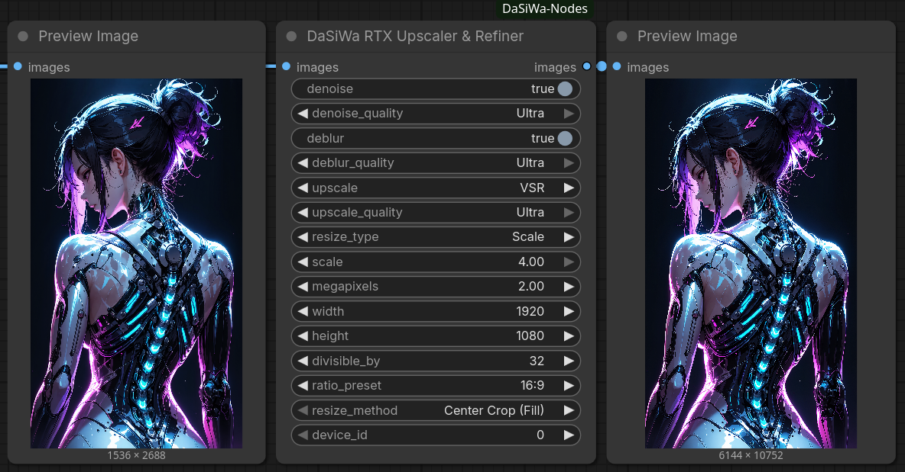

[Full documentation →](docs/rtx_upscaler_refiner.md)

---

### 📐 Resolution Scale Calculator

The **DaSiWa Scale Calculator** provides mathematically precise resolution management for high-performance video models. It uses a **Constant-Area Square-Root method** to ensure that your GPU VRAM usage remains stable regardless of the aspect ratio.

- **Unified Resolution Presets:** Pick standard `p` targets from 144p to 2160p/4K or optimized megapixel tiers from one dropdown.
- **Clear Aspect Modes:** `IMAGE ASPECT` uses the connected image shape; `USE ASPECT BELOW` uses the always-visible aspect controls.
- **Video-Safe Snapping:** Standard, Div32, Div64, and custom divisor modes keep dimensions aligned for different model families.

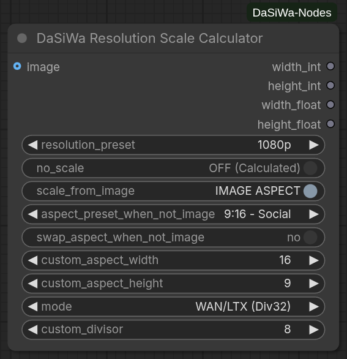

[Full documentation →](docs/ResolutionScaleCalculator.md)

---

### ⚡ Torch Resize

A drop-in replacement for ComfyUI's built-in resize nodes that keeps images sharp and video workflows fast without extra dependencies.

- **Sharper results:** Lanczos resampling with optional sRGB-to-linear gamma correction produces cleaner upscaling and downscaling than native bilinear/bicubic.
- **Video-friendly batching:** Automatically splits long frame sequences into memory-safe chunks so you never run out of VRAM, while keeping output order intact.
- **Zero extra installs:** Runs entirely on the PyTorch build ComfyUI already uses — no Pillow, torchlanc, Triton, or vendor SDK required.
- **Precise sizing control:** Divisible-by alignment, five aspect modes (fit, fill/crop, pad, stretch, long-side crop), and configurable crop/pad placement eliminate guesswork for downstream model constraints.
- **Alpha preserved:** Transparency channels are resized independently without gamma conversion artifacts.

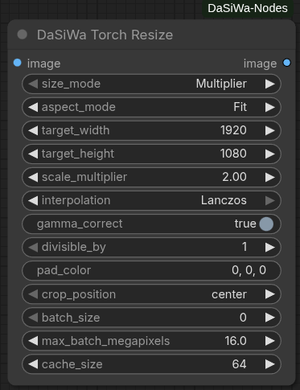

[Full documentation →](docs/torch_resize.md)

---

### 🎛️ Node Status Switch

The **DaSiWa Node Status Switch** lets you mute or bypass any node in your workflow using a single toggle. Targets are registered by wiring their outputs into the switch's input slots, which grow dynamically as you connect more nodes (up to 99).

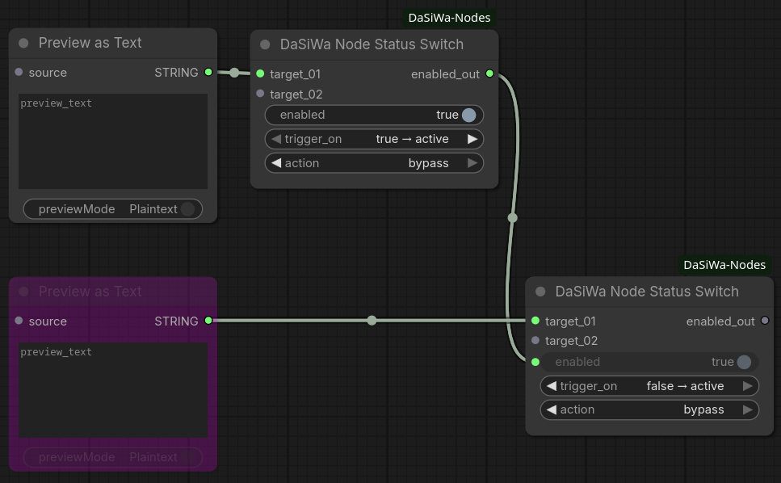

[Full documentation →](docs/node_status_switch.md)

**Quick start:**

1. Add a **DaSiWa Node Status Switch** to your workflow
2. Drag any **output** from the node(s) you want to control into the switch's `target_01` input — new slots appear as you connect more
3. Set `action` to `mute` or `bypass` and configure `trigger_on` to taste
4. Toggle `enabled` directly on the switch

---

### 🎬 Advanced LoRA Loader

The **DaSiWa Advanced LoRA Loader** is a 10-slot stacker for ordinary image/video LoRAs and LTX-2.3. In **Basic mode**, it loads the complete LoRA map, so it is compatible with standard image and video models. Its `VIS` control means **visual strength**: it affects the whole LoRA map in Basic mode, including image models. LTX-2.3 additionally supports independent audio separation.

- **Model Modes:** Select Basic for universal image/video compatibility or LTX-2.3 for separate visual/audio branches. MiniMax H3 uses Basic mode because its transformer blocks are shared between video and audio.
- **Visual Control:** `STR × VIS` is the effective visual strength. In Basic mode, `VIS` controls the complete LoRA map; it is not video-only.
- **Dual-Branch Control:** LTX-2.3 can adjust visual (`VIS×`) and audio (`A×`) multipliers independently per LoRA.
- **10 LoRA Slots:** Stack up to 10 LoRAs with fine-grained strength control (STR: −5.0 to +5.0).
- **Toggle All:** The `ALL` header button enables every slot; when all slots are enabled, it disables every slot.
- **Key Count Indicator:** Auto-scans each LoRA to show video/audio key counts before generation.
- **6 Themes:** Switch between Jade, Neon, Studio, Chrome, OLED, and Wood color schemes.
- **Searchable UI:** Quick LoRA search with live filtering in the node itself.

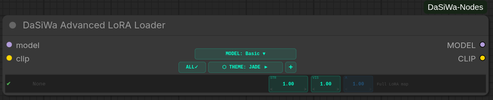

[Full documentation →](docs/ltx2_loader.md)

---

### 💾 Metadata Image Saver (Civitai Ready)

The **DaSiWa Metadata Image Saver** ensures your images are fully compatible with Civitai, Hugging Face, and other galleries by embedding A1111-style metadata. It automatically detects LoRAs used in the workflow and supports dynamic filenames.

- **Civitai Compatibility:** Writes the standard `parameters` block for auto-parsing of prompts and resources.
- **LoRA Detection:** Scans your workflow and appends `<lora:name:weight>` triggers automatically.
- **WebP Support:** Full "Drag-and-Drop" workflow reconstruction support for both PNG and WebP formats.
- **Dynamic Filenames:** Use placeholders like `%seed%`, `%date%`, `%model%`, `%width%`, and `%height%`.
- **Privacy:** Toggle workflow JSON embedding to share images without exposing your full graph.

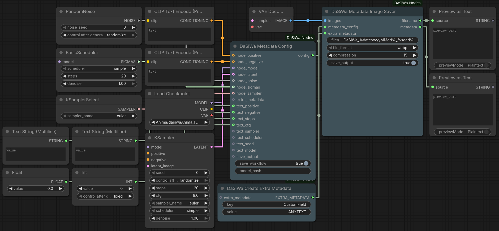

[Full documentation →](docs/metadata_image_saver.md)

---

### 🎞️ Enhanced Video Combine

Converts an `IMAGE` batch into a high-quality video with optional `AUDIO` muxing and an in-node VHS-style preview.

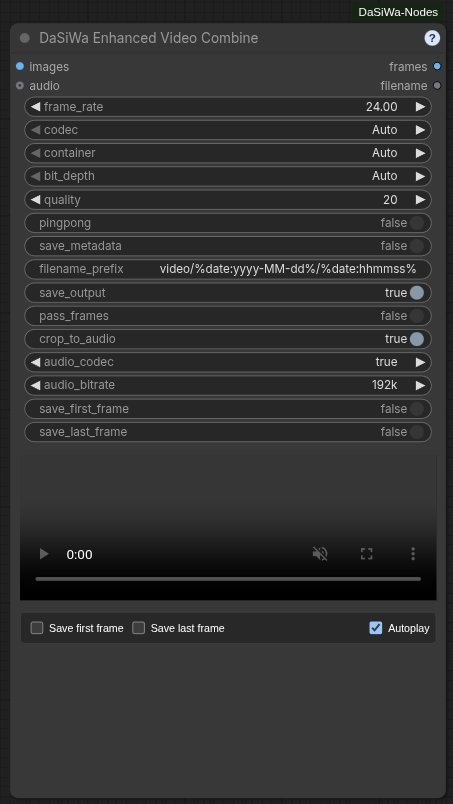

- **Codecs:** Auto (AV1 → VP9 → H.264), or explicit AV1 / VP9 / H.264 / H.265(HEVC). Hardware-first encoder chain (NVENC → QSV → AMF → VAAPI → software); mandatory H.264/MP4 fallback.
- **Containers:** Auto-selects per codec (WebM/MKV/MP4 for AV1/VP9; MP4/MKV for H.264/H.265).
- **Animated images:** Animated AVIF (GPU AV1 or software) and Animated WebP (`libwebp_anim`). Looping, no audio.
- **Bit depth & quality:** Auto-detects 8-bit vs 10-bit source precision; Auto codec forces 8-bit 4:2:0. CRF/CQ-based quality slider (default 20).
- **Audio muxing:** Opus/AAC/MP3 selectable; Auto uses Opus (WebM) or AAC (MKV/MP4). Bitrates 64–320k. Optional crop-to-audio.
- **In-node preview:** Framed player with native hover-reveal controls and hover-to-unmute audio; an optional Mute checkbox keeps the preview permanently silent, and both Autoplay and Mute are remembered with the node. Streamed H.264 transcoding for AV1/H.265 where needed.
- **Frame exports:** Save first/last frame as PNG alongside the video; all assets published to ComfyUI Assets.
- **Ping-pong mode:** Forward/reverse frame loop.
- **Workflow metadata:** Embed prompt/workflow JSON where supported.
- **Logging:** Compact CLI output with codec/container/encoder decisions and resolved audio settings. Built-in `?` help dialog.

[Full documentation →](docs/enhanced_video_combine.md)

---

### 🎬 Watermark Overlay

A professional-grade watermark tool optimized for image and video batches. It uses a stable CPU compositor with high-quality resampling and precise rotation.

- **Dynamic Random Positioning:** Toggle seeded corner cycling while keeping the selected position as the start position.
- **Splash Mode:** Configure dynamic fade-in and fade-out at the start and end of clips for professional branding.
- **Optical Padding:** Automatically adjusts placement by the watermark's visual center of mass for perfect alignment.
- **Stable Compositing:** Output frames are initialized from the source batch before the watermark region is blended, avoiding flicker and black-frame artifacts.

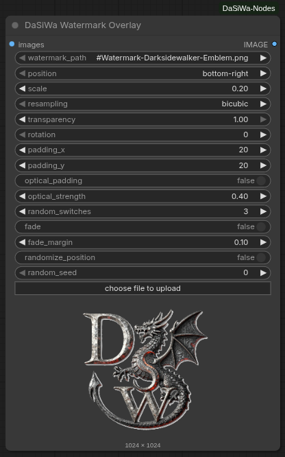

[Full documentation →](docs/watermark.md)

---

### 🩹 Inpaint Crop Prep & Composite

A two-node crop-inpaint-composite pair for any inpainting model. **Inpaint Crop Prep** tight-crops to the mask and scales it for a high-res inpainter; **Inpaint Composite** blends the result back onto the original image.

- **Crop Prep:** Gaussian-blurs the mask, extracts its bounding box (with configurable `grow_px` padding), crops image + mask, and bicubic-scales both to `target_width` × `target_height`. Emits `cropped_image`, `cropped_mask`, and the original-space `bbox_x/y/w/h` so you can composite back. `can_shrink` (default on) allows downscaling; turn it off to keep the crop at least its native size.
- **Composite:** pastes the inpainted `source` patch back at `(x, y)` with the (auto-rescaled) mask, applying optional **Match Channels** or **Histogram** color correction against the destination region for a seamless blend.
- **Pure PyTorch:** separable Gaussian blur, bicubic resampling, and channel-statistics color matching with no torchvision or extra dependencies.

Wiring:

```text
IMAGE + MASK ──► Inpaint Crop Prep ──► (cropped_image, cropped_mask)
                                     ──► any inpainter ──► source patch
IMAGE ───────────────────────────────────────────────┐
                                                     ▼
                                  Inpaint Composite (x, y, w, h from Crop Prep)
                                                     │
                                                     ▼
                                                   IMAGE
```

---

### 🖥️ System Monitor

A compact system telemetry bar integrated directly into the ComfyUI top toolbar. The adjacent DaSiWa settings button lets you hide the monitor or choose its display mode.

- **Multi-GPU Support:** Separate metrics per GPU device (NVIDIA, AMD, Intel) labeled as GPU0, GPU1, etc.
- **Resource Metrics:** CPU, RAM, SWAP/Pagefile, DISK, GPU Utilization, GPU VRAM, and GPU Temperature.
- **Visual Feedback:** Color-coded borders and proportional background fills (0–100%) for instant at-a-glance assessment.
- **Lite / Full Modes:** Lite is the default compact toolbar view; Full shows every available metric with detailed values and a live 60-second graph.
- **Responsive Layout:** Lite automatically hides lower-priority metrics when toolbar space is limited; Full is a scrollable panel that adapts to narrow screens. Each Lite chip sizes to its label and value (`max-content`) so text never clips, at any resolution, font, or DPI.
- **Cross-Platform:** Works on Linux and Windows with automatic fallback detection for GPU tools.
- **Container-safe:** In containers and sandboxes where parts of `/proc` are missing (e.g. `/proc/vmstat`), probes degrade to `n/a` instead of warning every second. Set `DASWA_SYSTEM_MONITOR=0` (also `false`/`no`/`off`/`disable`) to fully stop the backend polling thread.
- **Independent Placement:** Renders as its own toolbar element, not dependent on third-party extensions.

**Lite mode**

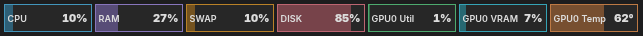

**Full mode**


[Full documentation →](docs/system_monitor.md)

---

### 🔀 Random String Picker

Bridge any string/text node through **DaSiWa Random String Picker** to randomize prompt variants inline.

- **Text passthrough:** Accepts a connected `STRING` input and returns a `STRING` output.
- **Inline variants:** Replaces every `{A|B|C}` segment with one randomly selected option.
- **Multiple groups:** Processes any number of groups independently, such as `{red|blue} car in {sun|rain}`.
- **Literal passthrough:** Text outside complete `{...}` groups is left unchanged.

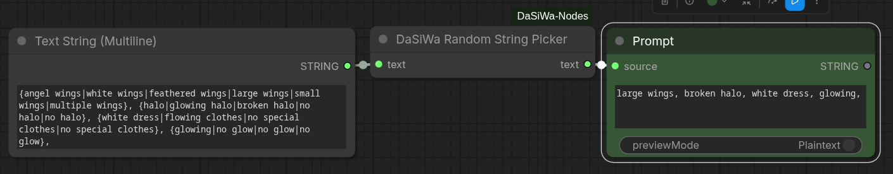

[Full documentation →](docs/random_string_picker.md)

---

### 🎲 Wildcard & Preset Prompt Builder

**DaSiWa Wildcard & Preset Prompt Builder** builds positive and negative `STRING` prompts directly from the bundled dual wildcard library—no downstream picker node needed.

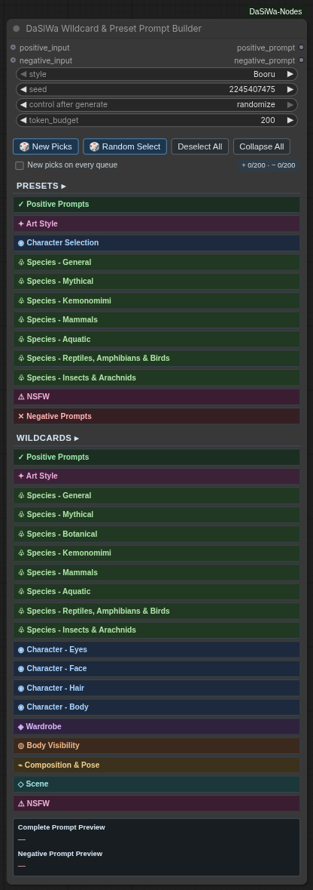

- **Dual style:** Switch globally between Booru and Natural Language source keys.
- **Compact selector:** Collapsible categories expose subject checkboxes, weights, deterministic live selections, and right-aligned selected-subject counters that remain visible while a category is collapsed.
- **Fast inspiration:** **Random Select** replaces the current selection with 1–10 secure-random available Preset/Wildcard subjects.
- **Reproducible rerolls:** Seed plus the stored reroll value reproduce every `{A|B|C}` choice; **New Picks** only advances the reroll value, while **New picks on every queue** opts into fresh output for each queue—including Preview as Text selected-output execution.
- **Weighted, bounded prompts:** Non-1.0 enabled subjects use ComfyUI emphasis syntax. Each positive/negative prompt independently removes complete lowest-weight subjects until it meets the token budget.
- **Optional prompt prefixes:** Connect `positive_input` or `negative_input` to prepend an existing prompt to that generated side.
- **Custom library:** Edit or replace `data/wildcards_and_presets_dual.json` with a compatible library; no checksum sidecar or pinned data version is required.

[Wildcard & Preset Prompt Builder documentation →](docs/wildcard_preset_prompt_builder.md)

---

### 🧠 LLM / VLM Analyze

The **DaSiWa LLM / VLM nodes** let you run local transformers chat or vision-language models from inside a ComfyUI workflow. They accept native `STRING` inputs and native `IMAGE` batches from nodes such as Load Image or VHS frame loaders.

- **Native ComfyUI Inputs:** Analyze connected text, still images, or video/image-sequence frame batches.
- **Prompt Presets:** Custom system instructions, LTX-2.3/Wan2.2 video prompt enhancement, and image/video caption presets for mixed tags, tag-only, or natural language.
- **Memory Modes:** Keep models cached for speed, or use full cleanup to unload DaSiWa and ComfyUI managed models before/after analysis so later image/video models recover VRAM/RAM.
- **Frame Sampling:** Limit video analysis with max frames, stride, frame strategy, resize controls, context limits, and optional KV-cache reduction.
- **Local, GGUF, Ollama, or HF Models:** Load full Transformers folders, local GGUF through llama.cpp, call Ollama, or download a Hugging Face repo id into `ComfyUI/models/llm`.

[Full documentation →](docs/llm_nodes.md)

---

## 🛠️ Installation

### Manual install

1. Activate your venv inside your ComfyUI folder
2. Clone this repo into your `custom_nodes` folder:
   ```bash
   git clone https://github.com/darksidewalker/ComfyUI-DaSiWa-Nodes
   ```
3. Install all dependencies:
   ```bash
   pip install -r requirements.txt
   ```
4. **Requirement:** NVIDIA RTX GPU with drivers 530+. (Windows users may need the NVIDIA Broadcast SDK; Linux usually works out-of-the-box with the pip package).
5. Restart ComfyUI.

### Use ComfyUI-Manager

Search for **DaSiWa-Nodes** and install.

---

## Credits

- The RTX implementation in this collection is based on the excellent work by [Deno2026/comfyui-deno-custom-nodes](https://github.com/Deno2026/comfyui-deno-custom-nodes).
- Lora-Loader is based on [Brojakhoeman/Loradaddyloaderltx](https://github.com/Brojakhoeman/Loradaddyloaderltx/tree/main).
- Ideas for Watermark Overlay are inspired by [Artificial-Sweetener/comfyui-WhiteRabbit](https://github.com/Artificial-Sweetener/comfyui-WhiteRabbit)
- MiniMax H3 Director was inspired by the LTX Director concept from [whatdreamscost](https://github.com/whatdreamscost)
