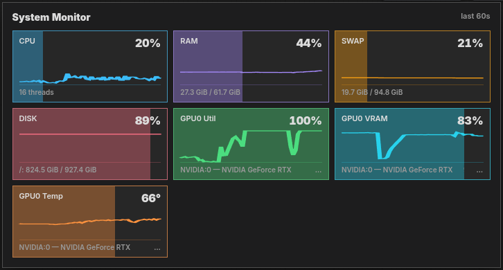

# DaSiWa System Monitor

A compact, non-intrusive system telemetry bar integrated directly into the ComfyUI top toolbar.

## Overview

The System Monitor displays real-time resource utilization in the ComfyUI header area. A DaSiWa settings button sits directly beside the monitor and is the home for settings shared by DaSiWa nodes as they are added.

The current settings are stored in the browser, so they remain active after a ComfyUI page reload:

- **Show system monitor:** hides or shows the monitor while keeping the settings button available.
- **Lite:** the default compact fixed-width, color-coded toolbar meters. Each meter shows a label, a numeric value, and a proportional background fill representing 0–100% usage.
- **Full:** a spacious monitor panel with every available metric, its current value and detail, plus a live graph covering the most recent 60 telemetry samples (normally about one minute).
- **Dock:** choose the top toolbar, left side, or right side from the settings menu. The selection is retained after reload.
- **Widget layout:** choose horizontal or vertical meter flow. This is especially useful in left/right side docks.
- **Widgets:** enable or disable individual CPU, memory, disk, I/O, and GPU meters. Every widget is enabled by default and choices are retained after reload.
- **Placement:** drag the monitor freely anywhere on the ComfyUI canvas. Floating placement uses pixel-aligned coordinates to keep its text sharp. Drop it on the visible top, left, or right target to dock it.

## Display Modes

### Lite (default)

Lite keeps the monitor in the toolbar as compact, content-sized meters. Each chip sizes to its label and value (`max-content`) so text never clips at any resolution, font, or DPI. It is intended for continuous at-a-glance monitoring while working in ComfyUI.

Use the small grip at the monitor's left edge to float it above the canvas. To dock it again, drag that grip to a visible top, left, or right dock target and release it there. The settings menu provides the same dock controls without dragging.


### Full

Full opens a larger panel directly below the monitor controls. It shows all available CPU, memory, disk, and GPU metrics at once, including each metric's detailed value and a graph of the most recent 60 telemetry samples. The settings button remains available above the panel to switch back to Lite or disable the monitor.



## Metrics

| Metric | Description | Color |
|--------|-------------|-------|
| CPU | Overall CPU utilization across all threads | Blue (`#38bdf8`) |
| RAM | Physical memory usage | Purple (`#a78bfa`) |
| SWAP | Swap space (Linux) or Pagefile (Windows) | Amber (`#f59e0b`) |
| DISK | System filesystem and, when different, the filesystem containing ComfyUI | Pink (`#fb7185`) |
| RD | Read throughput for each displayed filesystem (MB/s) | Green (`#34d399`) |
| WR | Write throughput for each displayed filesystem (MB/s) | Pink (`#f472b6`) |
| GPU0 Util | GPU 0 compute utilization | Green (`#4ade80`) |
| GPU0 VRAM | GPU 0 video memory usage | Cyan (`#22d3ee`) |
| GPU0 Temp | GPU 0 temperature in °C | Orange (`#fb923c`) |

Additional GPUs appear as GPU1, GPU2, etc., each with Util, VRAM, and Temp chips.

## Tooltips

Hover over any metric chip to see detailed information:

- **CPU:** Thread count
- **RAM/SWAP:** Used / Total in human-readable units (MiB/GiB)
- **DISK:** Device, mount path, used / total
- **RD/WR:** Mount path and current read/write throughput
- **GPU:** Device ID, name, and exact VRAM used / total

## GPU Support

| Platform | Vendor | Detection Method |
|----------|--------|------------------|
| Linux | NVIDIA | `nvidia-smi` query |
| Linux | AMD | `rocm-smi` JSON output |
| Linux | Intel | DRM/sysfs device tree |
| Windows | NVIDIA | `nvidia-smi` if available, otherwise CIM `Win32_VideoController` |
| Windows | AMD | CIM `Win32_VideoController` fallback |
| Windows | Intel | CIM `Win32_VideoController` fallback |

When multiple GPUs of the same vendor exist, each receives a sequential index starting at 0. If a specific GPU tool is unavailable, the system gracefully degrades to generic device enumeration.

On Windows the CIM `Win32_VideoController` query is expensive (a fresh `powershell.exe` per call) and its data — adapter name, `PNPDeviceID`, `AdapterRAM` — is static, so it is probed **once** and cached for the lifetime of the monitor instance. A successful non-empty result is reused on every subsequent tick; an empty result is retried on the next tick until an adapter is found. This avoids spawning a powershell process on every telemetry interval.

## Responsive Behavior

When toolbar width is insufficient to display all metrics, lower-priority chips are hidden first. The priority order (highest to lowest):

1. CPU
2. RAM
3. GPU metrics (Util, VRAM, Temp per GPU)
4. SWAP
5. DISK

A ResizeObserver monitors window changes and adjusts visibility dynamically without user interaction. Full mode uses a scrollable panel and collapses to one metric column on narrow screens.

## Backend Requirements

- **psutil** — Cross-platform system metrics (CPU, RAM, swap, disk). Included in project dependencies.
- **nvidia-smi** — Optional, bundled with NVIDIA drivers.
- **rocm-smi** — Optional, part of ROCm toolkit for AMD GPUs.
- No additional GPU tools required on Windows beyond standard drivers.

## API Endpoints

The backend exposes two REST endpoints for external consumption:

- `/dasiwa/system-monitor` — Full system snapshot (JSON)
- `/dasiwa/system-monitor/gpus` — GPU-specific data only (JSON)

Additionally, updates are broadcast via WebSocket event `dasiwa.system_monitor` approximately once per second.

## Troubleshooting

| Symptom | Cause | Fix |
|---------|-------|-----|
| Monitor shows "Loading..." | Backend route not registered | Ensure `nodes/nodes_system_monitor.py` is imported in `__init__.py` |
| No GPU metrics shown | Missing GPU query tool | Verify `nvidia-smi --query-gpu=index,name --format=csv` runs successfully |
| Swap shows "n/a" | No swap configured | Normal behavior; indicates swap/pagefile is disabled |
| Panel overlaps other toolbar items | Insufficient toolbar width | Lower-priority metrics auto-hide; check browser developer console for errors |

## Disabling

Two independent levels:

- **Browser-local (UI):** Use the settings button next to the monitor and disable **Show system monitor**. This only hides the panel in your browser; it does not stop the lightweight backend telemetry thread, which keeps the WebSocket event and REST endpoints live so re-enabling is instant without a ComfyUI restart.
- **Backend (real disable):** Set the `DASWA_SYSTEM_MONITOR` environment variable to `0`, `false`, `no`, `off`, `disable`, or `disabled` before starting ComfyUI. This skips starting the polling thread entirely — no `psutil` sampling and no `nvidia-smi`/`rocm-smi` subprocess calls. Any other value (or an unset variable) leaves the monitor on, preserving the default local-run behavior.

```bash
# bash / zsh
export DASWA_SYSTEM_MONITOR=0

# fish
set -x DASWA_SYSTEM_MONITOR 0
```

## Container / sandbox safety

Cloud containers and sandboxes often expose an incomplete `/proc` (for example, no `/proc/vmstat`). Every hardware and `psutil` probe now runs through a guarded wrapper that suppresses the resulting `RuntimeWarning` and falls back to a safe default, so:

- A missing swap source reports `n/a` (used/total/percent = null) instead of spitting a per-second `RuntimeWarning` into the log.
- A failing `nvidia-smi`/`rocm-smi`/DRM probe returns an empty GPU list instead of raising.
- The monitor thread never crashes the ComfyUI server because of an unavailable stat.

This is independent of the disable switch above — leaving the monitor on in a container is now quiet.
