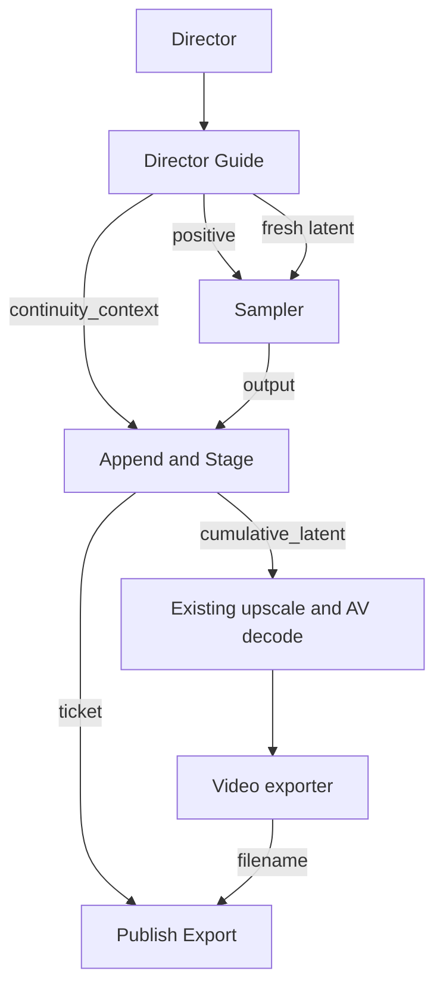

# H3 Director Continuity 1.2.5

The Director owns the controls. Selecting a video or checkpoint automatically shows **Continuity Active**. The actual model mode stays selected; there is no Continue pseudo-mode. The existing **Duration** input controls newly added seconds. The supplied wired workflow captures new takes by default; older capture-off workflows retain their preference.

## Two sources, one continuation path

| Source | Preparation | Conditioning |
| --- | --- | --- |
| Completed H3 checkpoint | Load immutable video/audio latent | Native AV latent-tail guide |
| Ordinary uploaded video | Probe/hash without models; encode with the connected H3 video/audio VAEs inside the queue | The same native AV latent-tail guide |

For ordinary video, use **Choose start video…**, describe the next action in Prompt, and queue. No separate import node or LLM configuration is needed. `ffmpeg` and `ffprobe` must be on PATH. H3 video and audio VAEs are both required, including for silent inputs. A content hash protects a pinned upload against replacement. Imports are reused for the same session, source, canvas and model family; use a new session when changing the H3 codec weights.

The importer preserves the full source at 24 fps, fits it to the Director canvas with padding, and adds at most 16 repeated first frames at the **beginning** to satisfy 17k+5. Matching leading silence keeps AV alignment. No grid padding freezes the source ending. Audio is stereo 32 kHz and sized to the native globally rounded 40 Hz token boundary. Source media is VAE-reconstructed, not stream-copied.

## Wiring

| From | To | Purpose |
| --- | --- | --- |
| Director.guide | Director Guide.guide | Mode, canvas, separate continuation prompt and source selection |
| Director Guide.positive | BasicGuider.conditioning | Active native tail conditioning |
| Director Guide.latent | SamplerCustomAdvanced.latent_image | Bounded fresh AV sample window |
| Director Guide.continuity_context | Append & Stage.context | Pinned parent, timing and run identity |
| SamplerCustomAdvanced.output | Append & Stage.sampled | Generated joint video/audio latent |
| Append & Stage.cumulative_latent | Existing latent upscale, then video/audio decode | Keep the source prefix and append only new AV tokens |
| Append & Stage.ticket | Publish Export.ticket | Identify this staged checkpoint |
| Enhanced Video Combine.filename | Publish Export.filename | Wait for and validate this actual export |

The supplied workflow exposes `continuity_ticket` from Settings and places Publish at the root. Do not feed the export filename back into Settings or substitute an unrelated Set/Get filename. The visible root graph contains model/CLIP paths through Settings in both directions; the expanded node dependencies are acyclic.

## User controls

- **Choose start video… / source selector:** choosing a source activates continuity; no second action is required.
- **Continuity Active:** the row shows the current model mode and **Source + Added = Total**. Imported-video totals use ≈ until an encoded source length is known.
- **Duration:** the existing seconds input becomes the requested new visible section. `max(17, floor(seconds × 24 / 17 + 0.5) × 17)` derives new frames. No +frames control. Valid request: above 0, up to 15 seconds.
- **Prompt:** describe what happens next, or leave empty for natural continuation. The continuity policy is automatic. **Clear source** restores the normal prompt. Other video modes retain the source; Image Inpaint clears it.
- **Use latest output:** explicitly select a completed generated result. Imported source checkpoints never count as latest output. Completing a job never advances the source silently; rerolls share a pinned parent.
- **Prompt Forge:** the existing modal and `/dasiwa/h3/forge` endpoint receive continuity context automatically. Source-tail evidence, current text, next action and actual new duration inform the draft. Model/detail/creativity/cancel/unload/history/manual Apply are shared with normal Forge. Source/duration/mode/prompt/canvas/FPS changes invalidate a draft. Editing the idea or drafting options clears the displayed result; regenerate or explicitly choose history. Options/history are locked during a request. Failed or cancelled regeneration cannot apply the previous draft.
- **Source check:** a read-only metadata/header inspection reports unavailable or incompatible sources before queueing. It never changes mode automatically. Connected canvas dimensions are verified in the queue. For a raw upload, hashing/encoding still happen when queued.
- **∞ Save new takes:** the rounded button before **Choose start video…** controls checkpoint capture for new takes. It glows when capture is on and shows the disk-space hint on hover. It does **not** activate continuation: selecting a video or checkpoint source does, even with capture off. Continuations are always saved.
- **Advanced:** the rounded button between **Use latest output** and **Clear source** opens a separate overlay; it does not expand the node. The overlay holds preferred context, optional REF2VA references, saved-session resume, New session, manual session ID, refresh and **Match source settings**. Selecting a saved session pins its latest generated output; New session clears the source/next-action text without deleting previous files. Available checkpoint count and latent-file size exclude staged/broken files, exports, uploads and models. Checkpoint canvas/model family must match. Connected external dimensions must be changed upstream. These options, the selected session/source and the next-action prompt live in the workflow's `timeline_data`; save the workflow to keep them across browser reload or ComfyUI restart. Checkpoint files remain in ComfyUI output and the session list is read from disk after restart. Unsaved workflow edits are not recovered by this node.

| Duration request | New frames | Actual added seconds | Effective default context |
| --- | ---: | ---: | ---: |
| 5 s | 119 | 4.958 | 22 |
| 10 s | 238 | 9.917 | 22 |
| 15 s | 357 | 14.875 | 5 |

The hidden context is sampled but discarded before append; it is not added to the visible duration. At 5 seconds: 22 context + 119 new = 141 sample-window frames. A 124-frame source then becomes 243 frames, or 10.125 seconds. Preferred context shrinks to fit the actual source and the native 362-frame window limit; new visible time is never silently truncated to make room. Audio boundaries stay globally rounded across every append.

No tail tiles are displayed. Up to four chronological JPEGs are extracted only for an explicit vision Forge draft and cached separately from checkpoint metadata. They help infer end-of-source motion. Text-only fallback is labelled; no audio is analyzed. Upload/preparation and export do not generate JPEGs.

Continuation skips first/last-frame anchors and, by default, REF2VA timeline references. **Keep REF2VA timeline references** opts those references into generation; normal reference state stays intact. Continuation Forge uses source-tail evidence and text, not an additional visual analysis of those optional timeline references.

Old active v2 +frames values migrate to their exact fractional-second Duration. Custom prompt/idea are retained once; stock prefill becomes automatic policy. Previously inactive preselected sources do not activate during upgrade. Legacy v1/v2 API settings remain supported; this source-activation contract applies to v3.

## Integrity and resource costs

Checkpoints live under `output/df_h3_continuity/<session>/<clip_id>`. `latent.safetensors` holds both streams; `clip.json` records timing, parent and provenance. `_imports` holds upload manifests and, after vision drafting, optional tail-image caches. A staged sample is never offered as a completed result until export succeeds and its duration matches. Downstream ping-pong or time trimming is incompatible; duration-preserving interpolation is allowed. Failed exports leave the source pinned.

Lists/preflight read safetensors headers without materializing video/audio tensors. Missing, malformed or shape-inconsistent checkpoints are excluded; counts remain visible in Advanced. The latest 200 clips are shown plus any older pinned checkpoint. Header checks are not payload checksums.

Video import uses temporary disk-backed RGB and public VAE calls of at most 124 frames. Preflight estimates temporary RGB/PCM disk and reports available space; the importer repeats the check in its actual temporary directory before decoding. The estimate includes 10% plus 64 MiB reserve, but is not a RAM/VRAM or cumulative-export budget. Probe-duration errors and simultaneous disk use remain possible. Queued hash scanning checks cancellation every 4 MiB. The chunk plan follows native H3's independent 17-frame encoder chunks with the three-token drop applied only at the final boundary. Audio encoding and cumulative latent/decode still scale with total length. Importing arbitrary input does not make hour-long material inexpensive.

No model monkeypatch is installed. Native tail/window/append code remains the MIT-licensed [ttulttul continuation implementation](https://github.com/ttulttul/ComfyUI-Minimax-H3-Continuation), with its license retained in `nodes/h3_continuity/vendor/LICENSE`. Native ComfyUI arbitrary-frame guides are required. The source prefix is exact at the latent level; re-decoding or postprocessing may change prior pixels/audio.

CPU, media and browser harness tests do not establish visual/acoustic seam quality. Perform the GPU acceptance runs described in the package's maintainer notes before treating this as production-validated.
