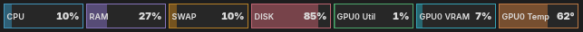
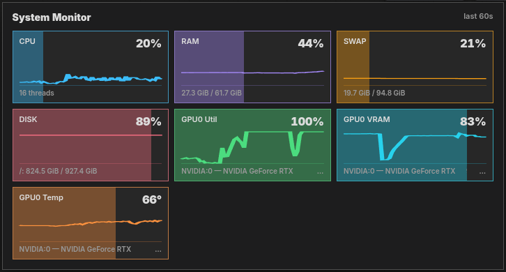

# DaSiWa System Monitor

A compact system telemetry monitor integrated into ComfyUI. The default Lite bar sits below the Extensions/Run toolbar; choosing Ultra compact docks its card on the right.

## Overview

The System Monitor displays real-time resource utilization in the ComfyUI header area. Its local display controls remain on the monitor itself; the global switch lives at **ComfyUI → Settings → Other → DaSiWa → System Monitor**. The separate Free Memory button is independent of monitor telemetry.

The current settings are stored in the browser, so they remain active after a ComfyUI page reload:

- **Enable System Monitor:** the global DaSiWa switch. Off removes the monitor toolbar/floating UI, dock targets, frontend listeners, and backend telemetry polling. On starts and mounts them again.
- **Lite:** the default single-line bar on its own top row, with color-coded meters. Each meter shows a label, a numeric value, and a proportional background fill representing 0–100% usage. On narrow screens, scroll the bar horizontally to see the rest.
- **Ultra compact:** an optional 240 px wide card that docks right when selected, with one colored line per enabled metric. Its height grows to show all enabled metrics without an internal scrollbar; hover a line for the full value or device detail. It also works docked elsewhere or floating, and retains the same widget and opacity settings as Lite without changing Lite's saved resize width.
- **Resize:** drag the lower-right corner horizontally in Lite to change the monitor's width. Its height follows the number of meter rows automatically, and the dotted grip stays one meter tall. Narrowing the bar wraps whole meters to new rows; expanding stops when they all fit on one row. Size persists after reload. Ultra compact uses a fixed card size instead.
- **Reset to default Lite bar:** the monitor settings menu restores the top-docked Lite layout without changing widget visibility or opacity.
- **Full:** a spacious monitor panel with every available metric, its current value and detail, plus a live graph covering the most recent 60 telemetry samples (normally about one minute).
- **Dock:** Lite defaults to the top row; selecting Ultra compact switches to the right side, away from ComfyUI's top controls. Choose top, left, or right manually from the settings menu afterward; the choice persists after reload. The menu opens toward available viewport space and scrolls if the window is too short.
- **Transparency:** two 0–100% opacity sliders are available both in ComfyUI Settings and in the monitor's settings menu. Background controls the monitor surfaces; Drawing / text / lines controls meters, labels, graphs, and borders independently. 0% is invisible, 100% is opaque (the default). Both values persist after reload.
- **Widget layout:** choose horizontal or vertical meter flow. This is especially useful in left/right side docks.
- **Widgets:** enable or disable individual CPU, memory, disk, I/O, and GPU meters. Every widget is enabled by default and choices are retained after reload.
- **Placement:** drag the monitor freely anywhere on the ComfyUI canvas. Floating placement uses pixel-aligned coordinates to keep its text sharp. Drop it on the visible top, left, or right target to dock it.

## Free Memory toolbar button

The DaSiWa-logo button sits beside the other top controls, independent of the monitor's dock, size, or floating position. It stays in the toolbar even if the monitor is disabled. Click it to choose:

- **Free VRAM:** asks ComfyUI to unload its managed models (`POST /free` with `unload_models: true`, `free_memory: false`).
- **Free System RAM:** unloads managed models **and** resets ComfyUI's execution cache (`unload_models: true`, `free_memory: true`). This is not an operating-system-wide RAM purge.

The request is queued by ComfyUI and processed by its prompt worker; the button does not interrupt an active generation or free memory owned by other processes. Click outside either this menu or the monitor settings menu to close it. Disable the Free Memory button separately at **ComfyUI → Settings → Other → DaSiWa → Free Memory → Show Free Memory Button**; the preference is browser-local and does not disable telemetry.

## Display Modes

### Lite

Lite uses an independent bar below the main ComfyUI action toolbar, leaving Extensions, Run, and other actions in place. It reattaches to that row if ComfyUI rebuilds the toolbar when the Properties panel opens or closes. With no custom size it keeps its meters on one line; at reduced viewport width, the bar scrolls horizontally instead of crowding the actions above it.

Resize the bar horizontally from its lower-right corner. The meters retain their font and chip size, move to additional rows as width decreases, and determine the bar's height automatically. **Reset to default Lite bar** restores the single-line top layout.

Use the small grip at the monitor's left edge to float it above the canvas. To dock it again, drag that grip to a visible top, left, or right dock target and release it there. The settings menu provides the same dock controls without dragging.



### Ultra compact

Choose **Ultra compact** from the monitor's settings menu to switch from the default Lite top row to a right-docked readout. It shows every enabled CPU, memory, disk, and GPU metric as a short label/value line with a thin utilization indicator. The card grows with the number of lines and has no internal scrollbar; hovering a line reveals its full detail. Switching back to Lite returns to the top row and restores its previous width. The choice persists after a page reload; you can also move either mode to any dock or float it afterward.

### Full

Full opens a larger panel anchored to the monitor controls. It shows all available CPU, memory, disk, and GPU metrics at once, including each metric's detailed value and a graph of the most recent 60 telemetry samples. The settings button remains available to switch back to Lite or disable the monitor. Horizontal corner resizing applies to Lite, not the Full graph panel; if a floating Full panel extends below the viewport, move the monitor higher or dock it at the top.



## Metrics

| Metric | Description | Color |
|--------|-------------|-------|
| CPU | Overall CPU utilization across all threads | Blue (`#38bdf8`) |
| RAM | Physical memory usage | Purple (`#a78bfa`) |
| SWAP | Swap space (Linux) or Pagefile (Windows) | Amber (`#f59e0b`) |
| DISK | System filesystem and, when different, the filesystem containing ComfyUI | Pink (`#fb7185`) |
| RD | Read throughput for each displayed filesystem (MB/s) | Green (`#34d399`) |
| WR | Write throughput for each displayed filesystem (MB/s) | Pink (`#f472b6`) |
| GPU0 Util | GPU 0 compute utilization | Green (`#4ade80`) |
| GPU0 VRAM | GPU 0 video memory usage | Cyan (`#22d3ee`) |
| GPU0 Temp | GPU 0 temperature in °C | Orange (`#fb923c`) |

Additional GPUs appear as GPU1, GPU2, etc., each with Util, VRAM, and Temp chips.

## Tooltips

Hover over any metric chip to see detailed information:

- **CPU:** Thread count
- **RAM/SWAP:** Used / Total in human-readable units (MiB/GiB)
- **DISK:** Device, mount path, used / total
- **RD/WR:** Mount path and current read/write throughput
- **GPU:** Device ID, name, and exact VRAM used / total

## GPU Support

| Platform | Vendor | Detection Method |
|----------|--------|------------------|
| Linux | NVIDIA | NVML (`nvidia-ml-py`), `nvidia-smi` query as fallback |
| Linux | AMD | `rocm-smi` JSON output |
| Linux | Intel | DRM/sysfs device tree |
| Windows | NVIDIA | NVML (`nvidia-ml-py`), then `nvidia-smi`, otherwise CIM `Win32_VideoController` |
| Windows | AMD | ADLX (`amd-adlx`), otherwise CIM `Win32_VideoController` |
| Windows | Intel | CIM `Win32_VideoController` fallback |

When multiple GPUs of the same vendor exist, each receives a sequential index starting at 0. If a specific GPU tool is unavailable, the system gracefully degrades to generic device enumeration.

On Windows the CIM `Win32_VideoController` query is expensive (a fresh `powershell.exe` per call) and its data — adapter name, `PNPDeviceID`, `AdapterRAM` — is static, so it is probed **once** and cached for the lifetime of the monitor instance. A successful non-empty result is reused on every subsequent tick; an empty result is retried on the next tick until an adapter is found. This avoids spawning a powershell process on every telemetry interval.

NVIDIA telemetry uses **one NVML session opened on the first sample and kept for the life of the monitor**. Spawning `nvidia-smi` every tick opens a new NVML session each time, and under Docker Desktop / WSL2 on Windows every session opened in the guest leaks NVIDIA driver memory on the host until reboot; queries on one open session do not. If NVML cannot load, the monitor falls back to `nvidia-smi`, retrying NVML at most every 10 minutes.

AMD telemetry on Windows goes through ADLX, the AMD driver's own telemetry library, since `rocm-smi` and `amdsmi` have no Windows build. Like NVML it is opened once and kept for the life of the monitor. VRAM from ADLX is device-wide, covering memory held by other applications. Without `amd-adlx` an AMD card still appears through CIM, but utilization, VRAM usage and temperature show `n/a`.

## Responsive Behavior

The default Lite bar keeps its meters on one line at its unresized width and scrolls horizontally when the viewport is too narrow; dragging Lite's corner wraps fixed-size meters into additional rows. Ultra compact shows all enabled lines without an internal scrollbar and grows vertically as needed. The Full panel remains independently scrollable and collapses to one metric column on narrow screens.

## Backend Requirements

- **psutil** — Cross-platform system metrics (CPU, RAM, swap, disk). Included in project dependencies.
- **nvidia-ml-py** — NVIDIA telemetry through NVML (installed from `requirements.txt`; pure Python, harmless without an NVIDIA GPU).
- **nvidia-smi** — Optional fallback when NVML cannot load, bundled with NVIDIA drivers.
- **amd-adlx** — AMD telemetry on Windows through ADLX (installed from `requirements.txt` on Windows only; the driver library is loaded only when an AMD driver is present).
- **rocm-smi** — Optional, part of ROCm toolkit for AMD GPUs on Linux.
- No additional GPU tools required on Windows beyond standard drivers.

## API Endpoints

The backend exposes three REST endpoints:

- `/dasiwa/system-monitor` — Full system snapshot (JSON; returns 503 when disabled)
- `/dasiwa/system-monitor/gpus` — GPU-specific data only (JSON; returns 503 when disabled)
- `POST /dasiwa/system-monitor/enabled` — Starts or stops telemetry using `{ "enabled": true | false }`

Updates are broadcast via WebSocket event `dasiwa.system_monitor` approximately once per second while the monitor is enabled.

## Troubleshooting

| Symptom | Cause | Fix |
|---------|-------|-----|
| Monitor shows "Loading..." | Backend route not registered | Ensure `nodes/nodes_system_monitor.py` is imported in `__init__.py` |
| No GPU metrics shown | Missing GPU query tool | Verify `python -c "import pynvml; pynvml.nvmlInit()"` or `nvidia-smi --query-gpu=index,name --format=csv` runs successfully |
| Swap shows "n/a" | No swap configured | Normal behavior; indicates swap/pagefile is disabled |
| Panel overlaps other toolbar items | Monitor restored from an older placement | Use **Reset to default Lite bar** in its settings menu; the default top dock occupies its own row below ComfyUI's controls |

## Disabling

Use **ComfyUI → Settings → Other → DaSiWa → System Monitor** to disable the monitor. This removes every monitor element from the ComfyUI UI, unregisters its frontend event listeners, stops the backend polling thread, and makes snapshot routes return 503 until re-enabled. The preference is browser-local and is synchronized when that browser loads ComfyUI.

For a server that must never start telemetry before a browser connects, set `DASWA_SYSTEM_MONITOR` to `0`, `false`, `no`, `off`, `disable`, or `disabled` before starting ComfyUI. The settings switch can still enable it later.

```bash
# bash / zsh
export DASWA_SYSTEM_MONITOR=0

# fish
set -x DASWA_SYSTEM_MONITOR 0
```

## Container / sandbox safety

Cloud containers and sandboxes often expose an incomplete `/proc` (for example, no `/proc/vmstat`). Every hardware and `psutil` probe now runs through a guarded wrapper that suppresses the resulting `RuntimeWarning` and falls back to a safe default, so:

- A missing swap source reports `n/a` (used/total/percent = null) instead of spitting a per-second `RuntimeWarning` into the log.
- A failing `nvidia-smi`/`rocm-smi`/DRM probe returns an empty GPU list instead of raising.
- The monitor thread never crashes the ComfyUI server because of an unavailable stat.

This is independent of the disable switch above — leaving the monitor on in a container is now quiet.
