# DaSiWa Custom Nodes Collection

A high-performance collection of custom nodes for ComfyUI, optimized for video workflows, resolution management, and logic control. Its installed version is shown in **ComfyUI → Settings → About**. 

Use **ComfyUI → Settings → Other → DaSiWa → ...** to enable or disable extra settings.

[📰 News & Changelog — release notes and complete change history across the collection →](docs/news_and_changelog.md)

## Included Nodes

### 🎬 MiniMax H3 Director

> 🎬 MiniMax H3 Director — The Ultimate One-Stop Video Creation Pipeline: Experience the most advanced, feature-complete MiniMax H3 Director node available for ComfyUI. Built as a comprehensive production hub, it seamlessly merges timeline-based multi-modal authoring, intelligent LLM/VLM Prompt Forge assistance, deep RefMod persona control, and high-precision continuity extensions into a single, unified workflow. Whether starting from text, images, or an existing H3 video, the Director serves as your central command deck for end-to-end synchronized video and audio generation.

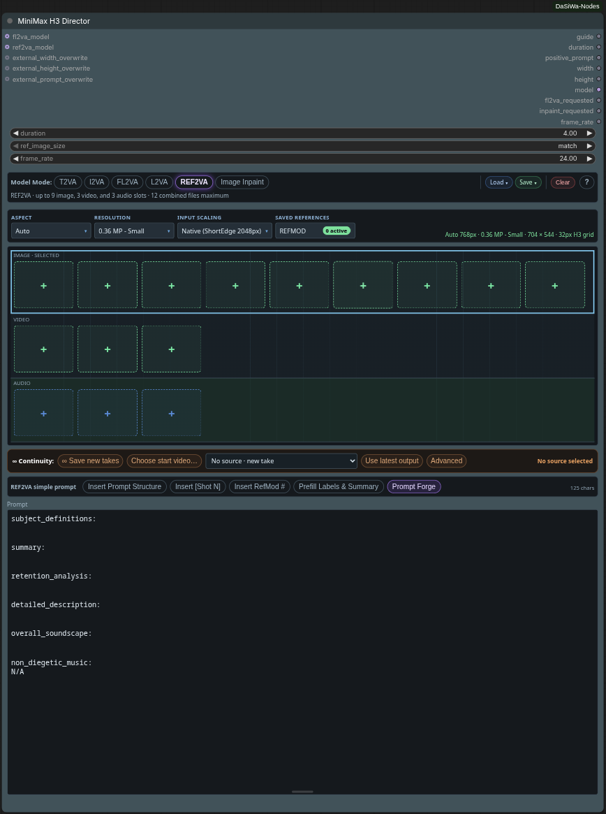
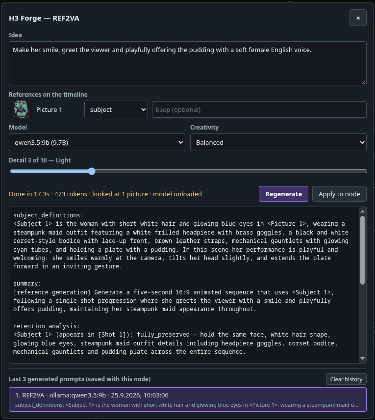
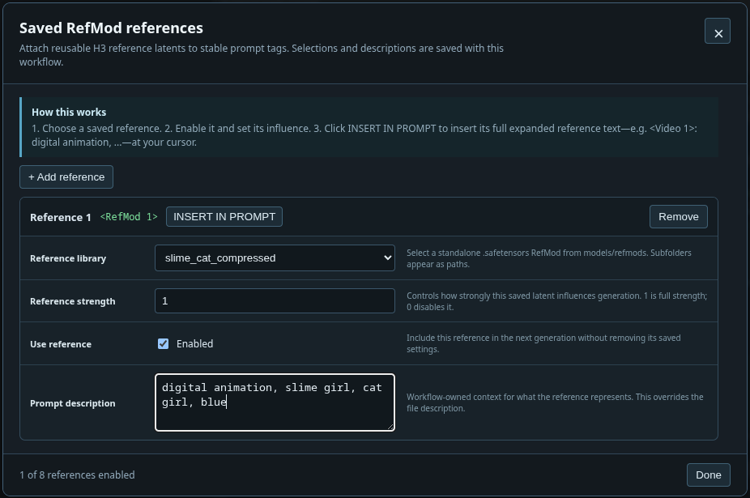

- 🎥 **H3 modes:** T2VA/I2VA/L2VA/FL2VA in the two-image endpoint family (first/last-frame interpolation); REF2VA (9 images, 3 videos, 3 audio files; 12 total); Image Inpaint (one image → single output frame via a 5-frame pass).
- 🖼️ **Reference Director:** separate image/video/audio lanes; drag-reorder slots, per-media prompts, external soundtracks, embedded-video V/A/V+A switch; incompatible media retained when changing modes.
- 📋 **Media input:** lane-selected Ctrl+V, file-manager drag-and-drop, paste-replace on a selected tile; first-frame video thumbnails and audio waveforms.
- ⏱️ **Reference trims:** draggable crop markers and preview range, ▶ Play crop; 2–15s per reference window and ≤15s combined visual / ≤15s combined audio, with input-path validation.
- 📸 **RefMods:** image/video/audio files and upstream v5 bundles from `models/refmods/`; overlay selection, strength scaling, workflow-local descriptions, runtime `<RefMod N>` → native-label resolution.
- ✍️ **Prompt editor:** one free-text field per mode; optional structure, shot/RefMod insertion and reference-label prefill; legacy prompts migrate into that field.
- ✨ **Prompt Forge:** review/apply H3 drafts from `models/llm`, Ollama or an OpenAI-compatible server. REF2VA picture labels define characters, places, styles and frame/pose/custom references; image-only labelled drafts need no writer vision, while mixed references retain the full REF2VA path. Choose Auto or 1–5 shots with optional per-shot descriptions; continuity retains vision context and inherited definitions. [Model setup and limitations →](docs/minimax_h3_director.md#prompt-forge-optional).
- ♾️ **Continuity (opt-in):** extend a completed 24-fps H3 video/audio take from a pinned latent checkpoint; Duration controls added seconds, new-take capture is opt-in; separate next-action prompt, explicit source advancement, optional Forge draft. [Wiring and limits →](docs/h3_continuity.md).
- 📐 **Smart resolution:** Auto/custom aspect, resolution and megapixel presets; input scaling via Torch Resize (Off/Auto/Target/Fit/Fill/Fit+pad/Divisible crop).
- 💾 **Save/Load packs:** reference files, prompt and RefMod selections; append/overwrite with mode-limit and missing-file checks.
- 🧩 **Native H3 routing:** Director + Guide forward to built-in H3 nodes; selected-model lazy loading and name-bound REF2VA inputs; optional prompt and width/height overwrite sockets.
- 🎞️ **Frame rate:** 0.1–240 FLOAT input (default 24) and matching output for downstream nodes; Image Inpaint outputs a still.
- ⚡ **Optional performance node:** MiniMax H3 Cache patches the connected model; cache storage supports CUDA/CPU fallback. It is a separate node, not a Director mode.
- 💎 **Optional output processing:** RTX Upscaler & Refiner offers denoise/deblur/VSR upscale with frame-by-frame memory control; Watermark Overlay adds branding; Enhanced Video Combine encodes/muxes audio, previews output and optionally exports first/last PNG frames to ComfyUI Assets. Wire these downstream as needed; H3 latent upscaling is not shipped.

[Full documentation, UI guide, and prompting reference →](docs/minimax_h3_director.md)

---

### ⚡ MiniMax H3 Cache

An approximate, model-scoped whole-block-stack residual cache for ComfyUI's native MiniMax H3 model.

- **MODEL PATCH:** clones only the connected MiniMax H3 `MODEL`; no global model-class monkey patch.
- **CONTROLLED REUSE:** sampled audio/video-token relative-L1 threshold, 15–90% sampling window, and a bounded number of consecutive cache hits.
- **STORAGE:** auto / CUDA / CPU cached-residual storage with CPU fallback if automatic storage runs out of VRAM.
- **COMPATIBILITY:** preserves ComfyUI block replacements, transformer options, and model-scoped optimized-attention overrides.
- **PDD HEAD BANK:** works with ComfyUI's PDD LoRA head bank (0.34+). The node passes the PDD sigma-schedule arguments automatically, so cache and PDD coexist with no extra setup.
- **PER-TOKEN MASKS:** honors per-token video and audio denoise masks, running masked rows at their own strength exactly like Core, so cached and region-masked generations match Core quality.
- **QUALITY:** approximate optimization—higher cache thresholds trade fidelity for more skipped block-stack evaluations.

[Full documentation, usage, compatibility, and provenance →](docs/minimax_h3_cache.md)

---

### 🏷️ Lable (DaSiWa)

Workflow-only labels for the classic canvas and Nodes 2.0. Add **Lable (DaSiWa)** from **DaSiWa / utilities**, then double-click it to edit.

- Font previews, alignment, rotation, independent text/background opacity, and sliders with editable numbers.
- 48 color swatches, RGB picker, editable HEX values, and a screen-eyedropper icon. Native ComfyUI node colors respect label opacity.
- Embedded PNG/JPEG/WebP images: auto-scaled background, floating beside text, or above/below text. Images travel with saved workflows.
- Drag, resize, fit to text, and pin/click-through. No rgthree dependency, server route, or execution node.

[Full documentation and compatibility →](docs/lable.md)

---

### ♾️ Seamless Loop

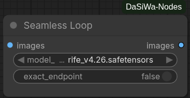

One `IMAGE` batch in, one `IMAGE` batch out. A native RIFE/FILM safetensors combo selects a checkpoint from `models/frame_interpolation/`.

- Automatic trim/overlap selection using PSNR/MSE, local SSIM, edges, temporal differences and exposure analysis.
- Bidirectional native interpolation, eased overlap morphing and bounded local color correction; original middle frames remain unchanged.
- `exact_endpoint` is off by default for continuous cyclic playback; enable it only when identical first/last pixels are required.
- No additional dependency. Output duration can change; audio must be aligned downstream.
- Visible seams may remain with incompatible motion or scene changes; residual temporal discontinuities are logged.

[Usage, model compatibility and references →](docs/seamless_loop.md)

---

### 💎 RTX Upscaler & Refiner

NVIDIA RTX Video SDK enhancement with Denoise, Deblur and VSR/High Bitrate upscaling. Processing uses bounded frame windows and produces one standard ComfyUI `IMAGE` batch.

- **Refine:** Independent Denoise and Deblur passes (both off by default).
- **Upscale:** AI-powered VSR and High Bitrate upscaling.
- **Smart Sizing:** Multiple resize modes including Constant Megapixel targets.
- **Efficiency:** Internal `chunking` (on, 16 frames by default) bounds processing intermediates; the final output remains a single `IMAGE` batch.
- **Lossless output storage:** `lossless_fp16` (on by default) uses FP16 only if every output value round-trips exactly and memory headroom permits; typical VSR output remains FP32.
- **Memory Control:** Full input and output batches still scale with video duration and may be cached by ComfyUI; internal chunking is not constant-memory streaming. The output is allocated lazily in VRAM or RAM. Optional `use_mmap` enables a disk-backed last resort (off by default); `auto_unload_models` is on by default.

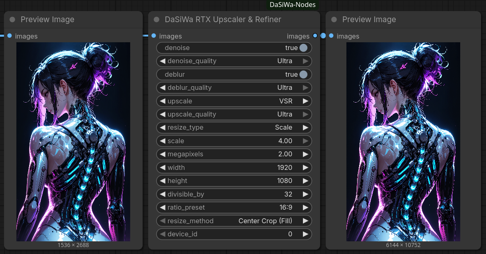

[Full documentation →](docs/rtx_upscaler_refiner.md)

---

### 📐 Resolution Scale Calculator

The **DaSiWa Scale Calculator** provides mathematically precise resolution management for high-performance video models. It uses a **Constant-Area Square-Root method** to ensure that your GPU VRAM usage remains stable regardless of the aspect ratio.

- **Unified Resolution Presets:** Pick standard `p` targets from 144p to 2160p/4K or optimized megapixel tiers from one dropdown.
- **Clear Aspect Modes:** `IMAGE ASPECT` uses the connected image shape; `USE ASPECT BELOW` uses the always-visible aspect controls.
- **Video-Safe Snapping:** Standard, Div32, Div64, and custom divisor modes keep dimensions aligned for different model families.

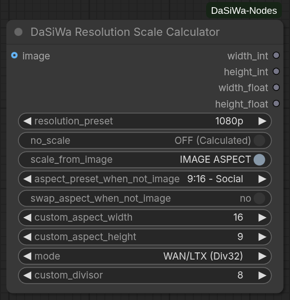

[Full documentation →](docs/ResolutionScaleCalculator.md)

---

### ⚡ Torch Resize

A drop-in replacement for ComfyUI's built-in resize nodes that keeps images sharp and video workflows fast without extra dependencies.

- **Sharper results:** Lanczos resampling with optional sRGB-to-linear gamma correction produces cleaner upscaling and downscaling than native bilinear/bicubic.
- **Video-friendly batching:** Automatically splits long frame sequences into memory-safe chunks so you never run out of VRAM, while keeping output order intact.
- **Zero extra installs:** Runs entirely on the PyTorch build ComfyUI already uses — no Pillow, torchlanc, Triton, or vendor SDK required.
- **Precise sizing control:** Divisible-by alignment, five aspect modes (fit, fill/crop, pad, stretch, long-side crop), and configurable crop/pad placement eliminate guesswork for downstream model constraints.
- **Alpha preserved:** Transparency channels are resized independently without gamma conversion artifacts.

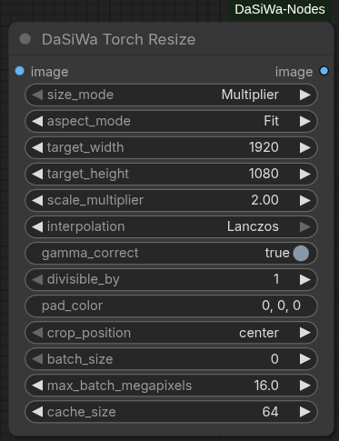

[Full documentation →](docs/torch_resize.md)

---

### 🎛️ Node Status Switch

The **DaSiWa Node Status Switch** lets you mute or bypass any node in your workflow using a single toggle. Targets are registered by wiring their outputs into the switch's input slots, which grow dynamically as you connect more nodes (up to 99).

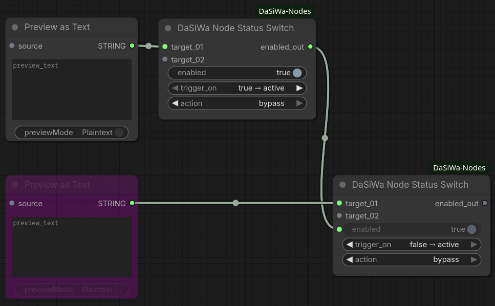

[Full documentation →](docs/node_status_switch.md)

**Quick start:**

1. Add a **DaSiWa Node Status Switch** to your workflow
2. Drag any **output** from the node(s) you want to control into the switch's `target_01` input — new slots appear as you connect more
3. Set `action` to `mute` or `bypass` and configure `trigger_on` to taste
4. Toggle `enabled` directly on the switch

---

### 🎬 Advanced LoRA Loader

The **Advanced LoRA Loader** is a 10-slot stacker for ordinary image/video LoRAs and LTX-2.3. In **Basic mode**, it loads the complete LoRA map, so it is compatible with standard image and video models. Its `VIS` control means **visual strength**: it affects the whole LoRA map in Basic mode, including image models. LTX-2.3 additionally supports independent audio separation.

- **Model Modes:** Select Basic for universal image/video compatibility or LTX-2.3 for separate visual/audio branches. MiniMax H3 uses Basic mode because its transformer blocks are shared between video and audio.
- **Visual Control:** `STR × VIS` is the effective visual strength. In Basic mode, `VIS` controls the complete LoRA map; it is not video-only.
- **Dual-Branch Control:** LTX-2.3 can adjust visual (`VIS×`) and audio (`A×`) multipliers independently per LoRA.
- **10 LoRA Slots:** Stack up to 10 LoRAs with fine-grained strength control (STR: −5.0 to +5.0).
- **Toggle All:** The `ALL` header button enables every slot; when all slots are enabled, it disables every slot.
- **Key Count Indicator:** Auto-scans each LoRA to show video/audio key counts before generation.
- **6 Themes:** Switch between Jade, Neon, Studio, Chrome, OLED, and Wood color schemes.
- **Searchable UI:** Quick LoRA search with live filtering in the node itself.
- **LoRA Info Button (ⓘ):** an info button at the right edge of each slot row (drawn as a circle with an "i") opens an info panel with the LoRA's Civitai links — looked up by the file's SHA-256 and cached in `lorainfo/` — shown as both mirrors, `.com` (labeled `BLUE:` in blue) and `.red` (labeled `RED:` in red); the lookup falls back to the `.red` mirror when `.com` has no entry, and misses are memoized so a missing LoRA doesn't re-hit the API on every open (**Refresh** forces a re-lookup). The panel also lists trigger/trained words from the safetensors header and Civitai (click-select, copy) and preview images (Civitai plus a local sidecar image next to the LoRA if present). The file name and sha256 sit on their own rows at the top, so long folder paths can't stretch the controls (v0.4.35).
- **Trash Button (v0.4.29):** a small ASCII-drawn trash button sits directly right of the info button. It resets that slot's LoRA back to **None** (STR / V× / A× kept — same as picking None in the picker) so you can unstack a LoRA without reopening the picker. The info button shifted slightly left to make room.
- **PDD/ACC Metadata (v0.4.27):** LoRA files are read with their metadata and it is forwarded to Core's `load_lora_for_models` like the native `LoraLoader`, so PDD/ACC head banks activate; older ComfyUI builds fall back automatically.
- **Opt-in LoRA Cache (v0.4.27):** a cache button in the control strip keeps each unique LoRA file in a small LRU cache so a LoRA reused across slots is read once — **off by default**.

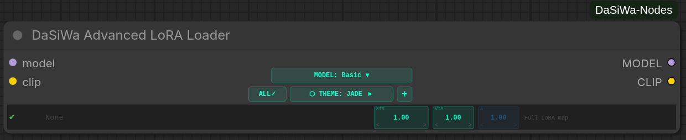

[Full documentation →](docs/advanced_lora_loader.md)

---

### 💾 Metadata Image Saver (Civitai Ready)

The **DaSiWa Metadata Image Saver** ensures your images are fully compatible with Civitai, Hugging Face, and other galleries by embedding A1111-style metadata. It automatically detects LoRAs used in the workflow and supports dynamic filenames.

- **Civitai Compatibility:** Writes the standard `parameters` block for auto-parsing of prompts and resources.
- **LoRA Detection:** Scans your workflow and appends `<lora:name:weight>` triggers automatically.
- **WebP Support:** Full "Drag-and-Drop" workflow reconstruction support for both PNG and WebP formats.
- **Dynamic Filenames:** Use placeholders like `%seed%`, `%date%`, `%model%`, `%width%`, and `%height%`.
- **Privacy:** Toggle workflow JSON embedding to share images without exposing your full graph.

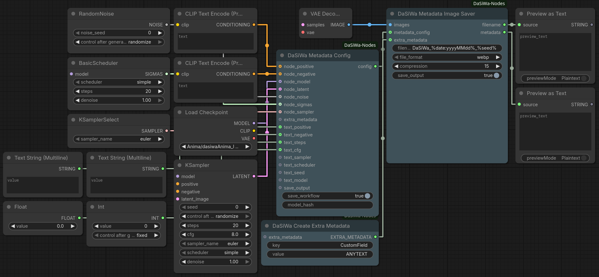

[Full documentation →](docs/metadata_image_saver.md)

---

### 🎞️ Enhanced Video Combine

Converts an `IMAGE` batch into a high-quality video with optional `AUDIO` muxing and an in-node VHS-style preview.

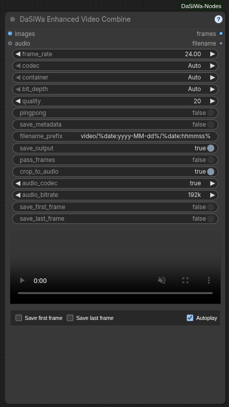

- **Codecs:** Auto (AV1 → VP9 → H.264), or explicit AV1 / VP9 / H.264 / H.265(HEVC). Hardware-first encoder chain (NVENC → QSV → AMF → VAAPI → software); mandatory H.264/MP4 fallback.
- **PyAV-native encoding (v0.4.40):** Encoding, audio muxing, metadata, animated outputs, and preview transcoding run through PyAV 18 and its bundled FFmpeg libraries without launching external processes. Hardware encoders are tried first and failed or unavailable devices fall back to software encoders.
- **Seekable previews (v0.4.40):** Every generated video receives one-second keyframes. MP4 outputs use fast-start metadata. AV1, VP9, HEVC, 10-bit, and other compatibility previews are cached as ordinary H.264/AAC files served with HTTP byte-range support, so browsers can pause and scrub reliably. Downloads remain the unchanged original codec/container.
- **Containers:** Auto-selects per codec (WebM/MKV/MP4 for AV1/VP9; MP4/MKV for H.264/H.265).
- **Animated images:** Animated AVIF (GPU AV1 or software) and Animated WebP (`libwebp_anim`). Looping, no audio.
- **Bit depth & quality:** Auto-detects 8-bit vs 10-bit source precision; Auto codec forces 8-bit 4:2:0. CRF/CQ-based quality slider (default 20).
- **Audio muxing:** Opus/AAC/MP3 selectable; Auto uses Opus (WebM) or AAC (MKV/MP4). Bitrates 64–320k. Optional crop-to-audio.
- **In-node preview:** Framed player with native hover-reveal controls and hover-to-unmute audio; an optional Mute checkbox keeps the preview permanently silent, and both Autoplay and Mute are remembered with the node. Streamed H.264 transcoding for AV1/H.265 where needed.
- **Frame exports:** Save first/last frame as PNG alongside the video; all assets published to ComfyUI Assets.
- **Ping-pong mode:** Forward/reverse frame loop.
- **Workflow metadata:** Embed prompt/workflow JSON where supported.
- **Output naming (v0.4.45):** Connect a seed to the optional `seed` socket and use `%seed%` in `filename_prefix` (for example `video/%date:yyyy-MM-dd%/shot_%seed%`) to include the exact generation seed in the video and first/last-frame export names.
- **Logging:** Compact CLI output with codec/container/encoder decisions and resolved audio settings. Built-in `?` help dialog.

[Full documentation →](docs/enhanced_video_combine.md)

---

### 🎬 Watermark Overlay

A professional-grade watermark tool optimized for image and video batches. It uses a stable CPU compositor with high-quality resampling and precise rotation.

- **Dynamic Random Positioning:** Toggle seeded corner cycling while keeping the selected position as the start position.
- **Splash Mode:** Configure dynamic fade-in and fade-out at the start and end of clips for professional branding.
- **Optical Padding:** Automatically adjusts placement by the watermark's visual center of mass for perfect alignment.
- **Stable Compositing:** Output frames are initialized from the source batch before the watermark region is blended, avoiding flicker and black-frame artifacts.

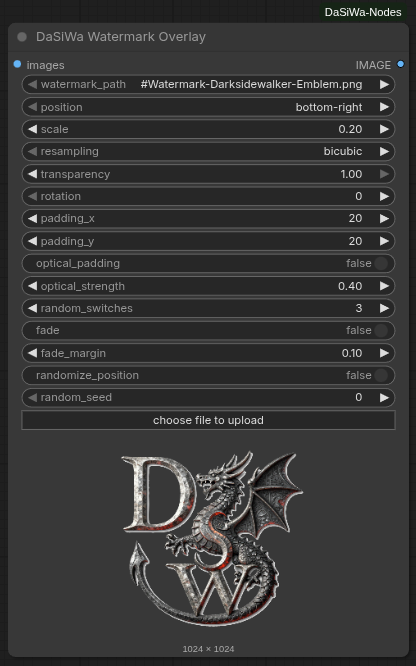

[Full documentation →](docs/watermark.md)

---

### 🩹 Inpaint Crop Prep & Composite

A two-node crop-inpaint-composite pair for any inpainting model. **Inpaint Crop Prep** tight-crops to the mask and scales it for a high-res inpainter; **Inpaint Composite** blends the result back onto the original image.

- **Crop Prep:** Gaussian-blurs the mask, extracts its bounding box (with configurable `grow_px` padding), crops image + mask, and bicubic-scales both to `target_width` × `target_height`. Emits `cropped_image`, `cropped_mask`, and the original-space `bbox_x/y/w/h` so you can composite back. `can_shrink` (default on) allows downscaling; turn it off to keep the crop at least its native size.
- **Composite:** pastes the inpainted `source` patch back at `(x, y)` with the (auto-rescaled) mask, applying optional **Match Channels** or **Histogram** color correction against the destination region for a seamless blend.
- **Pure PyTorch:** separable Gaussian blur, bicubic resampling, and channel-statistics color matching with no torchvision or extra dependencies.

Wiring:

```text
IMAGE + MASK ──► Inpaint Crop Prep ──► (cropped_image, cropped_mask)
                                     ──► any inpainter ──► source patch
IMAGE ───────────────────────────────────────────────┐
                                                     ▼
                                  Inpaint Composite (x, y, w, h from Crop Prep)
                                                     │
                                                     ▼
                                                   IMAGE
```

---

### 🖥️ System Monitor

A compact telemetry bar that defaults to its own row below ComfyUI's top controls; switching to Ultra compact docks a small card on the right.

- **Multi-GPU Support:** Separate metrics per GPU device (NVIDIA, AMD, Intel) labeled as GPU0, GPU1, etc.
- **Resource Metrics:** CPU, RAM, SWAP/Pagefile, DISK, GPU Utilization, GPU VRAM, and GPU Temperature.
- **Visual Feedback:** Color-coded borders and proportional background fills (0–100%) for instant at-a-glance assessment.
- **Lite / Ultra compact / Full Modes:** Lite defaults to a top toolbar row; Ultra compact switches to a right-docked card with every enabled metric visible; Full shows detailed values and live 60-second graphs.
- **Resizable Lite Bar:** Drag its corner horizontally; meters keep their size and wrap into new rows as the bar narrows. Reset to the default Lite bar from its menu.
- **Dock or Float:** The default is a separate top row; Ultra compact switches to the right. Either mode can then be docked elsewhere or floated. Placement and Lite width persist across reloads.
- **Viewport-Aware Menu:** The settings menu opens toward available screen space; separate background and drawing/text/lines opacity sliders are also available in ComfyUI Settings.
- **Cross-Platform:** Works on Linux and Windows with automatic fallback detection for GPU tools.
- **Container-safe:** In containers and sandboxes where parts of `/proc` are missing (e.g. `/proc/vmstat`), probes degrade to `n/a` instead of warning every second. Set `DASWA_SYSTEM_MONITOR=0` (also `false`/`no`/`off`/`disable`) to fully stop the backend polling thread.
- **Free Memory Button:** Separate DaSiWa-logo button stays beside the top controls regardless of monitor placement. Free VRAM unloads ComfyUI models; Free System RAM also resets its execution cache. Hide it independently under **Settings → Other → DaSiWa → Free Memory**.

**Lite mode**


**Full mode**


**Ultra-Compact mode**

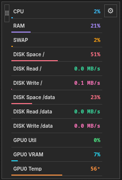

[Full documentation →](docs/system_monitor.md)

---

### 🔀 Random String Picker

Bridge any string/text node through **DaSiWa Random String Picker** to randomize prompt variants inline.

- **Text passthrough:** Accepts a connected `STRING` input and returns a `STRING` output.
- **Inline variants:** Replaces every `{A|B|C}` segment with one randomly selected option.
- **Multiple groups:** Processes any number of groups independently, such as `{red|blue} car in {sun|rain}`.
- **Literal passthrough:** Text outside complete `{...}` groups is left unchanged.

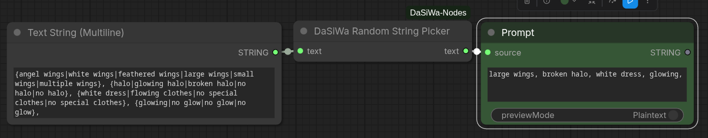

[Full documentation →](docs/random_string_picker.md)

---

### 🎯 Seed Control

**Seed Control** extracts the MiniMax H3 Director's seed panel into a standalone node — the same seed UX for any workflow, without a Director in the graph.

- **Full 64-bit seeds:** unsigned `0..0xFFFFFFFFFFFFFFFF` seed field, matching the H3 seed space.
- **Random|Fixed switch:** one segmented switch (a single control, Pixaroma style) — Random rolls a fresh seed on every queue, Fixed keeps the current seed for repeatable results; **New** rolls a fresh seed and keeps the selected mode, **Use Last** restores the previous seed and flips to Fixed. Stepping, typing, and the switch all lock the seed as Fixed.
- **Stacked layout:** seed field with an attached ▲/▼ spinner (Pixaroma seed control style; hold to repeat, wraps at the 64-bit bounds) on its own row, then the Random|Fixed switch + New, then Use Last / Last 10 seeds. The panel column has a fixed width (~240 px) and every row is the same 42 px cell height, so resizing the node never stretches or reflows the fields. The seed number auto-fits its font (shrinks as needed) so a full 16-digit seed always displays without clipping.
- **Lossless 64-bit seeds:** the panel keeps the seed as a decimal string and only *mirrors* it into the hidden INT widget (which coerces 16-digit values to a lossy JS number), so the spinner and display never desync at the top of the 64-bit range.
- **Last 10 seeds:** collapsible history with per-entry copy actions.
- **External override socket:** linking `seed` disables the local controls (showing an "External seed connected" note) and passes the connected value through — same semantics as the Director's external seed input.
- **Downstream NOISE output:** the `seed` INT and a `NOISE`-compatible object are emitted, so the value can be passed straight to any node that accepts a `NOISE` input (e.g. the LTX sampler's `noise` socket).
- **Headless-safe:** in Random mode without a local value the backend rolls a fresh seed on every queue, so API clients get the same behaviour without the DOM panel.
- **Persists with the workflow:** mode, last seed and history live in a hidden state widget and survive save/reload.

[Full documentation →](docs/seed_control.md)

---

### 🎲 Wildcard & Preset Prompt Builder

**DaSiWa Wildcard & Preset Prompt Builder** builds positive and negative `STRING` prompts directly from the bundled dual wildcard library—no downstream picker node needed.

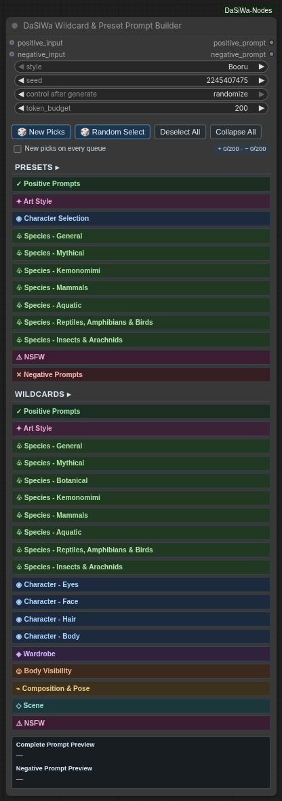

- **Dual style:** Switch globally between Booru and Natural Language source keys.
- **Compact selector:** Collapsible categories expose subject checkboxes, weights, deterministic live selections, and right-aligned selected-subject counters that remain visible while a category is collapsed.
- **Fast inspiration:** **Random Select** replaces the current selection with 1–10 secure-random available Preset/Wildcard subjects.
- **Reproducible rerolls:** Seed plus the stored reroll value reproduce every `{A|B|C}` choice; **New Picks** only advances the reroll value, while **New picks on every queue** opts into fresh output for each queue—including Preview as Text selected-output execution.
- **Weighted, bounded prompts:** Non-1.0 enabled subjects use ComfyUI emphasis syntax. Each positive/negative prompt independently removes complete lowest-weight subjects until it meets the token budget.
- **Optional prompt prefixes:** Connect `positive_input` or `negative_input` to prepend an existing prompt to that generated side.
- **Custom library:** Edit or replace `data/wildcards_and_presets_dual.json` with a compatible library; no checksum sidecar or pinned data version is required.

[Wildcard & Preset Prompt Builder documentation →](docs/wildcard_preset_prompt_builder.md)

---

### 🧠 LLM / VLM Analyze

The **DaSiWa LLM / VLM nodes** let you run local transformers chat or vision-language models from inside a ComfyUI workflow. They accept native `STRING` inputs and native `IMAGE` batches from nodes such as Load Image or VHS frame loaders.

- **Native ComfyUI Inputs:** Analyze connected text, still images, or video/image-sequence frame batches.
- **Prompt Presets:** Custom system instructions, existing LTX-2.3/Wan2.2 and caption presets, plus PromptForge-backed H3, Wan 2.2, LTX, Krea2, Anima and Illustrious rewriting. Returns the model's primary prompt without segment scaffolding; legacy preset instructions remain unchanged.
- **Memory Modes:** Keep models cached for speed, or use full cleanup to unload DaSiWa and ComfyUI managed models before/after analysis so later image/video models recover VRAM/RAM.
- **Frame Sampling:** Limit video analysis with max frames, stride, frame strategy, resize controls, context limits, and optional KV-cache reduction.
- **Local and External Models:** Load already-installed Transformers folders or GGUFs, keep the legacy loopback Ollama mode, or use operator-configured OpenAI-compatible/Ollama servers. Endpoints and credentials stay outside workflow JSON; runtime downloads and custom remote model code remain disabled. The Director and LLM nodes share backend implementations without changing Director settings or workflows.

[Full documentation →](docs/llm_nodes.md)

---

## 🛠️ Installation

### Manual install

1. Activate your venv inside your ComfyUI folder
2. Clone this repo into your `custom_nodes` folder:
   ```bash
   git clone https://github.com/darksidewalker/ComfyUI-DaSiWa-Nodes
   ```
3. Install all dependencies:
   ```bash
   pip install -r requirements.txt
   ```
4. **Requirement:** NVIDIA RTX GPU with drivers 530+. (Windows users may need the NVIDIA Broadcast SDK; Linux usually works out-of-the-box with the pip package).
5. Restart ComfyUI.

### Use ComfyUI-Manager

Search for **DaSiWa-Nodes** and install.

### Repository contents versus local data

The repository ships `assets/` screenshots, `docs/`, `data/` starter libraries, `nodes/` and `js/`. The former example `workflows/` and in-repository test suites were retired; they are not part of the current package or its push workflow. A formerly bundled Spectrum v0.2.20 compatibility patch targeted a separate project, was never applied by this pack, and is no longer shipped.

Runtime files do **not** belong in the node pack repository: `lorainfo/` is a regenerable Civitai metadata cache; `.hermes/`, `.projectatlas/`, `graft/`, Python bytecode and test caches are local tooling state. H3 Continuity checkpoints live in the ComfyUI **output** directory at `output/df_h3_continuity/` (not beside `nodes/`); browser video previews live in ComfyUI's **temp** directory. The root-level `input/`, `output/`, `temp/`, `models/`, and `cache/` are ignored as safeguards if someone uses this checkout as a ComfyUI base directory. The `.gitignore` rules prevent *new* matching files being staged; they do not remove files already tracked or delete anyone's local files.

A commit on local or Gitea `main` does not automatically appear on the separate GitHub remote; publishing to each remote is a separate action.

---

## Credits

- The RTX implementation in this collection is based on the excellent work by [Deno2026/comfyui-deno-custom-nodes](https://github.com/Deno2026/comfyui-deno-custom-nodes).
- Lora-Loader is based on [Brojakhoeman/Loradaddyloaderltx](https://github.com/Brojakhoeman/Loradaddyloaderltx/tree/main).
- Ideas for Watermark Overlay are inspired by [Artificial-Sweetener/comfyui-WhiteRabbit](https://github.com/Artificial-Sweetener/comfyui-WhiteRabbit)
- MiniMax H3 Director was inspired by the LTX Director concept from [whatdreamscost](https://github.com/whatdreamscost)
- MiniMax H3 Director RefMod integration (saved person references, `.safetensors` latent format, strength scaling) is based on the design and file format established in [Luisacaotica/ComfyUI-MiniMaxH3Mod](https://github.com/Luisacaotica/ComfyUI-MiniMaxH3Mod). The DaSiWa implementation was contributed by [kasimalperenyavuz-design](https://github.com/kasimalperenyavuz-design) in [PR #45](https://github.com/darksidewalker/ComfyUI-DaSiWa-Nodes/pull/45). It is standalone — no runtime dependency on the upstream pack — but both can be installed side-by-side and share the same RefMod files in `models/refmods/`.
