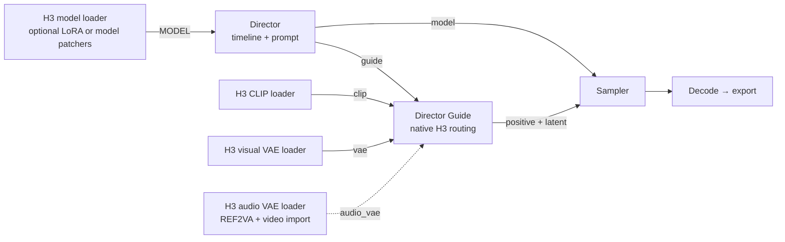
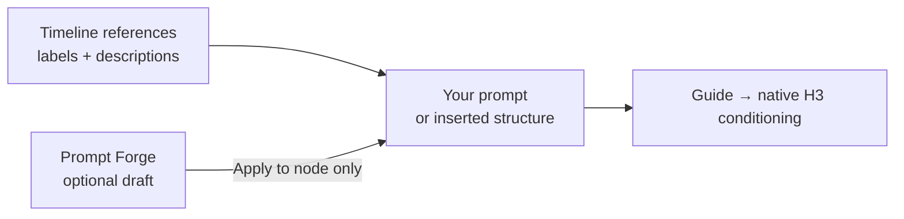
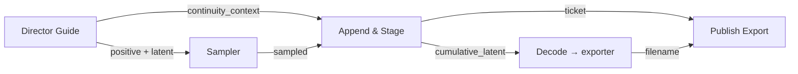

# MiniMax H3 Director

Build an H3 video in one place: arrange references on a timeline, trim them, write a prompt, and choose a canvas. **Director** prepares the inputs; **Director Guide** checks them and calls ComfyUI's native H3 nodes. You do not wire the native image-to-video or reference-to-video nodes separately.

[Collection changelog](news_and_changelog.md#minimax-h3-director-v1) · [Continuity guide](h3_continuity.md)

## Start here

1. Install the pack's dependencies (`pip install -r requirements.txt` in ComfyUI's Python environment), restart ComfyUI, and use a ComfyUI build with native MiniMax H3 support.
2. Add **MiniMax H3 Director** and **MiniMax H3 Director Guide** from `DaSiWa/MiniMax H3`.
3. Pick a mode, add media to the appropriate lane, set Duration and canvas, and write a prompt. Connect the matching model to Director, and CLIP and visual VAE to Guide. REF2VA also needs an audio VAE.
4. Connect Guide's conditioning and latent to your normal sampler/decode/export path. The Director forwards the selected model to that sampler path.

| Requirement | Where it goes | When needed |
| --- | --- | --- |
| H3 diffusion `MODEL` | Director `fl2va_model` | T2VA, I2VA, L2VA, FL2VA, Image Inpaint |
| H3 diffusion `MODEL` | Director `ref2va_model` | REF2VA |
| H3 text encoder / `CLIP` | Guide `clip` | Every mode |
| H3 visual `VAE` | Guide `vae` | Every mode |
| H3 audio `VAE` | Guide `audio_vae` | REF2VA; also importing an ordinary video for continuity, even if silent |
| Optional RefMod files | `ComfyUI/models/refmods/` | REF2VA saved references; no other node pack required to read them |
| Optional Prompt Forge model | `ComfyUI/models/llm/`, Ollama, or OpenAI-compatible server | Only for AI-assisted prompt drafts |
| Optional continuity nodes | After sampling and after export | Only to save checkpoints or extend a source; see [wiring](h3_continuity.md#wiring) |

Only the active Director model socket is requested (lazy loading). A LoRA loader, MiniMax H3 Cache, attention patcher, or model preview override may feed that socket **before** Director. Do not loop Director's model output into its own upstream loader. External width and height overwrite sockets must both be connected; they override canvas calculations and input scaling. `external_prompt_overwrite` accepts a nonempty external prompt for ordinary generations. `frame_rate` defaults to 24, accepts 0.1–240, and is also an output; continuity uses its own native timing constraints.

## Choose a mode

| Mode | Use it for | References |
| --- | --- | --- |
| T2VA | Text to video | None |
| I2VA | Start from an image | First-frame image |
| L2VA | Finish at an image | Last-frame image |
| FL2VA | Start and/or finish at an image | Up to two endpoint images; zero works as text-only |
| REF2VA | Borrow identity, style, motion, composition or sound | Up to 9 images, 3 videos, 3 audio clips; 12 files total |
| Image Inpaint | Edit/refine a still | Exactly one image, no video/audio; native five-frame pass yields one output frame (use Get Image from Batch) |

Endpoint modes accept images only. Switching modes hides incompatible timeline items rather than deleting them; switching back restores them. T2VA does not use those hidden references. REF2VA audio needs at least one visual reference. Each reference video/audio crop must be 2–15 seconds; combined visual video length and combined audio length must each stay within 15 seconds. The Director reports violations in its node status before native execution.

## Work in the timeline

Choose the Image, Video or Audio lane, then use **+**, drag/drop or paste (Ctrl+V). Media is saved under ComfyUI's `input/` folder. Click a tile to edit its description, trim or remove it; drag to reorder. Pasting onto a selected tile replaces it without moving its slot. Video tiles show a first-frame thumbnail, and audio tiles show a waveform. Video and audio crops have draggable endpoints and a crop-play preview.

For a REF2VA video tile, choose **V** (frames), **A** (embedded sound), or **V+A** (both). An attached soundtrack shares its video's trim. Audio gets its own `<Audio N>` label; image, video and audio labels are numbered within their type in timeline order. Use those labels consistently in your prompt.

**Load / Save** handles reference files, prompts, or both as a pack, with append/overwrite choices. Loading checks mode limits and missing files first. **Clear** removes the timeline, prompt and Forge draft history. The toolbar **Remove** acts on the selected tile.

### Canvas and input scaling

The Resolution panel offers Auto or custom aspect ratio and resolution. Auto aspect follows the first image/video; Auto resolution uses a 768-pixel short side. Presets snap to H3's 16-pixel grid. Input scaling affects visual references, not audio:

| Setting | Effect |
| --- | --- |
| Off | Keep the input tensor as-is |
| Auto | Downscale only if needed to a 2048-pixel short side; never enlarge smaller inputs |
| Target - Selected Aspect & Resolution | Stretch to the selected canvas |
| Fit / Fill and crop / Fit and pad / Long side with divisible crop | Use the corresponding Torch Resize behavior against the canvas |

## Write a prompt

There is one editable prompt field. Write freely, or click **Insert Prompt Structure** for mode-appropriate H3 headings. **Simple / Structured** controls how older builder content is assembled and is saved with the workflow. **Insert [Shot N]** adds a shot marker. In REF2VA, **Prefill Labels & Summary** fills reference labels and descriptions without inventing visual/audio details; check its proposed roles and finish the actual action yourself.

Use `[Shot 1]` for the start and `[Shot 2] At 00:04.500` for a later cut (target-video time, not source time). For endpoint images, state how `<Picture 1>` at 0 seconds and, if present, `<Picture 2>` at the end align with the target video. The base structure uses `integrated_multimodal_description`, `overall_soundscape`, and `non_diegetic_music`.

REF2VA's optional structure has six headings: `subject_definitions`, `summary`, `retention_analysis`, `detailed_description`, `overall_soundscape`, `non_diegetic_music`. Use `<Subject N>` for who/what appears, `<Picture N>` for concrete frame anchors, `<Video N>` for structural pacing/editing, and `<Audio N>` for sound references. Describe transferred appearances or motion under Subjects. Retention terms include `fully_preserved`, `partially_preserved`, `attribute_transfer`, `weak_reference` (visual) and `fully_copy`, `partially_copy`, `reference`, `weak_reference` (audio). For example, distinguish “At 00:05.000 in the target video” from “near 00:02.400 in `<Video 1>`.”

For more prompt syntax, see MiniMax's [base prompt guide](https://huggingface.co/MiniMaxAI/MiniMax-H3/blob/main/docs/VIDEO_PROMPT_WRITING_GUIDE_base_en.md) and [full-reference guide](https://huggingface.co/MiniMaxAI/MiniMax-H3/blob/main/docs/VIDEO_PROMPT_WRITING_GUIDE_ref_en.md).

### Prompt Forge (optional)

Click **Prompt Forge**, enter an **Idea** (or **Next action** during continuity), choose a model, **Creativity** and **Detail** (1–10), then **Generate**. Review the draft and explicitly click **Apply to node**; generating alone does not change your prompt or queue a video. **Regenerate** makes another draft; Cancel/close stops an active request. The last three successful drafts are saved in this node's workflow properties, not reference packs. Choose one from history to preview it. A draft for another mode must be applied in that mode. **Clear history** leaves the applied prompt intact; Director **Clear** removes both.

**Canvas:** Forge receives the Director's current output width and height and derives the exact aspect ratio from those dimensions, not from reference images. Director dimensions take priority over conflicting format requests in the Idea. When external width/height overrides are connected, their runtime values are unknown to Forge, so it is instructed to omit aspect ratio and resolution rather than guess. Canvas changes invalidate existing drafts.

**Detail and Creativity:** Detail increases descriptive precision, not shot count or additional events. Low Creativity uses one continuous shot unless the Idea explicitly requests multiple shots. Medium Creativity permits small plausible surprises and only clearly motivated cuts; high Creativity permits unexpected events and optional creative cuts, not a cutting quota. Explicit single-shot/no-cut or multi-shot requests take priority. FL2VA still requires an explicit request for multiple shots; continuity remains uninterrupted at every Creativity level. These are model instructions, not a guarantee that every model follows them.

**Shots:** choose **Auto** or exactly **1–5** shots for a new clip. A selected count overrides shot counts in the Idea, Detail and guide examples. Each numbered shot has an optional description box; filled boxes join the Idea as `Shot N: ...`, and the boxes alone are sufficient to generate. Auto ignores these boxes; reducing the count excludes later boxes without erasing their session text. Successful drafts save their count and descriptions in history. Shots is hidden during continuity, which remains uninterrupted. A mismatched generated count produces a warning. Invalid cut timestamps at/past the clip end or before the previous cut are redistributed within the available gap; shot text is unchanged.

**Picture labels** (REF2VA): choose **Character**, **Several characters**, **Place**, **Style**, **First frame**, **Last frame**, **Pose**, or **Custom** for each timeline image. Pictures sharing a Character number describe one subject. Several characters specifies the supported two/three-character combinations and their left-to-right positions. In the Idea and shot boxes, name `Character 1`, `Character 2`, `the place`, or `picture 3`; Forge maps these names to native tags. Additional Character choices appear for larger reference sets so older separate references are not merged. Existing subject groups migrate to matching Character labels, including partially labelled groups. Labels, instructions and Keep / ignore travel with workflows and reference packs.

For new image-only labelled REF2VA drafts, the prompt model receives the cast and instructions, **not image pixels**. Mixed audio/video references or saved unlabelled references use the full REF2VA path, retaining their definitions and retention; vision-capable writers can then receive timeline pictures. Code writes subject definitions and retention from the labels and generated shots; the video model still consumes the references. Review identities, acting and retention before Apply. Pose transfers posture only; Custom requires instructions. Forge preserves reference appearance instead of inventing a visual medium. An English keyword heuristic warns about possibly unsolicited music but never deletes a score requested in another language or with an unlisted instrument. Repetitive output may be rejected as runaway text; the raw draft remains available for review.

| Forge source | Setup | Notes |
| --- | --- | --- |
| Local ComfyUI model | Chat-model directory or GGUF under `models/llm/` | `local:`; GGUF needs `llama-cpp-python`. Vision GGUF also needs its matching `mmproj` in the same model folder. Bare `.safetensors` is not a chat model. |
| Ollama | Running Ollama server with a downloaded chat/vision model | `ollama:`; defaults to `http://127.0.0.1:11434` |
| OpenAI-compatible | Server with `/v1/models` and streaming `/v1/chat/completions` | `openai:`; configure its base URL to enable it |

Set remote URLs in **ComfyUI Settings → DaSiWa → H3 Forge** (Ollama address or OpenAI-compatible server address); set the OpenAI-compatible API key there if required. Reopen Forge after changing a server or local model. The Director does not download models or launch servers. Local models unload after use; Ollama normally unloads too, while other servers may retain VRAM. Forge refuses a new generation while the workflow samples. For GGUF installation/build alternatives, see [LLM nodes](llm_nodes.md).

Forge uses the selected mode, Duration and reference instructions. REF2VA image labels also retain the compatible subject/style/keyframe/pose/custom role metadata used by continuity. Choose **pose** to transfer posture without automatically copying the reference person's identity, clothing or background. Use the optional **Reference instructions** box to specify exactly what to transfer; **custom** requires a description. **Keep / ignore** is an optional collapsed detail. These choices persist with the workflow and travel with saved reference-file packs. An **all** pack also carries verified media mappings; overwrite-loading it rebuilds them against the new timeline IDs and remaps surviving links automatically. Missing media links are removed with a notice. Legacy/manual and prompt-only packs retain their authored text, but their links are not silently treated as verified. Appending prompt text or replacing files alone invalidates ambiguous old links and reports this in the status. RefMod selections and settings also survive overwrite-loading; native links to RefMod members still require destination-library review, while `<RefMod N>` aliases remain intact. Only subject references join subject groups. First/last-frame roles in endpoint modes remain actual frame anchors.

For example, select **pose** and write “Use only the raised arms and stance; keep the target character's face, clothes and proportions.” Or select **custom** and write “Use the room layout and light direction, not the people.” In endpoint modes and continuity, vision models can see attached timeline pictures; new labelled REF2VA drafts use labels and instructions instead. Text-only models never see pixels. Saved RefMods contribute their descriptions, not decoded pictures; video and audio reference content is not analyzed. Prompt guidance is not dedicated skeleton/pose conditioning and does not guarantee a matching pose. During continuity, Forge also receives source-tail context and the next action; a changed source, Duration, mode or prompt invalidates an old draft. Applying only edits the continuation prompt.

### RefMods (REF2VA)

Put standalone or upstream v5 bundle `.safetensors` files in `ComfyUI/models/refmods/` (subfolders work). Open **REFMOD** beside Input Scaling, select a file, enable its row, adjust strength (0–1) and edit its description. Up to eight RefMod slots are supported, subject to REF2VA's final reference limits. The overlay is separate from the node; files load when opened. Workflow descriptions override embedded ones. An optional [ComfyUI-MiniMaxH3Mod](https://github.com/Luisacaotica/ComfyUI-MiniMaxH3Mod) installation can create compatible files, but is not needed for playback. This pack scales latents directly by strength rather than using upstream blur-mix behavior.

**Insert RefMod #** writes its expanded native `<Picture N>`, `<Video N>`, or `<Audio N>` label and description into the prompt. Saved `<RefMod N>` aliases still resolve at queue time. A v5 bundle expands to all members in order. Disabled/zero-strength rows contribute no reference; an unresolved alias is an error. Save/Load reference packs also preserve RefMod selection.

## Continue an existing video (optional)

Capture of new takes is **off by default**; enable **∞ Save new takes** before the initial generation if you want a checkpoint. Older active Continuity workflows migrate their saved added-frame count to Duration once, retaining next-action text and structured prompt definitions without moving action text into music. Later Duration edits remain authoritative. Save the workflow to retain migrated settings. [Older-workflow migration →](h3_continuity.md#loading-older-workflows)

Choose a completed checkpoint or ordinary video using **Choose start video…**. **Continuity Active** appears automatically; Duration now means *new* seconds, not total length. The source stays pinned until you change or clear it. **∞ Save new takes** saves fresh generations as checkpoints; continuations are saved regardless. Add **H3 Continuity • Append & Stage** after sampling and **H3 Continuity • Publish Export** after your actual exporter to publish only successful exports.

**Advanced → Keep REF2VA timeline references** is **off by default**. Continuation normally skips both endpoint-frame anchors and REF2VA timeline media so the pinned source tail drives the next segment. Turn this on if you intentionally want REF2VA image/video/audio references (and enabled RefMods) included during the continuation; it does not erase or change the saved timeline. The same switch is available directly in Forge as **Include timeline references**. When enabled, Forge sees the current reference instructions and a vision model also sees timeline pictures, separately from the chronological source-tail frames. **Structured REF2VA draft** is then selected automatically: existing definitions provide draft context and all six sections survive runtime continuation assembly. Template creation is in the Director's **Insert Prompt Structure** button during Continuity, not Forge: it retains the next-action text and carries existing definitions into the same editable prompt. New reference media still need their subject definitions authored or reviewed; Keep references alone does not describe a new character or scene. Video/audio reference content and RefMod pixels are not analyzed. For other modes, endpoint anchors remain skipped even when the option is on.

Advanced also provides preferred context, session resume/New session, refresh, and **Match source settings** for checkpoint mismatches. The selected source and settings live in the saved workflow; checkpoint files live in ComfyUI output. Ordinary-video import requires both H3 VAEs, including for silent video. See [H3 Continuity](h3_continuity.md) for exact wiring, duration rounding, limits, session behavior and resource costs.
