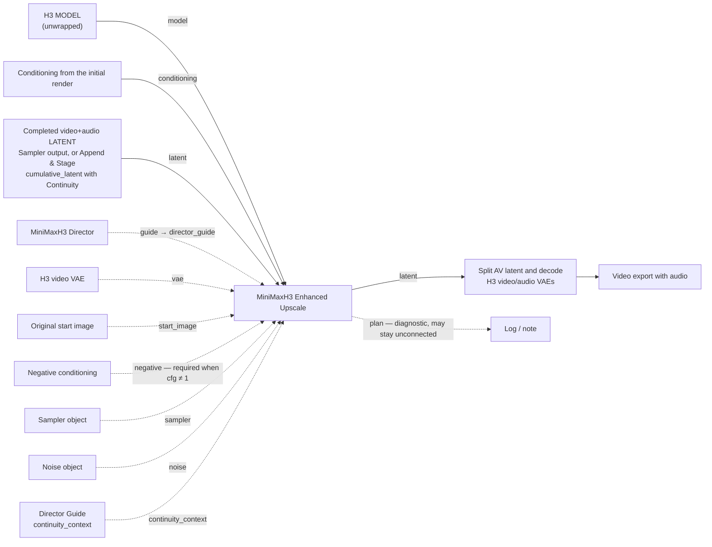
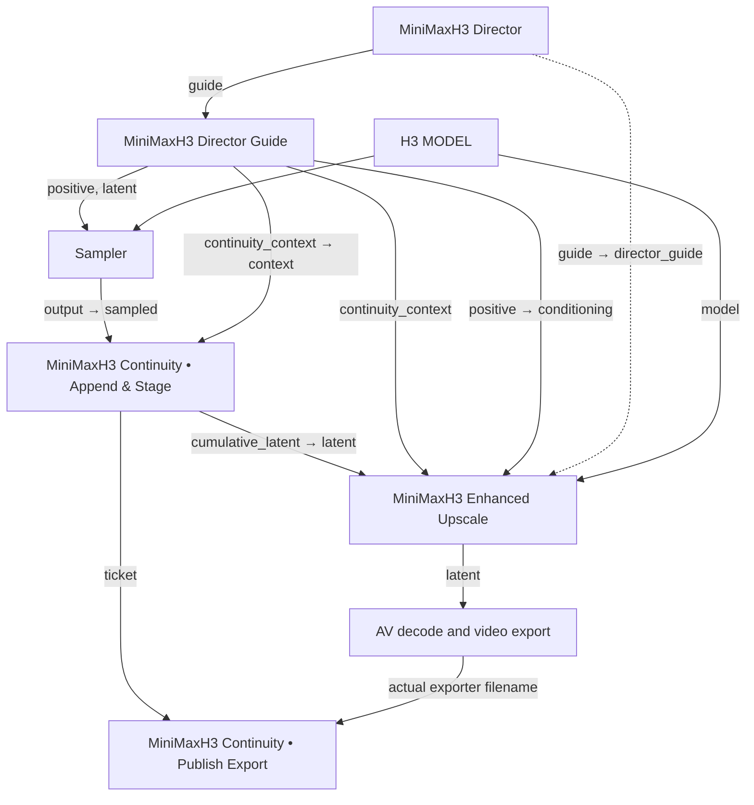

# MiniMaxH3 Enhanced Upscale

**MiniMaxH3 Enhanced Upscale** is one node for learned H3 latent upscaling and per-step spatial Tiled Diffusion. Temporal windows, overlap and tile geometry are planned internally. No parameter-helper nodes and no second Director are required.

Registered node type `DaSiWaH3TiledUpscale`, category **DaSiWa/MiniMax H3**. Saved workflows reference the node type, not the display name, so the display rename keeps every existing workflow valid.

## Wiring

Solid lines are the core path; dashed lines are optional.



Continuity take (assemble first, upscale once):



## Sockets

Required:

| Socket | Type | Widget / default |
| --- | --- | --- |
| `model` | `MODEL` | Connection. The same native, unwrapped H3 model as the initial render. |
| `conditioning` | `CONDITIONING` | Connection. The initial render's conditioning. |
| `latent` | `LATENT` | Connection. Native H3 packed video+audio latent (`[1,24,T,H/16,W/16]` video + `[1,32,2,A]` audio). |
| `scale` | FLOAT | Default **2.0**, range 1.0–8.0, step 0.1. Factor only; target = source × factor rounded to the 32-pixel grid. |
| `upscale_model` | combo | `interpolation` or a checkpoint filename from `models/latent_upscale_models/`. No automatic choice, no fallback. |
| `steps` | INT | Default **1**, range 1–100. |
| `denoise` | FLOAT | Default **0.2**, range 0–1, step 0.01. `0` skips diffusion entirely. |
| `seed` | INT | Default 0, full 64-bit range, generate-after-run supported. |

Optional:

| Socket | Type | Behavior |
| --- | --- | --- |
| `director_guide` | `MINIMAX_H3_DIRECTOR_GUIDE` | The Director's `guide` output. Endpoint images are re-encoded at target size (with `vae`). Image Inpaint guides are rejected. |
| `vae` | `VAE` | H3 **video** VAE. Required whenever endpoint pixels are supplied. |
| `start_image` | `IMAGE` | Full-resolution original start pixels; overrides the guide's first frame. |
| `negative` | `CONDITIONING` | Required when `cfg` ≠ 1. |
| `cfg` | FLOAT | Default **1.0**, range 0–20, step 0.1. |
| `sampler_name` | combo | Default `euler`. |
| `scheduler` | combo | Default `simple`. Sigmas are always generated internally from scheduler, steps and denoise; there is no external `sigmas` input. |
| `memory_budget_mb` | INT | Default 0 (automatic device-memory estimate), max 131072. Caps the planning budget, not the allocator. |
| `sampler` | `SAMPLER` | Overrides `sampler_name` when connected. |
| `noise` | `NOISE` | Overrides the internal seed-based noise when connected. |
| `continuity_context` | `DF_H3_CONTINUITY_CONTEXT` | The Director Guide's `continuity_context`. Enables cumulative-timeline continuation handling. |
| `upscale_precision` | combo | `auto` (default), `bf16`, `fp16`, `fp32`. Learned latent-upscaler only. |
| `continuity_soft_refine` | BOOLEAN | Default **off**. Active Continuity only. |
| `continuity_mask_strength` | FLOAT | Default **1.0**, range 0–1, step 0.05. Used only with soft refine on an active continuation. |
| `spatial_tiling` | BOOLEAN | Default **on**. Spatial diffusion tiles; off uses the full target canvas. |
| `temporal_chunking` | BOOLEAN | Default **on**. Temporal windows for learned upscale and diffusion; off uses the full video. |

Outputs: `latent` (`LATENT`, native packed H3 video/audio for the existing decode path) and `plan` (`STRING`, diagnostic report of the actual selected settings; it need not be connected).

## Connections

Connect the same native H3 `MODEL` and `CONDITIONING` used by the initial render. Connect the initial sampler's completed video/audio `LATENT` to `latent` (with Continuity: the Append & Stage `cumulative_latent`). The output is a native packed H3 video/audio latent for your existing decode path.

Do not connect a model already wrapped by bbaudio's Tiled Diffusion: this node installs its own wrapper on a clone. Having the bbaudio pack installed is supported; node identifiers, helper imports and model caches are independent. This node also works without that pack installed. Model checkpoints remain separate files.

### With the Director

Optionally connect the existing Director's **guide output** directly to `director_guide`, and the existing **H3 video VAE** to `vae`. The supplied endpoint images are resized in pixel space and re-encoded at the final canvas size. Original text/reference conditioning still comes from the `conditioning` connection; no duplicated Director or widget-reading scaffolding is involved.

The Director can already have resized its images. A new VAE encode avoids stretching the old conditioning latent, but cannot recover detail removed upstream. To use full-resolution original start-image pixels, optionally connect them to `start_image`; these override the guide's first frame. Supplying endpoint images requires a matching video VAE. Endpoint re-encoding only runs when `denoise > 0` and no Continuity is active; at `denoise = 0` it is skipped, and during an active continuation the source-tail guide replaces it.

Without a Director, the node uses the incoming model, latent and conditioning. An optional `start_image` plus video VAE also works in this mode. Without endpoint pixels, existing keyframe latents are spatially resized as necessary; do not interpret this path as a verified fix for first-frame softness.

## Continuity

Keep the existing assembly order:

```text
Sampler → Append & Stage.cumulative_latent → MiniMaxH3 Enhanced Upscale.latent → AV decode
Director Guide.continuity_context          → MiniMaxH3 Enhanced Upscale.continuity_context
Append & Stage.ticket                     → Publish Export.ticket
Video exporter.filename                   → Publish Export.filename
```

`continuity_context` is optional. Without it, with disabled capture, or for a new take, the node performs ordinary upscale/refine. For an active continuation it expects the already assembled cumulative latent, not the unappended sampler window. Read-only source-checkpoint metadata and native timing validate the cumulative canvas and duration.

The entire video is spatially upscaled. The old prefix before the source-tail overlap is excluded from diffusion refinement, so the continuation prompt cannot regenerate earlier scenes. The already-upscaled source tail becomes native AV guide conditioning at its cumulative timeline position; sample-local keyframe positions are shifted to that same timeline. The overlapping source tail and newly appended section are refined together through the existing per-step spatial and phase-aligned temporal sampling. The final prefix is written back from the exact upscaled source, so refinement rounding cannot drift the protected region.

No overlap is appended again, no frames are added or removed, and output audio remains the original cumulative stream. Audio guide cuts use globally rounded native boundaries. Existing Director endpoint images are not re-encoded during an active continuation. Append & Stage and Publish Export retain ownership of source-resolution checkpoints and export publication; the upscaler does not write or advance them.

Existing workflow node IDs are preserved; only the visible display name changes. Tensor and native sampling tests do not establish real-model seam quality.

## Controls

- `spatial_tiling`: default **on**, controls spatial diffusion only. Off bypasses the tiled wrapper and refines the full canvas for each temporal window.
- `temporal_chunking`: default **on**, controls temporal windows in both learned latent upscale and diffusion. Off processes the full video in each pass, without temporal stitching.
- The switches are independent: both on = tiled windows; only spatial on = full-duration tiles; only temporal on = full-canvas windows; both off = full-canvas/full-duration processing. Off is never silently re-enabled. The planner can only reduce enabled dimensions and rejects an insufficient estimated refinement budget. Disabling either can increase peak memory; old workflows default to both on.

- `continuity_soft_refine`: opt-in, default **off**. Only active continuation with `continuity_context` and diffusion refinement uses it. A globally indexed smoothstep mask ramps video refine strength across the existing source-tail overlap, reaching full strength at the new section. It does not extend the overlap, touch audio, or perform RGB color matching.
- `continuity_mask_strength`: 0–1, default **1**. 0 reproduces the hard mask; 1 applies the full ramp; intermediate values mix hard and smooth masks. Start at 1 and compare against off using the same latent/seed. A minimal overlap offers fewer temporal tokens for smoothing. Without active continuation, or at `denoise = 0`, the feature has no effect. The plan report shows `soft_refine_mask=off` or the active strength. This may reduce refinement-induced light/color steps but cannot guarantee a flicker-free join.
- `scale`: defaults to 2×, derived from the actual input latent canvas, not unrelated Director widgets. Target dimensions are always source dimensions × factor, rounded to the required 32-pixel grid; there are no exact-size overrides. Neither target dimension may shrink.
- `upscale_model`: explicitly select an H3 latent-upscaler checkpoint filename or `interpolation` for bilinear spatial latent resizing without an upscaler network. There is no automatic model choice or fallback. A missing selected checkpoint raises an error instead of switching methods. Both methods are followed by diffusion refinement when `denoise > 0`.
- `steps`, `denoise`, `seed`: internal refinement controls. Defaults are 1 step and denoise 0.2. `denoise=0` skips diffusion and the endpoint re-encode, returning the upscaled latent with the original audio.
- `upscale_precision`: `auto`, `bf16`, `fp16`, or `fp32` for the learned latent-upscaler only. Auto uses ComfyUI hardware/backend policy and global precision flags (including force-fp16), with FP32 on CPU. Explicit modes cast weights and computation to the selected dtype without silently falling back; unsupported operations may fail on your backend. The incoming diffusion model and VAE are unchanged; interpolation does not use this setting. The plan reports the actual learned-upscaler dtype.
- `cfg`: defaults to 1. Values other than 1 require `negative` conditioning.
- `sampler_name` and `scheduler`: native sampler/schedule selections (defaults `euler`, `simple`). Optional connected `sampler` and `noise` objects override the internal equivalents. Sigmas are always generated internally from this node's scheduler, steps and denoise; there is no external `sigmas` input. The same sampler can be shared with the initial render without reusing its full-denoise schedule.
- `memory_budget_mb`: 0 uses free device memory plus reclaimable ComfyUI-managed weight residency on the same device (clones are counted once). A nonzero value caps that total planning pool, not the allocator. ComfyUI's configured VRAM reservation is deducted. Dynamic and normal/low-VRAM offloading reserve up to 40% of the remaining pool for weight streaming/casts instead of requiring the full checkpoint in VRAM; this 40% is a node throughput heuristic, not an aimdo residency rule. Full-resident loading budgets the complete model. Audio/text/references, full-window sampler/blending buffers and 35% runtime headroom also consume the budget. Other applications' VRAM is never counted as reclaimable.
- Spatial tiles have a **512×512 pixel minimum**, or the actual canvas dimension when smaller. The planner searches all 32px-aligned tile sizes above this floor jointly with native-phase-aligned temporal windows (10–30 tokens; shorter clips also permit the complete clip). It minimizes total model forwards, then repeated video rows including actual spatial edge overlap and temporal overlap, with longer context and canvas aspect ratio as tie-breakers. Disabled dimensions are fixed. Keyframe attention rows scale with each tile; native references/audio stay unsliced in the estimate, and full-target keyframe buffers plus a possible chunk anchor are reserved. The plan reports target geometry and estimated forwards/step. This is a geometric/offload proxy, not a benchmarked runtime optimum. If the minimum still does not fit the estimate, refinement fails early with an actionable budget error instead of silently scheduling thousands of tiny tiles. `denoise=0` does not require a viable diffusion budget. These estimates are not a performance or OOM guarantee.

The learned H3 checkpoint selector uses ComfyUI's `latent_upscale_models` catalog and safetensors files. There are no unsafe pickle checkpoints or global GPU model caches.

## Processing and limits

Spatial tiles share one noise field and sigma schedule. Their predictions are blended at every denoising step with global full-frame position coordinates. This is different from finishing each spatial tile separately and stitching the completed latents.

Temporal windows respect H3's repeating token/frame phase. Learned upscaling includes temporal convolution context; GroupNorm, residual convolutions and optional attention can still make chunked upscale differ from full-video inference. Diffusion windows overlap, with the previously sampled boundary available as conditioning. Tile/chunk choices account for source shape, target geometry, reference/text load, model weights and available device memory. Changing the attention backend or reference set can still change actual peak memory substantially.

Audio participates as frozen conditioning during refinement. The returned audio tensor is the original input stream, not a newly generated, interpolated or crossfaded soundtrack. Output timing and full latent stream lengths remain unchanged.

The node accepts native H3 batch-one packed video/audio latents. Fun Control/ControlNet, unfinished source denoise masks and Image Inpaint are not supported. Existing sampler/model patches are preserved except that another model-function wrapper must not already be installed.

Input, output, full noise and stitched video buffers still scale with video duration. Internal chunks bound working intermediates, not total CPU storage. A conservative RAM check rejects excessive staging allocations; no disk backing or other services are stopped. Cancellation is checked between tiles/windows. Learned upscale models are released through native ComfyUI management.

## Continuity light/color flicker: comparison hints

A small exposure or color change at the join can originate in the continuation generation, the upscale/refine pass, or temporal VAE decoding. The symptom alone does not identify the cause. This node does not perform explicit exposure/color matching across the join.

- Compare the assembled source-resolution latent decoded **before upscale** with the upscaled result from the same take. If the shift is already present before upscale, investigate the continuation sampling/prompt or VAE path rather than changing upscale parameters.
- Keep the same generated cumulative latent and seed, and compare upscale with `denoise = 0` against `denoise = 0.2`. If only refinement adds the shift, try lower denoise first. The old prefix is protected from continuation-prompt diffusion while the source tail/new section is refined; this change in treatment can reveal a subtle brightness boundary.
- A same-latent comparison of learned upscale and `interpolation`, both with `denoise = 0`, can help isolate the learned upscaler. Interpolation is a diagnostic alternative, not a promise of better detail. Learned temporal chunking is approximate; normalization and temporal context can affect light/color at window boundaries.
- Keep the H3 model, VAE, sampler settings and source treatment consistent. If using tiled/chunked VAE decode, compare a larger temporal context/overlap or a full decode only when memory permits. Do not change several stages at once.
- In the continuation prompt, ask for consistent exposure, white balance and lighting at the seam; avoid an unintended lighting transition in the next action. This is guidance, not a hard color lock.

Use a fixed seed for these comparisons. More diffusion steps or higher CFG are not an established fix. A representative output comparison is required before attributing the flicker or claiming it solved.

## Credits and reference implementations

Thanks to the upstream authors for the ideas and reference code used to develop this integration:

- [bbaudio-2025/Comfyui-MMH3-UltimateUpscale](https://github.com/bbaudio-2025/Comfyui-MMH3-UltimateUpscale): H3 upscale/refine workflow ideas and the per-step spatial tiled-diffusion/global-position reference implementation.
- [LBH-123-AI/Comfyui_Minimax_h3_latent_Upscaler](https://github.com/LBH-123-AI/Comfyui_Minimax_h3_latent_Upscaler): learned H3 latent-upscaling ideas and 3D upscaler architecture/reference code; [model repository](https://huggingface.co/LBH-123-AI/Minimax_h3_latent_Upscaler).
- [shiimizu/ComfyUI-TiledDiffusion](https://github.com/shiimizu/ComfyUI-TiledDiffusion): the tiled-diffusion foundation referenced by the bbaudio implementation.

DaSiWa's existing GPLv3 license is retained. Learned-upscaler architecture code retains its upstream MIT attribution. Credits do not replace source-code license notices. These external nodepacks are not imported at runtime; model checkpoints remain separate downloads.

A successful import, tensor test or graph validation is not a before/after visual comparison. First-frame sharpness and temporal seam quality require a representative render using your actual model, VAE, image, resolution and settings.
