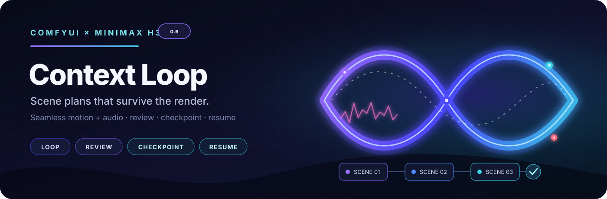
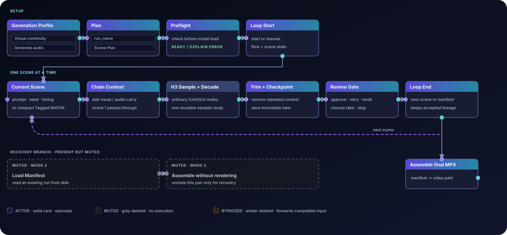

<p align="center">

See [0.7 migration notes](docs/MIGRATING_TO_0_7.md) for retired legacy nodes.
  
</p>

# ComfyUI MiniMax H3 Context Loop

Build a multi-scene MiniMax H3 video with one reusable sampling graph.
Review each scene, compare takes, resume from checkpoints, and assemble the
result later—without keeping the whole production in memory.

[Getting started](docs/GETTING_STARTED.md) ·
[Workflows](example_workflows/README.md) ·
[Changelog](CHANGELOG.md) ·
[Documentation](docs/README.md)

## Changelog

### 0.6.11 — Faster resume and Plan layout fixes

- Remove duplicate saved-artifact hashing during resume while preserving
  integrity checks; add verification progress and timing logs.
- Fix Modern/Production Plan blank space and duplicate controls, including
  automatic widget sockets and the Vue node renderer.
- Add persistent global prompt collapse, fix canvas wheel navigation over
  inactive panels, and restore Loop Start selection after completion (#75).

### 0.6.10 — Checkpoint recovery and Plan editing fixes

- Recover expanded visual context when resuming saved scenes (#72).
- Improve deferred Carousel reference recovery and add a saved upscale loader
  (#65); fix the tagged source-audio lip-sync example (#53).
- Add persistent scene collapse controls to the base Plan editors (#69).
- Improve checkpoint reattribution and add previewed obsolete-path cleanup,
  plus opt-in checkpoint cleanup after completed assembly (#66).
- Correct zoomed trim dragging and refresh trim controls as checkpoints load.
  The remaining disabled-trim report in #68 is still under investigation.

### 0.6.9 — Plan controls and workflow loading fixes

- Combine repeated Plan refreshes during workflow loading.
- Fix default steps and fingerprint input visibility; keep deliberate scene
  overrides, with an explicit option to clear them.
- Add a separate-loader source-audio example without the Carousel.

### 0.6.8 — Fractional H3 mask correction

- Bring nightly's fractional video/audio denoise-mask correction to main,
  including feathered AV continuity and native-first compatibility.
- Correct only missing streams; leave native fixes and source latents intact.

### 0.6.7 — Automatic PNG sequence variants

- Conflicting VIDEO PNG exports automatically use `_2`, `_3`, etc. folders,
  preserving earlier exports and keeping subsequent scenes in one variant.
- Copy verified earlier scenes safely when a rerender changes mid-sequence;
  retain bounded memory and interrupted-publication recovery.

### 0.6.6 — Review Gate capture and resizing

- Capture a still from a saved Review Gate preview into the Project Asset
  Carousel, with safe project selection and numbered tags for new takes.
- Resize the optional prompt editor using its new drag handle; height is
  saved with the workflow and double-click resets it.

### 0.6.5 — Upscale anchor overrides and clear checkpoint sources

- Choose semantic-anchor size and mode for cached, rebuilt, or connected
  upscale references, including the VIDEO conditioning node.
- Checkpoint Manager explicitly names the output branch, available scenes,
  Original/DeRoPE source and fallback scenes, independently of preview browsing.

### 0.6.4 — Preserve reference sizing during recovery

- Recover saved Max sizing through linked inputs and Tagged Scene Options.
- Apply Match/Max upscale overrides to automatic caches too, rebuilding native
  picture conditioning from original masters without changing the source cache.

### 0.6.3 — Cancellation-safe processing saves

- Preserve saved DeRoPE/upscale scenes when manifest updates or network
  acknowledgements fail.
- Recover interrupted PNG publication from a scene journal; accept recreated
  video containers when their delivered pixels match the existing PNGs.
- Keep earlier scenes and conflicting partial files safe. See
  [cancellation and scene-level resume](docs/processing-resume.md).

### 0.6.2 — Upscale recovery and saving

- **Recover lost reference caches.** Upscale rebuilds missing Ref2VA tensors
  from verified saved reference media. Per-reference tensor files avoid repeated
  bundles; legacy caches remain readable and can be converted safely.
- **Reliable deferred sources.** Full-sequence upscale respects selected final-cut
  alternates and saved DeRoPE sources. Checkpoint previews no longer shorten the
  processing range. Processing tabs expose saved versions and guarded cleanup.
- **Scene-by-scene PNG export.** The existing PNG Sequence + Audio node accepts
  file-backed VIDEO and passes it through after saving each scene, with selectable
  8/16-bit PNGs, bounded memory, and network-storage-safe reuse.
- **Exact recovery records.** New takes keep their own Plan/workflow snapshots;
  later edits cannot replace those saved settings. Original media must still
  exist for a lost reference cache to be rebuilt.

- **Grouped source audio.** Assign full mix, vocals and instrumental in the
  Carousel or Audio Tracks node. Vocals drive lip-sync; the full mix stays the
  soundtrack. Per-scene Lip-sync On/Off controls do not alter delivery.

### Context Loop execution and recovery

- **Maintained workflow path.** The release docs now describe the proven
  memory-safe top-level prompt lifecycle: keep the same Plan and creative
  model stack, let Loop End finish, wait through the cleanup delay, then queue
  the next heavyweight scene as a new top-level prompt.
- **Reference propagation fix.** Valid prompt `@tags` again see the connected
  Tagged registry during preflight without rewriting prompt text or storing
  reference data in the Plan.
- **Crash-safe review and resume.** Review snapshots stay visible after a
  refresh or restart, and durable handoffs/manual resume keep the same Plan
  semantics while avoiding duplicate queues.
- **Release packaging.** The changelog, compatibility notes, and workflow docs
  now call out the WSL2 pinned-memory caveat separately from the architectural
  fix.

### 0.6 — Better authoring, recovery, and export

- **Production Plan.** The familiar scene columns, with settings organized
  into Project, Canvas, Generation, and Delivery. The original Plan node stays
  available; migration is optional.
- **Context Builder.** Compose picture context from multiple saved-scene
  windows, choose their frame repartition, and adjust boundary controls in
  Plan Studio. Audio follows the predecessor by default and can be unlocked
  for independent context selection.
- **Plan Studio and review.** Non-destructive trims, picture-only final-cut
  alternates, and scene LoRA routes. Candidate selection now keeps seeds and
  settings synchronized across the Plan and editors.
- **Project Asset Carousel.** More reliable project switching and previews,
  editable semantic-anchor size/mode with downstream inheritance, and video
  references that keep their own duration.
- **Recovery and editing fixes.** Safer checkpoint rollback, stale-response
  protection when switching projects, and fixes for empty-scene navigation,
  archive restoration, and source audio after scene resizing.
- **Faster PNG + WAV export.** Parallel PNG saving, progress and timing logs,
  plus synchronized audio export. Connect the video VAE, audio VAE, or both.
- **Rebuilt 0.6 workflows.** Clean settings, readable layouts, and wiring
  checked against the release nodes. Studio examples include the Carousel and
  Checkpoint Manager; older workflows are kept in the archive.
- **Experimental pixel upscaling.** A scene-by-scene DLSS5 + USDU example with
  conditioning matched to the actual upscaled image size and original audio
  preserved. Full external GPU refinement testing is still pending.

[Full changelog](CHANGELOG.md) ·
[0.5 → 0.6 visual overview](docs/assets/minimax-h3-context-loop-0.5-to-0.6-major-improvements.png)

<details>
<summary>Earlier milestones</summary>

- **0.5:** generation profiles, candidate review, checkpoint branches, project
  assets, and deferred upscale workflows.
- **0.4:** tagged references, Studio authoring, saved-run recovery, and masked
  video/audio editing.
- **0.1–0.3:** the recursive scene loop, review gate, per-scene checkpoints,
  prompt editor, and archival PNG export.

</details>

## Install

From `ComfyUI/custom_nodes`:

```bash
git clone https://github.com/seitanism/ComfyUI-H3-Motion-Context-MultiRef.git
git clone https://github.com/ethanfel/ComfyUI-MiniMaxH3-Context-Loop.git
```

`main` is the stable release line. Use `nightly` for development features.

Restart ComfyUI. Use a build with native MiniMax H3 **Add Guide** support and
install your H3 model, text encoder, video VAE, and audio VAE; models are not
bundled. `ffmpeg` on `PATH` is recommended for review and assembly. Optional
upscale packs and example assets are listed in the [workflow catalog](example_workflows/README.md).

## First run

1. Open [T2V Normal](<example_workflows/T2V Normal - MiniMax H3 0.6.json>) and
   select the four model files.
2. Give **Production Plan** a unique `run_name`, edit the scene prompts, and
   keep the default Generation Profile for a first test.
3. Queue. Preflight checks the plan, then the loop renders and checkpoints one
   scene at a time.
4. At **Review Gate**, approve, retry, reroll, or approve and stop. After the
   last approval, **Assemble** writes the final MP4.

To extend a running Plan, append scenes before approving its last scene. With
Loop Start's `scene_range` left blank, **Approve & continue** finishes the current
run, then queues the updated workflow at the first appended scene using the
saved checkpoint. Keep that workflow and branch open until it queues. Explicit
scene ranges and **Approve & stop** do not automatically extend the run.

For Studio workflows, set the run name in **Project Asset Carousel** instead.
See [Getting started](docs/GETTING_STARTED.md) for setup and recovery steps.

For disposable batch renders, Assemble has an opt-in
[`delete_checkpoints_after_assembly`](docs/POST_EXPORT_CHECKPOINT_CLEANUP.md)
setting. It frees checkpoint space only after a completed export. Leave it off
if you need resume, latent upscale, or checkpoint-based reassembly later.

To reuse a still as a reference, scrub the saved Review Gate preview, click
**Capture frame…**, check the destination project and tag, then **Save to
Carousel**. Reusing a tag creates a numbered take without replacing the
original asset or video. Capture requires `ffmpeg`.

## Choose a workflow

| Starting point | Workflow |
|---|---|
| Text | [T2V Normal](<example_workflows/T2V Normal - MiniMax H3 0.6.json>) |
| First image / first and last images | [I2V Normal](<example_workflows/I2V Normal - MiniMax H3 0.6.json>) / [FL2V Normal](<example_workflows/FL2V Normal - MiniMax H3 0.6.json>) |
| Tagged references and timeline editing | [Ref2V Studio](<example_workflows/Ref2V Studio - MiniMax H3 0.6.json>) |
| References with a source soundtrack | [Ref2V Studio Source Audio](<example_workflows/Ref2V Studio Source Audio - MiniMax H3 0.6.json>) |
| Inpaint, extend, bridge, or upscale video | [All examples and requirements](example_workflows/README.md) |

**Normal** keeps the scene-column editor. **Studio** adds an optional
experimental timeline interface without changing the sampling graph.

<details>
<summary>How the graph is organized</summary>

### How the graph is organized



Only the current scene enters the sampler. Loop End advances to the next scene
or passes a manifest to Assemble. The muted **Load Manifest → Assemble** branch
can assemble saved scenes without rendering again.

</details>

## Updating from 0.5

Back up your workflows and project folders before updating. Existing Plan nodes
remain supported; the new examples have **0.6** in their filenames, and the
older examples are preserved under [Archive/0.5](example_workflows/Archive/0.5/).
Restart ComfyUI after updating and hard-refresh the browser.

Keep the same `run_name` to resume the same production; use a new one for a
different project. Saved runs live in `output/h3_chains/<run_name>/`, with final
movies under `final/`. Carousel media lives in `input/h3_projects/<run_name>/`
and is mirrored into the run for recovery. These paths follow your configured
ComfyUI input/output directories. Resume checks still reject incompatible
generation changes; see [Runs and recovery](docs/RUNS_AND_RECOVERY.md).

The repository is now spelled **Context-Loop**. Existing installs named
`ComfyUI-MiniMaxH3-Contex-Loop` can stay in place—do not install a second copy
just to change the folder name.

## Origins and license

Started from **NikoDemon80's** [H3 Motion Context](https://github.com/NikoDemon80/ComfyUI-H3-Motion-Context).
See [Feature origins](docs/FEATURE_TRACEABILITY.md) and
[Third-party notices](THIRD_PARTY_NOTICES.md) for contributors and upstream work.

GPL-3.0 · [License](LICENSE) · [Contributing](CONTRIBUTING.md)
